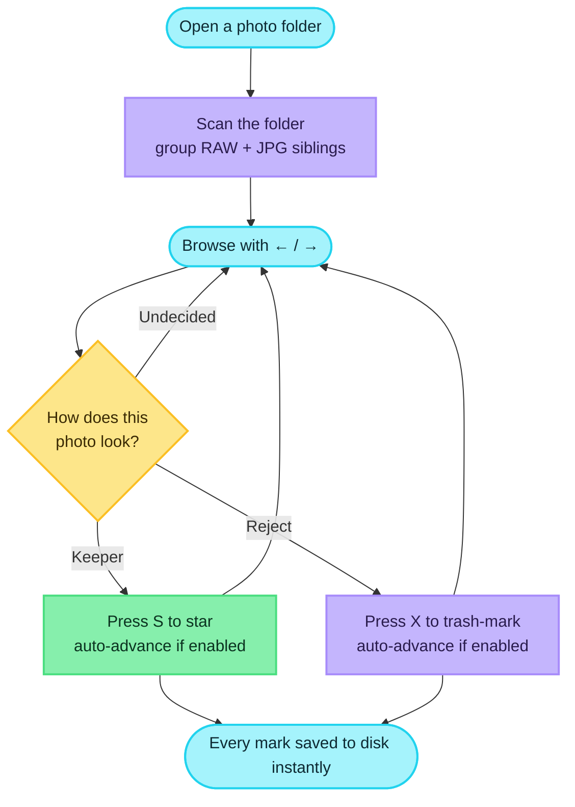
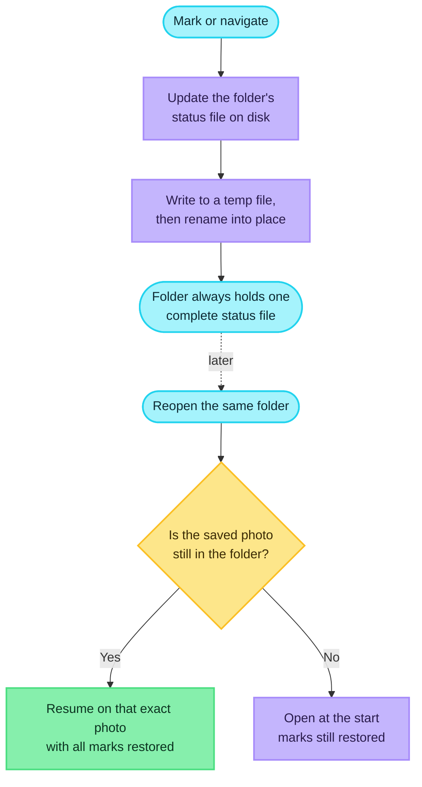
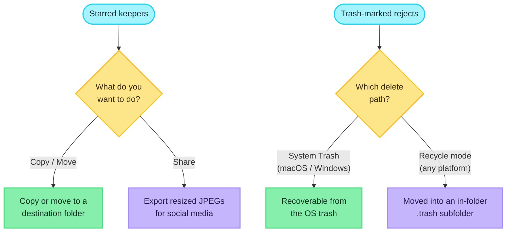
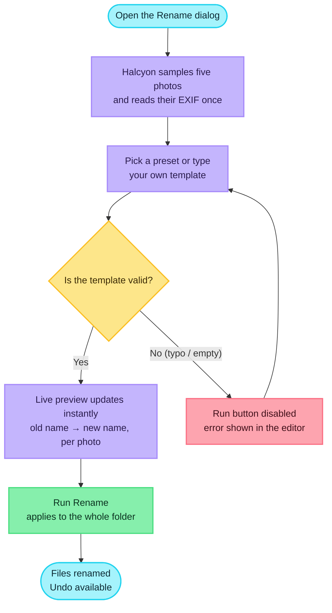
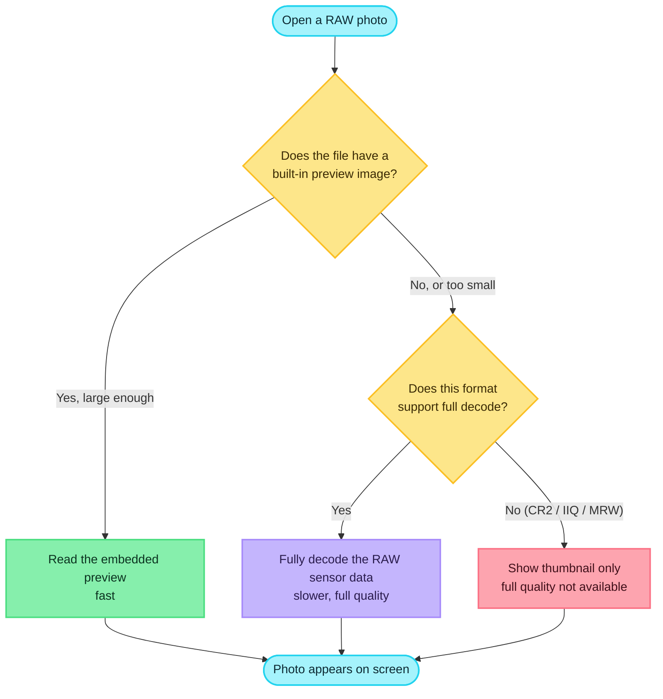
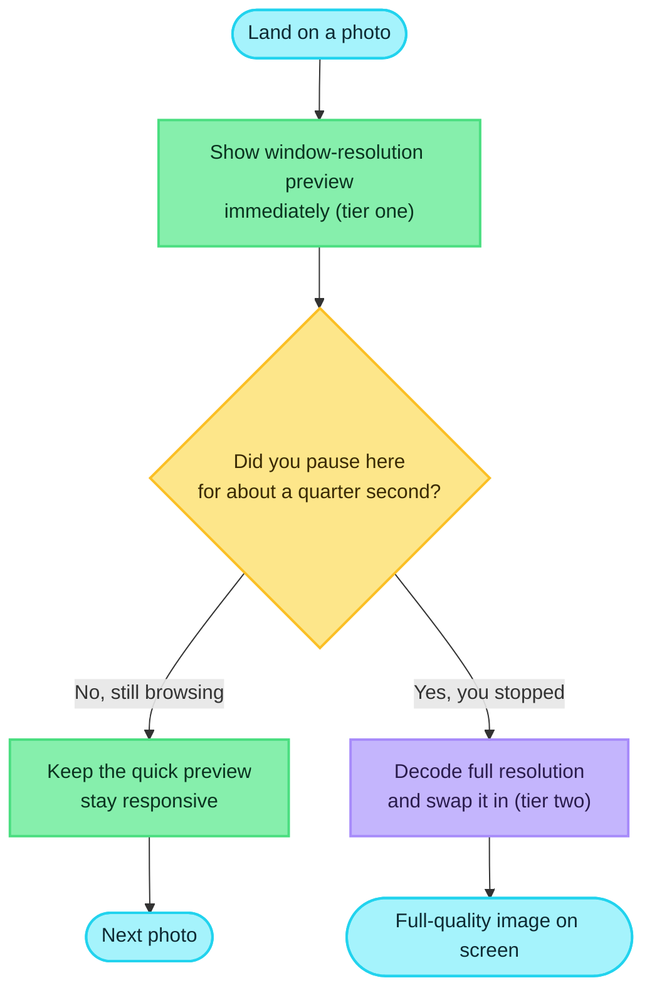
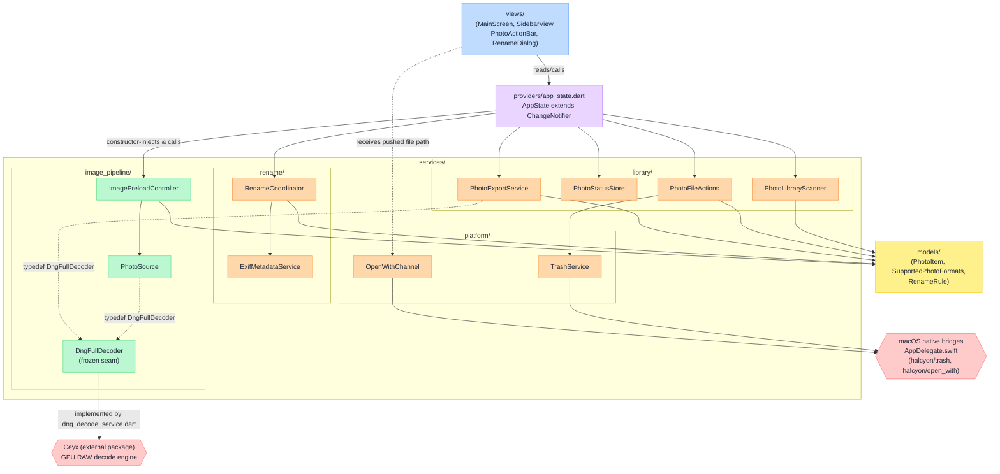
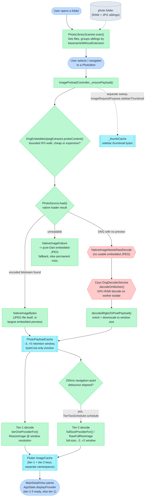

# Halcyon

*[繁體中文版本 / Traditional Chinese](README.zh-TW.md)*

Halcyon is a Flutter desktop application for photographers to triage RAW and JPG photo
folders: browse with the keyboard, mark photos star/trash, then batch-copy or move the
starred files.
<!-- evidence: lib/views/main_screen.dart:104-129 keyboard shortcut handler; lib/services/library/photo_file_actions.dart batch copy/move -->


*The main triage screen, macOS 15.6.1: the sidebar lists the folder's 628 photos, and
the viewer fills the rest of the window with no app bar — only the star and trash
buttons float over the image. Arrow keys move; `S` and `X` mark.*


*The Rename by EXIF dialog on the same folder. The left pane holds the presets and the
editable rule template with live validation; the right pane previews five randomly
sampled files, showing each current filename above the name it would be renamed to.*

### The name

*Halcyon* and *Ceyx* are both kingfisher genera. In Greek myth, Alcyone and Ceyx were
transformed into kingfishers — the two repositories are named as a pair: Ceyx the
decoding engine, Halcyon the application built on it.
<!-- evidence: docs/logs/2026-08-26/readme-draft/BRIEFING.md:46-49 (shared framing agreed for both READMEs); ../ceyx/README.md:56-65 "Sister project: Halcyon" section states the same pairing and dependency direction -->

### Why Halcyon

- **Culling is a throughput problem, not a viewing problem.** The photographer's loop is
  look, judge, advance — arrow keys move between photos, `S` stars, `X` trashes, and
  nothing in that loop asks for a dialog or a mouse click. Anything that stalls that loop
  is the whole cost of the tool.
  <!-- evidence: lib/views/main_screen.dart:104-129 arrowLeft/arrowRight/keyS/keyX bound directly to previousPhoto/nextPhoto/markCurrent -->
- **Lineage: FastPictureViewer.** The keyboard-driven marking model — browse and mark
  without leaving the keyboard — is directly inspired by FastPictureViewer, a paid
  Windows tool from an earlier era that photographers still miss.
- **Preview area maximized, chrome minimized.** The main screen has no app bar: the
  `Scaffold` body is a `Stack` with the image viewer positioned to fill the screen and
  only a floating action bar and status line overlaid on top of it.
  <!-- evidence: lib/views/main_screen.dart:48-59 Scaffold with no appBar, body is Stack(children: [_buildKeyboardShortcutHandler(...), StatusLine()]); lib/views/main_detail_view.dart:113-135 Stack with Positioned.fill viewer and a bottom-centered floating action bar -->
  The macOS window's default size is computed directly from a 3:2 preview area plus a
  270px sidebar (`previewWidth = defaultHeight * 1.5`, `defaultWidth = 270.0 +
  previewWidth`), targeting a wide desktop window rather than a narrow one.
  <!-- evidence: macos/Runner/MainFlutterWindow.swift:9-19 -->
  The sidebar itself is user-resizable between 180px and 600px by dragging a handle.
  <!-- evidence: lib/views/main_screen.dart:71-78 -->
- **Decoding is delegated, not reimplemented.** RAW decode belongs to the sister project
  Ceyx; Halcyon is the application that consumes it under real product constraints —
  UI thread responsiveness, tiered preview/full-size loading, and folder-scale batch
  workflows.
- **Honest about scope.** Desktop is the target platform. Mobile and web build targets
  exist and compile, but the interface itself is not adapted for touch.
  <!-- evidence: pubspec.yaml has no platform restriction, standard Flutter multi-platform project; this claim is scope framing, not a measured behaviour -->

### Sister project: Ceyx

Halcyon depends on Ceyx as an ordinary Dart path dependency on Ceyx's `plugin/`
directory:

```yaml
ceyx:
  path: ../ceyx/plugin
```
<!-- evidence: pubspec.yaml:46-47 -->

This is a plain dependency, not a fork or a subproject: Ceyx must exist as a sibling
checkout next to this repository for `flutter pub get` to succeed, and Halcyon's own
comment on the dependency records that it deliberately depends on the `plugin/` package
rather than Ceyx's own `app/`, to avoid dragging that app's harness dependencies into
Halcyon's build.
<!-- evidence: pubspec.yaml:42-47 -->

---

## Table of contents

- [The triage workflow](#the-triage-workflow)
- [Persistence, resume and batch actions](#persistence-resume-and-batch-actions)
- [Renaming by EXIF](#renaming-by-exif)
- [RAW format support and decode routing](#raw-format-support-and-decode-routing)
- [Measured performance](#measured-performance)
- [Cache and memory management](#cache-and-memory-management)
- [Architecture](#architecture)
- [Architecture diagrams](#architecture-diagrams)
- [Platform support](#platform-support)
- [Building from source](#building-from-source)
- [Testing and quality gates](#testing-and-quality-gates)
- [Third-party attribution](#third-party-attribution)
- [Document maintenance](#document-maintenance)

---

## The triage workflow

This is the core loop: open a folder, browse it with the keyboard, mark keepers and
rejects, and move on. Everything below is what actually happens when you sit down with a
card full of RAW and JPG files.



### Opening a folder

Point Halcyon at a folder and it lists the photos sitting **directly inside** it — it does
not descend into subfolders. Hidden files (anything whose name starts with a dot, including
the AppleDouble sidecars macOS scatters on some cards) are skipped, and only files in a
supported format are shown.

Supported formats:

| Category | Formats |
|---|---|
| Everyday image files | JPG, PNG, WebP, TIFF, HEIC / HEIF |
| RAW, fully decoded | DNG, ARW, CR3, NEF, RAF, RW2, ORF, PEF, SRW, X3F |
| RAW, browse-only | CR2, IIQ, MRW |

The everyday image formats have a few things worth knowing:

- **WebP** displays on every platform. Animated WebP shows its first frame only.
- **TIFF** supports the common flavours (stripped and tiled, 8/16/32-bit, LZW / PackBits /
  Deflate / uncompressed); 16-bit is shown as 8-bit, and multi-page files show page 1 only.
  A few exotic compressions (CCITT fax, JPEG-in-TIFF) are not supported and show as
  unreadable.
- **HEIC / HEIF** uses a bundled decoder, so a HEIC looks the same on every platform
  instead of depending on the OS. Multi-image files (bursts, Live Photos, depth images)
  show the main image only; HDR gain maps and depth maps are ignored. AVIF is not
  supported.

The RAW formats and the difference between "fully decoded" and "browse-only" are covered in
"RAW format support and decode routing" below. Everything that scans and lists — including
the browse-only RAW formats — can be starred, trashed, renamed and batch-moved like any
other photo.

### RAW and JPG sibling grouping

If you shoot RAW+JPG, each shutter press writes two files that share a name and differ only
by extension. Halcyon groups them: the RAW and its same-named JPG (and any hidden sidecar)
become **one entry** in the sidebar, with one star/trash mark and one row you interact
with, no matter how many files are behind it.

For display, Halcyon prefers a JPG or PNG sibling when one exists (it opens fastest),
falling back to the RAW when the group is RAW-only.

Grouping also changes the default deletion behaviour: a folder that contains any RAW+JPG
pair automatically starts in recycle mode (in-folder `.trash`, described below) rather than
permanent delete, so a card you're culling can't lose a RAW to a mis-click. Every mark or
delete acts on the whole group, so a RAW and its JPG sibling always move together as one
unit.

### Marking, navigating and zooming

Beyond "unmarked", a photo can be **starred** (a keeper) or **trashed** (a reject).
Marking toggles: press the same mark again to clear it; press the other mark to switch.
Clearing a mark never moves you; setting a new mark advances to the next photo when
**auto-advance** is turned on (off by default, and remembered between sessions).

Left/right move through the folder in order, with no wraparound at either end. Zoom steps
in and out by ×1.25 per press up to 5×, and zooming back down snaps cleanly to fit rather
than leaving the image drifted off-centre. Your zoom level stays put as you move between
photos — switching from one photo to the next doesn't reset it.

### Keyboard shortcuts

The whole triage loop is designed to run without leaving the keyboard:

| Key | Action |
|---|---|
| `←` | Previous photo |
| `→` | Next photo |
| `↑` | Zoom in (×1.25 per step, up to 5×) |
| `↓` | Zoom out (×1.25 per step, snaps to fit near 1×) |
| `S` | Toggle star mark on the current photo |
| `X` | Toggle trash mark on the current photo |
| `R` | Toggle recycle mode (in-folder `.trash` vs. system/permanent delete) |

The star and trash buttons also float over the image if you'd rather click. Recycle mode
can be toggled from the keyboard with `R`, or by right-clicking the trash button — a
left-click on it just marks the current photo as usual.

### On-screen feedback during triage

Short status messages appear at the bottom of the window, fully visible for a couple of
seconds and then fading out, so they never pile up or block the view. Two of them come
straight from the triage loop:

- A one-time warning if the folder you opened turns out to be **read-only** — shown once
  when the folder opens, not once per mark. Halcyon checks this by actually trying to
  write a small file and delete it, because a card's permission bits can lie (an exFAT card
  can look writable while its physical lock switch blocks every write).
- An error message if the folder can't be scanned at all (for example a permissions error),
  showing what went wrong.

---

## Persistence, resume and batch actions

### A culling session is never lost

Close Halcyon in the middle of a folder, reopen the same folder later, and it comes back on
the same photo with every star and trash mark intact. Marks aren't kept only in memory —
each one is written to disk the instant you make it, and the photo you were on is
remembered too.



#### The status file

Every folder Halcyon opens gets its own small status file (`.halcyon_status.json`) written
right next to the photos. It's plain, human-readable JSON: each marked photo maps to
"starred" or "trashed" (unmarked photos simply aren't listed), plus a note of which photo
you last viewed and the folder's saved rename pattern. Plain JSON was chosen over a
database on purpose — the file lives with the photos, so it travels with the folder when you
copy it to another machine or back it up, and you can read it in a diff.

Because the marks live inside each folder, they stay self-contained: open a second folder
and it keeps its own separate marks — two shoots never bleed into each other. And if the
status file is ever corrupt or unreadable, the folder still opens (just with no marks
restored) — losing marks is recoverable, losing access to the photos is not.

#### Resume on reopen

On reopening a folder, Halcyon returns you to the photo you last viewed, as long as that
photo is still there. It records where you are a few seconds after you settle on a photo,
so rapid arrow-key browsing doesn't hammer the disk on every keystroke.

#### Durability: safe against crashes and pulled cards

Marks and the resume pointer are saved through a single ordered queue, so two saves can
never race and overwrite each other. Each save is written to a temporary file and then
renamed into place, so pulling the card or a crash mid-write can never leave a half-written
file behind — the folder always holds either the complete old file or the complete new one,
never a torn one.

#### Renaming and marks

Marks are tied to filenames. If you rename photos with some **other** tool, the marks
tied to the old names are orphaned — they no longer match anything in the folder. Halcyon's
own rename feature avoids this by moving every mark (and the resume pointer) onto the new
names as part of the rename, so stars and trash marks survive a rename done inside the app.

### Batch actions

Once you've starred your keepers, Halcyon acts on them as a batch:



#### Copy and move starred photos

Your starred photos can be copied or moved as a batch to a folder you choose. A RAW and its
same-named JPG travel together as one unit (and any hidden macOS sidecar file is cleaned up
alongside them rather than left behind at the destination). If a file with the same name
already exists at the destination it's left untouched rather than overwritten, and one
failure never stops the batch — every remaining file is still attempted, and anything that
did fail is collected and shown to you rather than swallowed silently.

#### Social-media export

Starred photos can also be exported as resized JPEGs sized for social media — one file per
photo, with the long edge capped at 2048px, aspect ratio preserved, and encoded at JPEG
quality 90. The important EXIF fields (camera make and model, capture date, artist,
exposure, aperture, focal length, lens, ISO and GPS) are re-read from the original and
reattached to the resized copy. Exports run a few at a time to keep memory in check on
large batches.

#### Two deletion paths

Halcyon offers two genuinely different ways to delete:

| Path | What it does | Recoverable? | Platform |
|---|---|---|---|
| System Trash | Moves the file to the OS trash | Yes, from the OS trash | macOS, Windows |
| Recycle mode (in-folder) | Moves the file into a `.trash` subfolder next to the photos | Yes, still on the card | Any platform |

Recycle mode is the safety-first option: it moves every file of a rejected photo — the RAW
sibling and any hidden sidecar included — into a `.trash` subfolder right next to the
photos. Because that's a move within the same drive, it's instant (nothing is copied) and it
works even on cards where the system trash isn't available. If a name clashes with an
earlier recycle batch, the file is never overwritten — a `-1`, `-2` suffix is added until
the name is free. Recycle mode is per-folder and is turned on automatically for folders that
contain RAW+JPG pairs; you can toggle it any time with `R`.

If a delete fails, Halcyon stops and shows exactly which files failed and why — a delete
that silently did nothing would look just like a working app. A successful recycle-mode
batch instead shows a brief message with the moved count, reminding you the files are still
on disk in `.trash` and were not permanently removed.

---

## Renaming by EXIF

Photographers name files by shoot date, camera, lens, sequence number, or some mix of
those — and the format is usually a house convention, not whatever the camera wrote to the
SD card. Halcyon's rename feature lets you write one naming template and apply it to a
whole folder. Every RAW, its JPG twin, and any hidden sidecar file move together under the
same new base name, so a RAW+JPG pair never gets split apart.

### How the template works

A template is just a piece of text with `{placeholders}` in it, such as
`{YYYY}-{MM}-{DD}-{hh}-{mm}-{ss}`. Halcyon fills each placeholder from the photo's EXIF
metadata (or, for dates, the file's own timestamp as a fallback). Here is every
placeholder you can use, grouped the same way the "Insert variable" panel groups them:

| Group | Placeholder | What it becomes | Example |
|---|---|---|---|
| Date & time | `{YYYY}` | Capture year, 4 digits | `2026` |
| Date & time | `{MM}` | Capture month, 2 digits | `08` |
| Date & time | `{DD}` | Capture day, 2 digits | `26` |
| Date & time | `{hh}` | Capture hour, 2 digits | `14` |
| Date & time | `{mm}` | Capture minute, 2 digits | `07` |
| Date & time | `{ss}` | Capture second, 2 digits | `33` |
| Camera | `{camera}` | Camera model | `Z 8` |
| Camera | `{lens}` | Lens model | `NIKKOR Z 24-70mm f_2.8 S` |
| Camera | `{make}` | Camera maker | `NIKON CORPORATION` |
| Camera | `{artist}` | Artist / copyright tag | `J. Chen` |
| Shooting | `{f}` | Aperture, as `f<value>` | `f2.8` |
| Shooting | `{focal}` | Focal length, as `<value>mm` | `35mm` |
| Shooting | `{iso}` | ISO, as `ISO<value>` | `ISO400` |
| Shooting | `{shutter}` | Shutter speed | `1/250` |
| Shooting | `{direction}` | GPS heading, whole degrees | `187` |
| File | `{seq}` | Sequence number for files that would otherwise collide; pad with a width like `{seq:3}` → `007` | `1` |
| File | `{orig}` | The original filename (without extension) | `DSC_0431` |

A few things worth knowing:

- **Dates always resolve** — if EXIF has no capture date, or can't be read, date/time
  placeholders fall back to the file's own last-modified time.
- **Missing tags become blank**, never a literal `{camera}` in the name.
- **Typos are caught before anything happens** — an unknown placeholder is flagged
  "Unknown variable {name}" and the Run button stays disabled.
- **Names stay filesystem-safe** — characters that would break a filename (`/`, `:`, `\`,
  NUL) become `_`, so a `1/250` shutter speed can't accidentally create a subfolder.

### Built-in presets

Four ready-made presets ship with the app. Rendered against a photo shot 2026-08-26
14:07:33 with the original name `DSC_0431`:

| Preset | Template | Example result |
|---|---|---|
| Date & time | `{YYYY}-{MM}-{DD}-{hh}-{mm}-{ss}` | `2026-08-26-14-07-33` |
| Compact | `{YYYY}{MM}{DD}_{hh}{mm}{ss}` | `20260826_140733` |
| Camera-style | `IMG_{YYYY}{MM}{DD}_{hh}{mm}{ss}` | `IMG_20260826_140733` |
| Date + sequence | `{YYYY}-{MM}-{DD}_{seq}` | `2026-08-26_1` |

"Date & time" is what a fresh dialog opens with. The moment you edit the template text (or
tap a variable chip), the selection switches to `Custom...`. Your custom rule is remembered
per folder — reopen the dialog on a folder you last renamed with a custom rule and that
exact template comes back.

### The dialog and its live preview

The rename dialog has two panes: the preset picker, template field, and variable chips on
the left, and a live preview on the right.



After the initial read, every keystroke re-renders those five preview rows instantly with no
re-reading of metadata, so typing stays snappy even on a big folder. A "Re-roll" button swaps
in a fresh set of five random photos with a fresh metadata read.

Each preview row shows old name → new name, plus badges for sibling extensions (so a RAW+JPG
pair's move is visible before you commit) and a "no camera tag" badge when applicable. The
rename always applies to the whole folder — there's no per-item selection.

### Where the EXIF comes from

Halcyon reads EXIF once per photo (covering its RAW, JPG twin, and any sidecar together),
preferring the JPG twin's EXIF when one exists, otherwise reading the RAW header directly.
Reading a RAW header runs in the background in batches, with progress in the status line, so
the interface never freezes on a large folder.

If a RAW format's header can't be parsed, that photo gets no camera metadata — its EXIF
placeholders render blank, though date and time still resolve from the file timestamp.

### Applying the rename — and undoing it

Halcyon works out every move first, then performs them one at a time:

- Photos that would collide are numbered with `{seq}` in a stable order; any remaining
  clash gets a `-1`, `-2`, … suffix.
- A photo whose new name equals its current name is skipped.
- All files belonging to one photo are renamed to the same base name, so pairs never split.

Each move is journaled, which powers **Undo** (replays the journal in reverse). Star/trash
marks and the last-viewed photo follow renames automatically. A non-writable folder can't
open the rename dialog at all.

### Limitations

- A placeholder with no matching EXIF tag renders as a blank rather than substituting
  another field.
- A RAW with no JPG twin and an unparseable header yields no camera metadata at all.

---

## RAW format support and decode routing

Halcyon supports RAW files from nearly every major camera brand, plus the universal Adobe DNG:

| Camera brand | Format | How it's shown |
|---|---|---|
| Sony | ARW | Fully decoded |
| Canon | CR3 | Fully decoded |
| Nikon | NEF | Fully decoded |
| Fujifilm | RAF | Fully decoded |
| Panasonic | RW2 | Fully decoded |
| Olympus | ORF | Fully decoded |
| Pentax | PEF | Fully decoded |
| Samsung | SRW | Fully decoded |
| Sigma | X3F | Fully decoded |
| Adobe (universal) | DNG | Fully decoded |
| Canon (older) | CR2 | Thumbnail only |
| Phase One | IIQ | Thumbnail only |
| Minolta | MRW | Thumbnail only |

The three "thumbnail only" formats can still be starred, deleted, and moved just like any
other photo — they just don't show full decoded quality yet.

Most of the time you won't notice a difference: Halcyon automatically picks the fastest way
to display each photo.



In short:

- **Has a built-in preview → use it.** Many RAW files (especially DNGs processed by
  Lightroom or DxO PureRAW, and Panasonic's RW2 files) already contain a ready-made JPEG
  preview inside them. Halcyon uses it instantly when it finds one.
- **No usable preview → full decode.** When no preview is large enough and the format
  supports full decoding, Halcyon decodes the complete RAW sensor data — a bit slower, but
  full quality.
- **Format doesn't support full decode → thumbnail only.** CR2, IIQ, and MRW currently can
  only be browsed as thumbnails.

Current platform support:

| Platform | Full RAW decode |
|---|---|
| macOS | ✅ Supported |
| Windows | ✅ Supported |
| Android | ✅ Supported |
| Linux | ✅ Supported |
| iOS | ⏳ Not yet |
| Web | ⏳ Not yet |

On platforms without full decode support, a RAW file with no built-in preview will
temporarily show as unavailable — that's a missing platform feature, not a broken photo.

---

## Measured performance

When you're triaging photos the loop is simple: look, judge, move on. The number that
actually matters is how long it takes from pressing an arrow key to a usable
full-resolution image on screen — not decode throughput in the abstract.

Two very different costs hide behind that one number:

- **Photos with a built-in JPEG preview take the cheap path** — Halcyon just shows the
  preview, no RAW decoding at all. This is the majority of files in a typical folder, and
  it lands in single-digit milliseconds.
- **Photos with no usable preview** (bare-sensor DNGs, mostly from phones) go through a full
  RAW decode via the sister decoder, Ceyx. This is the expensive path.

Because of that split — plus the difference between a **cold** first decode and a **warm**
repeat decode — any single number is only meaningful with its conditions attached. Here's
what's actually been recorded.

### The numbers

| What's being measured | Time | Conditions |
|---|---|---|
| Full RAW decode, key-press to full-res on screen (12 MP phone DNG) | cold 491–601 ms; warm 150–159 ms | macOS release build, 2026-08-17, machine not recorded |
| Sidebar thumbnail decode, bare-sensor DNG (no built-in preview) | warm ~56–100 ms per photo | Test harness, target 200 px long edge |
| Sidebar thumbnail, DNG *with* a built-in preview (fast path) | warm ~0.3–0.4 ms | Same harness |
| Sidebar thumbnail, JPEG files | warm ~22–26 ms | Same harness |
| Ceyx full decode, 24 MP DNG, lossless | ~177 ms | macOS (Metal), warm |
| Ceyx full decode, 24 MP DNG, lossy | ~105 ms | macOS (Metal), warm |
| Ceyx cold first decode in a GUI app, 24 MP (6000×4000) lossless DNG | 291 ms | Apple M3 Ultra, macOS 15.6.1, release, **cold** |
| Switching between JPEG-preview photos (no RAW decode) | 2.8 ms (was 127.5 ms before optimisation) | Historical baseline, kept to show the size of the win |

### The one number to remember

If you want a single figure, it's **about 300 ms for a cold, GPU-accelerated full RAW
decode** — from one clean recorded run: Ceyx cold-decoding a 24 MP lossless DNG inside a
real app, 291 ms on an Apple M3 Ultra.

Everything else in the table answers a slightly different question, and the differences
are worth keeping in mind:

- **Warm decode is roughly half that.** The one full end-to-end run that reached
  full-res paint measured 150–159 ms warm, and Ceyx's warm figures sit at 105–177 ms for
  24 MP. A photographer flicking back and forth across a handful of frames lives in this
  warm regime, not the cold one.
- **A cold decode on an older/unrecorded machine ran higher** — 491–601 ms in one 2026
  run. Treat that as a weak data point (its own notes flag it for a re-run that never
  happened), not a contradiction of the 300 ms figure.
- **Most files never decode at all.** A RAW carrying a usable built-in JPEG preview skips
  the decoder entirely and appears in single-digit milliseconds. The 300 ms figure only
  describes the expensive path, which is the minority of files in a normal folder.

Honest summary: quote **~300 ms cold / ~150 ms warm** for full RAW decode, and don't treat
either as a universal benchmark — no measurement here cleanly separates cold from warm
across a range of machines and sensor sizes.

### What hasn't been measured

A few things simply have no recorded number yet, and it's better to say so than to guess:

- Full-decode timing for large-sensor RAW files (full-frame, 40+ MP) running through
  Halcyon's own pipeline. The recorded samples top out around 24 MP.
- The machine (chip, RAM) behind most of the Halcyon-side figures — only the 291 ms M3
  Ultra data point names its hardware.
- Export timing (decode → resize → re-encode JPEG).
- Interactive switch-latency and memory usage under real UI navigation — these are
  reserved for the project owner to measure personally rather than in automated runs.

---

## Cache and memory management

### Why this matters for triage

Reviewing a shoot means holding an arrow key down and flying through dozens of
frames a second. That only feels good if two things are true at once: each
photo appears the instant you land on it, and browsing a folder of any size
never runs the app out of memory. Those goals pull in opposite directions — a
full-resolution frame from a modern 24 MP sensor is around 90 MB once decoded,
so decoding every frame at full quality on every keystroke would stall, while
keeping every frame you've seen would eventually exhaust memory.

Halcyon's answer is to keep only the photos near where you're looking, show
each one at the right level of detail for what you're doing, and quietly
upgrade to full quality the moment you pause. You never wait for the "heavy"
work while you're moving.

### Two levels of detail for the main image

The main preview is drawn in two passes:

- **Tier one — instant.** As soon as you land on a photo, Halcyon shows it
  decoded to your window's resolution. This is quick, so rapid arrow-key
  browsing stays smooth and every photo shows something immediately.
- **Tier two — full quality.** If you stop on a photo for about a quarter of a
  second, Halcyon decodes the full-resolution version and swaps it in. Because
  it waits for that brief pause, blowing past a hundred photos never kicks off
  a hundred heavy full-frame decodes for images you only glanced at.



### The sidebar thumbnails

The filmstrip of thumbnails down the side is loaded separately from the main
image. Halcyon only fetches the thumbnails that are actually on screen, plus a
margin just above and below so scrolling stays ahead of you, and it drops
thumbnails once they scroll well out of view. Thumbnails re-appear on their own
after any action that reloads the folder — starring, trashing, copying or
moving — so the sidebar never gets stuck blank. Small embedded previews are
used as-is; larger images are shrunk to a compact thumbnail once and kept in
that lightweight form, so the sidebar stays cheap even for a big folder.

### Keeping only what's nearby

Rather than holding every photo you've opened, Halcyon keeps a moving window of
photos around the one you're on — a few behind you and a few more ahead, since
browsing runs overwhelmingly forward. As you move, photos entering the window
are loaded and photos falling out the back are released. This window is also
capped by an overall memory budget, so even with unusually large files the app
releases the oldest held photo first and stays within bounds. The net effect:
memory use stays roughly flat no matter how long the folder is or how long you
browse.

### Summary

| Lane | What it holds | How much is kept | When it's released |
|---|---|---|---|
| Sidebar thumbnails | Small thumbnail images for the filmstrip | The rows on screen plus a margin above and below | Trimmed to what's currently needed on every update |
| Main image, both tiers | The photos near the one you're viewing | A moving window: a few behind, a few more ahead, capped by a memory budget | Oldest / farthest photo released first as you move or when over budget |
| Decoded frames | The window-resolution and full-resolution images being shown | Bounded by a share of the machine's memory | Released automatically once a photo leaves the active window |

---

## Architecture

Halcyon is a strictly one-way layered app — `views/` → `providers/app_state.dart` → `services/` → `models/` — with a small number of frozen seams where a contributor should not casually change the shape of things.

### Layering and dependency direction

`views/` builds the UI and owns only view-local state (keyboard shortcuts, the zoom transform, dialog scaffolding). It reads `AppState` through the `provider` package and calls its methods; it has no knowledge of how a photo gets scanned, decoded, or deleted. View-local, animation-driven state such as zoom and pointer position lives in view-owned controllers (e.g. `lib/views/zoom_controller.dart`'s `ZoomController extends ChangeNotifier`, owned and disposed by `MainScreen`) rather than in `AppState` — `AppState` holds only state that represents the photo-library model.

`providers/app_state.dart` defines `AppState extends ChangeNotifier` (`lib/providers/app_state.dart:61`), the single coordination point for application logic — folder loading, selection, star/trash marking, settings, and dispatch into the service layer. It takes its collaborators via constructor injection rather than hardcoding them as fields:

```dart
AppState({
  PhotoLibraryScanner? scanner,
  PhotoStatusStore? statusStore,
  PhotoFileActions? fileActions,
  ImagePreloadController? preloadController,
  NativeImageLoad? imageLoader,
  DngFullDecoder? dngDecoder,
  PhotoExportService? exportService,
  ExifBatchReader? exifReader,
})
```

Each parameter falls back to the real implementation when omitted (e.g. `_scanner = scanner ?? PhotoLibraryScanner()`), so production gets the real collaborators for free while tests substitute fakes for any of them — this is what lets `AppState` be unit-tested without touching a real filesystem or platform channel.

`services/` implements the actual work — scanning, status persistence, image decode/cache, file operations, EXIF/rename, and the two platform bridges — and is forbidden from reaching back up into `views/` or `AppState`; it's called, and only calls back through the callback/supplier parameters `AppState` hands it explicitly. `models/` holds pure data shapes and functions with no I/O — `PhotoItem`, the format registry, `RenameRule`'s template rendering — and does not import from `services/` or `views/`.

`services/` is split into four purpose-named subfolders:

| Folder | Owns |
|---|---|
| `image_pipeline/` | tier-1/tier-2 sliding-window preload, DNG decode integration, image cache bookkeeping |
| `library/` | folder scanning, status persistence, file copy/move/trash, star-photo export |
| `rename/` | EXIF-driven rename planning, EXIF metadata reading, the rename coordinator |
| `platform/` | the two macOS `MethodChannel` bridges (Trash, Open With) |

### Seams and invariants

These are the load-bearing constraints in the image pipeline; changing them casually breaks the tier-1/tier-2 contract described elsewhere in this README.

**The Ceyx integration seam.** DNG full-size decoding — for DNGs with no usable embedded preview — is delegated to the sister project Ceyx through a typedef, not a concrete class:

```dart
typedef DngFullDecoder = Future<DecodedRgba> Function(String path);
```

This seam is what lets the image pipeline be unit-tested against a fake decoder instead of loading the real native dylib.

Paired with it, `image_source_types.dart` declares a sealed class with exactly three variants describing the outcome of any image-bytes request: `NativeImageBytes` (encoded bytes, the happy path), `NativeImageNeedsRawDecode` (a DNG with no embedded preview — not a failure, a signal to run the real RAW decoder), and `NativeImageFailure` (a genuine failure). This set is frozen at three variants.

**Image loading is pure Dart on every platform.** `dartImageLoad` (`lib/services/image_pipeline/dart_image_loader.dart:17`) is the sole producer of image bytes; there is no native thumbnail channel on any platform. Photo behaviour — which files load, what pixels appear, what deletion does, what export produces — is implemented once in Dart and behaves the same on every platform, with exactly three closed native-bridge exceptions: system Trash (macOS/Windows native), the Open With transport layer (macOS/Windows/Android/iOS, excluding Linux), and file association registration (Windows/macOS).

**Single-owner invariants.** Two classes each hold exactly one piece of tier-2 state, so it can be reasoned about and tested in one place instead of drifting across call sites:

- `TierTwoRegistry` (`lib/services/image_pipeline/tier_two_registry.dart:26`) is the single holder of tier-two *readiness* bookkeeping — which ids have a full-size cache entry, which payload object it was decoded for, and whether that decode has failed.
- `TierTwoScheduler` (`lib/services/image_pipeline/tier_two_scheduler.dart:58`) is the single holder of tier-two *scheduling* — the ±2 window, the 250ms navigation debounce, and the serialized decode queue.

**Native bridges.** `macos/Runner/AppDelegate.swift` registers exactly two `MethodChannel`s:

```dart
FlutterMethodChannel(name: "halcyon/trash", ...)
FlutterMethodChannel(name: "halcyon/open_with", ...)
```

`halcyon/open_with` is push-only: native calls into Dart to deliver a file path, and Dart has no method to ask native "is anything pending?". Flutter buffers native→Dart messages until a Dart handler registers, which makes push-only the reliable direction even at cold start; an event that arrives before the channel object exists is held in a `pendingOpenFile` variable and flushed the moment the channel is created.

**One EXIF orientation table.** `exif_orientation.dart`'s `exifTransformFor` is the project's only 8-case Orientation-tag lookup table; both the `package:image`-based export path and the `dart:ui`-based full-size RGBA provider translate through it rather than encoding their own orientation logic, and both apply rotation before mirroring, in that fixed order.

### Repository layout

```
Halcyon/
├── lib/
│   ├── main.dart              # ChangeNotifierProvider + MaterialApp setup
│   ├── models/                # PhotoItem, format registry, RenameRule (pure, no I/O)
│   ├── perf/                  # opt-in performance instrumentation
│   ├── providers/
│   │   └── app_state.dart     # AppState: the single coordination point
│   ├── services/
│   │   ├── image_pipeline/    # tier-1/tier-2 preload, DNG decode, cache bookkeeping
│   │   ├── library/           # folder scan, status persistence, file ops, export
│   │   ├── rename/            # EXIF-driven rename planning + coordinator
│   │   └── platform/          # the two macOS MethodChannel bridges
│   └── views/                 # UI, keyboard shortcuts, dialogs
├── test/                      # mirrors the lib/ tree above, plus test/support/
├── macos/ ios/ android/ web/ windows/ linux/   # per-platform runner shells
├── scripts/
│   └── build_apps.py          # the single build entry point for all six targets
├── docs/
│   ├── logs/YYYY-MM-DD/       # dated task logs; recorded measurements live here
│   └── sop/                   # untracked internal maintenance docs; absent from a fresh clone
└── README.md
```

Halcyon also maintains a set of internal process documents — architecture decisions and gotchas, task tracking, phase milestones, a handoff summary, and the test strategy and test-case matrix — under `docs/sop/` in a working checkout. They're git-ignored, so a fresh clone won't contain them.

Licensing and third-party attribution are covered in [Third-party attribution](#third-party-attribution) at the end of this document.

---

## Architecture diagrams

Three diagrams cover the system: how the modules depend on each other, how a
photo's bytes travel from disk to the screen, and how a keypress turns into a
mark that later drives a batch action on the filesystem. Together they should
let a new reader place any file in `lib/` within thirty seconds.

### Legend

**Shapes** (consistent across all three diagrams):

| Shape | Meaning |
|---|---|
| Stadium `([ ])` | Entry point / user action |
| Rectangle `[ ]` | Module, service, or class |
| Subroutine `[[ ]]` | In-memory cache |
| Cylinder `[( )]` | Persistent storage (file on disk) |
| Rhombus `{ }` | Decision / routing point |
| Hexagon `{{ }}` | Native / FFI boundary crossing |

**Colour** (one hue per architectural layer, Tailwind 200-shade fill / 400-shade
stroke, text forced to `#1e293b`, Tailwind slate-800):

| Layer | Fill (200) | Stroke (400) |
|---|---|---|
| Views / entry points | `#bfdbfe` (blue-200) | `#60a5fa` (blue-400) |
| Providers (`AppState`) | `#e9d5ff` (purple-200) | `#c084fc` (purple-400) |
| Services — image pipeline | `#bbf7d0` (green-200) | `#4ade80` (green-400) |
| Services — library/platform/rename | `#fed7aa` (orange-200) | `#fb923c` (orange-400) |
| Models | `#fef08a` (yellow-200) | `#facc15` (yellow-400) |
| Native / FFI boundary (Ceyx, AppDelegate) | `#fecaca` (red-200) | `#f87171` (red-400) |
| Caches | `#a5f3fc` (cyan-200) | `#22d3ee` (cyan-400) |
| Persistent storage | `#e2e8f0` (slate-200) | `#94a3b8` (slate-400) |

**Edges**: a solid arrow is a direct call or import dependency; a dashed arrow
is a data/file dependency (something read from or written to disk) rather than
a function call.

---

### 1. Module dependency and layering



**Caption:** dependencies flow one way, top to bottom. `views` calls into
`AppState`, `AppState` composes every `services/` collaborator by constructor
injection, and those collaborators depend only on `models/`. Nothing in
`services/` or `models/` imports `views/` or `providers/`. The only two native crossings are
the `DngFullDecoder` seam into the external Ceyx package (RAW decode) and the
two `MethodChannel`s registered in `AppDelegate.swift` (system Trash and
"Open With" file delivery).

**Evidence:**
- `AppState` composes its collaborators via constructor injection —
  `lib/providers/app_state.dart:61-104`.
- `ImagePreloadController` depends on `PhotoSource`, which is the one
  type-aware layer — `lib/services/image_pipeline/photo_source.dart:82-93`.
- `DngFullDecoder`/`DngSizedDecoder` are the frozen integration seam between
  the pipeline and the native decoder —
  `lib/services/image_pipeline/dng_decode_contract.dart:30,39`.
- The Ceyx adapter implementing that seam imports `package:ceyx/ceyx.dart` —
  `lib/services/image_pipeline/dng_decode_service.dart:1,12-14`.
- `PhotoExportService` also takes an optional `DngFullDecoder` for its own
  RAW export path — `lib/services/library/photo_export_service.dart:38-39`.
- `PhotoFileActions` defaults to `TrashService.trashFile` —
  `lib/services/library/photo_file_actions.dart:40`.
- `AppDelegate.swift` registers exactly two channels, `halcyon/trash` and
  `halcyon/open_with` — `macos/Runner/AppDelegate.swift:23,42`.
- `RenameCoordinator` is constructed by `AppState` with `readMetadata:
  readMetadataFor` wired to `ExifMetadataService.readBatch` —
  `lib/providers/app_state.dart:71-102`.

---

### 2. Image pipeline data flow — file on disk to pixels on screen

This is the centrepiece: the complete path a photo's bytes take from a folder
scan to a painted frame, including the two-tier decode strategy and the
routing decision between an embedded preview and a full RAW decode.



**Caption:** the scan groups sibling RAW/JPG files into a single `PhotoItem`.
When you select an item, a bounded content probe runs before any decode and
sorts the file into cheap or expensive. Cheap files — JPEGs, or DNGs whose
embedded preview is already large enough — skip the native decoder entirely,
while a DNG with no usable preview crosses into Ceyx's GPU decoder on a worker
isolate. Every decoded result, whether encoded bytes or downscaled pixels,
lands in a single byte-budgeted retention cache, and the display path always
paints from there: window resolution (tier-1) right away, then an upgrade to
full size (tier-2) once navigation has been quiet for 250ms.

**Evidence:**
- Sibling grouping by `basenameWithoutExtension` —
  `lib/services/library/photo_library_scanner.dart:14-19`, id definition at
  `lib/models/supported_photo_formats.dart:44`.
- The probe-first content classification and its cost/orientation dual output
  — `lib/services/image_pipeline/photo_source.dart:274-317`.
- The three-way `NativeImageResult` routing (bytes / needs-raw-decode /
  failure) — `lib/services/image_pipeline/image_source_types.dart:48-87`, and
  the switch that acts on it — `lib/services/image_pipeline/photo_source.dart:116-201`.
- The Ceyx crossing — `lib/services/image_pipeline/dng_decode_service.dart:12-14`.
- Tier-1/tier-2 provider factories and the identity/key-match requirement —
  `lib/services/image_pipeline/image_preload_controller.dart:28-49`.
- The 250ms navigation debounce constant —
  `lib/services/image_pipeline/image_preload_controller.dart:49`.
- The -3..+5 retention window and byteCost-only eviction —
  `lib/services/image_pipeline/photo_payload_cache.dart:6-10` (window) and
  class doc at `lib/services/image_pipeline/photo_payload_cache.dart:36-49`.
- Sidebar thumbnails use a separate cache/miss set from the detail path —
  `lib/services/image_pipeline/image_preload_controller.dart:91,173`.
- `displayProvider` picks tier-2 when ready, else tier-1 —
  `lib/providers/app_state.dart:214-215`.

---

### 3. Triage action flow — keypress to mark to batch action


**Caption:** a mark is pure in-memory state on `PhotoItem` until
`_saveStatusCache` persists it to `.halcyon_status.json` via an atomic
tmp-file-plus-rename write. Every batch action reads status directly off the
live `_items` list, not the file, and re-triggers a folder reload afterward,
which is what re-reads the JSON back in. Copy/move and export write into a
user-chosen destination; trash either moves files into a `.trash/` sibling
folder (recycle mode, same-volume rename) or hands them to the operating
system's own Trash through the native `halcyon/trash` channel, which is
registered on macOS and Windows only.

**Evidence:**
- `markCurrent` toggles status and calls `_saveStatusCache` —
  `lib/providers/app_state.dart:367-392`.
- Atomic tmp-file + rename write — `lib/services/library/photo_status_store.dart:68-76,132-148`.
- `processStarred` filters `item.status != PhotoStatus.starred` and copies or
  renames each file — `lib/services/library/photo_file_actions.dart:50-87`.
- `deleteTrashed` branches on `recycleMode` between `TrashService.trashFile`
  and `recycleTrashed`'s same-volume rename into `.trash/` —
  `lib/providers/app_state.dart:498-538`,
  `lib/services/library/photo_file_actions.dart:89-155`.
- `TrashService.trashFile` is the default for `PhotoFileActions` and is the
  system-Trash bridge, registered on macOS and Windows —
  `lib/services/library/photo_file_actions.dart:40`,
  channel registration at `macos/Runner/AppDelegate.swift:23`.
- `exportStarred`'s decode/resize/encode path —
  `lib/services/library/photo_export_service.dart:53-142`.
- Batch actions reload the folder afterward, which re-applies saved statuses
  — `lib/providers/app_state.dart:467-474,524-530`, re-application at
  `lib/services/library/photo_status_store.dart:93-130`.

---

## Platform support

Halcyon is a desktop app first, but it runs on more than that. Full RAW decode now works
on macOS, Windows, Android **and Linux** — only iOS and the web build don't have a native
decoder yet. The desktop targets are the ones the interface was designed for; the mobile
and web builds run but haven't been adapted for touch.

### Support matrix

| Platform | Runs | Interface | Full RAW decode | System Trash / Recycle Bin | "Open With" from the file manager |
|---|---|---|---|---|---|
| macOS | ✅ (arm64) | Designed for this | ✅ Yes | ✅ Yes | ✅ Yes |
| Windows | ✅ | Desktop layout, less exercised | ✅ Yes | ✅ Yes | ➖ No |
| Linux | ✅ | Desktop layout, less exercised | ✅ Yes | ➖ In-folder recycle mode | ➖ No |
| Android | ✅ | Runs; not adapted for touch | ✅ Yes | ➖ In-folder recycle mode | ➖ No |
| iOS | ✅ | Runs; not adapted for touch | ⏳ Not yet | ➖ In-folder recycle mode | ➖ No |
| Web | ✅ | Runs; not adapted | ⏳ Not yet | ➖ In-folder recycle mode | ➖ No |

### What the gaps mean in practice

**Full RAW decode is ready on four platforms.** macOS, Windows, Android and Linux all
decode RAW files completely. On Linux the decoder isn't compiled on your machine — the
build tool downloads a prebuilt, version-pinned copy automatically — but the end result is
the same full-quality decode as the other three.

**Only iOS and the web build lack a native decoder for now.** On those two, a RAW file is
viewable only when it carries an embedded JPEG preview large enough to use. Most modern
cameras write such a preview, so browsing usually still works — but a RAW file without one
can't be shown there yet.

**System Trash is macOS and Windows; everywhere else uses recycle mode.** On macOS and
Windows, deleting sends files to the real system Trash / Recycle Bin. On Linux, Android,
iOS and web, delete uses Halcyon's in-folder recycle mode instead — files move to a
`.trash` subfolder in the same place. It's a complete feature, not a degraded fallback:
nothing is lost, and you can recover files by hand.

**"Open With" from the file manager is macOS only.** Launching Halcyon by opening a photo
from Finder is wired up on macOS; on the other platforms you open the folder from inside
the app.

**macOS builds are arm64 only,** because the bundled decoder is built for Apple Silicon. An
Intel Mac build would need an x86_64 decoder first.

---

## Building from source

### Prerequisites

| Requirement | Version verified in this tree | Notes |
|---|---|---|
| Flutter SDK | 3.44.6 | Dart 3.12.2; `pubspec.yaml` declares `sdk: ^3.9.0` |
| Ceyx checkout | sibling directory | Must be at `../ceyx` relative to this repository |
| JDK (Android only) | Temurin 25, or Homebrew `openjdk@21` / `openjdk@17` | Auto-selected by the build script in that order |
| Gradle (Android only) | 9.1.0 | Pinned by the wrapper |
| Android Gradle Plugin | 9.0.1 | Kotlin 2.3.21 |

<!-- evidence: pubspec.yaml:22 (sdk constraint), flutter --version output 2026-08-26 -->
<!-- evidence: pubspec.yaml:46-47 (ceyx path dependency) -->
<!-- evidence: scripts/build_apps.py:232-234 (JDK search order), scripts/build_apps.py:448 (PATH fallback warning) -->
<!-- evidence: android/gradle/wrapper/gradle-wrapper.properties:5, android/settings.gradle.kts:22-23 -->

**The Ceyx sibling checkout is not optional.** `pubspec.yaml` declares the decoder as a
relative path dependency on `../ceyx/plugin`, so `flutter pub get` fails outright if that
directory is missing. Clone Ceyx next to Halcyon, not inside it.

<!-- evidence: pubspec.yaml:46-47 -->

Android builds additionally require compatibility mode to be left enabled —
`android.newDsl=false` and `android.builtInKotlin=false` in `android/gradle.properties` —
because Flutter's Gradle plugin does not yet support AGP 9's new DSL. Removing those two
lines breaks the Android build.

<!-- evidence: android/gradle.properties:4-5, docs/sop/memory.md G-009 -->

### Running in development

```bash
flutter pub get
flutter run -d macos     # also: -d chrome, or a connected device id
flutter analyze          # must report 0 issues
flutter test             # full suite
```

### Release builds

`scripts/build_apps.py` is the single build entry point. It builds the native decoder and
the Flutter application for every target, and it replaced the earlier per-platform shell
and PowerShell scripts, which were deleted. Do not reintroduce a per-platform script.

```bash
python3 scripts/build_apps.py              # macOS release, the default target
python3 scripts/build_apps.py android --release
python3 scripts/build_apps.py web
python3 scripts/build_apps.py all          # every target this host can build
python3 scripts/build_apps.py --check      # toolchain check only, builds nothing
```

<!-- evidence: scripts/build_apps.py:249-266 (target table), scripts/build_apps.py:1599 (target argument) -->

Targets are `macos`, `ios`, `android` / `android-apk` / `android-aab`, `web`, `windows`,
`linux`, and `all`. The `all` target is host-filtered and skips rather than fails on
targets this host cannot build; `ios` is deliberately excluded from it so that an
unattended run never has to make a code-signing decision. `windows` and `linux` must be
built on their own operating system.

<!-- evidence: scripts/build_apps.py:249-266 -->

### The colour gate

A native decoder library isn't trusted until it has passed the runbook S4 colour gate — a
blue-sky sample check that asserts the blue channel dominates the red one, which is enough
to catch a decoder whose colour matrix has been wired up wrong. Phase 0 of the build
refuses to place an ungated library.

- Pass a blue-sky DNG with `--cfa-sample-dng <file>` whenever a native build is due.
- `--no-colour-gate` is the loud opt-out. A run that uses it **exits 2, never 0**, and the
  resulting library is marked unvalidated.

<!-- evidence: scripts/build_apps.py:927-932 (Phase 0 refusal), scripts/build_apps.py:1220-1226 (skip warning), scripts/build_apps.py:1622-1624 (--no-colour-gate exits 2), scripts/build_apps.py:1721 -->

### Build outputs and what is source

Build outputs land under the root `build/` directory. The `android/`, `ios/`, `macos/`,
`web/`, `windows/` and `linux/` directories are source and configuration, not build output
— they stay in version control.

### A note on the Windows path

`scripts/build_apps.py` has never driven the Windows native build end to end. Treat the
first real Windows run of the script as first contact rather than a regression test. The
underlying CMake/MSVC path itself is not unproven — an upstream commit added it and built
the shipped `dng_decoder_native.dll` by hand on a real Windows machine — but that build
recorded no S4 colour-gate run, so the DLL is trust-on-first-use.

<!-- evidence: CLAUDE.md, Commands section -->

---

## Testing and quality gates

```bash
flutter analyze                                   # must report 0 issues
flutter test                                      # full suite
flutter test test/providers/app_state_test.dart   # a single file
flutter test --coverage
```

The suite is 45 test files under `test/`, organised to mirror `lib/`: `models/`,
`providers/`, `services/`, `views/`, `perf/`, plus shared fakes in `test/support/`. Each
test carries a 10-second timeout.

<!-- evidence: dart_test.yaml:1, test/ directory listing 2026-08-26 -->

`flutter analyze` reporting zero issues is a gate, not a preference — work is not
considered done while it reports anything. Note that analysis covers `lib/`, `test/` **and**
`tool/`, so a symbol rename that only sweeps `lib/` and `test/` will still break the gate.

<!-- evidence: CLAUDE.md Commands section; docs/sop/memory.md 2026-08-25 naming-refactor entry -->

### What makes the suite possible

`AppState` receives every collaborator through its constructor — the library scanner, the
status store, the file actions, the preload controller, the image-loading function and the
optional full decoder. Tests substitute fakes for all of them, so the application logic is
exercised without touching the filesystem or a platform channel. The decoder seam is the
same story: the pipeline is tested against a fake decoder rather than by loading the real
native library.

<!-- evidence: lib/providers/app_state.dart constructor; lib/services/image_pipeline/dng_decode_contract.dart -->

### Test strategy documentation

The project keeps an internal test strategy document under `docs/sop/`: the TC-NNN
test-case matrix, with per-case pass/fail history and the coverage priorities. It is
untracked, so a fresh clone won't have it. When you do have it, every test you add to
this repository is expected to get a matching entry in that matrix. It also records cases
that were tried and deliberately dropped — a full keyboard widget test that hung the test
runner's timers, for instance — so it's worth a read before you re-attempt one.

<!-- evidence: docs/sop/unit_test.md:1-3, docs/sop/unit_test.md:197 -->

### Known testing hazards

Two traps in this codebase have cost real time and are documented in the project's
internal architecture notes (`docs/sop/memory.md` in a working checkout; not present in
a fresh clone):

- A `testWidgets` body that performs real `dart:io` work must be wrapped in
  `tester.runAsync`, and awaiting a real engine future inside `FakeAsync` hangs forever.
- Tapping a `PopupMenuItem` inside `testWidgets` hangs under `FakeAsync`.

<!-- evidence: docs/sop/memory.md G-020, docs/sop/memory.md G-013 -->

---

## Third-party attribution

Halcyon's own source in this repository carries no declared license — there is no
`LICENSE` file at the repository root and no `license:` field in `pubspec.yaml`.
<!-- evidence: pubspec.yaml:1-19 -->
What Halcyon *does* bundle is the set of Dart packages declared in `pubspec.yaml`, and —
transitively, through the sister project Ceyx — the native RAW/DNG decoding stack. Ceyx
compiles that stack, and Halcyon ships it inside its own app binary on every platform.

| Component | License | Notes |
|---|---|---|
| Direct Dart dependencies (`provider`, `path`, `image`, `exif`, `desktop_drop`, etc.) | Mostly MIT / BSD-3-Clause / Apache-2.0 | Per-package identification in the linked document; not an ecosystem assumption |
| Adobe DNG SDK | Adobe DNG SDK License Agreement | Transitive, via `ceyx` |
| LibRaw, RawSpeed3 | LGPL-2.1 (statically linked) | Transitive, via `ceyx`; carries a source-offer obligation — see open question below |
| Halide, pugixml, LibRaw-cmake | MIT | Transitive, via `ceyx` |
| libjpeg-turbo, zlib, x3f-tools | Permissive (IJG/BSD/zlib/BSD-3-Clause) | Transitive, via `ceyx` |

The full accounting — exact versions, per-package license text sources, and the
reasoning behind each attribution — lives in
[`docs/legal/THIRD_PARTY_LICENSES.md`](docs/legal/THIRD_PARTY_LICENSES.md).

One item there is an open legal question rather than a settled fact, and it's flagged as
such. LibRaw and RawSpeed3 are LGPL-2.1 and statically linked into the native library
Halcyon ships, which obligates making source or relinkable objects available to anyone who
receives the binary. It's not yet clear whether Ceyx's own source offer already covers a
distributed Halcyon build, or whether Halcyon's release process needs one of its own. That
needs legal review before Halcyon is distributed outside this development environment.

---

## Document maintenance

The project maintains a set of internal, timestamp-driven process documents under
`docs/sop/` in a working checkout; they are deliberately untracked, so a fresh clone will
not contain them. This README owns the project's outward-facing description: what
Halcyon is, what it does, how it is built, and what it depends on.

Update it when a feature ships, when the architecture changes shape, or when a phase in
the internal plan document (`docs/sop/plan.md` in a working checkout) completes. In a
working checkout, keep it in sync with `docs/sop/file_index.md` (the directory map) and
`docs/sop/plan.md` (phase progress). Behavioural claims here carry inline
`<!-- evidence: path:line -->` notes; when you change a claim, re-verify its evidence
rather than carrying the old note forward.
