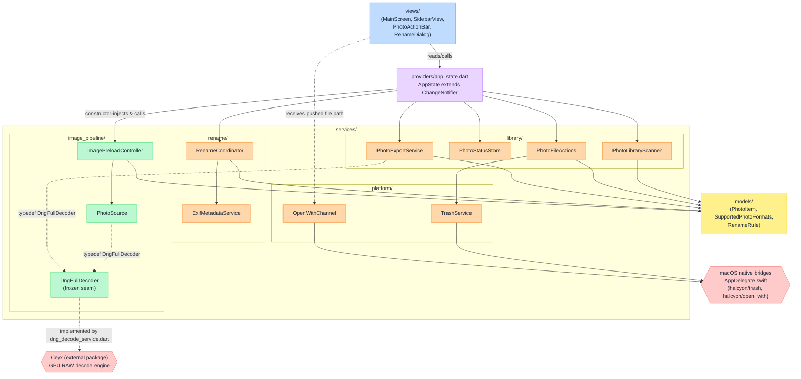
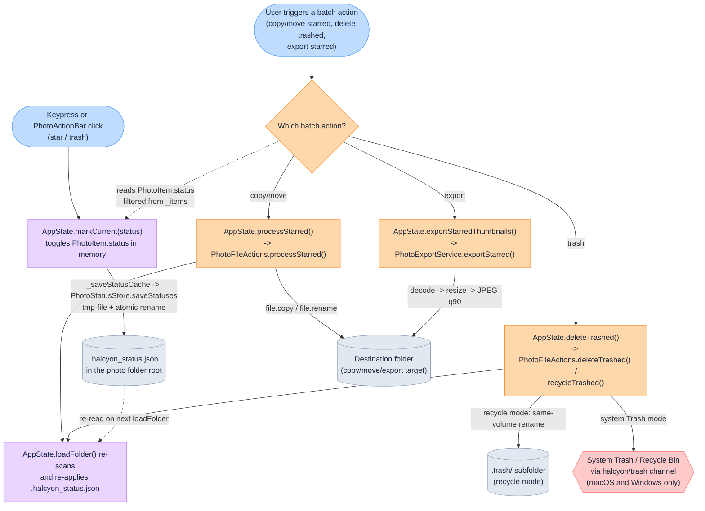

# Halcyon

*[繁體中文版本 / Traditional Chinese](README.zh-TW.md)*

Halcyon is a Flutter desktop application for photographers to triage RAW and JPG photo
folders: browse with the keyboard, mark photos star/trash, then batch-copy or move the
starred files.
<!-- evidence: lib/views/main_screen.dart:104-129 keyboard shortcut handler; lib/services/library/photo_file_actions.dart batch copy/move -->


*The main triage screen, macOS 15.6.1: the sidebar lists the folder's 628 photos, and
the viewer fills the rest of the window with no app bar — only the star and trash
buttons float over the image. Arrow keys move; `S` and `X` mark.*


*The Rename by EXIF dialog on the same folder. The left pane holds the presets and the
editable rule template with live validation; the right pane previews five randomly
sampled files, showing each current filename above the name it would be renamed to.*

### The name

*Halcyon* and *Ceyx* are both kingfisher genera. In Greek myth, Alcyone and Ceyx were
transformed into kingfishers — the two repositories are named as a pair: Ceyx the
decoding engine, Halcyon the application built on it.
<!-- evidence: docs/logs/2026-08-26/readme-draft/BRIEFING.md:46-49 (shared framing agreed for both READMEs); ../ceyx/README.md:56-65 "Sister project: Halcyon" section states the same pairing and dependency direction -->

### Why Halcyon

- **Culling is a throughput problem, not a viewing problem.** The photographer's loop is
  look, judge, advance — arrow keys move between photos, `S` stars, `X` trashes, and
  nothing in that loop asks for a dialog or a mouse click. Anything that stalls that loop
  is the whole cost of the tool.
  <!-- evidence: lib/views/main_screen.dart:104-129 arrowLeft/arrowRight/keyS/keyX bound directly to previousPhoto/nextPhoto/markCurrent -->
- **Lineage: FastPictureViewer.** The keyboard-driven marking model — browse and mark
  without leaving the keyboard — is directly inspired by FastPictureViewer, a paid
  Windows tool from an earlier era that photographers still miss.
- **Preview area maximized, chrome minimized.** The main screen has no app bar: the
  `Scaffold` body is a `Stack` with the image viewer positioned to fill the screen and
  only a floating action bar and status line overlaid on top of it.
  <!-- evidence: lib/views/main_screen.dart:48-59 Scaffold with no appBar, body is Stack(children: [_buildKeyboardShortcutHandler(...), StatusLine()]); lib/views/main_detail_view.dart:113-135 Stack with Positioned.fill viewer and a bottom-centered floating action bar -->
  The macOS window's default size is computed directly from a 3:2 preview area plus a
  270px sidebar (`previewWidth = defaultHeight * 1.5`, `defaultWidth = 270.0 +
  previewWidth`), targeting a wide desktop window rather than a narrow one.
  <!-- evidence: macos/Runner/MainFlutterWindow.swift:9-19 -->
  The sidebar itself is user-resizable between 180px and 600px by dragging a handle.
  <!-- evidence: lib/views/main_screen.dart:71-78 -->
- **Decoding is delegated, not reimplemented.** RAW decode belongs to the sister project
  Ceyx; Halcyon is the application that consumes it under real product constraints —
  UI thread responsiveness, tiered preview/full-size loading, and folder-scale batch
  workflows.
- **Honest about scope.** Desktop is the target platform. Mobile and web build targets
  exist and compile, but the interface itself is not adapted for touch.
  <!-- evidence: pubspec.yaml has no platform restriction, standard Flutter multi-platform project; this claim is scope framing, not a measured behaviour -->

### Sister project: Ceyx

Halcyon depends on Ceyx as an ordinary Dart path dependency on Ceyx's `plugin/`
directory:

```yaml
ceyx:
  path: ../ceyx/plugin
```
<!-- evidence: pubspec.yaml:46-47 -->

This is a plain dependency, not a fork or a subproject: Ceyx must exist as a sibling
checkout next to this repository for `flutter pub get` to succeed, and Halcyon's own
comment on the dependency records that it deliberately depends on the `plugin/` package
rather than Ceyx's own `app/`, to avoid dragging that app's harness dependencies into
Halcyon's build.
<!-- evidence: pubspec.yaml:42-47 -->

---

## Table of contents

- [The triage workflow](#the-triage-workflow)
- [Persistence, resume and batch actions](#persistence-resume-and-batch-actions)
- [Renaming by EXIF](#renaming-by-exif)
- [RAW format support and decode routing](#raw-format-support-and-decode-routing)
- [Measured performance](#measured-performance)
- [Cache and memory management](#cache-and-memory-management)
- [Architecture](#architecture)
- [Architecture diagrams](#architecture-diagrams)
- [Platform support](#platform-support)
- [Building from source](#building-from-source)
- [Testing and quality gates](#testing-and-quality-gates)
- [Third-party attribution](#third-party-attribution)
- [Document maintenance](#document-maintenance)

---

## The triage workflow

This is the core loop: open a folder, browse it, mark photos, move on. Everything below
describes what the app actually does when a photographer sits down with a card full of
RAW and JPG files.

### Opening a folder

`PhotoLibraryScanner.scan()` lists the directory's immediate entries with
`dir.list(followLinks: false)` and does not descend into subdirectories — only files
directly inside the chosen folder are picked up.
<!-- evidence: lib/services/library/photo_library_scanner.dart:8 -->

Each entry is filtered before it is considered a photo: it must be a regular file, its
name must not start with `.` (dotfiles/AppleDouble sidecars are skipped), and its
extension must be in the supported set.
<!-- evidence: lib/services/library/photo_library_scanner.dart:11-16 -->

The supported set is `.jpg`, `.jpeg`, `.png`, `.webp`, `.tif`, `.tiff`, plus every RAW
extension the Ceyx engine can decode (`.dng`, `.arw`, `.cr3`, `.nef`, `.raf`, `.rw2`,
`.orf`, `.pef`, `.srw`, `.x3f`, derived at runtime from Ceyx's own capability constant)
plus three browse-only RAW formats Ceyx cannot decode but Halcyon still lists (`.cr2`,
`.iiq`, `.mrw`) — see "RAW format support and decode routing" below for the full breakdown
and why this list is derived rather than hand-maintained.
<!-- evidence: lib/models/supported_photo_formats.dart:6-32 -->

The two bitmap formats added alongside JPEG/PNG:

- **WebP** (`.webp`) — decoded by the Flutter engine on every platform.
  Animated WebP shows its first frame only. EXIF orientation carried in a
  WebP `EXIF` chunk is not applied; files written by phones with a non-1
  Orientation tag may display rotated.
- **TIFF** (`.tif`, `.tiff`) — decoded with `package:image`. Stripped and
  tiled TIFF, 8/16/32-bit samples, LZW/PackBits/Deflate and uncompressed are
  supported; 16-bit is down-converted to 8-bit for display. Multi-page TIFF
  shows page 1 only. Exotic compressions (CCITT G3/G4, JPEG2000-in-TIFF,
  old-style JPEG-in-TIFF) are not supported and appear as an unreadable file.

Matched files are grouped (see below) into `PhotoItem`s and the resulting list is sorted
by id, case-insensitively.
<!-- evidence: lib/services/library/photo_library_scanner.dart:22-26 -->

### RAW and JPG sibling grouping

Grouping key is the filename with its extension stripped —
`SupportedPhotoFormats.photoIdFor()` returns `p.basenameWithoutExtension(file.path)`. All
files sharing that basename, regardless of extension, land in the same `List<File>` under
that key.
<!-- evidence: lib/models/supported_photo_formats.dart:41-43 -->
<!-- evidence: lib/services/library/photo_library_scanner.dart:14-19 -->

That grouped list becomes one `PhotoItem(id: entry.key, files: entry.value)` — a single
sidebar entry, a single `PhotoStatus`, and a single row the user interacts with, no matter
how many files are in the group.
<!-- evidence: lib/services/library/photo_library_scanner.dart:22-24 -->
<!-- evidence: lib/models/photo_item.dart:7-16 -->

Which file the app actually loads for display is decided by `bestFileToLoad()`: it walks
a fixed preference order (`.jpg`, `.jpeg`, `.png`) and returns the first match; if none of
those extensions are present it falls back to the first supported file in the group, and
only falls back to an arbitrary file if the whole group is otherwise unsupported.
<!-- evidence: lib/models/supported_photo_formats.dart:45-61 -->

Downstream, a folder containing any multi-file group (i.e. any RAW+JPG pair) makes the app
default to recycle-mode deletion instead of permanent delete, on the reasoning that a
card being culled shouldn't lose a RAW to a mis-click.
<!-- evidence: lib/providers/app_state.dart:285-287 -->

Marking or deleting operates on the `PhotoItem`, so a single star or trash action applies
to every file in the group together — the RAW and its JPG sibling move as one unit.
<!-- evidence: lib/models/photo_item.dart:10 -->

### Marking

Two mark states exist beyond "unmarked": `starred` and `trashed`
(`PhotoStatus` enum). `markCurrent(status)` toggles: pressing the same mark again clears it
back to `unmarked`; pressing a different mark sets it. Toggling *off* does not
auto-advance; setting a *new* mark does, if auto-advance is enabled.
<!-- evidence: lib/providers/app_state.dart:367-381 -->
<!-- evidence: docs/sop/memory.md G-005 -->

Auto-advance is a persisted user preference (`SharedPreferences` key `autoAdvance`,
default `false`), toggled via `setAutoAdvance()`.
<!-- evidence: lib/providers/app_state.dart:139,151,405-409 -->

The floating action bar mirrors the same two calls — star and trash/recycle icon buttons
both invoke `AppState.markCurrent()`, and the trash icon's glyph and tooltip switch
between "delete" and "restore from trash" depending on recycle mode.
<!-- evidence: lib/views/photo_action_bar.dart:49-69 -->

Marks are saved to disk on every change (`_saveStatusCache()`); the persistence format and
resume behaviour are covered elsewhere in this document.
<!-- evidence: lib/providers/app_state.dart:378 -->

### Navigation and zoom

`←`/`→` move to the previous/next photo by index within the current sorted list, with
bounds checks (no wraparound at either end).
<!-- evidence: lib/providers/app_state.dart:351-365 -->

Zoom is owned entirely outside `AppState`, by a per-screen `ZoomController` created and
disposed by `MainScreen` — deliberately *not* by the detail view, because the detail view
rebuilds on every photo switch and would otherwise reset the zoom level each time the user
pressed left/right.
<!-- evidence: lib/views/zoom_controller.dart:10-15 -->
<!-- evidence: docs/sop/memory.md AD-015 -->

Each zoom step multiplies or divides the current scale by a fixed factor of `1.25`, capped
at a maximum of `5.0×`. Zooming back down to at-or-below `1.05×` snaps all the way to the
identity matrix instead of settling just above `1.0×`, avoiding a drifted pan offset.
<!-- evidence: lib/views/zoom_controller.dart:44,50-58,60-75 -->

### Keyboard shortcuts

All keyboard handling for the triage loop lives in one place — a single `Focus` widget's
`onKeyEvent` callback in `MainScreen`. This is the complete set of bindings the app
registers; no other file in `lib/` attaches a key handler.
<!-- evidence: lib/views/main_screen.dart:97-135 -->

| Key | Action |
|---|---|
| `←` | Previous photo |
| `→` | Next photo |
| `↑` | Zoom in (×1.25 per step, up to 5×) |
| `↓` | Zoom out (×1.25 per step, snaps to fit below ~1.05×) |
| `S` | Toggle star mark on the current photo |
| `X` | Toggle trash mark on the current photo |
| `R` | Toggle recycle mode (folder-local `.trash/` vs. permanent/system delete) |

<!-- evidence: lib/views/main_screen.dart:104-129 -->

Recycle mode can also be toggled by right-clicking the trash icon in the floating action
bar; left-click on that same icon keeps its ordinary "mark this photo" meaning.
<!-- evidence: lib/views/photo_action_bar.dart:60-68 -->

### On-screen feedback during triage

Transient status messages are shown by a custom `StatusLine` widget (bottom of the
window), which replaced Flutter's `SnackBar` for a fixed, explicit timing: fully visible
for 2.5s, then a 0.5s fade, then removed.
<!-- evidence: lib/views/status_line.dart:25-26 -->
<!-- evidence: docs/sop/memory.md AD-009 -->

Two feedback messages fire directly from the triage loop:

- A one-time warning when a folder is opened and found not writable — surfaced once per
  `loadFolder()` call, not once per mark. Writability is checked by actually creating and
  deleting a probe file, not by reading Unix permission bits, because permission bits are
  unreliable on `noowners`-mounted exFAT cards.
  <!-- evidence: lib/providers/app_state.dart:288-289 -->
  <!-- evidence: docs/sop/memory.md AD-009 -->
- An error message if the folder scan itself throws (e.g. a permission error walking the
  directory), surfaced with the underlying exception text.
  <!-- evidence: lib/providers/app_state.dart:324-326 -->

---

## Persistence, resume and batch actions

### A culling session is never lost

Close Halcyon mid-folder, reopen the same folder later, and it comes back on the same
photo with every star and trash mark intact. Marks are not held only in memory: each
mutation is written to a status file next to the photos, and the last-viewed photo is
restored on the next open.

#### The status file

Every folder Halcyon opens gets its own `.halcyon_status.json`, written at the folder
root next to the photos it describes.
<!-- evidence: lib/services/library/photo_status_store.dart:22-24 -->
It is a flat JSON object: each photo id (its filename) maps to `"starred"` or
`"trashed"` — unmarked photos are simply absent, not written as `"unmarked"` — plus two
reserved keys, `_last_viewed_id` for resume and `_rename_rule` for the folder's saved
rename pattern.
<!-- evidence: lib/services/library/photo_status_store.dart:18,132-148 -->
Plain JSON was chosen over a database so the file sits directly in the photo folder,
travels with it when copied to another machine or backed up, and is human-readable in
a diff.
<!-- evidence: docs/sop/memory.md AD-004 -->

Because the file lives inside the folder rather than in a central app database, each
folder's marks are self-contained: opening a second folder starts a second, independent
`.halcyon_status.json`, and shoots never bleed marks into each other.
<!-- evidence: lib/services/library/photo_status_store.dart:22-24 -->

A corrupt or unreadable status file degrades to an empty set of marks rather than
blocking the folder from opening at all — losing marks is recoverable, losing access to
the photos is not.
<!-- evidence: lib/services/library/photo_status_store.dart:34-53 -->

#### Resume on reopen

On reopening a folder, Halcyon restores the previously selected photo: if no explicit
selection target is given, it falls back to the id stored under `_last_viewed_id`,
provided that photo still exists in the freshly scanned folder.
<!-- evidence: lib/providers/app_state.dart:291-316 -->
The pointer is saved five seconds after navigation settles on a photo, debounced so
that rapid arrow-key browsing does not write on every keystroke.
<!-- evidence: lib/providers/app_state.dart:342-343,394-400 -->

#### Durability: atomic writes, one writer at a time

Two independent timers in the app can each want to write this file — one for star/trash
marks, one for the last-viewed pointer — and both do a read-modify-write. Serializing
every write through a single queue means a save that started earlier can never finish
later and clobber a change the other timer already wrote.
<!-- evidence: docs/sop/memory.md G-019 -->
<!-- evidence: lib/services/library/photo_status_store.dart:55-66 -->
Every write itself lands via a temp-file-then-rename, so pulling the memory card or a
crash mid-write can never leave a half-written status file behind — the folder always
has either the old complete file or the new complete file, never a torn one.
<!-- evidence: lib/services/library/photo_status_store.dart:68-76 -->

#### Read-only folders are detected honestly

Directory permission bits are unreliable on some mounts — an exFAT card can report a
writable-looking mode while its physical write-lock switch makes every write fail.
Halcyon does not trust the bits: it probes writability by actually creating and
deleting a small file in the folder, and only then surfaces a one-time warning if the
folder turns out to be read-only.
<!-- evidence: lib/services/library/photo_status_store.dart:78-91 -->
<!-- evidence: docs/sop/memory.md AD-009 -->
<!-- evidence: docs/sop/memory.md G-006 -->

#### Renaming and marks

Marks are keyed by filename, not by any other identity. If photos are renamed by a
tool that does not go through Halcyon's own rename feature, the marks tied to their old
filenames are silently orphaned — they stop matching any photo in the folder.
Halcyon's own rename feature avoids this by remapping every key in the status file to
the new filename as part of the rename operation, so stars, trash marks and the resume
pointer all survive a rename performed inside the app.
<!-- evidence: docs/sop/memory.md G-011 -->
<!-- evidence: lib/services/library/photo_status_store.dart:185-203 -->

### Batch actions

#### Copy and move starred photos

Starred photos can be copied or moved as a batch to a chosen destination folder.
<!-- evidence: lib/services/library/photo_file_actions.dart:50-87 -->
A RAW file and its same-named JPG sibling travel together as one unit — the item, not
the individual file, is what carries the starred mark — and an AppleDouble sidecar file
that macOS creates on some volumes (exFAT, network mounts) is cleaned up alongside it
rather than left behind at the destination.
<!-- evidence: lib/services/library/photo_file_actions.dart:63-84 -->
<!-- evidence: docs/sop/memory.md G-006 -->
By default an existing file at the destination is left untouched (skipped, not
overwritten); the batch does not stop on one failure — every remaining file is still
attempted, and every failure is collected and shown to the user rather than being
silently swallowed.
<!-- evidence: lib/services/library/photo_file_actions.dart:56-70,28-36 -->

#### Social-media export

Starred photos can also be exported as resized JPEGs for social media, one file per
item, decoded, resized and re-encoded entirely in Dart. The long edge is capped at
`2048` px, aspect ratio preserved, and the output is encoded at JPEG quality `90`.
<!-- evidence: lib/services/library/photo_export_service.dart:82,126,141 -->
Core EXIF fields — camera make/model, capture date, artist, exposure time, f-number,
focal length, lens model, ISO and GPS coordinates — are re-read from the original
source file and reattached to the resized output; this is a curated set of tags, not a
full metadata block copy.
<!-- evidence: lib/services/library/photo_export_service.dart:144-216 -->
Up to `4` exports run concurrently, a ceiling chosen because a full RAW decode can hold
hundreds of megabytes in flight and letting every starred item decode at once on a
large batch risks running out of memory.
<!-- evidence: lib/services/library/photo_export_service.dart:218-223,287-288 -->

#### Two deletion paths

Halcyon offers two distinct ways to delete, and they are genuinely different products:

| Path | What it does | Platform |
|---|---|---|
| System Trash | Moves the file to the OS trash via a native bridge | macOS, Windows |
| Recycle mode (in-folder) | Moves the file into a `.trash` subfolder inside the photo folder | Any platform |

The system Trash path is backed by a `halcyon/trash` method channel. On macOS it is
registered in `AppDelegate.swift` and calls `FileManager.default.trashItem`; on Windows
it is registered in `windows/runner/halcyon_channels.cpp`.
<!-- evidence: macos/Runner/AppDelegate.swift:23-24 -->
<!-- evidence: windows/runner/halcyon_channels.cpp:49-51 -->
<!-- evidence: docs/sop/memory.md AD-008 -->
Grepping the Android, iOS, Linux and web runner directories for `halcyon/trash` finds
no registration, so the system Trash path is macOS- and Windows-only. Recycle mode is a
user-toggleable, per-folder default (and is switched on automatically for folders that
contain RAW+JPG sibling pairs) rather than an automatic fallback; on a platform without
the native channel, choosing direct system-Trash delete throws a `TrashException`
instead of silently doing nothing.
<!-- evidence: lib/providers/app_state.dart:130,166,287,498-515 -->
<!-- evidence: lib/services/platform/trash_service.dart:9-19 -->

Recycle mode moves every file of a trashed item — including its RAW sibling and any
AppleDouble sidecar — into a `.trash` subfolder next to the photos, rather than through
the OS. It is a same-volume rename, so it works even on cards where the system Trash
API is unavailable, and it is instant because no data is copied.
<!-- evidence: lib/services/library/photo_file_actions.dart:114-155 -->
<!-- evidence: docs/sop/memory.md AD-013 -->
A filename collision with an earlier recycle batch is never overwritten: the mover
appends `-1`, `-2`, and so on until it finds a free name.
<!-- evidence: lib/services/library/photo_file_actions.dart:157-171 -->

Batch delete failures block: any failed file produces a dialog listing exactly which
files failed and why, because a delete that silently did nothing looks identical to a
broken app. A successful recycle-mode batch instead posts a transient status-line
message with the moved count, as a reminder the files are still on disk in `.trash` and
were not permanently removed.
<!-- evidence: lib/views/batch_delete_feedback.dart:12-40 -->

---

## Renaming by EXIF

Photographers name files by shoot date, camera, lens, sequence number, or some mix of
those, and the format tends to be a house convention rather than whatever the camera
wrote to the SD card. Halcyon's rename feature is a small template engine over EXIF and
filesystem metadata: write a template once, apply it to a whole folder, and every RAW,
its JPG sibling, and any sidecar (`._DSC_0431.NEF`-style AppleDouble files) move together
under the same new base name.
<!-- evidence: lib/models/rename_rule.dart:30-35 -->

### The template model

A rule is a single string template such as `{YYYY}-{MM}-{DD}-{hh}-{mm}-{ss}`. Rendering a
template is pure — it never touches the filesystem — so the whole naming policy is
unit-testable without any photos on disk.
<!-- evidence: lib/models/rename_rule.dart:30-39 -->

Every `{token}` the renderer understands is grouped exactly as the rule editor's "Insert
variable" panel groups them:
<!-- evidence: lib/views/rename_dialog/rule_editor.dart:70-90 -->

| Group | Variable | Resolves to | Example |
|---|---|---|---|
| Date/time | `{YYYY}` | Capture year, 4 digits | `2026` |
| Date/time | `{MM}` | Capture month, 2 digits | `08` |
| Date/time | `{DD}` | Capture day, 2 digits | `26` |
| Date/time | `{hh}` | Capture hour, 2 digits | `14` |
| Date/time | `{mm}` | Capture minute, 2 digits | `07` |
| Date/time | `{ss}` | Capture second, 2 digits | `33` |
| Camera | `{camera}` | EXIF camera model, empty if absent | `Z 8` |
| Camera | `{lens}` | EXIF lens model, empty if absent | `NIKKOR Z 24-70mm f_2.8 S` |
| Camera | `{make}` | EXIF camera make, empty if absent | `NIKON CORPORATION` |
| Camera | `{artist}` | EXIF artist/copyright tag, empty if absent | `J. Chen` |
| Shooting | `{f}` | Aperture, formatted `f<value>`, empty if absent | `f2.8` |
| Shooting | `{focal}` | Focal length, formatted `<value>mm`, empty if absent | `35mm` |
| Shooting | `{iso}` | ISO, formatted `ISO<value>`, empty if absent | `ISO400` |
| Shooting | `{shutter}` | Shutter speed as EXIF prints it, empty if absent | `1/250` |
| Shooting | `{direction}` | GPS image direction, rounded to a whole degree, empty if absent | `187` |
| File | `{seq}` | 1-based sequence number among files that collide on the same rendered name before `{seq}` is applied; supports a zero-pad width, e.g. `{seq:3}` → `007` | `1` |
| File | `{orig}` | The original filename's base (no extension) | `DSC_0431` |
<!-- evidence: lib/models/rename_rule.dart:50-124 -->

The date/time fields fall back to the file's filesystem modification time when EXIF has
no capture date (or when EXIF could not be read at all) — the renderer always has *some*
date to render, it is just not necessarily the capture date in that case.
<!-- evidence: lib/models/rename_rule.dart:96 -->

Any field with no EXIF value renders as an empty string rather than a placeholder — the
dialog's preview list says this explicitly ("Missing metadata renders as an empty
string").
<!-- evidence: lib/models/rename_rule.dart:107-119 -->
<!-- evidence: lib/views/rename_dialog/preview_list.dart:87-92 -->

A template referencing any token outside this table is rejected before it can run: the
editor shows "Unknown variable {name}" and the Run button is disabled.
<!-- evidence: lib/models/rename_rule.dart:65-77 -->
<!-- evidence: lib/views/rename_dialog/actions.dart:52-53 -->

Rendered names are sanitised for filesystem safety: `/`, `:`, `\` and NUL are replaced
with `_` (`:` matters because it is a path separator under the classic Mac OS layer and
still shows up as `/` in Finder, and a raw `1/250` shutter-speed rendering would otherwise
create a subdirectory), and leading/trailing whitespace and dots are stripped.
<!-- evidence: lib/models/rename_rule.dart:128-134 -->

### Presets

Four presets ship with the app, selectable from the dialog's preset list. Rendered
against a file shot 2026-08-26 14:07:33 with base name `DSC_0431` and no metadata
collision (`{seq}` = 1):

| Preset | Template | Example rendering |
|---|---|---|
| Date & time | `{YYYY}-{MM}-{DD}-{hh}-{mm}-{ss}` | `2026-08-26-14-07-33` |
| Compact | `{YYYY}{MM}{DD}_{hh}{mm}{ss}` | `20260826_140733` |
| Camera-style | `IMG_{YYYY}{MM}{DD}_{hh}{mm}{ss}` | `IMG_20260826_140733` |
| Date + sequence | `{YYYY}-{MM}-{DD}_{seq}` | `2026-08-26_1` |
<!-- evidence: lib/models/rename_rule.dart:43-48 -->

"Date & time" is also the default template a fresh dialog opens with.
<!-- evidence: lib/models/rename_rule.dart:41 -->
<!-- evidence: lib/views/rename_dialog/rename_dialog.dart:33-35 -->

Editing the template text (or inserting a variable chip) while a preset is selected
switches the selection to a pseudo-preset labelled `Custom...`; only a custom rule is
remembered per folder, and reopening the dialog on a folder that was last renamed with a
custom rule restores that exact template.
<!-- evidence: lib/views/rename_dialog/rename_dialog.dart:61-70 -->
<!-- evidence: lib/views/rename_dialog/rename_dialog.dart:101-113 -->

### Dialog and live preview

The dialog is two panes: preset picker, rule text field and variable chips on the left
(`RuleEditor`), a live preview list on the right (`RenamePreviewList`). Opening the dialog
draws five random items from the current folder and reads their EXIF once; every
keystroke in the rule field re-renders those five preview rows against the already-read
metadata, without re-reading EXIF.
<!-- evidence: lib/views/rename_dialog/rename_dialog.dart:72-84 -->
<!-- evidence: lib/views/rename_dialog/preview_list.dart:98-107 -->

A "Re-roll" control redraws a fresh set of five random items with a fresh metadata read.
Each preview row shows the current filename struck through, an arrow, the rendered new
base name plus extension, a badge for each sibling extension the item carries (so the
user can see that a RAW+JPG pair moves together before committing), and a "no camera tag"
badge when the template references `{camera}` and this particular item has none.
<!-- evidence: lib/views/rename_dialog/preview_list.dart:98-116 -->

The Run Rename button is disabled whenever the current template has a validation error
(unknown variable, empty template, or a template that renders to an empty string), so an
invalid rule cannot be applied.
<!-- evidence: lib/models/rename_rule.dart:73-87 -->
<!-- evidence: lib/views/rename_dialog/actions.dart:52-53 -->

The dialog only applies to the whole folder — there is no per-item selection, and the
footer states the item count applies to the whole folder.
<!-- evidence: lib/views/rename_dialog/rename_dialog.dart:200 -->
<!-- evidence: lib/views/rename_dialog/actions.dart:29-34 -->

### Where EXIF comes from, and its cost

EXIF is read once per photo item, not once per file: `PhotoItem.bestFileToLoad` picks the
file EXIF is read from, and that single reading is applied to every sibling file in the
group (RAW, JPG, sidecar) when the rename executes.
<!-- evidence: docs/sop/memory.md AD-017 -->
<!-- evidence: lib/providers/app_state.dart:547-564 -->

`bestFileToLoad` prefers a `.jpg`/`.jpeg`/`.png` sibling over the RAW file when one
exists, falling back to the first file this app can decode, and finally to the first file
in the group if nothing is decodable.
<!-- evidence: lib/models/supported_photo_formats.dart:18-22 -->
<!-- evidence: lib/models/supported_photo_formats.dart:45-61 -->

The user-visible consequence: for a RAW shot with no JPG sibling, EXIF is read straight
from the RAW file's own header via the `exif` package, run off the UI isolate since
parsing a RAW header means scanning megabytes. If that read fails or the RAW format's
header is not one the `exif` package parses, the item's metadata is `null` and every EXIF
token in the template renders empty for it — the date/time tokens alone still resolve,
falling back to the file's modification time.
<!-- evidence: lib/services/rename/exif_metadata_service.dart:66-75 -->
<!-- evidence: lib/models/rename_rule.dart:96 -->

EXIF is read in chunks of 500 paths so a large folder still reports incremental progress
rather than blocking on one giant batch; the dialog reports this as "讀取 EXIF
*done/total*…" in its status line.
<!-- evidence: lib/services/rename/exif_metadata_service.dart:18-42 -->
<!-- evidence: lib/services/rename/rename_coordinator.dart:86-91 -->

### Applying the rename

Naming policy and file I/O are two separate functions: `planRenames` computes every move
without touching disk, and only `applyRenames` performs the actual `File.rename` calls.
`planRenames` is pure, so the whole collision-avoidance policy is testable without photos
on disk.
<!-- evidence: docs/sop/memory.md AD-016 -->
<!-- evidence: lib/services/rename/rename_service.dart:32-41 -->

Renames execute serially, one plan at a time. `File.rename` is a same-volume metadata
operation, so parallelism buys nothing and would turn the planner's collision avoidance
into a race.
<!-- evidence: lib/services/rename/rename_service.dart:143-146 -->

**Collision rule, as implemented.** Items are grouped by what they would render to at
`{seq}` = 1; every item inside a group that collides on that rendered name gets a
deterministic 1-based sequence number, assigned by sorting the group's item ids and
taking each item's position — so the numbering does not depend on scan order. If the
resulting candidate name still collides with a name already in the folder (or a name
already claimed earlier in this same batch), a numeric suffix `-1`, `-2`, ... is appended
until the name is free. An item whose final rendered name is identical to its current
name is dropped from the plan — a no-op rename does not get an undo-log entry.
<!-- evidence: lib/services/rename/rename_service.dart:58-85 -->

All files belonging to one item — the RAW, a JPG sibling, and an AppleDouble sidecar
(`._<name>`) if one exists in the folder — are renamed to the same new base name with
their own original extensions preserved, so a RAW+JPG pair or a RAW+sidecar pair never
splits apart during a rename.
<!-- evidence: lib/services/rename/rename_service.dart:87-105 -->

Every move is appended to `.halcyon_rename_log.jsonl` in the folder as it lands (an
append-only, one-JSON-object-per-line journal rather than a rewritten array, so a crash
mid-batch does not corrupt or lose earlier moves), which is what backs the dialog's
"Undo" action — the log is replayed backwards and then deleted.
<!-- evidence: lib/services/rename/rename_service.dart:123-192 -->
<!-- evidence: lib/services/rename/rename_service.dart:194-244 -->

Because `.halcyon_status.json` (star/trash marks, last-viewed id) is keyed by filename,
the coordinator remaps every changed key in that store immediately after a rename batch
completes, and again (in reverse) after an undo — otherwise every mark would be silently
orphaned under a filename that no longer exists.
<!-- evidence: docs/sop/memory.md G-011 -->
<!-- evidence: lib/services/rename/rename_coordinator.dart:136-141 -->
<!-- evidence: lib/services/rename/rename_coordinator.dart:182-189 -->

The rename dialog itself is unreachable for a folder Halcyon has determined it cannot
write to — the dialog's own footer states this.
<!-- evidence: lib/views/rename_dialog/actions.dart:29-34 -->

### Limitations

- A field with no corresponding EXIF tag — or a photo whose EXIF could not be read at all
  — renders as an empty string in that position of the filename; the template does not
  fall back to a different field.
  <!-- evidence: lib/models/rename_rule.dart:107-119 -->
- EXIF for a RAW-only item (no JPG sibling) depends entirely on the `exif` package's
  ability to parse that RAW file's own header; there is no RAW-specific EXIF parser in
  this path, and a RAW format the package cannot parse yields no metadata for that item
  rather than a partial read.
  <!-- evidence: lib/services/rename/exif_metadata_service.dart:66-93 -->

---

## RAW format support and decode routing

Two separate questions determine whether a photo shows up and how it gets turned into
pixels: which files Halcyon's folder scanner lists at all, and which of those Ceyx, the
sister decoding engine, actually knows how to decode. The two sets are not the same, and
the gap between them matters to anyone pointing Halcyon at a folder of camera originals.

### What Halcyon scans and lists

The sidebar only ever shows a file whose extension is in `SupportedPhotoFormats
.supportedExtensions`, checked once per directory entry during the folder scan. As of the
2026-08-26 RAW-coverage contract, that set is no longer a hand-written list: it is
**derived** at runtime from Ceyx's own `kSupportedDecodeExtensions` constant, unioned with
a small hard-coded browse-only set and the two encoded-bitstream extensions:

| Extension | Category |
|---|---|
| `.jpg`, `.jpeg` | Encoded bitstream |
| `.png` | Encoded bitstream |
| `.dng`, `.arw`, `.cr3`, `.nef`, `.raf`, `.rw2`, `.orf`, `.pef`, `.srw`, `.x3f` | RAW, engine-decodable — derived from Ceyx's `kSupportedDecodeExtensions` |
| `.cr2`, `.iiq`, `.mrw` | RAW, browse-only — Ceyx cannot decode these containers (contract decision D2); they scan, star and batch-move like any other item, and the loader attempts the same embedded-preview path every other RAW gets — whether that attempt actually finds a usable preview is a property of each vendor's file layout, not guaranteed by this whitelist entry |

<!-- evidence: lib/models/supported_photo_formats.dart:6-32 -->

The point of deriving rather than restating: a future Ceyx addition reaches every file
Halcyon browses without anyone editing this app. The previous hand-maintained list already
failed once this way — Panasonic `.rw2` was silently missing from it until that gap was
found and closed (`docs/sop/memory.md` G-007) — and a whitelist derived from the engine's
own capability constant cannot desync from it the same way again.
<!-- evidence: docs/sop/memory.md G-007 -->

`PhotoLibraryScanner.scan` drops any directory entry that fails
`SupportedPhotoFormats.isSupportedPath` before it is even grouped into a `PhotoItem`, so an
unlisted extension never reaches any later stage of the app, decode or otherwise.
<!-- evidence: lib/services/library/photo_library_scanner.dart:11-16 -->

Within a sibling group that shares a basename (e.g. a JPG and a RAW written by the same
shutter press), `SupportedPhotoFormats.preferredLoadExtensions` (`.jpg`, `.jpeg`, `.png`,
in that order) decides which file loads first; a RAW-only group falls back to the first
supported file present.
<!-- evidence: lib/models/supported_photo_formats.dart:34-46,56-72 -->

### What Ceyx can decode

Ceyx, not Halcyon, owns RAW decode capability. It routes each file to one of two frontends
by probing the file header — never by matching the extension:

| Route | Container | Frontend |
|---|---|---|
| DNG | TIFF-based, `DNGVersion` tag present in IFD0 | Adobe DNG SDK |
| Generic RAW | ARW, CR3, NEF, RAF, ORF, RW2, PEF, SRW, X3F | LibRaw, with RawSpeed3 as its preferred backend |

<!-- evidence: ceyx README.md:69-76; ../ceyx/plugin/lib/src/raw_route.dart -->

**CR2, IIQ and MRW are not in this list.** Canon's older CR2 container, Phase One IIQ and
Minolta MRW are formats Ceyx cannot decode at all; Halcyon still lists them (contract
decision D2, "keep them browsable — removing them would be a capability regression") and
routes them through the same embedded-preview attempt as every other RAW with no decode
route. That attempt does not always succeed: it depends on the walker recognising the
container's own preview tags, and it is unconfirmed for real CR2 files specifically —
there is no CR2 sample in this project's test corpus, and the walker's candidate search
targets tags that real CR2 embedded previews are not known to use. Nothing in this
document should be read as a claim that a real CR2 file has been observed displaying its
embedded preview in Halcyon; only that the code attempts it and does not fall back to a
decode.

Fujifilm's X-Trans and Sigma's Foveon X3F are decodable, and are not a separate question
from the rest of this list: Ceyx's GPU dispatch keys on sensor layout after a file is
unpacked (Bayer 2×2 for the RGGB-family majority, X-Trans 6×6 for Fujifilm, linear RGB/no
CFA for Foveon), and both non-Bayer layouts already have working GPU paths — there is no
open question of whether they are supported, only which layout dispatch a given decoded
file lands on.
<!-- evidence: ceyx README.md:107-117 -->

### Full RAW decode routing

Two Halcyon-side gaps used to sit between "Ceyx can decode this container" and "Halcyon
actually asks it to": a narrower scan whitelist (closed above) and a decode-routing
decision that was hard-coded to `.dng`. Both are closed as of this contract.

The decode dispatch itself — the code that hands a file to Ceyx's decoder once the loader
has said "this needs a real RAW decode" — was **already format-agnostic** before this
round; there was no `.dng`-only branch inside the state coordinator or the full-size half
of the preload controller. The entire routing gap lived in one place: the pure-Dart image
loader emitted its "needs RAW decode" signal only when the path ended in `.dng`, so every
other RAW extension that lacked a usable embedded preview fell through to a
`RAW_NO_EMBEDDED_PREVIEW` failure instead of ever reaching the decoder. That gate is now
`SupportedPhotoFormats.isDecodablePath` — true for every extension in Ceyx's capability
constant, false for the D2 browse-only set and everything else — so the signal fires for
any engine-decodable RAW, not just DNG.
<!-- evidence: lib/services/image_pipeline/dart_image_loader.dart:12-27,126-137; lib/services/image_pipeline/photo_source.dart:143-163 -->

Two guards that used to be spelled `.dng` for the same reason were re-derived onto the same
gate rather than left behind: the minimum-long-edge strictness that sends an undersized
preview candidate to decode instead of serving it undersized (`docs/sop/memory.md` AD-021),
and the "container declares only unreadable candidates" malformed verdict
(`docs/sop/memory.md` AD-022). Both now apply to every engine-decodable RAW, not only DNG;
browse-only RAW (D2) is deliberately excluded from both, because rejecting a candidate
there has nowhere to fall through to but `RAW_NO_EMBEDDED_PREVIEW` — there is no decoder
waiting on the other side.
<!-- evidence: lib/services/image_pipeline/dart_image_loader.dart:69-137 -->

**A real bug fixed in passing.** The sidebar-thumbnail RAW-decode fallback used to gate on
"is this a RAW file" rather than "can the engine decode this RAW file", so every
browse-only RAW (`.cr2`/`.iiq`/`.mrw`) triggered a doomed native decode call on every
folder load — one that could never succeed, silently swallowed, and degraded to a blank
sidebar tile. The gate is now the same `isDecodablePath` check used everywhere else: a
format the code still tries to decode was never really browse-only.
<!-- evidence: lib/services/image_pipeline/image_preload_controller.dart:875-888 -->

### Panasonic RW2: a second container flavour, not just a version number

Accepting Panasonic's TIFF version word (85, vs the Adobe/standard 42) was necessary but
not sufficient. An RW2's IFD0 is an ordinary TIFF chain, but it carries none of the six
tags (Compression, PhotometricInterpretation, width/height, StripOffsets/StripByteCounts)
the walker used to look for — its embedded previews are whole JPEG bitstreams sitting
inline in two vendor tags (`0x002E` "JpgFromRaw", the small rendition; `0x0127`
"JpgFromRaw2", the full-size one) whose dimensions are not stated anywhere in the IFD. The
walker now reads each blob's own JPEG frame header under a bounded scan to learn its size,
and falls back to Panasonic's own width/height IFD tags (rather than the Adobe
`DefaultCropSize` tag RW2 does not carry) when judging whether a candidate is full-size.
<!-- evidence: lib/services/image_pipeline/dng_embedded_jpeg_extractor.dart:19-24,314-327,731-834 -->

On the real sample file
(`/Users/jhangyu/project/ceyx/image_samples/raw_corpus/2026-08-10-17-47-27.rw2`), the
full-size preview path selects the `0x0127` blob — 6000×4000, 3,593,728 bytes — and the
sidebar path selects the smaller `0x002E` blob — 1920×1280 — at a measured probe cost of
24,578 bytes across 4 disk reads.
<!-- evidence: test/services/image_pipeline/dng_embedded_jpeg_extractor_test.dart:396-448 -->

Non-TIFF RAW containers (Fujifilm RAF, Sigma X3F, Canon CR3) are deliberately not handled
by this walker at all; they are not TIFF-based, so they reach Ceyx's decoder directly and
that is sufficient.

### The no-native-decoder platform state (D3)

Full RAW decode is not available on every platform Halcyon targets. The build script's
native-library table only builds and packages a Ceyx decoder library for macOS, Windows
and Android; a target absent from that table has no native decoder, and the table
explicitly names iOS, Linux and web as such targets today.
<!-- evidence: scripts/build_apps.py:265-290 -->

On those three platforms, a RAW file that needs a real decode (no usable embedded preview)
is now distinguishable, internally, from an ordinary decode failure. The pure-Dart loader
stays free of `Platform` checks by construction: it still emits the ordinary "needs RAW
decode" signal, and the layer that owns the decoder seam detects the absent decoder
**before** attempting anything and records it as a `NativeImageFailure` carrying the
`NO_NATIVE_DECODER` code — a static platform property, never inferred from a caught
exception, and never confused with a decoder that exists and threw on bad data.
`NativeImageResult` still has exactly three variants; this is expressed as a failure code
on the existing failure variant, not a fourth variant (`docs/sop/memory.md`
AD-010/AD-011). This is a plumbing-level distinction only: nothing in the app's views reads
this code today, so the item surfaces the same way any other permanent miss does, with no
dedicated on-screen message for "no native decoder on this platform".
<!-- evidence: lib/services/image_pipeline/image_source_types.dart:120-132; lib/services/image_pipeline/photo_source.dart:147-162; lib/services/image_pipeline/image_preload_controller.dart:297,309-316; lib/providers/app_state.dart:219 -->

### The two read paths

Halcyon shows a RAW file's pixels one of three ways, and which one runs is decided before
any GPU work happens. Path two, below, depends on a native Ceyx library that only ships on
macOS, Windows and Android (see "The no-native-decoder platform state (D3)" above); on
iOS, Linux and web, an engine-decodable RAW with no usable embedded preview reports the D3
state instead of running path two.

**Path one — embedded preview.** Many RAW containers (DNGs from Lightroom Classic or DxO
PureRAW in particular, and Panasonic RW2s via their vendor-tag blobs) carry one or more
JPEG renditions alongside the actual sensor data. When a candidate large enough to serve
the request is found, Halcyon reads that JPEG directly — a bounds-checked seek and slice,
no image decode of the RAW mosaic at all — and skips RAW decode entirely.
<!-- evidence: lib/services/image_pipeline/dng_embedded_jpeg_extractor.dart:6-24 -->

**Path two — full RAW decode.** When no preview candidate qualifies and the extension is
in Ceyx's decodable set, the file is handed to Ceyx's decoder (the `DngFullDecoder` seam;
the name predates this round's generalisation and is not being renamed — see the
architecture-decision entry in `docs/sop/memory.md` AD-032).
<!-- evidence: lib/services/image_pipeline/dart_image_loader.dart:171-195; lib/services/image_pipeline/photo_source.dart:143-192 -->

**Path three — no native decoder on this platform (D3).** On iOS, Linux and web, path two
cannot run at all; a RAW that would otherwise need it is recorded internally with the
`NO_NATIVE_DECODER` code described above instead, with no separate on-screen treatment.

The rule that decides between paths one and two is a minimum long-edge requirement, and it
is applied unevenly on purpose. The `preview` request purpose (long edge 2800px) on any
engine-decodable RAW passes that value as `minLongEdge`: a selected candidate smaller than
2800px on its long edge is rejected outright, sending the file to path two rather than
serving an undersized image.
<!-- evidence: lib/services/image_pipeline/image_source_types.dart:19; lib/services/image_pipeline/dart_image_loader.dart:126-137 -->

The sidebar-thumbnail path deliberately does not apply this floor: it keeps its lenient
smallest-then-largest candidate selection so thumbnails never fall through to a full RAW
decode.
<!-- evidence: lib/services/image_pipeline/dng_embedded_jpeg_extractor.dart:96-100; lib/services/image_pipeline/dart_image_loader.dart:58-67; docs/sop/memory.md AD-021 -->

`PhotoExportService.exportBytesFor` calls the loader with the `preview` purpose — the same
purpose the strict floor is keyed on — so the floor applies to export today as well: an
export source whose best embedded candidate falls short of 2800px on its long edge is sent
to a full RAW decode rather than exported at that smaller size.
<!-- evidence: lib/services/library/photo_export_service.dart:53-58 -->

One rejection threshold applies independently of the size floor: a RAW whose declared crop
extent implies a decoded RGBA buffer over roughly 1.5 GB is refused outright rather than
decoded, to bound worst-case memory use.
<!-- evidence: lib/services/image_pipeline/dart_image_loader.dart:171-182 -->

### Two things a container with unreadable previews is not conflated with

A container whose declared preview candidates are all unreadable — a strip offset or byte
count that falls outside the file — used to be reported broken immediately, before any
decode was attempted. That pre-empt is gone: such a container is now routed to a real RAW
decode first, exactly like an ordinary preview-less file, and is only reported broken
(`DNG_PARSE_FAILED`) if that decode *also* fails. The change followed a measurement: a file
in this state was being reported broken while the engine decoded its actual sensor data
successfully in 383ms.
<!-- evidence: lib/services/image_pipeline/dart_image_loader.dart:138-170; lib/services/image_pipeline/image_source_types.dart:76-104; lib/services/image_pipeline/photo_source.dart:193-222 -->

The finding — that every declared preview was unreadable — still travels forward; it is
not discarded, only no longer acted on early. It rides as a field on the same "needs RAW
decode" signal (`NativeImageNeedsRawDecode.declaredPreviewsUnreadable`), and the layer that
owns the decoder is the one that finally resolves it, because it is the only layer that
knows whether the decode succeeded:

- **The container declares no preview at all** (a bare-CFA capture, or every candidate is
  either absent or rejected as undersized) and the decode fails — the uniform miss, no
  broken-file code.
- **The container declares previews but all are unreadable** and the decode *also* fails —
  only now is it reported broken (`DNG_PARSE_FAILED`); AD-022's two-state distinction is
  preserved, it is just formed after the decode attempt instead of before it.
- **The container declares previews but all are unreadable**, and the decode *succeeds* —
  the file renders normally and is never called broken at all, which is the point of the
  change.
- **No native decoder exists on this platform** (D3, above) — a property of the build, not
  of the file, decided before any decode is attempted and never conflated with either state
  above or with a decoder that exists and threw on bad data.

Browse-only RAW (D2) is unaffected in every direction: it never reached the old pre-empt
and has no decode to route to now, so a corrupt `.cr2`/`.iiq`/`.mrw` keeps the uniform
`RAW_NO_EMBEDDED_PREVIEW` state throughout.
<!-- evidence: docs/sop/memory.md AD-022; lib/services/image_pipeline/dart_image_loader.dart:159-170,196-203; lib/services/image_pipeline/photo_source.dart:193-222 -->

A single unreadable candidate sitting next to a good one does not trigger the broken-file
finding — only the case where *no* declared candidate is readable counts as malformed.
<!-- evidence: docs/sop/memory.md AD-022; lib/services/image_pipeline/dng_embedded_jpeg_extractor.dart:521-528 -->

### What is proven, and what is not

The routing change above is implemented and covered by unit tests using a substituted
decoder (`test/services/image_pipeline/raw_coverage_wiring_test.dart`,
`test/services/image_pipeline/dart_image_loader_test.dart`,
`test/services/image_pipeline/photo_source_test.dart`). It has **not** been proven end to
end against a real preview-less file of a non-DNG format: the one real Panasonic sample
available to this project has an embedded preview, so it exercises path one, not path two.
Do not read the routing description above as a claim that a real generic-RAW file has been
watched going through Ceyx's decoder inside Halcyon's own app shell — that has only been
demonstrated for DNG (see "Measured performance" below).

Real sample files exist only for Panasonic, Sony, Fujifilm and Sigma
(`/Users/jhangyu/project/ceyx/image_samples/raw_corpus/`). Nikon, Canon CR3, Olympus,
Pentax and Samsung get routing-logic tests only — there is no real-file proof for them.
This is a stated limitation of the current test corpus, not a gap silently papered over.

Verification, HEAD `0a32c50`: `flutter analyze` reports 0 issues across `lib/`, `test/` and
`tool/`; `flutter test -j 1` passes 403 test cases on the combined tree (serialized
execution is required — the parallel runner loses filenames and miscounts).

---

## Measured performance

The photo-triage loop is look, judge, advance: the number that matters is time from a
keypress to a usable full-resolution image on screen, not raw decode throughput in the
abstract. Two very different costs hide behind that one number. Photos with an embedded
JPEG preview take the cheap path — extract and display the preview bytes, no RAW decode at
all. Photos with no usable embedded preview (bare-CFA DNGs, mostly from phones) fall
through to a full RAW decode via the sister project Ceyx, reached
through the `DngFullDecoder` seam
(`lib/services/image_pipeline/dng_decode_contract.dart`)
<!-- evidence: lib/services/image_pipeline/dng_decode_contract.dart -->. Tier-1 (a
window-resolution decode for immediate display) and tier-2 (the full-size decode, fired
after 250 ms of navigation quiet,
`lib/services/image_pipeline/image_preload_controller.dart:49`
<!-- evidence: lib/services/image_pipeline/image_preload_controller.dart:49 -->) also cost
differently, so a number quoted without saying which tier, which path, and whether the
run was cold or warm is not a comparable number.

### What the recorded artifacts show

| Path / stage | Value | Conditions | Source |
|---|---|---|---|
| Full RAW decode, end-to-end, tier-2 on screen (4080×3056 bare-CFA DNG, 6-file sandboxed run) | cold 491–601 ms; warm 150–159 ms | macOS, **release** `.app` build, sandboxed, 2026-08-17, machine model not recorded | `docs/logs/2026-08-17/round-3b-reintegration-handover.md:27` <!-- evidence: docs/logs/2026-08-17/round-3b-reintegration-handover.md:27 --> |
| Same run, `rawDecode.ready` span, 9 events | 61–406 ms | Same conditions as above | `docs/logs/2026-08-17/round-3b-reintegration-handover.md:72` <!-- evidence: docs/logs/2026-08-17/round-3b-reintegration-handover.md:72 --> |
| Sidebar-thumbnail-purpose (200 px) decode, bare-CFA DNG, no-embedded-preview fallback route, 13-sample set | warm median 55.6–100.2 ms per sample | Runs under `flutter test` (`flutter_tester`, not a release app build), warm median of repeated in-process runs, target long edge 200 px | `tool/m6_dng_gate/verdict_dng_extract.py:41-73` <!-- evidence: tool/m6_dng_gate/verdict_dng_extract.py:41 -->, method in `tool/m6_dng_gate/g3_sidebar_bench.dart:42` <!-- evidence: tool/m6_dng_gate/g3_sidebar_bench.dart:42 --> |
| Same gate, DNG with usable embedded preview (fast path, no RAW decode), 12 samples | warm median 0.30–0.40 ms | Same harness as row above | `tool/m6_dng_gate/verdict_dng_extract.py:41-73` <!-- evidence: tool/m6_dng_gate/verdict_dng_extract.py:41 --> |
| Same gate, JPEG samples, 7 files | warm median 22.4–25.9 ms | Same harness as row above | `tool/m6_dng_gate/verdict_dng_extract.py:41-73` <!-- evidence: tool/m6_dng_gate/verdict_dng_extract.py:41 --> |
| Ceyx: end-to-end 24 MP DNG, lossless | ~177 ms | macOS (Metal), 2026-07-05, machine model not recorded | ceyx `README.md:403` <!-- evidence: /Users/jhangyu/project/ceyx/README.md:403 --> |
| Ceyx: end-to-end 24 MP DNG, lossy | ~105 ms | macOS (Metal), 2026-07-05, machine model not recorded | ceyx `README.md:404` <!-- evidence: /Users/jhangyu/project/ceyx/README.md:404 --> |
| Ceyx: cold first decode inside a GUI app, 6000×4000 lossless DNG | 291 ms | Apple M3 Ultra, macOS 15.6.1, release build, 2026-08-26, explicitly **cold** and not comparable to the warmed figures above | ceyx `README.md:410-413` <!-- evidence: /Users/jhangyu/project/ceyx/README.md:410 --> |
| Halcyon JPEG-preview switch latency (no RAW decode) | 2.8 ms (down from 127.5 ms pre-optimization) | Historical baseline, memory tag `image-switch-latency-round2-shipped`; superseded architecture, kept for the shape of the win | `docs/logs/2026-08-22/thumbnail-dart-first-plan.md:229` <!-- evidence: docs/logs/2026-08-22/thumbnail-dart-first-plan.md:229 --> |

The 4080×3056 sample above is a phone-camera bare-CFA DNG from this project's own sample
corpus (`local_data/photo_samples/`), not a studio/full-frame RAW; none of the artifacts
found record a sample resolution above 24 MP being measured through Halcyon's own app
shell (Ceyx's own bench uses 24 MP and 6000×4000 samples, but those numbers are Ceyx-only
runs, not Halcyon's app pipeline).

### Not measured

- No artifact records the current, still-shipping full RAW decode path (Ceyx's static-link
  build, post 2026-08-17) being re-benchmarked after the libjpeg sandbox blocker was lifted
  — the 61–406 ms / cold-491–601-warm-150–159 ms row above is the fix-verification run
  itself, and the same document flags it as needing a re-run once the decoder side's tree
  stopped moving (`docs/logs/2026-08-17/round-3b-reintegration-handover.md:29`)
  <!-- evidence: docs/logs/2026-08-17/round-3b-reintegration-handover.md:29 -->; no later
  artifact re-running it was found.
- No artifact records the machine model (chip, RAM) for any of the Halcyon-side rows in the
  table above. Ceyx's own README carries the same gap for its macOS figures except the one
  M3 Ultra data point.
- No artifact measures full-size decode latency for large-sensor (e.g. full-frame,
  40+ MP) RAW files running through Halcyon's own pipeline; Ceyx's README separately notes
  format-specific outliers (Fujifilm X-T5 40 MP RAF, Foveon X3F) that are not re-measured
  inside Halcyon.
- UI-driven switch-latency and memory (RSS) measurement is explicitly reserved for the
  project owner to run personally, not for agents
  (`lib/perf/perf_driver.dart:1-6`)
  <!-- evidence: lib/perf/perf_driver.dart:1 -->, so this section cannot report a current
  number for that even where the harness exists.
- Export-path timing (decode → resize → re-encode JPEG q90,
  `lib/services/library/photo_export_service.dart`) has no recorded artifact: **TBD (not
  measured)**.

### What number to quote

If a single figure is wanted, it is **about 300 ms for a cold, GPU-accelerated full RAW
decode**, and that figure comes from one recorded run rather than from a range chosen for
convenience: Ceyx's cold first decode of a 6000×4000 lossless DNG inside a GUI app, 291 ms
on an Apple M3 Ultra running macOS 15.6.1, release build, 2026-08-26.
<!-- evidence: /Users/jhangyu/project/ceyx/README.md:410 -->

Everything else in the table above is a different question, and the difference is worth
holding onto:

- **Warm decode is roughly half that.** The one full end-to-end Halcyon-side run that
  reached tier-2 paint measured 150–159 ms warm, and Ceyx's warmed matrix measured
  105–177 ms at 24 MP. A photographer moving back and forth across a handful of frames is
  in this regime, not the cold one.
- **Cold on the Halcyon side measured higher than 300 ms** — 491–601 ms in the 2026-08-17
  run, on an unrecorded machine. That run's own document flags it as needing a re-run once
  the decoder tree stopped moving, and no later re-run exists, so it is the weakest row in
  the table rather than a contradiction of the 300 ms figure.
- **Most files never decode at all.** A RAW carrying a usable embedded JPEG preview skips
  the decoder entirely and lands in single-digit milliseconds. The 300 ms figure describes
  the expensive path, which is the minority of files in a typical folder.

The honest summary: quote 300 ms as a cold full-decode figure for a named machine, quote
roughly 150 ms warm, and do not present either as a general benchmark — no artifact here
isolates cold from warm cleanly across a range of machines and sensor sizes.

### Reproducing these numbers

- `lib/perf/perf_driver.dart` and `lib/perf/perf_log.dart` are the app's own instrumentation:
  gated on the `HALCYON_PERF_DIR` environment variable (structurally a no-op otherwise,
  `lib/perf/perf_log.dart:38`) <!-- evidence: lib/perf/perf_log.dart:38 -->, it drives the
  app through photo switches and writes `PERF|<us>|<name>|key=value` lines, including a
  `rawDecode.ready|...|dur=` event for full RAW decodes
  (`lib/perf/perf_driver.dart:19-24`) <!-- evidence: lib/perf/perf_driver.dart:19 -->. Per
  the same file's header, this harness is reserved for the project owner to run personally,
  not for automated or agent-driven measurement.
- `tool/m6_dng_gate/` is a tracked, re-runnable gate for the sidebar-thumbnail decode path:
  `bash tool/m6_dng_gate/run_gate.sh <sample-dir> <out-file>` followed by
  `python3 tool/m6_dng_gate/verdict_dng_extract.py <out-file>`
  (`tool/m6_dng_gate/README.md:32-37`) <!-- evidence: tool/m6_dng_gate/README.md:32 -->. It
  requires a local sample corpus (`local_data/photo_samples/`, untracked) and the vendored
  Ceyx native dylib; it records the git commit, tree state, and a symbol check on the dylib
  before writing any number, specifically to prevent measuring a binary that does not
  contain the code under test (`tool/m6_dng_gate/README.md:69-86`)
  <!-- evidence: tool/m6_dng_gate/README.md:69 -->.
- `python3 native/tests/run_decode_matrix.py --repeat 3` reproduces Ceyx's own warmed
  matrix figures, run from the Ceyx repository
  (`/Users/jhangyu/project/ceyx/README.md:391-393`)
  <!-- evidence: /Users/jhangyu/project/ceyx/README.md:391 -->.

---

## Cache and memory management

### The problem

A full-resolution decoded frame from a modern sensor is large — a 24 MP RAW
decodes to roughly 91.55 MiB of RGBA pixels
<!-- evidence: lib/services/image_pipeline/cache_budget.dart:20 -->.
A photographer reviewing a folder holds an arrow key down and moves through
dozens of frames per second. A cache that decodes every frame at full
resolution on every keystroke stalls that loop; a cache with no eviction
policy exhausts memory on a folder of any real size. Halcyon's image pipeline
exists to make continuous full-window browsing possible without either
failure mode, and it does so with several purpose-built, independently sized
caches rather than one general-purpose one.

### The sidebar thumbnail lane

The sidebar does not drive its thumbnail prefetch from a `ScrollController`
listener. It is driven by `ListView.builder`'s `itemBuilder`, which reports
the index range it actually built each frame; `ImagePreloadController`
aggregates that into a visible range and fetches from there
<!-- evidence: docs/sop/memory.md AD-014 -->.
The earlier scroll-listener design only recomputed the needed range when the
user was actively scrolling, so a list left scrolled away from the top stayed
blank after a folder reload (star/trash/copy/move all reload the folder)
until the next scroll gesture; `itemBuilder` recomputes for free on every
rebuild, which makes the sidebar self-healing after a cache-clearing reload
<!-- evidence: docs/sop/memory.md AD-014 -->.
A 100ms debounce timer still buffers the resulting requests
(`_thumbnailDebounceTimer`), now paired with a batch-generation counter so a
batch superseded by rapid scrolling or a folder reload aborts before its next
`await` instead of spending a channel round trip on a list that no longer
exists
<!-- evidence: lib/services/image_pipeline/image_preload_controller.dart:779-781 -->
<!-- evidence: docs/sop/memory.md G-001 -->.

Fetch order is visible rows top-to-bottom first, then `thumbnailPrefetchMargin`
= 20 rows outward from each edge of the viewport, alternating below then above
<!-- evidence: lib/services/image_pipeline/image_preload_controller.dart:53 -->
<!-- evidence: lib/services/image_pipeline/image_preload_controller.dart:783-793 -->.
Fetched thumbnail bytes are held in an in-memory byte cache (`_thumbCache`,
a plain `Map<String, Uint8List>`) keyed by photo id and pruned to exactly the
range currently needed — visible range plus margin — on every batch
<!-- evidence: lib/services/image_pipeline/image_preload_controller.dart:91 -->
<!-- evidence: lib/services/image_pipeline/image_preload_controller.dart:795-796 -->.

Payloads at or under 512 KiB pass into that cache untouched — an embedded DNG
preview candidate is already thumbnail-sized. Anything larger is decoded once,
downscaled to a 200px long edge, and re-encoded as JPEG at quality 80
<!-- evidence: lib/services/image_pipeline/sidebar_thumbnail_codec.dart:26-30 -->.
The encoder choice is JPEG, not PNG, and that choice is specific to
photographic content: on the real DNG samples this project measures against,
JPEG at q80 comes out roughly 4–6x smaller than PNG. A synthetic test image
made of flat colour bars inverted that result — PNG beat JPEG on that
fixture — because large flat regions are close to ideal input for PNG's
filter-plus-deflate step and sharp synthetic edges are close to worst-case
input for JPEG's DCT step; that inversion is a property of the fixture's
content, not evidence against JPEG for the photographs the sidebar actually
displays
<!-- evidence: docs/sop/memory.md G-016 -->.

### The main image lane — two tiers

The main preview uses two decode tiers rather than one. Tier one is a
window-resolution decode — a `ResizeImage` wrapping the source bytes at the
current viewport's pixel size — used for immediate display while navigating
<!-- evidence: lib/services/image_pipeline/image_preload_controller.dart:28-39 -->.
Tier two is a full-size decode of the same source, held back until navigation
has been quiet for `tierTwoNavigationDebounce` = 250ms, so continuous
arrow-key browsing never triggers a burst of full-frame decodes for images the
user only passed through
<!-- evidence: lib/services/image_pipeline/image_preload_controller.dart:49 -->.
Scheduling for tier two — the debounce timer, the ±`kTierTwoRadius` window,
and a single sequential decode queue — lives in `TierTwoScheduler`
<!-- evidence: lib/services/image_pipeline/tier_two_scheduler.dart:58-73 -->;
readiness bookkeeping (which id has a resident tier-two entry, for which exact
payload object, and whether its decode listener has actually fired) lives
separately in `TierTwoRegistry`, which is pure state with no timers and no
async of its own
<!-- evidence: lib/services/image_pipeline/tier_two_registry.dart:26-58 -->.
The tier-two decode window is `kTierTwoRadius` = 2 items on either side of the
current photo
<!-- evidence: lib/services/image_pipeline/prefetch_scheduler.dart:32 -->
(the file lives at `lib/services/image_pipeline/prefetch_scheduler.dart` in
this tree's current layout).

### The two window constants that must not be merged

Two constants look interchangeable and are not: `kTierTwoRadius` = 2 governs
which items get a full-size decode, and `kExpensiveStartupRadius` = 1 governs
which items an expensive RAW decode is even allowed to start for
<!-- evidence: lib/services/image_pipeline/prefetch_scheduler.dart:12 -->
<!-- evidence: lib/services/image_pipeline/prefetch_scheduler.dart:32 -->.
Before this split, one shared constant served both meanings, and widening it
to grow the full-size preview window silently also widened how many expensive
RAW decodes could start at once — from three sequential items to five — which
on a folder of RAW files with no embedded preview measured out to roughly 42
seconds of cold settle time instead of roughly 25, at a measured 8.5 seconds
per sequential expensive decode
<!-- evidence: docs/sop/memory.md AD-018 -->.
The two constants were also derived from opposite sample sets and are not
usable as a cross-check on each other: `kTierTwoRadius` is unconstrained by
decode cost, while `kExpensiveStartupRadius` exists specifically to bound how
many concurrent expensive FFI decodes a burst of navigation can trigger
<!-- evidence: docs/sop/memory.md AD-019 -->
<!-- evidence: lib/services/image_pipeline/prefetch_scheduler.dart:5-12 -->.
Which items count as "expensive" is measured from file content, not inferred
from file extension — the old extension-based rule was wrong on roughly 13 of
every 14 files it classified
<!-- evidence: lib/services/image_pipeline/prefetch_scheduler.dart:44-47 -->.
A future contributor's instinct will be to fold these two constants back into
one because they look like the same number; the reason not to is that
"decode this many full-size previews" and "start this many expensive FFI
calls at once" are different questions whose answers happen to currently be
close in magnitude, not the same question asked twice.

### The retention cache and its eviction policy

`PhotoPayloadCache` keeps one retention window of payload bytes centred on the
selected photo: 3 items before it and 5 after, asymmetric because browsing is
overwhelmingly forward
<!-- evidence: lib/services/image_pipeline/photo_payload_cache.dart:6-10 -->,
and evicts by total resident byte cost against a budget, `kPayloadByteBudget`
= 224 MiB
<!-- evidence: lib/services/image_pipeline/photo_payload_cache.dart:31 -->.

This is a FIFO over that window, not a least-recently-used cache. The only
read operation that used to bump an entry's position on access had no callers
anywhere in the codebase and was deleted; iteration order is therefore
insertion order, and the budget path evicts the oldest entry first when the
window itself is over budget
<!-- evidence: docs/sop/memory.md AD-023 -->
<!-- evidence: lib/services/image_pipeline/photo_payload_cache.dart:54-60 -->.
The reason a plain FIFO is the right design here, rather than a missing
feature: access to this cache is a moving cursor advancing through a sorted
list, not random access into a keyed store. Under that access pattern,
insertion order and recency of use are the same ordering — whichever item
entered the window least recently is also, structurally, the one the user is
currently furthest from — so tracking last-access time on top of that would
add bookkeeping without changing which entry gets evicted.

### The image cache budget

Flutter's own `ImageCache` byte ceiling is derived from physical memory
rather than hardcoded: a quarter of physical memory, clamped to a floor of
256 MiB and a ceiling of 768 MiB
<!-- evidence: lib/services/image_pipeline/cache_budget.dart:32-38 -->.
The floor is the point below which this pipeline's no-re-decode guarantee
stops holding; the ceiling is the size this app's desktop target currently
ships with. `dart:io` on the Dart version this project builds against exposes
no platform-neutral total-physical-memory API, so the derivation function
takes physical memory as an optional injected parameter and falls back to the
768 MiB ceiling as its default when no reading is supplied
<!-- evidence: lib/services/image_pipeline/cache_budget.dart:4-10 -->.

The 224 MiB payload budget and the 768 MiB `ImageCache` ceiling are sized
against opposite sample corpora and are not interchangeable proof of each
other: the payload budget is sized against the expensive, no-embedded-preview
RAW corpus (window-resolution RGBA pixels, ~22.4 MiB per item measured), while
the `ImageCache` ceiling is sized against the cheap, preview-bearing corpus,
where a single item holds a full native-size tier-two entry (~91.55 MiB at 24
MP) alongside a separate tier-one entry
<!-- evidence: docs/sop/memory.md AD-019 -->
<!-- evidence: lib/services/image_pipeline/cache_budget.dart:18-25 -->.
Simplifying either number using the other as a reference silently breaks the
one not being looked at.

### The cache key identity pitfall

Both the tier-one and tier-two provider factories, `tierOneProviderFor` and
`fullSizeProviderFor`, must be called with the same `bytes` object identity —
and, for tier one, the same `width`/`height` — everywhere they are used to
display or precache a given payload
<!-- evidence: lib/services/image_pipeline/image_preload_controller.dart:23-44 -->.
Flutter's `ImageProvider` cache key (`ResizeImageKey` for tier one, the
`MemoryImage` itself for tier two) is only equal — and therefore only resolves
as a cache hit — when all of those inputs match exactly; a caller that
rebuilds a provider from a copy of the bytes, or with a different target size,
gets a silent second decode into a second cache entry instead of a hit on the
existing one. This is why both provider factories are kept side by side as
free functions rather than being constructed ad hoc at each call site, and why
`TierTwoScheduler` receives `fullSizeProviderFor` as an injected supplier
closure rather than rebuilding its own copy
<!-- evidence: lib/services/image_pipeline/tier_two_scheduler.dart:29-37 -->.
Anyone extending this pipeline with a new call site for either tier must reuse
the same payload object and the same factory function, not reconstruct an
equivalent-looking provider.

### Summary

| Cache | Lane | Holds | Sized by | Eviction |
|---|---|---|---|---|
| Sidebar byte cache (`_thumbCache`) | Sidebar thumbnails | Small encoded bytes (passthrough or re-encoded JPEG q80) per visible+prefetch id | Visible range + `thumbnailPrefetchMargin` (20) rows on each side <!-- evidence: lib/services/image_pipeline/image_preload_controller.dart:53 --> | Pruned to exactly the currently-needed id set on every batch <!-- evidence: lib/services/image_pipeline/image_preload_controller.dart:795-796 --> |
| `PhotoPayloadCache` | Main image, both tiers | Retained `SourcePayload` bytes/pixels, one per photo id | -3..+5 item window, `kPayloadByteBudget` = 224 MiB total <!-- evidence: lib/services/image_pipeline/photo_payload_cache.dart:6-10,31 --> | FIFO by insertion order once over budget; hard window sweep drops anything outside -3..+5 regardless of budget <!-- evidence: docs/sop/memory.md AD-023 --> |
| `TierTwoRegistry` state | Main image, tier two | Bookkeeping only: which id has a resident tier-2 `ImageCache` entry, for which payload object, and whether it is ready | ±`kTierTwoRadius` (2) window <!-- evidence: lib/services/image_pipeline/prefetch_scheduler.dart:32 --> | Explicit `evict()` per id when it leaves the window, or `clear()` on reset <!-- evidence: lib/services/image_pipeline/tier_two_registry.dart:221-240 --> |
| Flutter `ImageCache` | Both tiers, decoded frames | Decoded `ui.Image` frames keyed by provider identity | Derived from physical memory, clamped to [256 MiB, 768 MiB] <!-- evidence: lib/services/image_pipeline/cache_budget.dart:32-38 --> | Flutter's own LRU-by-byte-budget engine; entries also explicitly evicted when their tier-1/tier-2 bookkeeping id leaves its window |

<!-- evidence: lib/services/image_pipeline/image_preload_controller.dart:699-707 -->

---

## Architecture

Halcyon is layered `views/` → `providers/app_state.dart` → `services/` → `models/`,
with dependencies flowing one way only. This section describes how that layering holds
together in the code, the two seams a contributor must not break casually, and where
everything lives on disk.

### Layering and dependency direction

`views/` builds the UI and owns view-local state — keyboard shortcuts, the zoom
transform, dialog scaffolding. It reads `AppState` through the `provider` package and
calls its methods; it is not supposed to know how a photo gets scanned, decoded, or
deleted.

`providers/app_state.dart` defines `AppState extends ChangeNotifier`
(`lib/providers/app_state.dart:61`), the single coordination point for application
logic — folder loading, selection, star/trash marking, settings, and dispatch into the
service layer. It composes its collaborators through constructor injection rather than
constructing them as hardcoded fields:

<!-- evidence: lib/providers/app_state.dart:62-104 -->
```dart
AppState({
  PhotoLibraryScanner? scanner,
  PhotoStatusStore? statusStore,
  PhotoFileActions? fileActions,
  ImagePreloadController? preloadController,
  NativeImageLoad? imageLoader,
  DngFullDecoder? dngDecoder,
  PhotoExportService? exportService,
  ExifBatchReader? exifReader,
})
```

Each parameter falls back to the real implementation when omitted (for example
`_scanner = scanner ?? PhotoLibraryScanner()`), so production code gets the real
collaborators for free while tests can substitute fakes for any of them.
<!-- evidence: lib/providers/app_state.dart:71-91 -->

This is what makes the coordination layer testable without touching a real filesystem
or a platform channel. `test/providers/app_state_test.dart` builds every `AppState`
under test through a `_testState()` helper that injects a stub `imageLoader` closure
returning fixed bytes instead of decoding a real file, and elsewhere in the same file
injects a `PhotoFileActions(trashFile: (file) async { ... })` that records calls instead
of touching the OS trash, and a `PhotoLibraryScanner` subclass (`_FixedScanner`,
`_ThrowingScanner`) that returns a fixed item list or throws on demand instead of
walking a directory.
<!-- evidence: test/providers/app_state_test.dart:577-597 -->
<!-- evidence: test/providers/app_state_test.dart:420 -->

`services/` implements the actual work — filesystem scanning, status persistence, image
decode/cache, file operations, EXIF/rename, and the two platform bridges — and is
forbidden from reaching back up into `views/` or `AppState` directly; it is called, it
does not call back except through the callback/supplier parameters `AppState` hands it
explicitly (see the `RenameCoordinator` note below). `models/` holds pure data shapes
and pure functions with no I/O — `PhotoItem`, the format registry, and `RenameRule`'s
template rendering — and is not supposed to import from `services/` or `views/`.

**The reverse-data-flow hazard.** `docs/sop/memory.md` G-010 records that `main_detail_view.dart`
once wrote directly into `AppState`'s public zoom fields from widget build/callback code
(`context.read<AppState>().pointerPosition = event.localPosition` and similar), breaking
the one-way flow — a view mutating provider state outside of a method call. The fix
extracted a dedicated `ZoomController extends ChangeNotifier`
(`lib/views/zoom_controller.dart`), owned and disposed by `MainScreen`, and `AppState`
now carries no zoom fields at all. The current rule: view-local, animation-driven state
(zoom, pointer position, transform matrices) belongs in a view-owned controller, not in
`AppState`; `AppState` holds only state that represents the application's photo-library
model.
<!-- evidence: docs/sop/memory.md G-010 -->

**The four service subfolders.** `services/` is split into four purpose-named
subfolders, not left as a flat directory:

| Folder | Owns |
|---|---|
| `image_pipeline/` | tier-1/tier-2 sliding-window preload, DNG decode integration, image cache bookkeeping (18 files) |
| `library/` | folder scanning, status persistence, file copy/move/trash, star-photo export |
| `rename/` | EXIF-driven rename planning, EXIF metadata reading, the rename coordinator |
| `platform/` | the two macOS `MethodChannel` bridges (Trash, Open With) |

`rename_rule.dart` was reclassified out of `services/` into `models/rename_rule.dart` in
the same reorganisation, because it is pure template-rendering with no I/O and therefore
fits the `models/` definition rather than `services/`.
<!-- evidence: docs/sop/memory.md AD-030 -->

### Seams and invariants

These are the load-bearing constraints in the image pipeline; changing them casually
breaks the tier-1/tier-2 contract described elsewhere in this README.

**The Ceyx integration seam.** DNG full-size decoding — for DNGs with no usable
embedded preview — is delegated to the sister project Ceyx through a typedef, not a
concrete class:

<!-- evidence: lib/services/image_pipeline/dng_decode_contract.dart:30 -->
```dart
typedef DngFullDecoder = Future<DecodedRgba> Function(String path);
```

This seam exists specifically so the image pipeline can be unit-tested against a fake
decoder instead of loading the real native dylib.
<!-- evidence: lib/services/image_pipeline/dng_decode_contract.dart:3-8 -->

Paired with it, `image_source_types.dart` declares a sealed class with exactly three
variants describing the outcome of any image-bytes request: `NativeImageBytes` (encoded
bytes, the happy path), `NativeImageNeedsRawDecode` (a DNG with no embedded preview —
not a failure, a signal to run the real RAW decoder), and `NativeImageFailure` (a
genuine failure). The type is documented as frozen: "Exactly three variants; do not add
a fourth without the squad lead's sign-off."
<!-- evidence: lib/services/image_pipeline/image_source_types.dart:41-87 -->

**Image loading is pure Dart on every platform.** `dartImageLoad`
(`lib/services/image_pipeline/dart_image_loader.dart:17`) is the sole producer of image
bytes; there is no native thumbnail channel on any platform. `docs/sop/memory.md` AD-020 records
the contract behind this: photo behaviour (which files load, what pixels appear, what
deletion does, what export produces) is implemented once in Dart and must produce the
same observable result on every supported platform, with exactly three closed,
non-extensible exceptions where a native bridge remains: system Trash (macOS/Windows
native), the Open With transport layer (macOS/Windows/Android/iOS, excluding Linux), and
file association registration (Windows/macOS). The document states this list is closed
— no new platform divergence may cite these three as precedent.
<!-- evidence: docs/sop/memory.md AD-020 -->

**Single-owner invariants.** Two classes each hold exactly one piece of tier-2 state so
that invariant can be reasoned about and tested in one place instead of drifting across
call sites:

- `TierTwoRegistry` (`lib/services/image_pipeline/tier_two_registry.dart:26`) is the
  single holder of tier-two *readiness* bookkeeping — which ids have a full-size cache
  entry, which payload object it was decoded for, and whether that decode has failed.
- `TierTwoScheduler` (`lib/services/image_pipeline/tier_two_scheduler.dart:58`) is the
  single holder of tier-two *scheduling* — the ±2 window, the 250ms navigation debounce,
  and the serialized decode queue.

`docs/sop/memory.md` AD-027 and AD-028 record why these were split into two classes rather than
one: before the split, two review-flagged bugs (a stale readiness flag, and a
`containsKey` check that returned true for still-pending entries) were guarded only by
comments; pulling the four readiness containers into their own class made them testable
in isolation, and keeping scheduling in a separate third class means merging the two
back together would silently re-couple state and timing again.
<!-- evidence: docs/sop/memory.md AD-027 -->
<!-- evidence: docs/sop/memory.md AD-028 -->

**Native bridges.** `macos/Runner/AppDelegate.swift` registers exactly two
`MethodChannel`s — verified by `grep -n "FlutterMethodChannel(name:" macos/Runner/AppDelegate.swift`,
which returns two matches, `halcyon/trash` (line 23) and `halcyon/open_with` (line 42):
<!-- evidence: macos/Runner/AppDelegate.swift:23,42 -->

```dart
FlutterMethodChannel(name: "halcyon/trash", ...)
FlutterMethodChannel(name: "halcyon/open_with", ...)
```

`halcyon/open_with` is push-only: native calls into Dart to deliver a file path, and
Dart has no method on this channel to ask native "is anything pending?". The reason is
cold-start timing — at the moment the file arrives, the Flutter engine may not yet have
a Dart handler registered on the channel; a Dart-initiated query in that window would
throw. Flutter's channel implementation buffers a message sent in the native→Dart
direction until the Dart handler registers, so push-only is the reliable direction at
startup. An event arriving before the channel object itself exists is held in a
`pendingOpenFile` variable and flushed the moment the channel is created.
<!-- evidence: macos/Runner/AppDelegate.swift:12-49 -->
<!-- evidence: docs/sop/memory.md AD-012 -->

This grep-verification step matters here specifically because of `docs/sop/memory.md` G-017:
this repository's own documentation once described an entire milestone's worth of a
`halcyon/thumbnail` channel and a `NativeThumbnailService` that had already been
deleted, including a stale line-number reference. The recorded rule is to check native
bridge claims against `AppDelegate.swift` with `grep -n "MethodChannel"`, not against
whether the claim reads plausibly.
<!-- evidence: docs/sop/memory.md G-017 -->

**One EXIF orientation table.** `exif_orientation.dart`'s `exifTransformFor` is the
project's only 8-case Orientation-tag lookup table; both the `package:image`-based
export path and the `dart:ui`-based full-size RGBA provider translate through this one
table rather than each encoding their own orientation logic, and both apply rotation
before mirroring, in that fixed order.
<!-- evidence: docs/sop/memory.md AD-024 -->

### Repository layout

An annotated top-level layout — verified against the current tree, not just the
internal directory-map document (see below), which can lag a same-day reorganisation:

```
Halcyon/
├── lib/
│   ├── main.dart              # ChangeNotifierProvider + MaterialApp setup
│   ├── models/                # PhotoItem, format registry, RenameRule (pure, no I/O)
│   ├── perf/                  # opt-in performance instrumentation
│   ├── providers/
│   │   └── app_state.dart     # AppState: the single coordination point
│   ├── services/
│   │   ├── image_pipeline/    # tier-1/tier-2 preload, DNG decode, cache bookkeeping
│   │   ├── library/           # folder scan, status persistence, file ops, export
│   │   ├── rename/            # EXIF-driven rename planning + coordinator
│   │   └── platform/          # the two macOS MethodChannel bridges
│   └── views/                 # UI, keyboard shortcuts, dialogs
├── test/                      # mirrors the lib/ tree above, plus test/support/
├── macos/ ios/ android/ web/ windows/ linux/   # per-platform runner shells
├── scripts/
│   └── build_apps.py          # the single build entry point for all six targets
├── docs/
│   ├── logs/YYYY-MM-DD/       # dated task logs; recorded measurements live here
│   └── sop/                   # untracked internal maintenance docs; absent from a fresh clone
└── README.md
```
<!-- evidence: docs/sop/file_index.md:44-102 -->

**Internal maintenance documents.** Halcyon maintains a set of internal process
documents — architecture decisions and gotchas, task tracking, phase milestones, a
handoff summary, and the test strategy and test-case matrix — under `docs/sop/` in a
working checkout. They are deliberately excluded from version control (git-ignored), so
a fresh clone of this repository will not contain them. Several claims in this README,
including in the sections on the image pipeline and native bridges, draw on them.

Licensing and third-party attribution are covered in [Third-party attribution](#third-party-attribution) at the end of this document.

---

## Architecture diagrams

Three diagrams cover the system: how the modules depend on each other, how a
photo's bytes travel from disk to the screen, and how a keypress turns into a
mark that later drives a batch action on the filesystem. Together they should
let a new reader place any file in `lib/` within thirty seconds.

### Legend

**Shapes** (consistent across all three diagrams):

| Shape | Meaning |
|---|---|
| Stadium `([ ])` | Entry point / user action |
| Rectangle `[ ]` | Module, service, or class |
| Subroutine `[[ ]]` | In-memory cache |
| Cylinder `[( )]` | Persistent storage (file on disk) |
| Rhombus `{ }` | Decision / routing point |
| Hexagon `{{ }}` | Native / FFI boundary crossing |

**Colour** (one hue per architectural layer, Tailwind 200-shade fill / 400-shade
stroke, text forced to `#1e293b`, Tailwind slate-800):

| Layer | Fill (200) | Stroke (400) |
|---|---|---|
| Views / entry points | `#bfdbfe` (blue-200) | `#60a5fa` (blue-400) |
| Providers (`AppState`) | `#e9d5ff` (purple-200) | `#c084fc` (purple-400) |
| Services — image pipeline | `#bbf7d0` (green-200) | `#4ade80` (green-400) |
| Services — library/platform/rename | `#fed7aa` (orange-200) | `#fb923c` (orange-400) |
| Models | `#fef08a` (yellow-200) | `#facc15` (yellow-400) |
| Native / FFI boundary (Ceyx, AppDelegate) | `#fecaca` (red-200) | `#f87171` (red-400) |
| Caches | `#a5f3fc` (cyan-200) | `#22d3ee` (cyan-400) |
| Persistent storage | `#e2e8f0` (slate-200) | `#94a3b8` (slate-400) |

**Edges**: a solid arrow is a direct call or import dependency; a dashed arrow
is a data/file dependency (something read from or written to disk) rather than
a function call.

---

### 1. Module dependency and layering



**Caption:** dependencies flow one way, top to bottom — `views` calls into
`AppState`, which composes every `services/` collaborator by constructor
injection, which in turn depends only on `models/`. Nothing in `services/` or
`models/` imports `views/` or `providers/`. The only two native crossings are
the `DngFullDecoder` seam into the external Ceyx package (RAW decode) and the
two `MethodChannel`s registered in `AppDelegate.swift` (system Trash and
"Open With" file delivery).

**Evidence:**
- `AppState` composes its collaborators via constructor injection —
  `lib/providers/app_state.dart:61-104`.
- `ImagePreloadController` depends on `PhotoSource`, which is the one
  type-aware layer — `lib/services/image_pipeline/photo_source.dart:82-93`.
- `DngFullDecoder`/`DngSizedDecoder` are the frozen integration seam between
  the pipeline and the native decoder —
  `lib/services/image_pipeline/dng_decode_contract.dart:30,39`.
- The Ceyx adapter implementing that seam imports `package:ceyx/ceyx.dart` —
  `lib/services/image_pipeline/dng_decode_service.dart:1,12-14`.
- `PhotoExportService` also takes an optional `DngFullDecoder` for its own
  RAW export path — `lib/services/library/photo_export_service.dart:38-39`.
- `PhotoFileActions` defaults to `TrashService.trashFile` —
  `lib/services/library/photo_file_actions.dart:40`.
- `AppDelegate.swift` registers exactly two channels, `halcyon/trash` and
  `halcyon/open_with` — `macos/Runner/AppDelegate.swift:23,42`.
- `RenameCoordinator` is constructed by `AppState` with `readMetadata:
  readMetadataFor` wired to `ExifMetadataService.readBatch` —
  `lib/providers/app_state.dart:71-102`.

---

### 2. Image pipeline data flow — file on disk to pixels on screen

This is the centrepiece: the complete path a photo's bytes take from a folder
scan to a painted frame, including the two-tier decode strategy and the
routing decision between an embedded preview and a full RAW decode.


**Caption:** the scan groups sibling RAW/JPG files into one `PhotoItem`;
selecting an item runs a bounded content probe before any decode to classify
the file as cheap or expensive; cheap files (JPEGs, DNGs with a large enough
embedded preview) skip the native decoder entirely, while a DNG with no usable
preview crosses into Ceyx's GPU decoder on a worker isolate. Every decoded
result — encoded bytes or downscaled pixels — lands in one byte-budgeted
retention cache; the display path always paints from there, first at
window (tier-1) resolution immediately, then upgraded to full size (tier-2)
once navigation has been quiet for 250ms.

**Evidence:**
- Sibling grouping by `basenameWithoutExtension` —
  `lib/services/library/photo_library_scanner.dart:14-19`, id definition at
  `lib/models/supported_photo_formats.dart:44`.
- The probe-first content classification and its cost/orientation dual output
  — `lib/services/image_pipeline/photo_source.dart:274-317`.
- The three-way `NativeImageResult` routing (bytes / needs-raw-decode /
  failure) — `lib/services/image_pipeline/image_source_types.dart:48-87`, and
  the switch that acts on it — `lib/services/image_pipeline/photo_source.dart:116-201`.
- The Ceyx crossing — `lib/services/image_pipeline/dng_decode_service.dart:12-14`.
- Tier-1/tier-2 provider factories and the identity/key-match requirement —
  `lib/services/image_pipeline/image_preload_controller.dart:28-49`.
- The 250ms navigation debounce constant —
  `lib/services/image_pipeline/image_preload_controller.dart:49`.
- The -3..+5 retention window and byteCost-only eviction —
  `lib/services/image_pipeline/photo_payload_cache.dart:6-10` (window) and
  class doc at `lib/services/image_pipeline/photo_payload_cache.dart:36-49`.
- Sidebar thumbnails use a separate cache/miss set from the detail path —
  `lib/services/image_pipeline/image_preload_controller.dart:91,173`.
- `displayProvider` picks tier-2 when ready, else tier-1 —
  `lib/providers/app_state.dart:214-215`.

---

### 3. Triage action flow — keypress to mark to batch action



**Caption:** a mark is pure in-memory state on `PhotoItem` until
`_saveStatusCache` persists it to `.halcyon_status.json` via an atomic
tmp-file-plus-rename write. Every batch action reads status directly off the
live `_items` list, not the file, and re-triggers a folder reload afterward,
which is what re-reads the JSON back in. Copy/move and export write into a
user-chosen destination; trash either moves files into a `.trash/` sibling
folder (recycle mode, same-volume rename) or hands them to the operating
system's own Trash through the native `halcyon/trash` channel, which is
registered on macOS and Windows only.

**Evidence:**
- `markCurrent` toggles status and calls `_saveStatusCache` —
  `lib/providers/app_state.dart:367-392`.
- Atomic tmp-file + rename write — `lib/services/library/photo_status_store.dart:68-76,132-148`.
- `processStarred` filters `item.status != PhotoStatus.starred` and copies or
  renames each file — `lib/services/library/photo_file_actions.dart:50-87`.
- `deleteTrashed` branches on `recycleMode` between `TrashService.trashFile`
  and `recycleTrashed`'s same-volume rename into `.trash/` —
  `lib/providers/app_state.dart:498-538`,
  `lib/services/library/photo_file_actions.dart:89-155`.
- `TrashService.trashFile` is the default for `PhotoFileActions` and is the
  system-Trash bridge, registered on macOS and Windows —
  `lib/services/library/photo_file_actions.dart:40`,
  channel registration at `macos/Runner/AppDelegate.swift:23`.
- `exportStarred`'s decode/resize/encode path —
  `lib/services/library/photo_export_service.dart:53-142`.
- Batch actions reload the folder afterward, which re-applies saved statuses
  — `lib/providers/app_state.dart:467-474,524-530`, re-application at
  `lib/services/library/photo_status_store.dart:93-130`.

---

## Platform support

Halcyon is a desktop application first. All six Flutter targets compile, but they are not
equivalent: the desktop targets are the ones the interface was designed for, the mobile
targets build and run without a touch-adapted layout, and three targets have no native
RAW decoder at all.

### Support matrix

| Target | Builds | Interface | Native RAW decode | System Trash | "Open With" from the file manager |
|---|---|---|---|---|---|
| macOS | Yes, arm64 only | Designed for this | Yes | Yes | Yes |
| Windows | Yes, on a Windows host | Desktop layout, less exercised | Yes | Yes, via `IFileOperation` | No |
| Linux | Yes, on a Linux host | Desktop layout, less exercised | No | No — falls back to in-folder recycle mode | No |
| Android | Yes | Compiles; not adapted for touch | Yes | No | No |
| iOS | Yes, unsigned by default | Compiles; not adapted for touch | No | No | No |
| Web | Yes | Compiles; not adapted | No | No | No |

<!-- evidence: scripts/build_apps.py:249-266 (TARGET_HELP / ALL_TARGETS) -->
<!-- evidence: scripts/build_apps.py:265-270 (NATIVE_SPECS covers macos, windows, android only; the comment names web, ios and linux as having no native decoder) -->
<!-- evidence: macos/Runner/AppDelegate.swift:23,42 (exactly two channels: halcyon/trash, halcyon/open_with) -->

### What the gaps mean in practice

**No native decoder on Linux, iOS and web.** The Ceyx decoding library is built for macOS,
Windows and Android only. On the other three targets the full-RAW-decode path does not
exist, so a RAW file is viewable only when its container carries an embedded JPEG preview
large enough to use. Most modern cameras write such a preview, so browsing usually still
works — but a file without one cannot be displayed on those platforms.

<!-- evidence: scripts/build_apps.py:265-270 -->

**Two native bridges, unevenly implemented.** macOS registers both `MethodChannel`
bridges in `macos/Runner/AppDelegate.swift`: `halcyon/trash` for moving files to the
system Trash, and `halcyon/open_with` for receiving file paths when a photo is opened
through the Finder. Windows implements `halcyon/trash` on top of the Win32
`IFileOperation` API, so the system Recycle Bin works there too. Android, iOS, Linux and
web have neither bridge, and delete on those platforms uses the in-folder recycle mode —
a complete feature, not a degraded one.

<!-- evidence: macos/Runner/AppDelegate.swift:12,23,42 -->
<!-- evidence: windows/runner/halcyon_channels.cpp:51, windows/runner/halcyon_trash.cpp:1, windows/runner/halcyon_native.h:53 -->

**macOS builds are arm64 only,** because the vendored decoder library is arm64 only. An
Intel Mac build would need an x86_64 or universal decoder library first.

<!-- evidence: CLAUDE.md, scripts/build_apps.py --macos-arch option at scripts/build_apps.py:1636 -->

**Image loading itself is pure Dart on every platform.** There is no native thumbnail
channel; a single Dart entry point produces image bytes everywhere. Platform divergence is
confined to the two macOS bridges above.

<!-- evidence: lib/services/image_pipeline/dart_image_loader.dart, docs/sop/memory.md AD-020 -->

---

## Building from source

### Prerequisites

| Requirement | Version verified in this tree | Notes |
|---|---|---|
| Flutter SDK | 3.44.6 | Dart 3.12.2; `pubspec.yaml` declares `sdk: ^3.9.0` |
| Ceyx checkout | sibling directory | Must be at `../ceyx` relative to this repository |
| JDK (Android only) | Temurin 25, or Homebrew `openjdk@21` / `openjdk@17` | Auto-selected by the build script in that order |
| Gradle (Android only) | 9.1.0 | Pinned by the wrapper |
| Android Gradle Plugin | 9.0.1 | Kotlin 2.3.21 |

<!-- evidence: pubspec.yaml:22 (sdk constraint), flutter --version output 2026-08-26 -->
<!-- evidence: pubspec.yaml:46-47 (ceyx path dependency) -->
<!-- evidence: scripts/build_apps.py:232-234 (JDK search order), scripts/build_apps.py:448 (PATH fallback warning) -->
<!-- evidence: android/gradle/wrapper/gradle-wrapper.properties:5, android/settings.gradle.kts:22-23 -->

**The Ceyx sibling checkout is not optional.** `pubspec.yaml` declares the decoder as a
relative path dependency on `../ceyx/plugin`, so `flutter pub get` fails outright if that
directory is missing. Clone Ceyx next to Halcyon, not inside it.

<!-- evidence: pubspec.yaml:46-47 -->

Android builds additionally require compatibility mode to be left enabled —
`android.newDsl=false` and `android.builtInKotlin=false` in `android/gradle.properties` —
because Flutter's Gradle plugin does not yet support AGP 9's new DSL. Removing those two
lines breaks the Android build.

<!-- evidence: android/gradle.properties:4-5, docs/sop/memory.md G-009 -->

### Running in development

```bash
flutter pub get
flutter run -d macos     # also: -d chrome, or a connected device id
flutter analyze          # must report 0 issues
flutter test             # full suite
```

### Release builds

`scripts/build_apps.py` is the single build entry point. It builds the native decoder and
the Flutter application for every target, and it replaced the earlier per-platform shell
and PowerShell scripts, which were deleted. Do not reintroduce a per-platform script.

```bash
python3 scripts/build_apps.py              # macOS release, the default target
python3 scripts/build_apps.py android --release
python3 scripts/build_apps.py web
python3 scripts/build_apps.py all          # every target this host can build
python3 scripts/build_apps.py --check      # toolchain check only, builds nothing
```

<!-- evidence: scripts/build_apps.py:249-266 (target table), scripts/build_apps.py:1599 (target argument) -->

Targets are `macos`, `ios`, `android` / `android-apk` / `android-aab`, `web`, `windows`,
`linux`, and `all`. The `all` target is host-filtered and skips rather than fails on
targets this host cannot build; `ios` is deliberately excluded from it so that an
unattended run never has to make a code-signing decision. `windows` and `linux` must be
built on their own operating system.

<!-- evidence: scripts/build_apps.py:249-266 -->

### The colour gate

A native decoder library is not trusted until it has passed the runbook S4 colour gate — a
blue-sky sample check asserting that the blue channel dominates the red one, which catches
a decoder wired up with its colour matrix wrong. Phase 0 of the build refuses to place an
ungated library.

- Pass a blue-sky DNG with `--cfa-sample-dng <file>` whenever a native build is due.
- `--no-colour-gate` is the loud opt-out. A run that uses it **exits 2, never 0**, and the
  resulting library is marked unvalidated.

<!-- evidence: scripts/build_apps.py:927-932 (Phase 0 refusal), scripts/build_apps.py:1220-1226 (skip warning), scripts/build_apps.py:1622-1624 (--no-colour-gate exits 2), scripts/build_apps.py:1721 -->

### Build outputs and what is source

Build outputs land under the root `build/` directory. The `android/`, `ios/`, `macos/`,
`web/`, `windows/` and `linux/` directories are source and configuration, not build output
— they stay in version control.

### A note on the Windows path

`scripts/build_apps.py` has never driven the Windows native build end to end. Treat the
first real Windows run of the script as first contact rather than a regression test. The
underlying CMake/MSVC path itself is not unproven — an upstream commit added it and built
the shipped `dng_decoder_native.dll` by hand on a real Windows machine — but that build
recorded no S4 colour-gate run, so the DLL is trust-on-first-use.

<!-- evidence: CLAUDE.md, Commands section -->

---

## Testing and quality gates

```bash
flutter analyze                                   # must report 0 issues
flutter test                                      # full suite
flutter test test/providers/app_state_test.dart   # a single file
flutter test --coverage
```

The suite is 45 test files under `test/`, organised to mirror `lib/`: `models/`,
`providers/`, `services/`, `views/`, `perf/`, plus shared fakes in `test/support/`. Each
test carries a 10-second timeout.

<!-- evidence: dart_test.yaml:1, test/ directory listing 2026-08-26 -->

`flutter analyze` reporting zero issues is a gate, not a preference — work is not
considered done while it reports anything. Note that analysis covers `lib/`, `test/` **and**
`tool/`, so a symbol rename that only sweeps `lib/` and `test/` will still break the gate.

<!-- evidence: CLAUDE.md Commands section; docs/sop/memory.md 2026-08-25 naming-refactor entry -->

### What makes the suite possible

`AppState` receives every collaborator through its constructor — the library scanner, the
status store, the file actions, the preload controller, the image-loading function and the
optional full decoder. Tests substitute fakes for all of them, so the application logic is
exercised without touching the filesystem or a platform channel. The decoder seam is the
same story: the pipeline is tested against a fake decoder rather than by loading the real
native library.

<!-- evidence: lib/providers/app_state.dart constructor; lib/services/image_pipeline/dng_decode_contract.dart -->

### Test strategy documentation

The project keeps an internal test strategy document — the TC-NNN test-case matrix with
per-case pass/fail history and the coverage priorities — under `docs/sop/` in a working
checkout; it is untracked, so a fresh clone will not contain it. In a checkout that has
it, any test added to this repository is expected to get a corresponding entry in that
matrix, and it also records cases that were attempted and deliberately dropped — for
example a full keyboard widget test that hung the test runner's timers — worth reading
before re-attempting one.

<!-- evidence: docs/sop/unit_test.md:1-3, docs/sop/unit_test.md:197 -->

### Known testing hazards

Two traps in this codebase have cost real time and are documented in the project's
internal architecture notes (`docs/sop/memory.md` in a working checkout; not present in
a fresh clone):

- A `testWidgets` body that performs real `dart:io` work must be wrapped in
  `tester.runAsync`, and awaiting a real engine future inside `FakeAsync` hangs forever.
- Tapping a `PopupMenuItem` inside `testWidgets` hangs under `FakeAsync`.

<!-- evidence: docs/sop/memory.md G-020, docs/sop/memory.md G-013 -->

---

## Third-party attribution

Halcyon's own source in this repository carries no declared license — there is no
`LICENSE` file at the repository root and no `license:` field in `pubspec.yaml`.
<!-- evidence: pubspec.yaml:1-19 -->
What Halcyon *does* bundle is a set of Dart packages declared in `pubspec.yaml`, plus —
transitively, through the sister project Ceyx — the native RAW/DNG decoding stack that
Ceyx compiles and Halcyon ships inside its own app binary on every platform.

| Component | License | Notes |
|---|---|---|
| Direct Dart dependencies (`provider`, `path`, `image`, `exif`, `desktop_drop`, etc.) | Mostly MIT / BSD-3-Clause / Apache-2.0 | Per-package identification in the linked document; not an ecosystem assumption |
| Adobe DNG SDK | Adobe DNG SDK License Agreement | Transitive, via `ceyx` |
| LibRaw, RawSpeed3 | LGPL-2.1 (statically linked) | Transitive, via `ceyx`; carries a source-offer obligation — see open question below |
| Halide, pugixml, LibRaw-cmake | MIT | Transitive, via `ceyx` |
| libjpeg-turbo, zlib, x3f-tools | Permissive (IJG/BSD/zlib/BSD-3-Clause) | Transitive, via `ceyx` |

The full accounting — exact versions, per-package license text sources, and the
reasoning behind each attribution — lives in
[`docs/legal/THIRD_PARTY_LICENSES.md`](docs/legal/THIRD_PARTY_LICENSES.md).

One item there is not a settled fact and is stated as an open legal question rather
than resolved here: LibRaw and RawSpeed3 are LGPL-2.1 and statically linked into the
native library Halcyon ships, which obligates making source or relinkable objects
available to recipients of the binary. Whether Ceyx's own source offer already covers
a distributed Halcyon build, or whether Halcyon's release process needs an independent
one, has not been determined and needs legal review before Halcyon is distributed
outside this development environment.

---

## Document maintenance

The project maintains a set of internal, timestamp-driven process documents under
`docs/sop/` in a working checkout; they are deliberately untracked, so a fresh clone will
not contain them. This README owns the project's outward-facing description: what
Halcyon is, what it does, how it is built, and what it depends on.

Update it when a feature ships, when the architecture changes shape, or when a phase in
the internal plan document (`docs/sop/plan.md` in a working checkout) completes. In a
working checkout, keep it in sync with `docs/sop/file_index.md` (the directory map) and
`docs/sop/plan.md` (phase progress). Behavioural claims here carry inline
`<!-- evidence: path:line -->` notes; when you change a claim, re-verify its evidence
rather than carrying the old note forward.
