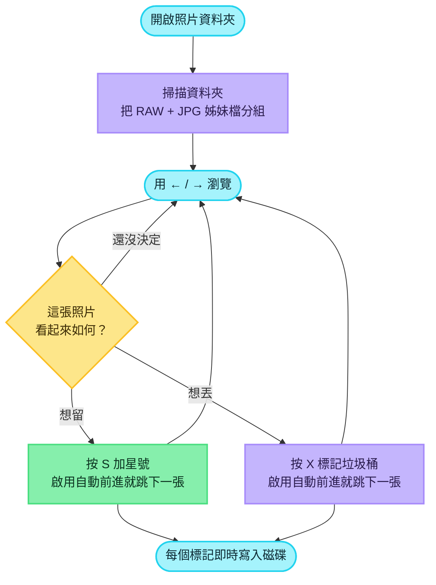
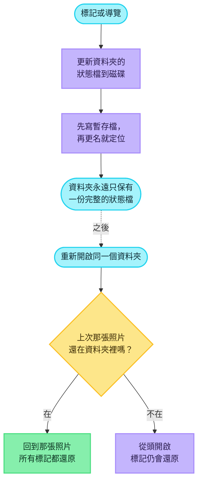
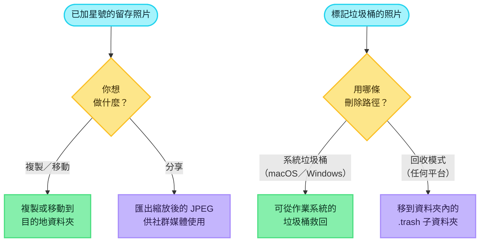
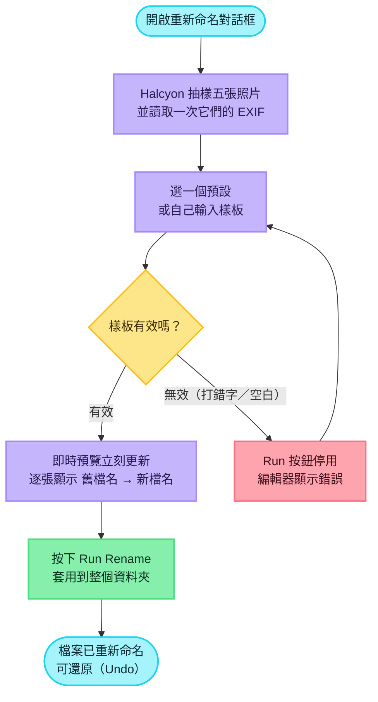
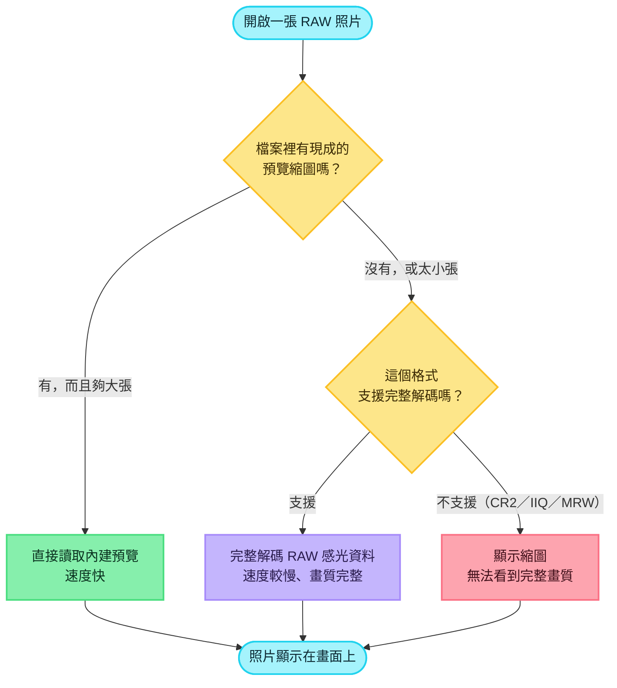
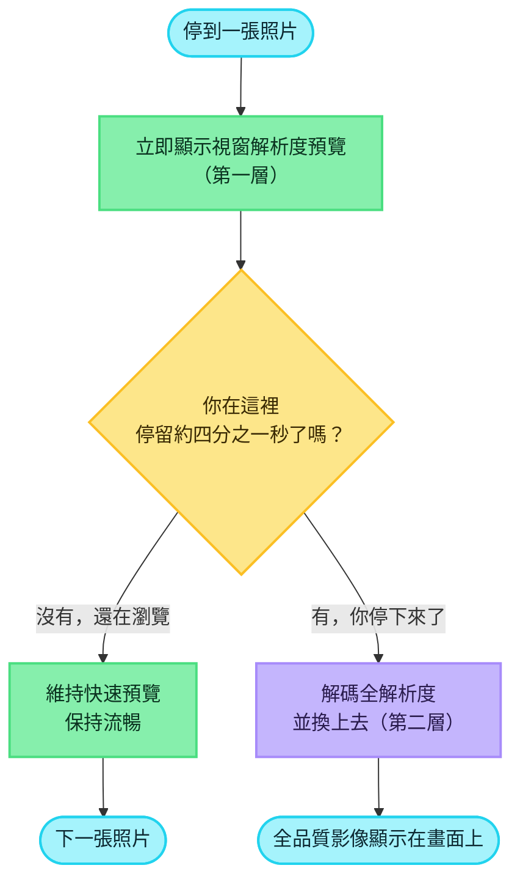
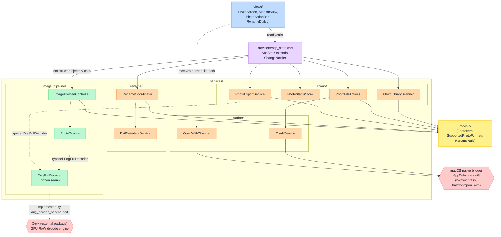
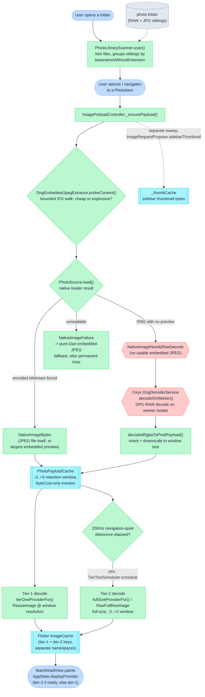
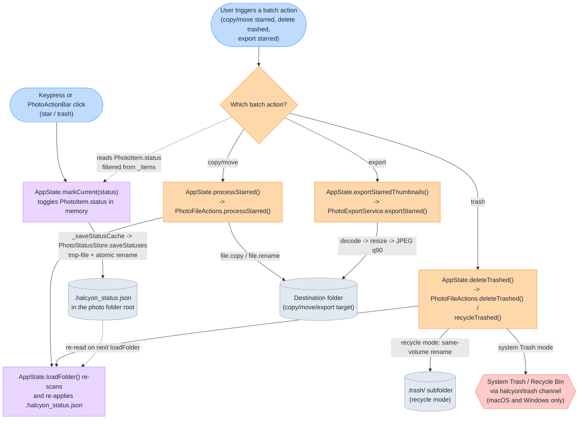

# Halcyon

*[English version](README.md)*

Halcyon 是一款 Flutter 桌面應用程式，讓攝影師整理 RAW 與 JPG 照片資料夾：用鍵盤瀏覽，
為照片標星或標垃圾桶，再批次複製或搬移已加星號的檔案。
<!-- evidence: lib/views/main_screen.dart:104-129 keyboard shortcut handler; lib/services/library/photo_file_actions.dart batch copy/move -->


*主挑選畫面，macOS 15.6.1：側邊欄列出該資料夾的 628 張照片，檢視區佔滿視窗其餘部分，
沒有應用程式標題列，只有星標與垃圾桶按鈕浮在影像上方。方向鍵切換照片，`S` 與 `X` 標記。*


*同一個資料夾上的「Rename by EXIF」對話框。左半部是預設集與可編輯的規則樣板（附即時
驗證），右半部隨機抽樣五個檔案預覽，每一列上方是目前檔名、下方是套用規則後的新檔名。*

### 名稱由來

Halcyon 與 Ceyx 都是翠鳥屬名。希臘神話中，阿爾庫俄涅（Alcyone）與刻宇克斯（Ceyx）
化身翠鳥——這兩個儲存庫因此成對命名：Ceyx 是解碼引擎，Halcyon 則是建構於其上的應用程式。
<!-- evidence: docs/logs/2026-08-26/readme-draft/BRIEFING.md:46-49 (shared framing agreed for both READMEs); ../ceyx/README.md:56-65 "Sister project: Halcyon" section states the same pairing and dependency direction -->

### 為什麼是 Halcyon

- **篩選是吞吐量問題，不是檢視問題。** 攝影師的操作迴圈是「看、判斷、前進」——方向鍵
  在照片間移動，`S` 加星號，`X` 標記垃圾桶，整個迴圈裡沒有一步需要對話框或滑鼠點擊。
  任何拖慢這個迴圈的東西，就是這個工具的全部成本所在。
  <!-- evidence: lib/views/main_screen.dart:104-129 arrowLeft/arrowRight/keyS/keyX bound directly to previousPhoto/nextPhoto/markCurrent -->
- **淵源：FastPictureViewer。** 這種「不離開鍵盤即可瀏覽與標記」的鍵盤驅動標記模型，
  直接受 FastPictureViewer 啟發——那是上一個時代一款付費的 Windows 工具，至今仍有攝影師懷念它。
- **最大化預覽區域、最小化介面裝飾。** 主畫面沒有 app bar：`Scaffold` 的 body 是一個
  `Stack`，圖片檢視器定位為填滿整個畫面，上面只疊一個浮動動作列與狀態列。
  <!-- evidence: lib/views/main_screen.dart:48-59 Scaffold with no appBar, body is Stack(children: [_buildKeyboardShortcutHandler(...), StatusLine()]); lib/views/main_detail_view.dart:113-135 Stack with Positioned.fill viewer and a bottom-centered floating action bar -->
  macOS 視窗的預設尺寸直接由 3:2 預覽區域加上 270px 側欄計算而來（`previewWidth =
  defaultHeight * 1.5`、`defaultWidth = 270.0 + previewWidth`），目標是寬螢幕桌面視窗，
  而非窄視窗。
  <!-- evidence: macos/Runner/MainFlutterWindow.swift:9-19 -->
  側欄可由使用者拖曳把手，在 180px 到 600px 之間自由調整寬度。
  <!-- evidence: lib/views/main_screen.dart:71-78 -->
- **解碼委託給姊妹專案，而非自行重新實作。** RAW 解碼屬於姊妹專案 Ceyx；Halcyon 在真實產品
  的條件下——UI 執行緒的即時反應、分層預覽到完整尺寸載入、資料夾規模的批次工作流程——
  使用該解碼引擎。
- **對範圍誠實。** 桌面是目標平台。行動裝置與網頁建置目標存在且可編譯，但介面本身
  並未針對觸控操作調整。
  <!-- evidence: pubspec.yaml has no platform restriction, standard Flutter multi-platform project; this claim is scope framing, not a measured behaviour -->

### 姊妹專案：Ceyx

Halcyon 用普通的 Dart path 相依方式，依賴 Ceyx 的 `plugin/` 目錄：

```yaml
ceyx:
  path: ../ceyx/plugin
```
<!-- evidence: pubspec.yaml:46-47 -->

這只是單純的相依關係，不是分支（fork），也不是子專案：Ceyx 必須以並排（sibling）簽出的
形式放在本儲存庫旁邊，`flutter pub get` 才跑得起來；Halcyon 在該相依項旁的註解也記下了原因——
刻意依賴 `plugin/` 套件而非 Ceyx 自己的 `app/`，避免把那個 app 的測試輔助相依項一併拖進
Halcyon 的建置流程。
<!-- evidence: pubspec.yaml:42-47 -->

---

## 目錄

- [挑選工作流程（triage workflow）](#挑選工作流程triage-workflow)
- [持久化、還原與批次操作](#持久化還原與批次操作)
- [依 EXIF 重新命名](#依-exif-重新命名)
- [RAW 格式支援與解碼路由](#raw-格式支援與解碼路由)
- [實測效能](#實測效能)
- [快取與記憶體管理](#快取與記憶體管理)
- [架構](#架構)
- [架構圖](#架構圖)
- [平台支援](#平台支援)
- [從原始碼建置](#從原始碼建置)
- [測試與品質閘門](#測試與品質閘門)
- [第三方歸屬](#第三方歸屬)
- [文件維護](#文件維護)

---

## 挑選工作流程（triage workflow）

核心迴圈很簡單：開啟一個資料夾、用鍵盤瀏覽、標記要留與要丟的照片、進下一張。以下就是你面對
一整張裝滿 RAW 與 JPG 檔案的記憶卡時，實際會發生的事。



### 開啟資料夾

把 Halcyon 指向一個資料夾，它會列出**直接放在裡面**的照片——不會遞迴進子資料夾。隱藏檔案
（任何以點開頭的名稱，包括 macOS 在某些記憶卡上散落的 AppleDouble 側車檔）一律跳過，只有
支援格式的檔案才會顯示。

支援的格式：

| 類別 | 格式 |
|---|---|
| 一般影像檔 | JPG、PNG、WebP、TIFF、HEIC／HEIF |
| RAW，完整解碼 | DNG、ARW、CR3、NEF、RAF、RW2、ORF、PEF、SRW、X3F |
| RAW，僅供瀏覽 | CR2、IIQ、MRW |

一般影像格式有幾個值得知道的細節：

- **WebP** 在所有平台都能顯示。動態 WebP 只顯示第一個影格。
- **TIFF** 支援常見的形式（分條式與分塊式、8／16／32 位元、LZW／PackBits／Deflate／未壓縮）；
  16 位元以 8 位元顯示，多頁檔只顯示第 1 頁。少數罕見壓縮（CCITT 傳真、TIFF 內嵌 JPEG）不支援，
  會顯示為無法讀取。
- **HEIC／HEIF** 使用內建打包的解碼器，因此一張 HEIC 在每個平台看起來都一樣，不必仰賴作業系統。
  含多張影像的檔案（連拍、Live Photo、深度圖）只顯示主影像；HDR 增益圖與深度圖一律忽略。
  AVIF 不支援。

RAW 格式，以及「完整解碼」與「僅供瀏覽」之間的差別，詳見下文「RAW 格式支援與解碼路由」。凡是
會被掃描列出的檔案——包括僅供瀏覽的 RAW 格式——都能像其他照片一樣加星號、標記垃圾桶、重新
命名與批次搬移。

### RAW 與 JPG 的姊妹檔分組

如果你以 RAW+JPG 拍攝，每按一次快門就會寫出兩個檔案，它們共用同一個檔名、只差在副檔名。
Halcyon 會把它們分組：一張 RAW 與其同名 JPG（以及任何隱藏側車檔）合成側邊欄裡的**一個項目**，
只有一個星號／垃圾桶標記、一列供你互動的資料，不管背後有幾個檔案。

顯示時，Halcyon 會優先選同名的 JPG 或 PNG（開啟最快），只在群組全是 RAW 時才退回 RAW。

分組也會改變預設的刪除行為：只要資料夾裡有任何 RAW+JPG 配對，就會自動以回收模式（資料夾內的
`.trash`，見下文）開始，而非永久刪除——正在挑選的記憶卡，不該因為一次誤點就連 RAW 一起丟。
每個標記或刪除都作用在整個群組上，因此 RAW 與其 JPG 姊妹檔永遠作為同一個單位一起移動。

### 標記、導覽與縮放

除了「未標記」，一張照片可以被**加星號**（要留）或**標記垃圾桶**（要丟）。標記是切換式的：
再按一次同一個標記會清除它；按另一個標記則切換過去。清除標記不會移動你的位置；設定新標記時，
若開啟了**自動前進**（預設關閉，會在不同工作階段間記住），就會前進到下一張。

左右鍵依順序在資料夾中移動，頭尾都不會循環。縮放每按一次以 ×1.25 放大或縮小，上限 5×，縮小
回來時會俐落地吸附回原尺寸，不會讓畫面停在偏移的位置。切換照片時縮放層級會維持不變——從一張
換到下一張不會把它重置。

### 鍵盤快捷鍵

整個挑選迴圈的設計，就是讓你不必離開鍵盤：

| 按鍵 | 動作 |
|---|---|
| `←` | 上一張照片 |
| `→` | 下一張照片 |
| `↑` | 放大（每次 ×1.25，最高 5×）|
| `↓` | 縮小（每次 ×1.25，接近 1× 會吸附回原尺寸）|
| `S` | 切換目前照片的星號標記 |
| `X` | 切換目前照片的垃圾桶標記 |
| `R` | 切換回收模式（資料夾內的 `.trash` vs. 系統／永久刪除）|

如果你偏好用滑鼠，星號與垃圾桶按鈕也會浮在影像上方。回收模式可以用鍵盤的 `R` 切換，或用右鍵
點擊垃圾桶按鈕——左鍵點它只是照常標記目前這張照片。

### 挑選過程中的畫面回饋

簡短的狀態訊息會出現在視窗底部，完整顯示幾秒後淡出，因此它們不會堆積或擋住畫面。其中兩則
直接來自挑選迴圈：

- 若你開啟的資料夾是**唯讀**的，會顯示一次性警告——在資料夾開啟時出現一次，不會每次標記都跳。
  Halcyon 的判斷方式是實際嘗試寫入一個小檔案再刪除，因為記憶卡的權限位元可能說謊（一張 exFAT
  記憶卡可能看起來可寫，實體防寫鎖卻擋下每一次寫入）。
- 若資料夾根本無法掃描（例如權限錯誤），會顯示錯誤訊息，說明哪裡出了問題。

---

## 持久化、還原與批次操作

### 一次篩選作業永遠不會遺失

在資料夾整理到一半時關閉 Halcyon，之後再重新開啟同一個資料夾，畫面會回到原本那張照片，所有
星號與垃圾桶標記都完好無缺。標記不是只存在記憶體裡——你一做出標記就會立刻寫入磁碟，你當時
所在的照片也會被記住。



#### 狀態檔

Halcyon 開啟的每個資料夾都有自己專屬的小狀態檔（`.halcyon_status.json`），就寫在照片旁邊。
它是純粹、人類可讀的 JSON：每張被標記的照片對應到「starred」或「trashed」（未標記的照片單純
不列入），再加上一筆記錄你上次看到哪張照片，以及該資料夾儲存的重新命名規則。刻意選純 JSON
而非資料庫——這個檔案跟照片放在一起，因此當你把資料夾複製到別台機器或備份時，它會一併跟著走，
你也能在 diff 裡直接讀懂它。

因為標記存在每個資料夾內部，它們始終自成一體：開啟第二個資料夾，它會保有自己獨立的標記——
不同拍攝場次之間永不互相污染。而且萬一狀態檔損毀或無法讀取，資料夾仍能開啟（只是不還原標記）
——遺失標記可以復原，無法存取照片就不行了。

#### 重新開啟時還原

重新開啟資料夾時，只要你上次看到的那張照片還在，Halcyon 就會帶你回到它。它會在你停留在一張
照片幾秒後才記錄位置，因此快速用方向鍵瀏覽時不會每按一次就狂寫磁碟。

#### 耐用性：能扛住當機與拔卡

標記與瀏覽位置指標都透過單一有序佇列儲存，因此兩次儲存絕不會互相競爭而覆蓋彼此。每一次儲存
都先寫進暫存檔、再更名就定位，因此拔卡或寫到一半當機也絕不會留下寫到一半的檔案——資料夾裡
永遠只會是完整的舊檔，或完整的新檔，不會是撕裂中的半成品。

#### 重新命名與標記

標記是綁在檔名上的。如果你用**其他**工具改照片的名字，綁在舊檔名上的標記就會孤立——不再對應
資料夾裡任何東西。Halcyon 自己的重新命名功能會避免這件事：在重新命名的同時把每個標記（與瀏覽
位置指標）搬到新檔名上，因此星號與垃圾桶標記都能在 app 內完成的重新命名之後存活下來。

### 批次操作

一旦你把要留的照片加了星號，Halcyon 就會把它們當成一批來處理：



#### 複製與移動已加星號的照片

你加了星號的照片可以整批複製或移動到你選定的資料夾。一張 RAW 與其同名 JPG 會作為同一個單位
一起搬動（macOS 產生的任何隱藏側車檔也會一併清除，不會殘留在目的地）。若目的地已有同名檔案，
它會保留不動而非被覆蓋；一次失敗也不會中止整批——其餘每個檔案仍會嘗試，任何失敗都會收集起來
顯示給你，而不是被靜默吞掉。

#### 社群媒體匯出

已加星號的照片也可以匯出為適合社群媒體尺寸的 JPEG——一張照片一個檔案，長邊上限 2048px，維持
長寬比，以 JPEG 品質 90 編碼。重要的 EXIF 欄位（相機廠牌與型號、拍攝日期、作者、曝光、光圈、
焦距、鏡頭、ISO 與 GPS）會從原始檔重新讀出，附加回縮放後的副本。匯出一次只跑幾個，以在大批次
時控制記憶體用量。

#### 兩種刪除路徑

Halcyon 提供兩種截然不同的刪除方式：

| 路徑 | 作用 | 可救回？ | 平台 |
|---|---|---|---|
| 系統垃圾桶 | 把檔案移到作業系統的垃圾桶 | 可，從作業系統垃圾桶救回 | macOS、Windows |
| 資料夾內回收模式 | 把檔案移到照片旁的 `.trash` 子資料夾 | 可，仍在記憶卡上 | 任何平台 |

回收模式是最保險的選項：它把要丟照片的每一個檔案——包括其 RAW 姊妹檔與任何隱藏側車檔——移到
照片旁的 `.trash` 子資料夾。因為那是同一個磁碟內的移動，所以是即時的（不複製任何資料），即使
在系統垃圾桶不可用的記憶卡上也能運作。若檔名與先前的回收批次相撞，檔案絕不會被覆蓋——會依序
加上 `-1`、`-2` 後綴，直到找到可用的檔名。回收模式以資料夾為單位，對含有 RAW+JPG 配對的資料夾
會自動開啟；你隨時可以用 `R` 切換。

若刪除失敗，Halcyon 會停下來，清楚列出哪些檔案失敗及原因——一次靜默無效的刪除，看起來跟正常
運作的 app 沒有兩樣。成功的回收模式批次則會顯示一則簡短訊息，附上移動的檔案數，提醒你這些檔案
仍在磁碟上的 `.trash` 裡，並未被永久刪除。

---

## 依 EXIF 重新命名

攝影師習慣依拍攝日期、相機、鏡頭或序號為檔案命名，而且命名格式通常是自家慣例，不會是相機
寫入記憶卡的原始檔名。Halcyon 的重新命名功能讓你寫一次命名樣板，就能套用到整個資料夾。每個
RAW 檔、它的 JPG 對應檔，以及任何隱藏的側車檔，都會一起改成相同的新基底檔名，所以 RAW+JPG
配對絕不會被拆散。

### 樣板怎麼運作

樣板就是一段夾帶 `{佔位符}` 的文字，例如 `{YYYY}-{MM}-{DD}-{hh}-{mm}-{ss}`。Halcyon 會用
照片的 EXIF 中繼資料（日期則以檔案本身的時間戳作為後備）填入每個佔位符。以下是你可以使用的
所有佔位符，分組方式與「Insert variable」面板一致：

| 分組 | 佔位符 | 會變成什麼 | 範例 |
|---|---|---|---|
| 日期與時間 | `{YYYY}` | 拍攝年份，4 位數 | `2026` |
| 日期與時間 | `{MM}` | 拍攝月份，2 位數 | `08` |
| 日期與時間 | `{DD}` | 拍攝日期，2 位數 | `26` |
| 日期與時間 | `{hh}` | 拍攝小時，2 位數 | `14` |
| 日期與時間 | `{mm}` | 拍攝分鐘，2 位數 | `07` |
| 日期與時間 | `{ss}` | 拍攝秒數，2 位數 | `33` |
| 相機 | `{camera}` | 相機型號 | `Z 8` |
| 相機 | `{lens}` | 鏡頭型號 | `NIKKOR Z 24-70mm f_2.8 S` |
| 相機 | `{make}` | 相機製造商 | `NIKON CORPORATION` |
| 相機 | `{artist}` | 作者／版權標籤 | `J. Chen` |
| 拍攝參數 | `{f}` | 光圈，格式為 `f<數值>` | `f2.8` |
| 拍攝參數 | `{focal}` | 焦距，格式為 `<數值>mm` | `35mm` |
| 拍攝參數 | `{iso}` | ISO，格式為 `ISO<數值>` | `ISO400` |
| 拍攝參數 | `{shutter}` | 快門速度 | `1/250` |
| 拍攝參數 | `{direction}` | GPS 拍攝方向，取整數度 | `187` |
| 檔案 | `{seq}` | 會撞名的檔案之間的序號；可補零，如 `{seq:3}` → `007` | `1` |
| 檔案 | `{orig}` | 原始檔名（不含副檔名） | `DSC_0431` |

有幾點值得知道：

- **日期一定填得出來**——EXIF 沒有拍攝日期或讀不到時，日期與時間佔位符退回檔案的修改時間。
- **缺失的標籤會留白**，不會把 `{camera}` 原封不動留在檔名裡。
- **打錯字會在動手前被攔下**——用到未知佔位符的樣板會標示「Unknown variable {name}」，
  「Run」按鈕維持停用。
- **檔名一定合法**——會破壞檔名的字元（`/`、`:`、`\`、NUL）替換成 `_`，所以 `1/250` 這樣的
  快門速度不會不小心建出子資料夾。

### 內建預設樣板

應用程式內建四組現成的預設樣板。以一張 2026-08-26 14:07:33 拍攝、原始檔名為 `DSC_0431`
的照片為例，渲染結果如下：

| 預設 | 樣板 | 渲染範例 |
|---|---|---|
| Date & time | `{YYYY}-{MM}-{DD}-{hh}-{mm}-{ss}` | `2026-08-26-14-07-33` |
| Compact | `{YYYY}{MM}{DD}_{hh}{mm}{ss}` | `20260826_140733` |
| Camera-style | `IMG_{YYYY}{MM}{DD}_{hh}{mm}{ss}` | `IMG_20260826_140733` |
| Date + sequence | `{YYYY}-{MM}-{DD}_{seq}` | `2026-08-26_1` |

「Date & time」也是全新對話框開啟時的預設樣板。一旦你編輯了樣板文字（或點了變數 chip），
選取狀態就會切換到 `Custom...`。你的自訂規則會依資料夾記住——重新開啟一個上次以自訂規則
重新命名過的資料夾，那個確切的樣板就會回來。

### 對話框與即時預覽

重新命名對話框分為兩個窗格：左側是預設選擇器、樣板欄位與變數 chip，右側是即時預覽。



初次讀取後，樣板欄位每次按鍵都會立即重新渲染這五列預覽，不會重新讀取中繼資料，所以即使是
大型資料夾，打字也保持流暢。「Re-roll」按鈕會重新抽取五張隨機照片並重新讀取中繼資料。

每一列預覽顯示舊檔名 → 新檔名，加上附屬副檔名徽章（讓你在送出前看到 RAW+JPG 配對會一起
移動）與「no camera tag」徽章。重新命名一律套用到整個資料夾，沒有逐項選取。

### EXIF 從哪裡來

Halcyon 以「每張照片一次」讀取 EXIF，涵蓋 RAW、JPG 對應檔與側車檔整組；有 JPG 對應檔時優先
從它讀取，否則讀 RAW 檔頭。讀取 RAW 檔頭在背景分批執行、狀態列顯示進度，不會凍結介面。

若 RAW 格式的檔頭無法解析，該照片的 EXIF 佔位符留白，但日期與時間仍從檔案時間戳解出。

### 套用重新命名——以及還原

按下 Run 後，Halcyon 先算出每一步搬移，再逐一執行：

- 會撞名的照片以 `{seq}` 編號，順序穩定；仍衝突的附加 `-1`、`-2`…… 後綴。
- 新檔名與目前檔名相同的照片會整個略過。
- 屬於同一張照片的所有檔案都改成相同基底檔名並各自保留副檔名，配對不會被拆開。

每一步搬移都會寫入日誌，這正是**還原（Undo）**的機制（倒著重播日誌）。星號／垃圾桶標記與
最後檢視的照片會自動跟著移動。無法寫入的資料夾無法開啟重新命名對話框。

### 已知限制

- 沒有對應 EXIF 標籤的佔位符會留白，不會改用其他欄位替代。
- 沒有 JPG 對應檔且檔頭無法解析的 RAW，得不到任何相機中繼資料。

---

## RAW 格式支援與解碼路由

Halcyon 幾乎支援所有主流相機的 RAW 格式，也支援通用的 Adobe DNG：

| 相機品牌 | 格式 | 顯示方式 |
|---|---|---|
| Sony | ARW | 完整解碼 |
| Canon | CR3 | 完整解碼 |
| Nikon | NEF | 完整解碼 |
| Fujifilm | RAF | 完整解碼 |
| Panasonic | RW2 | 完整解碼 |
| Olympus | ORF | 完整解碼 |
| Pentax | PEF | 完整解碼 |
| Samsung | SRW | 完整解碼 |
| Sigma | X3F | 完整解碼 |
| Adobe（通用） | DNG | 完整解碼 |
| Canon（較舊） | CR2 | 僅縮圖瀏覽 |
| Phase One | IIQ | 僅縮圖瀏覽 |
| Minolta | MRW | 僅縮圖瀏覽 |

「僅縮圖瀏覽」的三種格式一樣可以打星、刪除、搬移，只是目前還看不到完整解碼後的畫質。

大部分情況下你不會感覺到差異：Halcyon 會自動判斷用哪種方式顯示照片。



簡單說：

- **有內建預覽 → 用預覽**：很多 RAW 檔（尤其是用 Lightroom 或 DxO PureRAW 處理過的 DNG，還有 Panasonic 的 RW2）裡面其實藏著一張現成的 JPEG 縮圖，Halcyon 找得到就直接用。
- **沒有內建預覽 → 完整解碼**：找不到夠大張的預覽，且格式支援完整解碼，就去解完整的 RAW 資料，畫質更完整但稍微慢一點。
- **格式不支援完整解碼 → 只能看縮圖**：CR2、IIQ、MRW 目前只能瀏覽，還沒辦法完整解碼。

平台支援現況：

| 平台 | 完整 RAW 解碼 |
|---|---|
| macOS | ✅ 支援 |
| Windows | ✅ 支援 |
| Android | ✅ 支援 |
| Linux | ✅ 支援 |
| iOS | ⏳ 尚未支援 |
| 網頁版 | ⏳ 尚未支援 |

在還沒支援完整解碼的平台上，如果一張 RAW 檔剛好沒有內建預覽，會暫時顯示成無法預覽，這是平台功能還沒補齊，不是照片壞了。

---

## 實測效能

篩選照片時的迴圈很單純：看、判斷、按下一張。真正重要的數字，是從按下方向鍵到畫面上出現
可用全解析度影像所花的時間——而不是抽象的解碼吞吐量。

這個數字背後藏著兩種完全不同的成本：

- **含內嵌 JPEG 預覽的照片走便宜路徑**——Halcyon 直接顯示預覽，完全不做 RAW 解碼。這在
  一般資料夾裡是大多數檔案，落在個位數毫秒。
- **沒有可用預覽的照片**（多半來自手機的裸感光元件 DNG）則會走姊妹解碼器 Ceyx 的完整 RAW
  解碼。這是昂貴路徑。

正因為有這個分岔，再加上**冷啟動**首次解碼與**暖啟動**重複解碼之間的差異，任何單一數字都
必須附上條件才有意義。以下是實際記錄下來的結果。

### 數字

| 量測的是什麼 | 時間 | 條件 |
|---|---|---|
| 完整 RAW 解碼，從按鍵到全解析度上屏（12 MP 手機 DNG） | 冷啟動 491–601 毫秒；暖啟動 150–159 毫秒 | macOS release 建置，2026-08-17，未記錄機型 |
| 側欄縮圖解碼，裸感光元件 DNG（無內嵌預覽） | 暖啟動每張約 56–100 毫秒 | 測試環境，目標長邊 200 px |
| 側欄縮圖，*含*內嵌預覽的 DNG（快速路徑） | 暖啟動約 0.3–0.4 毫秒 | 同一套量測工具 |
| 側欄縮圖，JPEG 檔案 | 暖啟動約 22–26 毫秒 | 同一套量測工具 |
| Ceyx 完整解碼，24 MP DNG，無損 | ~177 毫秒 | macOS（Metal），暖啟動 |
| Ceyx 完整解碼，24 MP DNG，有損 | ~105 毫秒 | macOS（Metal），暖啟動 |
| Ceyx 在 GUI app 內的冷啟動首次解碼，24 MP（6000×4000）無損 DNG | 291 毫秒 | Apple M3 Ultra，macOS 15.6.1，release，**冷啟動** |
| 在 JPEG 預覽照片之間切換（無 RAW 解碼） | 2.8 毫秒（優化前為 127.5 毫秒） | 歷史基準值，保留以呈現優化幅度 |

### 該記住哪個數字

若只能給一個數字，答案是 **GPU 加速的完整 RAW 解碼在冷啟動下約 300 毫秒**——來自一次乾淨
記錄的執行：Ceyx 在真實 app 內冷啟動解碼一張 24 MP 無損 DNG，於 Apple M3 Ultra 上量得
291 毫秒。

上表其餘數字回答的是略有不同的問題，這些差異值得記住：

- **暖啟動大約是它的一半。** 唯一一次完整跑到全解析度上屏的端到端執行，暖啟動量得
  150–159 毫秒；Ceyx 的暖啟動數字在 24 MP 下落在 105–177 毫秒。攝影師在少數幾張照片之間
  來回快速翻看時，落在的是暖啟動這一區，不是冷啟動。
- **在較舊／未記錄機型上的冷啟動量得更高**——某次 2026 年執行量得 491–601 毫秒。請把它
  當作一個證據力較弱的資料點（其註記標明需要重跑，但一直沒發生），而不是對 300 毫秒這個
  數字的反證。
- **大多數檔案根本不會進入解碼。** 帶有可用內嵌 JPEG 預覽的 RAW 完全跳過解碼器，落在個位數
  毫秒。300 毫秒只描述昂貴路徑，而那在一般資料夾裡只是少數檔案。

誠實的總結：完整 RAW 解碼引用 **冷啟動約 300 毫秒／暖啟動約 150 毫秒**，且不要把任何一個
當成通用基準——現有量測都無法在跨機型、跨感光元件尺寸的條件下，把冷啟動與暖啟動乾淨地
分離開來。

### 尚未量測的項目

有幾件事目前根本沒有記錄下來的數字，與其猜測不如直說：

- 大片幅 RAW 檔案（全片幅、40+ MP）在 Halcyon 自身管線中的完整解碼計時。現有記錄的樣本
  大約止於 24 MP。
- 大多數 Halcyon 端數字背後的機型（晶片、記憶體）——只有那筆 291 毫秒的 M3 Ultra 資料點
  指明了硬體。
- 匯出計時（解碼 → 縮放 → 重新編碼為 JPEG）。
- 真實 UI 導覽下的切換延遲與記憶體用量——這些保留給專案擁有者親自量測，而非自動化執行。

---

## 快取與記憶體管理

### 為什麼這對挑選很重要

檢視一次拍攝，往往就是按住方向鍵、每秒飛掠數十張照片。要讓這件事順手，得同時
成立兩件事：每張照片在你停到它的瞬間就出現，而且不論資料夾多大，瀏覽都不會把
記憶體吃光。這兩個目標其實是互相拉扯的——現代 24 MP 感光元件的一張照片，全尺寸
解碼後大約要 90 MB，所以每按一次鍵就全品質解碼一次會卡頓，而把看過的每一張都
留著又終究會耗盡記憶體。

Halcyon 的做法是：只保留你目光附近的照片，依你當下的動作用「剛好合適」的清晰度
顯示每一張，並在你一停下來就悄悄升級成全品質。移動的時候，你永遠不會為「粗重」
的解碼工作等待。

### 主圖用兩種清晰度顯示

主要預覽分兩趟畫出來：

- **第一層——即時。** 你一停到某張照片，Halcyon 就先以你視窗的解析度顯示它。
  這一步很快，所以連續按方向鍵瀏覽依然順滑，每張照片都立刻有畫面。
- **第二層——全品質。** 如果你在某張照片上停留約四分之一秒，Halcyon 就解碼出
  全解析度版本並換上去。正因為它要等這個短暫的停頓，掃過上百張照片時，並不會
  為你只是瞥過的影像同時啟動上百次粗重的全畫面解碼。



### 側邊欄縮圖

側邊那條縮圖膠捲是跟主圖分開載入的。Halcyon 只抓目前實際在畫面上的縮圖，外加
上下各一小段邊界，讓捲動時預載能跑在你前面；一旦縮圖捲離視野夠遠就把它丟掉。
只要做了會重新載入資料夾的動作——標星、丟垃圾桶、複製或搬移——縮圖都會自己
重新出現，所以側邊欄不會卡在空白。小張的內嵌預覽會直接沿用；較大的影像則只縮成
一張精簡縮圖並以這個輕量形式保存，因此即使是很大的資料夾，側邊欄也依然省資源。

### 只留下附近的照片

Halcyon 不會把你開過的每一張照片都留著，而是圍繞你當下這張，保留一個會移動的
視窗——後面留幾張、前面多留幾張，因為瀏覽絕大多數是往前走。當你移動時，進入
視窗的照片會被載入，落到後方的則被釋放。這個視窗同時還受一個整體記憶體預算的
上限約束，所以即使遇到特別大的檔案，app 也會先釋放最舊的那張、維持在界線內。
最終效果是：不論資料夾多長、你瀏覽多久，記憶體使用量大致維持平穩。

### 摘要

| 通道 | 保留什麼 | 保留多少 | 何時釋放 |
|---|---|---|---|
| 側邊欄縮圖 | 膠捲用的小張縮圖 | 畫面上的列，加上上下各一段邊界 | 每次更新都修剪成目前實際所需 |
| 主圖，兩個層級 | 你正在看的那張附近的照片 | 一個移動視窗：後面幾張、前面多幾張，受記憶體預算上限約束 | 移動時或超出預算時，先釋放最舊／距離最遠的那張 |
| 已解碼影格 | 實際正在顯示的視窗解析度與全解析度影像 | 受機器記憶體的一部分約束 | 照片一離開作用中的視窗就自動釋放 |

---

## 架構

Halcyon 是一個嚴格單向分層的應用程式——`views/` → `providers/app_state.dart` → `services/` → `models/`——並有少數幾道不宜隨意更動形狀的凍結介面。

### 分層與相依方向

`views/` 負責建構 UI，只持有 view 本地狀態（鍵盤快捷鍵、縮放變換、對話框骨架），透過 `provider` 套件讀取 `AppState` 並呼叫其方法，完全不知道照片是怎麼被掃描、解碼或刪除的。由動畫驅動的 view 本地狀態（縮放、指標位置）放在 view 持有的 controller（例如 `lib/views/zoom_controller.dart` 的 `ZoomController extends ChangeNotifier`，由 `MainScreen` 持有並負責釋放），而不是放進 `AppState`——`AppState` 只保存代表相簿模型的狀態。

`providers/app_state.dart` 定義了 `AppState extends ChangeNotifier`（`lib/providers/app_state.dart:61`），是應用程式邏輯的唯一協調點——資料夾載入、選取、星標/垃圾桶標記、設定，以及派送到服務層。它靠建構子注入取得協作者，而非寫死成欄位：

```dart
AppState({
  PhotoLibraryScanner? scanner,
  PhotoStatusStore? statusStore,
  PhotoFileActions? fileActions,
  ImagePreloadController? preloadController,
  NativeImageLoad? imageLoader,
  DngFullDecoder? dngDecoder,
  PhotoExportService? exportService,
  ExifBatchReader? exifReader,
})
```

每個參數省略時都退回真實實作（例如 `_scanner = scanner ?? PhotoLibraryScanner()`），正式環境因此免費取得真實協作者，測試則可把任一個換成假物件——這也是協調層能脫離真實檔案系統或平台通道獨立受測的原因。

`services/` 實作實際工作——檔案系統掃描、狀態持久化、影像解碼/快取、檔案操作、EXIF/重新命名、兩個平台橋接——並禁止回頭直接呼叫 `views/` 或 `AppState`；它只被呼叫，只透過 `AppState` 明確交付的 callback/supplier 參數回呼。`models/` 持有純粹資料形狀與無 I/O 的純函式——`PhotoItem`、格式註冊表、`RenameRule` 的樣板渲染——不從 `services/` 或 `views/` 匯入。

`services/` 拆成四個按用途命名的子資料夾：

| 資料夾 | 負責範圍 |
|---|---|
| `image_pipeline/` | 第一層/第二層滑動視窗預載、DNG 解碼整合、影像快取記帳 |
| `library/` | 資料夾掃描、狀態持久化、檔案複製/搬移/丟垃圾桶、星標照片匯出 |
| `rename/` | EXIF 驅動的重新命名規劃、EXIF 中繼資料讀取、重新命名協調器 |
| `platform/` | 兩個 macOS `MethodChannel` 橋接 |

### 縫與不變量

以下是影像管線中承重的限制條件；隨意更動會打破本 README 其他地方描述的第一層/第二層契約。

**Ceyx 整合縫。** DNG 全尺寸解碼（針對沒有可用內嵌預覽圖的 DNG）委派給姊妹專案 Ceyx，靠的是一個 typedef，而非具體類別：

```dart
typedef DngFullDecoder = Future<DecodedRgba> Function(String path);
```

這道縫讓影像管線能針對假解碼器做單元測試，不必載入真正的 native dylib。

與其搭配的 `image_source_types.dart` 宣告了一個恰好三個變體的 sealed class，描述任何影像位元組請求的結果：`NativeImageBytes`（已編碼位元組，正常路徑）、`NativeImageNeedsRawDecode`（無內嵌預覽圖的 DNG——非失敗，是要跑真正 RAW 解碼器的訊號）、`NativeImageFailure`（真正的失敗）。這個集合凍結在三個變體。

**影像載入在每個平台上都是純 Dart。** `dartImageLoad`（`lib/services/image_pipeline/dart_image_loader.dart:17`）是影像位元組的唯一產生來源；沒有任何平台存在原生縮圖通道。照片相關行為——哪些檔案會被載入、畫面上出現什麼像素、刪除做了什麼、匯出產出什麼——只在 Dart 中實作一次，並在每個支援平台產生相同結果，只有三個封閉的原生橋接例外：系統垃圾桶（macOS/Windows 原生）、Open With 傳輸層（macOS/Windows/Android/iOS，不含 Linux）、檔案關聯註冊（Windows/macOS）。

**單一持有者不變量。** 兩個類別各自持有恰好一份第二層狀態，讓不變量能在單一位置推理與測試，不至於散落到各個呼叫點：

- `TierTwoRegistry`（`lib/services/image_pipeline/tier_two_registry.dart:26`）是第二層*就緒狀態*記帳的唯一持有者——哪些 id 有全尺寸快取項目、它是針對哪個 payload 物件解碼的，以及該次解碼是否已失敗。
- `TierTwoScheduler`（`lib/services/image_pipeline/tier_two_scheduler.dart:58`）是第二層*排程*的唯一持有者——±2 視窗、250ms 導覽 debounce，以及序列化的解碼佇列。

**原生橋接。** `macos/Runner/AppDelegate.swift` 恰好註冊兩個 `MethodChannel`：

```dart
FlutterMethodChannel(name: "halcyon/trash", ...)
FlutterMethodChannel(name: "halcyon/open_with", ...)
```

`halcyon/open_with` 是純推送式的：原生端呼叫進 Dart 端遞送檔案路徑，Dart 端在這個通道上無法主動詢問「有沒有東西還在等待」。Flutter 會緩衝原生→Dart 方向的訊息直到 Dart handler 註冊完成，這讓推送式即使在冷啟動時也可靠；通道物件建立前抵達的事件，暫存在 `pendingOpenFile` 變數中，於通道建立當下立即送出。

**唯一一份 EXIF 方向表。** `exif_orientation.dart` 的 `exifTransformFor` 是本專案唯一的 8 case Orientation 標籤對照表；`package:image` 匯出路徑與 `dart:ui` 全尺寸 RGBA provider 都透過這張表轉換，不各自實作方向邏輯，且都以固定順序先旋轉再鏡像。

### 目錄結構

```
Halcyon/
├── lib/
│   ├── main.dart              # ChangeNotifierProvider + MaterialApp setup
│   ├── models/                # PhotoItem, format registry, RenameRule (pure, no I/O)
│   ├── perf/                  # opt-in performance instrumentation
│   ├── providers/
│   │   └── app_state.dart     # AppState: the single coordination point
│   ├── services/
│   │   ├── image_pipeline/    # tier-1/tier-2 preload, DNG decode, cache bookkeeping
│   │   ├── library/           # folder scan, status persistence, file ops, export
│   │   ├── rename/            # EXIF-driven rename planning + coordinator
│   │   └── platform/          # the two macOS MethodChannel bridges
│   └── views/                 # UI, keyboard shortcuts, dialogs
├── test/                      # mirrors the lib/ tree above, plus test/support/
├── macos/ ios/ android/ web/ windows/ linux/   # per-platform runner shells
├── scripts/
│   └── build_apps.py          # the single build entry point for all six targets
├── docs/
│   ├── logs/YYYY-MM-DD/       # dated task logs; recorded measurements live here
│   └── sop/                   # 未受版控追蹤的內部維護文件；全新 clone 不會包含
└── README.md
```

Halcyon 也在工作副本的 `docs/sop/` 目錄下維護一組內部流程文件——架構決策與踩坑經驗、任務追蹤、階段里程碑、短期交接摘要，以及測試策略與測試案例矩陣。這些文件已加入 `.gitignore`，全新 clone 不會包含它們。

授權與第三方歸屬說明收錄在本文件結尾的
[第三方歸屬](#第三方歸屬)一節。

---

## 架構圖

三張圖涵蓋整個系統：模組之間如何相依、一張照片的位元組如何從磁碟走到螢幕，以及一次按鍵如何變成標記、再驅動檔案系統上的批次操作。三張合起來看，應該能讓初次接觸的讀者在三十秒內，在 `lib/` 底下找到任何一個檔案的位置。

### 圖例

**形狀**（三張圖一致）：

| 形狀 | 意義 |
|---|---|
| 圓角矩形 `([ ])` | 進入點／使用者動作 |
| 矩形 `[ ]` | 模組、服務或類別 |
| 子程序框 `[[ ]]` | 記憶體內快取 |
| 圓柱 `[( )]` | 持久化儲存（磁碟上的檔案） |
| 菱形 `{ }` | 決策／路由節點 |
| 六邊形 `{{ }}` | 原生／FFI 邊界跨越 |

**顏色**（每個架構層對應一個色相，Tailwind 200 色階填色／400 色階邊框，文字強制設為 `#1e293b`，即 Tailwind slate-800）：

| 層級 | 填色 (200) | 邊框 (400) |
|---|---|---|
| Views／進入點 | `#bfdbfe`（blue-200） | `#60a5fa`（blue-400） |
| Providers（`AppState`） | `#e9d5ff`（purple-200） | `#c084fc`（purple-400） |
| Services — image pipeline | `#bbf7d0`（green-200） | `#4ade80`（green-400） |
| Services — library/platform/rename | `#fed7aa`（orange-200） | `#fb923c`（orange-400） |
| Models | `#fef08a`（yellow-200） | `#facc15`（yellow-400） |
| 原生／FFI 邊界（Ceyx、AppDelegate） | `#fecaca`（red-200） | `#f87171`（red-400） |
| 快取 | `#a5f3fc`（cyan-200） | `#22d3ee`（cyan-400） |
| 持久化儲存 | `#e2e8f0`（slate-200） | `#94a3b8`（slate-400） |

**邊線**：實線箭頭代表直接呼叫或匯入相依；虛線箭頭代表資料／檔案相依（從磁碟讀取或寫入某物），而非函式呼叫。

---

### 1. 模組相依與分層



**圖說：** 相依關係單向流動，由上而下——`views` 呼叫 `AppState`，`AppState` 透過建構子注入組合每個 `services/` 協作物件，這些協作物件只相依於 `models/`。`services/` 或 `models/` 底下沒有任何東西會匯入 `views/` 或 `providers/`。唯二的原生邊界跨越，是通往外部 Ceyx 套件（RAW 解碼）的 `DngFullDecoder` 接縫，以及註冊在 `AppDelegate.swift` 裡的兩個 `MethodChannel`（系統垃圾桶與「以此開啟」檔案傳遞）。

**證據：**
- `AppState` 透過建構子注入組合它的協作物件 —
  `lib/providers/app_state.dart:61-104`。
- `ImagePreloadController` 相依於 `PhotoSource`，這是唯一具備型別知識的層 —
  `lib/services/image_pipeline/photo_source.dart:82-93`。
- `DngFullDecoder`／`DngSizedDecoder` 是管線與原生解碼器之間凍結的整合接縫 —
  `lib/services/image_pipeline/dng_decode_contract.dart:30,39`。
- 實作這個接縫的 Ceyx 轉接器匯入 `package:ceyx/ceyx.dart` —
  `lib/services/image_pipeline/dng_decode_service.dart:1,12-14`。
- `PhotoExportService` 也接受一個可選的 `DngFullDecoder`，用於自己的 RAW 匯出路徑 —
  `lib/services/library/photo_export_service.dart:38-39`。
- `PhotoFileActions` 預設使用 `TrashService.trashFile` —
  `lib/services/library/photo_file_actions.dart:40`。
- `AppDelegate.swift` 恰好註冊兩個 channel，`halcyon/trash` 與
  `halcyon/open_with` — `macos/Runner/AppDelegate.swift:23,42`。
- `RenameCoordinator` 由 `AppState` 建構，`readMetadata:
  readMetadataFor` 接到 `ExifMetadataService.readBatch` —
  `lib/providers/app_state.dart:71-102`。

---

### 2. 影像管線資料流——從磁碟上的檔案到螢幕上的像素

這是核心圖：一張照片的位元組從資料夾掃描到畫面繪製的完整路徑，涵蓋兩階解碼策略，以及在內嵌預覽圖與完整 RAW 解碼之間的路由決策。



**圖說：** 掃描階段會把 RAW／JPG 的同名檔案併成一個 `PhotoItem`。選取某個項目時，會先做一次有邊界的內容探測，據此把檔案分成「便宜」或「昂貴」再決定怎麼解碼：便宜的檔案（JPEG，或內嵌預覽圖已經夠大的 DNG）完全不經過原生解碼器；沒有可用預覽圖的 DNG，則跨越邊界交給 Ceyx 在 worker isolate 上執行的 GPU 解碼器。每個解碼結果——不論是編碼位元組還是縮小過的像素——都會落進同一個有位元組預算上限的保留快取，而顯示路徑一律從這裡取圖繪製：先立刻顯示視窗解析度（第一階），等導覽靜止 250 毫秒後，再升級到完整解析度（第二階）。

**證據：**
- 依 `basenameWithoutExtension` 分組同名檔案 —
  `lib/services/library/photo_library_scanner.dart:14-19`，id 定義於
  `lib/models/supported_photo_formats.dart:44`。
- 先探測再分類的內容判斷邏輯，以及它同時輸出成本與方向的設計
  — `lib/services/image_pipeline/photo_source.dart:274-317`。
- 三分支的 `NativeImageResult` 路由（位元組／需要 RAW 解碼／
  失敗）— `lib/services/image_pipeline/image_source_types.dart:48-87`，以及
  據此執行動作的 switch — `lib/services/image_pipeline/photo_source.dart:116-201`。
- 跨越到 Ceyx 的邊界 — `lib/services/image_pipeline/dng_decode_service.dart:12-14`。
- 第一階／第二階的 provider 工廠函式，以及物件身分／快取鍵必須一致的要求 —
  `lib/services/image_pipeline/image_preload_controller.dart:28-49`。
- 250 毫秒導覽防抖動常數 —
  `lib/services/image_pipeline/image_preload_controller.dart:49`。
- -3..+5 保留視窗與僅以 byteCost 決定的淘汰策略 —
  `lib/services/image_pipeline/photo_payload_cache.dart:6-10`（視窗大小）與
  `lib/services/image_pipeline/photo_payload_cache.dart:36-49` 的類別說明文件。
- 側欄縮圖使用與詳細檢視路徑各自獨立的快取／未命中集合 —
  `lib/services/image_pipeline/image_preload_controller.dart:91,173`。
- `displayProvider` 在第二階就緒時選用第二階，否則使用第一階 —
  `lib/providers/app_state.dart:214-215`。

---

### 3. 分類動作流程——按鍵到標記到批次動作



**圖說：** 一次標記在 `PhotoItem` 上只是純粹的記憶體內狀態，直到 `_saveStatusCache` 透過暫存檔＋原子重新命名的寫入方式，把它持久化到 `.halcyon_status.json`。每個批次動作都直接讀取 `_items` 這個活動清單上的狀態，而非讀檔案，事後還會重新觸發一次資料夾重新載入，藉此把 JSON 重新讀回來。複製／搬移與匯出會寫入使用者選定的目的地；垃圾桶動作則要嘛把檔案搬進同一層的 `.trash/` 子資料夾（回收模式，同磁碟區重新命名），要嘛透過原生的 `halcyon/trash` channel 交給作業系統自己的垃圾桶，而這個 channel 只在 macOS 與 Windows 上有註冊。

**證據：**
- `markCurrent` 切換狀態並呼叫 `_saveStatusCache` —
  `lib/providers/app_state.dart:367-392`。
- 原子式暫存檔＋重新命名寫入 — `lib/services/library/photo_status_store.dart:68-76,132-148`。
- `processStarred` 篩選 `item.status != PhotoStatus.starred`，並複製或
  重新命名每個檔案 — `lib/services/library/photo_file_actions.dart:50-87`。
- `deleteTrashed` 依 `recycleMode` 在 `TrashService.trashFile`
  與 `recycleTrashed` 的同磁碟區重新命名（搬進 `.trash/`）之間擇一 —
  `lib/providers/app_state.dart:498-538`，
  `lib/services/library/photo_file_actions.dart:89-155`。
- `TrashService.trashFile` 是 `PhotoFileActions` 的預設實作，也是
  系統垃圾桶橋接，於 macOS 與 Windows 註冊 —
  `lib/services/library/photo_file_actions.dart:40`，
  channel 註冊於 `macos/Runner/AppDelegate.swift:23`。
- `exportStarred` 的解碼／縮放／編碼路徑 —
  `lib/services/library/photo_export_service.dart:53-142`。
- 批次動作事後會重新載入資料夾，進而重新套用已儲存的狀態
  — `lib/providers/app_state.dart:467-474,524-530`，重新套用邏輯位於
  `lib/services/library/photo_status_store.dart:93-130`。

---

## 平台支援

Halcyon 骨子裡是桌面應用程式，但能跑的平台不只桌面。完整 RAW 解碼目前在
macOS、Windows、Android **以及 Linux** 上都能用，只有 iOS 與網頁版還沒有原生
解碼器。介面是為桌面平台設計的；行動與網頁版雖然跑得起來，但還沒針對觸控調整過。

### 支援矩陣

| 平台 | 可執行 | 介面 | 完整 RAW 解碼 | 系統垃圾桶／資源回收筒 | 從檔案管理員「開啟方式」 |
|---|---|---|---|---|---|
| macOS | ✅（arm64） | 為此平台設計 | ✅ 支援 | ✅ 支援 | ✅ 支援 |
| Windows | ✅ | 桌面版面，測試較少 | ✅ 支援 | ✅ 支援 | ➖ 無 |
| Linux | ✅ | 桌面版面，測試較少 | ✅ 支援 | ➖ 資料夾內回收模式 | ➖ 無 |
| Android | ✅ | 可執行；未針對觸控適配 | ✅ 支援 | ➖ 資料夾內回收模式 | ➖ 無 |
| iOS | ✅ | 可執行；未針對觸控適配 | ⏳ 尚未支援 | ➖ 資料夾內回收模式 | ➖ 無 |
| Web | ✅ | 可執行；未適配 | ⏳ 尚未支援 | ➖ 資料夾內回收模式 | ➖ 無 |

### 這些缺口在實務上代表什麼

**完整 RAW 解碼在四個平台上都已就緒。** macOS、Windows、Android 與 Linux 都能把
RAW 檔案完整解碼。Linux 比較特別：解碼器不在你的機器上編譯，而是由建置工具自動
下載一份預先編好、版本鎖定的副本——但拿到的結果和其他三個平台一樣，都是全品質的完整解碼。

**目前只有 iOS 與網頁版還沒有原生解碼器。** 在這兩個平台上，RAW 檔案只有在本身
帶有夠大的內嵌 JPEG 預覽時才顯示得出來。多數現代相機都會寫入這類預覽，所以瀏覽
通常沒問題——但沒有內嵌預覽的 RAW 檔，目前在這兩個平台上就是看不了。

**系統垃圾桶只有 macOS 與 Windows；其餘平台一律走回收模式。** 在 macOS 與 Windows
上，刪除會把檔案送進真正的系統垃圾桶／資源回收筒。在 Linux、Android、iOS 與 web
上，刪除改用 Halcyon 的資料夾內回收模式——檔案會移到同一處的 `.trash` 子資料夾。
這是完整功能，不是打折的替代方案：什麼都不會遺失，你也能手動把檔案救回來。

**從檔案管理員「開啟方式」只有 macOS 支援。** 在 Finder 裡開啟一張照片就直接啟動
Halcyon，這條路只在 macOS 上接好了；其他平台請改從 app 裡開啟資料夾。

**macOS 建置只支援 arm64，** 原因是隨附的解碼器是為 Apple Silicon 建置的。要建置
Intel Mac 版本，得先備妥 x86_64 的解碼器。

---

## 從原始碼建置

### 先決條件

| 需求 | 本樹已驗證的版本 | 備註 |
|---|---|---|
| Flutter SDK | 3.44.6 | Dart 3.12.2；`pubspec.yaml` 宣告 `sdk: ^3.9.0` |
| Ceyx 簽出 | 相鄰目錄 | 必須位於相對於本儲存庫的 `../ceyx` |
| JDK（僅 Android 需要） | Temurin 25，或 Homebrew 的 `openjdk@21` / `openjdk@17` | 由建置腳本按此順序自動選擇 |
| Gradle（僅 Android 需要） | 9.1.0 | 由 wrapper 鎖定版本 |
| Android Gradle Plugin | 9.0.1 | Kotlin 2.3.21 |

<!-- evidence: pubspec.yaml:22 (sdk constraint), flutter --version output 2026-08-26 -->
<!-- evidence: pubspec.yaml:46-47 (ceyx path dependency) -->
<!-- evidence: scripts/build_apps.py:232-234 (JDK search order), scripts/build_apps.py:448 (PATH fallback warning) -->
<!-- evidence: android/gradle/wrapper/gradle-wrapper.properties:5, android/settings.gradle.kts:22-23 -->

**Ceyx 必須簽出在相鄰目錄，這不是可有可無的。** `pubspec.yaml` 把解碼器宣告成指向 `../ceyx/plugin` 的相對路徑相依套件，只要該目錄不存在，`flutter pub get` 就會直接失敗。請把 Ceyx 複製到 Halcyon 隔壁，而不是放進 Halcyon 裡面。

<!-- evidence: pubspec.yaml:46-47 -->

Android 建置還要求保留相容模式——`android/gradle.properties` 中的 `android.newDsl=false` 與 `android.builtInKotlin=false`——因為 Flutter 的 Gradle 外掛還不支援 AGP 9 的新 DSL，拿掉這兩行 Android 就建置不起來。

<!-- evidence: android/gradle.properties:4-5, docs/sop/memory.md G-009 -->

### 開發時執行

```bash
flutter pub get
flutter run -d macos     # also: -d chrome, or a connected device id
flutter analyze          # must report 0 issues
flutter test             # full suite
```

### 發行版建置

`scripts/build_apps.py` 是唯一的建置入口，會為每個目標建置原生解碼器與 Flutter 應用程式，並取代了先前各平台各自的 shell 與 PowerShell 腳本——那些舊腳本已經刪除，不要再重新引入各平台獨立的腳本。

```bash
python3 scripts/build_apps.py              # macOS release, the default target
python3 scripts/build_apps.py android --release
python3 scripts/build_apps.py web
python3 scripts/build_apps.py all          # every target this host can build
python3 scripts/build_apps.py --check      # toolchain check only, builds nothing
```

<!-- evidence: scripts/build_apps.py:249-266 (target table), scripts/build_apps.py:1599 (target argument) -->

可用的目標平台有 `macos`、`ios`、`android` / `android-apk` / `android-aab`、`web`、`windows`、`linux`，以及 `all`。`all` 會依主機能力過濾，這台主機建置不出來的目標會跳過而不是報錯失敗；`ios` 被刻意排除在 `all` 之外，讓無人值守的執行永遠不必做程式碼簽署的決定。`windows` 與 `linux` 則必須在各自的作業系統上建置。

<!-- evidence: scripts/build_apps.py:249-266 -->

### 色彩閘門

原生解碼器函式庫在通過 runbook S4 色彩閘門之前一律不受信任——這是一項藍天樣本檢查，斷言藍色通道數值高於紅色通道，用來抓出色彩矩陣接錯的解碼器。建置流程的 Phase 0 會直接拒絕放入未過閘的函式庫。

- 每次需要跑原生建置，就透過 `--cfa-sample-dng <file>` 傳入一張藍天 DNG 樣本。
- `--no-colour-gate` 是刻意張揚的跳過選項：用了它的執行**一律以 exit code 2 結束、絕不會是 0**，產出的函式庫也會被標記為未經驗證。

<!-- evidence: scripts/build_apps.py:927-932 (Phase 0 refusal), scripts/build_apps.py:1220-1226 (skip warning), scripts/build_apps.py:1622-1624 (--no-colour-gate exits 2), scripts/build_apps.py:1721 -->

### 建置產出物與哪些屬於原始碼

建置產出物一律落在根目錄的 `build/` 底下。`android/`、`ios/`、`macos/`、`web/`、`windows/` 與 `linux/` 是原始碼與設定，不是建置產出物——這些目錄會留在版本控制中。

### 關於 Windows 路徑的說明

`scripts/build_apps.py` 從未真正端到端跑過 Windows 原生建置，該腳本第一次在 Windows 上實際執行，請當成初次接觸看待，而不是回歸測試。底層的 CMake/MSVC 路徑倒不是完全沒驗證過——上游有個 commit 加入了這條路徑，並在一台真實 Windows 機器上手動建出目前隨附的 `dng_decoder_native.dll`——只是那次建置沒留下 S4 色彩閘門的執行紀錄，因此這個 DLL 目前屬於「先用再驗」（trust-on-first-use）狀態。

<!-- evidence: CLAUDE.md, Commands section -->

---

## 測試與品質閘門

```bash
flutter analyze                                   # must report 0 issues
flutter test                                      # full suite
flutter test test/providers/app_state_test.dart   # a single file
flutter test --coverage
```

測試套件在 `test/` 下共有 45 個測試檔案，結構對照 `lib/`：`models/`、`providers/`、`services/`、`views/`、`perf/`，另外 `test/support/` 下還有共用的假物件（fake）。每個測試都設有 10 秒逾時限制。

<!-- evidence: dart_test.yaml:1, test/ directory listing 2026-08-26 -->

`flutter analyze` 回報零問題是硬性閘門，不是偏好——只要它報出任何問題，工作就還沒完成。注意靜態分析的範圍涵蓋 `lib/`、`test/` **以及** `tool/`，所以只掃過 `lib/` 與 `test/` 的符號重新命名，仍然會讓這道閘門過不了。

<!-- evidence: CLAUDE.md Commands section; docs/sop/memory.md 2026-08-25 naming-refactor entry -->

### 是什麼讓這套測試成為可能

`AppState` 透過建構子接收每一個協作物件——資料庫掃描器、狀態儲存區、檔案操作、預先載入控制器、影像載入函式，以及可選的完整解碼器。測試把這些全部換成假物件，應用程式邏輯因此不必碰觸檔案系統或平台通道就能執行。解碼器介面也是同一套做法：這條管線測的是假解碼器，不需要載入真正的原生函式庫。

<!-- evidence: lib/providers/app_state.dart constructor; lib/services/image_pipeline/dng_decode_contract.dart -->

### 測試策略文件

本專案在工作副本的 `docs/sop/` 目錄下維護一份內部測試策略文件：以 TC-NNN 編號的測試案例矩陣，記錄每個案例的通過/失敗歷史與涵蓋範圍的優先順序。這份文件不受版控追蹤，全新 clone 裡不會有。手上有這份文件時，本儲存庫新增的任何測試都應該在矩陣裡對應一筆條目。它也記下了試過卻刻意放棄的案例，例如某個把測試執行器計時器卡死的完整鍵盤元件測試——想重試同類測試前，值得先翻一翻。

<!-- evidence: docs/sop/unit_test.md:1-3, docs/sop/unit_test.md:197 -->

### 已知的測試陷阱

本程式碼庫有兩個曾經真正吃掉時間的陷阱，記錄在專案內部的架構筆記中
（工作副本裡的 `docs/sop/memory.md`；全新 clone 不會有）：

- 執行真實 `dart:io` 工作的 `testWidgets` 主體，必須包在 `tester.runAsync` 裡；在 `FakeAsync` 內等待真實引擎的 future 會永遠卡住。
- 在 `testWidgets` 裡點擊 `PopupMenuItem`，在 `FakeAsync` 底下會卡住不動。

<!-- evidence: docs/sop/memory.md G-020, docs/sop/memory.md G-013 -->

---

## 第三方歸屬

Halcyon 自己在這個 repository 裡的原始碼並未宣告任何授權條款——repository 根目錄
沒有 `LICENSE` 檔案，`pubspec.yaml` 裡也沒有 `license:` 欄位。
<!-- evidence: pubspec.yaml:1-19 -->
Halcyon *實際*綑綁的，是一組在 `pubspec.yaml` 中宣告的 Dart 套件，外加透過姊妹專案
Ceyx 間接引入的原生 RAW/DNG 解碼堆疊。這個堆疊由 Ceyx 編譯，而 Halcyon 在每個平台上
都把它一起打包進自己的 app 執行檔。

| 元件 | 授權 | 備註 |
|---|---|---|
| 直接的 Dart 相依套件（`provider`、`path`、`image`、`exif`、`desktop_drop` 等） | 多為 MIT / BSD-3-Clause / Apache-2.0 | 逐套件的判定列在連結文件中，不是憑生態系籠統推斷 |
| Adobe DNG SDK | Adobe DNG SDK License Agreement | 透過 `ceyx` 間接引入 |
| LibRaw, RawSpeed3 | LGPL-2.1（靜態連結） | 透過 `ceyx` 間接引入，附帶原始碼提供義務——詳見下方未決問題 |
| Halide, pugixml, LibRaw-cmake | MIT | 透過 `ceyx` 間接引入 |
| libjpeg-turbo, zlib, x3f-tools | 寬鬆授權（IJG/BSD/zlib/BSD-3-Clause） | 透過 `ceyx` 間接引入 |

完整清點——確切版本、各套件授權文字的來源，以及每項歸屬背後的推理——都收錄在
[`docs/legal/THIRD_PARTY_LICENSES.md`](docs/legal/THIRD_PARTY_LICENSES.md)。

其中有一項還沒有定案，該文件把它標記成未解決的法律問題，而不是在這裡直接下結論。
LibRaw 與 RawSpeed3 採 LGPL-2.1 授權，並靜態連結進 Halcyon 出貨的原生函式庫，這代表
Halcyon 有義務向拿到執行檔的人提供原始碼或可重新連結的目的檔（object）。目前還不清楚
Ceyx 自己的原始碼提供是否已經涵蓋 Halcyon 的發行版建置，還是 Halcyon 的發行流程需要
另外準備一份。這件事得在 Halcyon 散布到這個開發環境之外以前先經過法律審查。

---

## 文件維護

本專案在工作副本的 `docs/sop/` 目錄下維護一組內部的時間戳驅動流程文件；這些文件
刻意不受版本控制，全新 clone 裡不會有。本 README 負責的是專案的對外說明：
Halcyon 是什麼、能做什麼、怎麼建置、依賴什麼。

功能上線、架構型態改變，或內部進度文件（工作副本內的 `docs/sop/plan.md`）中某個
階段完成時，就更新本檔。在擁有該文件的工作副本中，記得與 `docs/sop/file_index.md`
（目錄地圖）和 `docs/sop/plan.md`（階段進度）保持同步。文中的行為性陳述都附有
`<!-- evidence: 路徑:行號 -->` 註解；修改任一陳述時請重新驗證其出處，不要沿用舊註解。

本檔為英文版 [`README.md`](README.md) 的繁體中文對照版本，兩份內容須同步更新。
