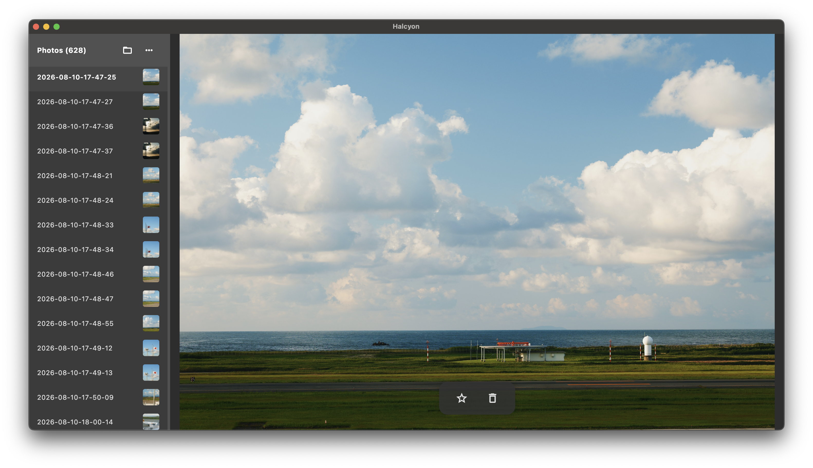
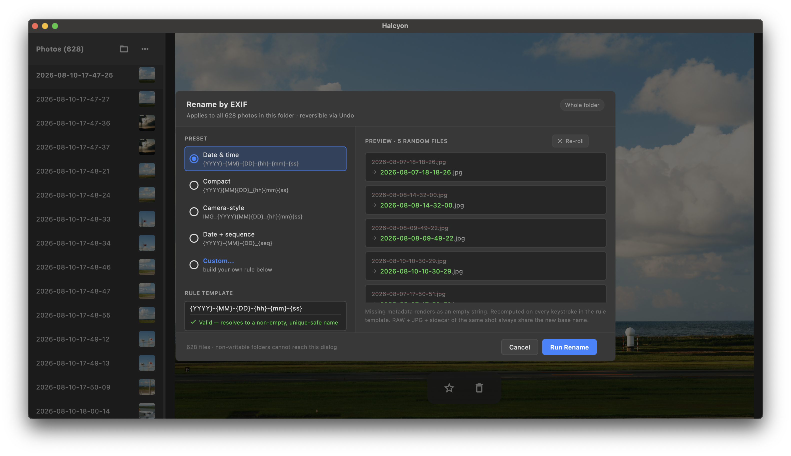
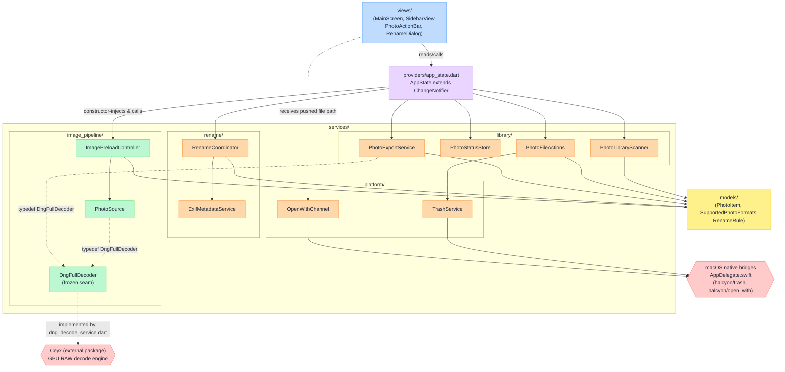

# Halcyon

*[English version](README.md)*

Halcyon 是一款 Flutter 桌面應用程式，供攝影師整理 RAW 與 JPG 照片資料夾：以鍵盤瀏覽，
為照片標記星號或垃圾桶，再批次複製或搬移已加星號的檔案。
<!-- evidence: lib/views/main_screen.dart:104-129 keyboard shortcut handler; lib/services/library/photo_file_actions.dart batch copy/move -->



*主挑選畫面，macOS 15.6.1：側邊欄列出該資料夾的 628 張照片，檢視區佔滿視窗其餘部分，
沒有應用程式標題列，只有星標與垃圾桶按鈕浮在影像上方。方向鍵切換照片，`S` 與 `X` 標記。*



*同一個資料夾上的「Rename by EXIF」對話框。左半部是預設集與可編輯的規則樣板（附即時
驗證），右半部隨機抽樣五個檔案預覽，每一列上方是目前檔名、下方是套用規則後的新檔名。*

### 名稱由來

Halcyon 與 Ceyx 都是翠鳥屬名。在希臘神話中，阿爾庫俄涅（Alcyone）與刻宇克斯（Ceyx）
化為翠鳥——這兩個儲存庫因此以一對的形式命名：Ceyx 是解碼引擎，Halcyon 是建構於其上
的應用程式。
<!-- evidence: docs/logs/2026-08-26/readme-draft/BRIEFING.md:46-49 (shared framing agreed for both READMEs); ../ceyx/README.md:56-65 "Sister project: Halcyon" section states the same pairing and dependency direction -->

### 為什麼是 Halcyon

- **篩選是吞吐量問題，不是檢視問題。** 攝影師的操作迴圈是「看、判斷、前進」——方向鍵
  在照片間移動，`S` 加星號，`X` 標記垃圾桶，這個迴圈中沒有任何一步需要對話框或滑鼠點
  擊。任何拖慢這個迴圈的東西，就是這個工具的全部成本所在。
  <!-- evidence: lib/views/main_screen.dart:104-129 arrowLeft/arrowRight/keyS/keyX bound directly to previousPhoto/nextPhoto/markCurrent -->
- **淵源：FastPictureViewer。** 這種「不離開鍵盤即可瀏覽與標記」的鍵盤驅動標記模型，
  直接受 FastPictureViewer 啟發——那是上一個時代一款付費的 Windows 工具，至今仍有攝影
  師懷念它。
- **最大化預覽區域、最小化介面裝飾。** 主畫面沒有 app bar：`Scaffold` 的 body 是一個
  `Stack`，圖片檢視器被定位為填滿整個畫面，只在其上疊加一個浮動動作列與狀態列。
  <!-- evidence: lib/views/main_screen.dart:48-59 Scaffold with no appBar, body is Stack(children: [_buildKeyboardShortcutHandler(...), StatusLine()]); lib/views/main_detail_view.dart:113-135 Stack with Positioned.fill viewer and a bottom-centered floating action bar -->
  macOS 視窗的預設尺寸直接由 3:2 預覽區域加上 270px 側欄計算而來（`previewWidth =
  defaultHeight * 1.5`、`defaultWidth = 270.0 + previewWidth`），目標是寬螢幕桌面視
  窗，而非窄視窗。
  <!-- evidence: macos/Runner/MainFlutterWindow.swift:9-19 -->
  側欄本身可由使用者拖曳把手，在 180px 到 600px 之間自由調整寬度。
  <!-- evidence: lib/views/main_screen.dart:71-78 -->
- **解碼是委託出去的，而非重新實作。** RAW 解碼屬於姊妹專案 Ceyx；Halcyon 是在真實產
  品條件下——UI 執行緒的即時反應、分層預覽／完整尺寸載入、資料夾規模的批次工作流程——
  使用該解碼引擎的應用程式。
- **對範圍誠實以對。** 桌面是目標平台。行動裝置與網頁建置目標存在且可編譯，但介面本身
  並未針對觸控操作調整。
  <!-- evidence: pubspec.yaml has no platform restriction, standard Flutter multi-platform project; this claim is scope framing, not a measured behaviour -->

### 姊妹專案：Ceyx

Halcyon 以一般的 Dart path 相依方式，依賴 Ceyx 的 `plugin/` 目錄：

```yaml
ceyx:
  path: ../ceyx/plugin
```
<!-- evidence: pubspec.yaml:46-47 -->

這是單純的相依關係，不是分支（fork）也不是子專案：Ceyx 必須以並排（sibling）簽出的
形式存在於本儲存庫旁邊，`flutter pub get` 才能成功執行；Halcyon 自己在該相依項旁的
註解也記錄了它刻意依賴 `plugin/` 套件、而非 Ceyx 自己的 `app/`，以避免把該 app 的測試
輔助相依項一併拖進 Halcyon 的建置流程。
<!-- evidence: pubspec.yaml:42-47 -->

---

## 目錄

- [挑選工作流程（triage workflow）](#挑選工作流程triage-workflow)
- [持久化、還原與批次操作](#持久化還原與批次操作)
- [依 EXIF 重新命名](#依-exif-重新命名)
- [RAW 格式支援與解碼路由](#raw-格式支援與解碼路由)
- [實測效能](#實測效能)
- [快取與記憶體管理](#快取與記憶體管理)
- [架構](#架構)
- [架構圖](#架構圖)
- [平台支援](#平台支援)
- [從原始碼建置](#從原始碼建置)
- [測試與品質閘門](#測試與品質閘門)
- [第三方歸屬](#第三方歸屬)
- [文件維護](#文件維護)

---

## 挑選工作流程（triage workflow）

這是核心迴圈：開啟一個資料夾、瀏覽它、標記照片、繼續下一張。以下描述的是攝影師面對一整張裝滿
RAW 與 JPG 檔案的記憶卡時，這個 app 實際會做的事。

### 開啟資料夾

`PhotoLibraryScanner.scan()` 用 `dir.list(followLinks: false)` 列出該目錄的直接內容，
不會遞迴進入子目錄——只有直接放在所選資料夾內的檔案會被抓到。
<!-- evidence: lib/services/library/photo_library_scanner.dart:8 -->

每個項目在被視為照片之前都會經過篩選：必須是一般檔案、名稱不能以 `.` 開頭
（dotfile／AppleDouble 側寫檔會被跳過），且副檔名必須在支援清單內。
<!-- evidence: lib/services/library/photo_library_scanner.dart:11-16 -->

支援的集合是 `.jpg`、`.jpeg`、`.png`，加上 Ceyx 引擎能解碼的每一個 RAW 副檔名（`.dng`、
`.arw`、`.cr3`、`.nef`、`.raf`、`.rw2`、`.orf`、`.pef`、`.srw`、`.x3f`，在執行期由 Ceyx
自身能力常數推導而來），再加上三個 Ceyx 無法解碼但 Halcyon 仍列出的 browse-only RAW 格式
（`.cr2`、`.iiq`、`.mrw`）——完整拆解與這份清單為何是推導而非手寫，見下文「RAW 格式支援
與解碼路由」。
<!-- evidence: lib/models/supported_photo_formats.dart:6-32 -->

符合的檔案會被分組（見下節）成 `PhotoItem`，最終清單依 id 排序，且不分大小寫。
<!-- evidence: lib/services/library/photo_library_scanner.dart:22-26 -->

### RAW 與 JPG 的 sibling 分組

分組鍵是去除副檔名後的檔名——`SupportedPhotoFormats.photoIdFor()` 回傳
`p.basenameWithoutExtension(file.path)`。所有共用同一個檔名主體的檔案，無論副檔名為何，
都會歸入同一個鍵下的 `List<File>`。
<!-- evidence: lib/models/supported_photo_formats.dart:41-43 -->
<!-- evidence: lib/services/library/photo_library_scanner.dart:14-19 -->

這個分組後的清單會變成單一個 `PhotoItem(id: entry.key, files: entry.value)`——不論群組內有
多少檔案，都只有一個側邊欄項目、一個 `PhotoStatus`、一列供使用者互動的資料。
<!-- evidence: lib/services/library/photo_library_scanner.dart:22-24 -->
<!-- evidence: lib/models/photo_item.dart:7-16 -->

app 實際載入哪個檔案來顯示，由 `bestFileToLoad()` 決定：它依固定的優先順序
（`.jpg`、`.jpeg`、`.png`）尋找，回傳第一個相符者；若群組內沒有這些副檔名，則退回群組中第一個
支援的檔案；只有在整個群組都不受支援時，才會退回任意一個檔案。
<!-- evidence: lib/models/supported_photo_formats.dart:45-61 -->

在下游行為上，只要資料夾內存在任何多檔案群組（也就是任何 RAW+JPG 配對），app 就會預設使用
資源回收模式刪除而非永久刪除，理由是：正在被挑選的記憶卡不該因為一次誤點就連 RAW 一起丟失。
<!-- evidence: lib/providers/app_state.dart:285-287 -->

標記或刪除是作用在 `PhotoItem` 上的，所以一次星號或垃圾桶動作會套用到群組內的每一個檔案——
RAW 與其 JPG sibling 會作為同一個單位一起移動。
<!-- evidence: lib/models/photo_item.dart:10 -->

### 標記

除了「未標記」之外還有兩種標記狀態：`starred`（星號）與 `trashed`（垃圾桶）
（`PhotoStatus` enum）。`markCurrent(status)` 是切換式的：再次按下同一個標記會清回
`unmarked`；按下不同的標記則會設定它。**切換關閉**時不會自動前進；**設定新標記**時，
若已啟用自動前進，則會前進。
<!-- evidence: lib/providers/app_state.dart:367-381 -->
<!-- evidence: docs/sop/memory.md G-005 -->

自動前進是一個會被持久化的使用者偏好設定（`SharedPreferences` 鍵值 `autoAdvance`，
預設為 `false`），透過 `setAutoAdvance()` 切換。
<!-- evidence: lib/providers/app_state.dart:139,151,405-409 -->

浮動的操作列（action bar）呼叫的是同一組方法——星號與垃圾桶／回收模式按鈕都呼叫
`AppState.markCurrent()`，且垃圾桶圖示的圖形與提示文字會依回收模式在「刪除」與
「從垃圾桶還原」之間切換。
<!-- evidence: lib/views/photo_action_bar.dart:49-69 -->

每次標記變更都會即時寫入磁碟（`_saveStatusCache()`）；儲存格式與復原（resume）行為留待
本文件其他章節說明。
<!-- evidence: lib/providers/app_state.dart:378 -->

### 導覽與縮放

`←`／`→` 在目前排序好的清單中依索引移動到上一張／下一張，並有邊界檢查（頭尾皆不會循環）。
<!-- evidence: lib/providers/app_state.dart:351-365 -->

縮放完全獨立於 `AppState` 之外，由 `MainScreen` 建立並釋放的專屬 `ZoomController` 持有——
刻意不放在 detail view，因為 detail view 在每次切換照片時都會重建，若放在其內部，
使用者按左右鍵切換照片時縮放層級就會被重置。
<!-- evidence: lib/views/zoom_controller.dart:10-15 -->
<!-- evidence: docs/sop/memory.md AD-015 -->

每次縮放都以固定倍率 `1.25` 乘除目前的縮放比例，上限為 `5.0×`。縮小到 `1.05×` 或以下時，
會直接吸附回單位矩陣（identity matrix），而不是停在剛好超過 `1.0×` 的位置，藉此避免殘留的
平移偏移。
<!-- evidence: lib/views/zoom_controller.dart:44,50-58,60-75 -->

### 鍵盤快捷鍵

觸發挑選流程的所有鍵盤處理都集中在同一處——`MainScreen` 內單一個 `Focus` widget 的
`onKeyEvent` callback。這是 app 註冊的完整按鍵集合；`lib/` 底下沒有其他檔案掛接鍵盤處理。
<!-- evidence: lib/views/main_screen.dart:97-135 -->

| 按鍵 | 動作 |
|---|---|
| `←` | 上一張照片 |
| `→` | 下一張照片 |
| `↑` | 放大（每次 ×1.25，最高 5×）|
| `↓` | 縮小（每次 ×1.25，縮到約 1.05× 以下會吸附回原尺寸）|
| `S` | 切換目前照片的星號標記 |
| `X` | 切換目前照片的垃圾桶標記 |
| `R` | 切換回收模式（資料夾內的 `.trash/` vs. 永久／系統刪除）|

<!-- evidence: lib/views/main_screen.dart:104-129 -->

回收模式也可以透過右鍵點擊操作列中的垃圾桶圖示來切換；左鍵點擊該圖示則維持它原本
「標記這張照片」的意思。
<!-- evidence: lib/views/photo_action_bar.dart:60-68 -->

### 挑選過程中的畫面回饋

即時狀態訊息由自訂的 `StatusLine` widget 顯示（位於視窗底部），它取代了 Flutter 的
`SnackBar`，改用固定且明確的時序：完全顯示 2.5 秒，接著 0.5 秒淡出，然後移除。
<!-- evidence: lib/views/status_line.dart:25-26 -->
<!-- evidence: docs/sop/memory.md AD-009 -->

挑選流程本身會直接觸發兩則回饋訊息：

- 開啟資料夾時，若發現該資料夾不可寫入，會顯示一次性警告——每次呼叫 `loadFolder()`
  只出現一次，而非每次標記都出現。可寫性的檢查方式是實際建立再刪除一個探測檔案，而非讀取
  Unix 權限位元，因為在以 `noowners` 掛載的 exFAT 記憶卡上，權限位元並不可靠。
  <!-- evidence: lib/providers/app_state.dart:288-289 -->
  <!-- evidence: docs/sop/memory.md AD-009 -->
- 若資料夾掃描本身拋出例外（例如遍歷目錄時發生的權限錯誤），會顯示錯誤訊息，並附上底層
  例外文字。
  <!-- evidence: lib/providers/app_state.dart:324-326 -->

---

## 持久化、還原與批次操作

### 一次篩選作業永遠不會遺失

在資料夾整理到一半時關閉 Halcyon，之後再重新開啟同一個資料夾，畫面會回到原本瀏覽的
那張照片，所有星號與垃圾桶標記都完好無缺。標記不是只存在記憶體裡：每一次變動都會寫入
照片旁的一個狀態檔，而上次瀏覽到的照片也會在下次開啟時被還原。

#### 狀態檔

Halcyon 開啟的每個資料夾都有自己專屬的 `.halcyon_status.json`，寫在該資料夾的根目錄，
與照片放在一起。
<!-- evidence: lib/services/library/photo_status_store.dart:22-24 -->
它是一個扁平的 JSON 物件：每個照片 id（其檔名）對應到 `"starred"` 或 `"trashed"`——
未標記的照片單純不會出現在裡面，而不是寫成 `"unmarked"`——另外加上兩個保留鍵：
`_last_viewed_id` 用於還原瀏覽位置，`_rename_rule` 用於儲存該資料夾的重新命名規則。
<!-- evidence: lib/services/library/photo_status_store.dart:18,132-148 -->
選擇純 JSON 而非資料庫，是為了讓這個檔案直接放在照片資料夾裡，複製到別台機器或備份時
會一起跟著走，而且在 diff 中也能被人直接讀懂。
<!-- evidence: docs/sop/memory.md AD-004 -->

因為這個檔案存在資料夾內部而非集中式的 app 資料庫，每個資料夾的標記都是自成一體的：
開啟第二個資料夾會建立第二份、獨立的 `.halcyon_status.json`，不同拍攝場次之間的標記
不會互相污染。
<!-- evidence: lib/services/library/photo_status_store.dart:22-24 -->

損毀或無法讀取的狀態檔會降級為空白標記集合，而不是連整個資料夾都打不開——遺失標記
是可以復原的，但無法存取照片就不行了。
<!-- evidence: lib/services/library/photo_status_store.dart:34-53 -->

#### 重新開啟時還原

重新開啟資料夾時，Halcyon 會還原先前選取的照片：如果沒有指定明確的選取目標，就會退回
使用 `_last_viewed_id` 底下記錄的 id，前提是那張照片在剛掃描完的資料夾裡仍然存在。
<!-- evidence: lib/providers/app_state.dart:291-316 -->
瀏覽位置會在導覽動作穩定五秒後才寫入，這個防彈跳設計讓快速用方向鍵瀏覽時不會每按一次
就寫入一次。
<!-- evidence: lib/providers/app_state.dart:342-343,394-400 -->

#### 耐用性：原子寫入、同一時間只有一條寫入鏈

App 裡有兩個獨立的計時器都可能想寫入這個檔案——一個對應星號/垃圾桶標記，一個對應上次
瀏覽位置指標——而兩者都是先讀再改再寫。把所有寫入都串成單一佇列，代表先開始的那次寫入
絕不可能比另一個計時器晚結束、進而覆蓋掉對方已經寫入的變動。
<!-- evidence: docs/sop/memory.md G-019 -->
<!-- evidence: lib/services/library/photo_status_store.dart:55-66 -->
每一次寫入本身都是透過「先寫暫存檔、再更名」完成，所以就算拔卡或在寫入途中當機，也絕不會
留下寫到一半的狀態檔——資料夾裡永遠只會是舊的完整檔案，或新的完整檔案，不會是撕裂中的
半成品。
<!-- evidence: lib/services/library/photo_status_store.dart:68-76 -->

#### 誠實偵測唯讀資料夾

某些掛載方式下，目錄的權限位元並不可靠——一張 exFAT 記憶卡可能回報看似可寫的權限模式，
但實體防寫鎖卻讓每一次寫入都失敗。Halcyon 不相信這些權限位元：它會實際在資料夾裡建立
並刪除一個小檔案來探測可寫性，唯有確認資料夾真的是唯讀時，才會顯示一次性警告。
<!-- evidence: lib/services/library/photo_status_store.dart:78-91 -->
<!-- evidence: docs/sop/memory.md AD-009 -->
<!-- evidence: docs/sop/memory.md G-006 -->

#### 重新命名與標記

標記是以檔名為 key，沒有其他身分識別依據。如果照片是透過不經過 Halcyon 內建重新命名
功能的工具改名，綁在舊檔名上的標記就會被靜默孤立——它們不再對應資料夾裡任何一張照片。
Halcyon 自己的重新命名功能會在重新命名操作的同時，把狀態檔裡的每一個 key 都重新對應
到新檔名，藉此避免這個問題，因此星號、垃圾桶標記與瀏覽位置指標都能在 app 內完成的重新
命名之後存活下來。
<!-- evidence: docs/sop/memory.md G-011 -->
<!-- evidence: lib/services/library/photo_status_store.dart:185-203 -->

### 批次操作

#### 複製與移動已加星號的照片

已加星號的照片可以整批複製或移動到指定的目的地資料夾。
<!-- evidence: lib/services/library/photo_file_actions.dart:50-87 -->
一張 RAW 檔與其同名的 JPG 姐妹檔會被當成同一個單位一起搬動——星號標記是掛在這個項目
上，而不是掛在單一檔案上——而 macOS 在某些磁碟（exFAT、網路磁碟）上自動產生的
AppleDouble 側寫檔，也會一併清除，不會殘留在目的地。
<!-- evidence: lib/services/library/photo_file_actions.dart:63-84 -->
<!-- evidence: docs/sop/memory.md G-006 -->
預設情況下，目的地已存在的檔案會被保留不動（略過，而非覆蓋）；批次作業不會因單一失敗
而中止——其餘每個檔案仍會繼續嘗試，所有失敗都會被收集並顯示給使用者看，而不是被靜默
吞掉。
<!-- evidence: lib/services/library/photo_file_actions.dart:56-70,28-36 -->

#### 社群媒體匯出

已加星號的照片也可以匯出為適合社群媒體的縮圖 JPEG，一個項目對應一個檔案，解碼、縮放、
重新編碼全部在 Dart 端完成。長邊上限為 `2048` px，維持長寬比，輸出以 JPEG 品質 `90`
編碼。
<!-- evidence: lib/services/library/photo_export_service.dart:82,126,141 -->
核心 EXIF 欄位——相機廠牌/型號、拍攝日期、作者、曝光時間、光圈值、焦距、鏡頭型號、ISO
與 GPS 座標——會從原始來源檔重新讀出，並附加回縮放後的輸出檔；這是一組經過篩選的標籤，
不是完整的中繼資料區塊複製。
<!-- evidence: lib/services/library/photo_export_service.dart:144-216 -->
最多同時執行 `4` 個匯出工作，這個上限的考量是：一次完整的 RAW 解碼可能佔用數百 MB
的記憶體，若讓所有已加星號的項目在大批次中同時解碼，會有記憶體耗盡的風險。
<!-- evidence: lib/services/library/photo_export_service.dart:218-223,287-288 -->

#### 兩種刪除路徑

Halcyon 提供兩種截然不同的刪除方式，而且它們確實是兩種不同的產品體驗：

| 路徑 | 作用 | 平台 |
|---|---|---|
| 系統垃圾桶 | 透過原生橋接把檔案移到作業系統的垃圾桶 | macOS、Windows |
| 資料夾內回收模式 | 把檔案移到照片資料夾內的 `.trash` 子資料夾 | 任何平台 |

系統垃圾桶路徑是由 `halcyon/trash` method channel 支撐的。在 macOS 上，它註冊於
`AppDelegate.swift`，呼叫 `FileManager.default.trashItem`；在 Windows 上，它註冊於
`windows/runner/halcyon_channels.cpp`。
<!-- evidence: macos/Runner/AppDelegate.swift:23-24 -->
<!-- evidence: windows/runner/halcyon_channels.cpp:49-51 -->
<!-- evidence: docs/sop/memory.md AD-008 -->
在 Android、iOS、Linux 與 web 這幾個 runner 目錄中搜尋 `halcyon/trash`，找不到任何
註冊，因此系統垃圾桶路徑僅限 macOS 與 Windows。資料夾內回收模式是一個使用者可切換、
以資料夾為單位的預設值（對含有 RAW+JPG 姐妹檔的資料夾會自動開啟），而不是自動的
後備方案；在沒有原生 channel 的平台上，若選擇直接走系統垃圾桶刪除，會拋出
`TrashException`，而不是靜默地什麼都不做。
<!-- evidence: lib/providers/app_state.dart:130,166,287,498-515 -->
<!-- evidence: lib/services/platform/trash_service.dart:9-19 -->

資料夾內回收模式會把已標記刪除項目的每一個檔案——包括其 RAW 姐妹檔與任何 AppleDouble
側寫檔——移到照片旁的 `.trash` 子資料夾，而不經過作業系統。這是同一個磁碟區內的更名
操作，因此即使在系統垃圾桶 API 不可用的記憶卡上也能運作，而且因為不涉及資料複製，
速度是即時的。
<!-- evidence: lib/services/library/photo_file_actions.dart:114-155 -->
<!-- evidence: docs/sop/memory.md AD-013 -->
與先前回收批次的檔名碰撞絕不會被覆蓋：移動程序會依序附加 `-1`、`-2`……直到找到一個
可用的檔名為止。
<!-- evidence: lib/services/library/photo_file_actions.dart:157-171 -->

批次刪除的失敗會擋下流程：任何失敗的檔案都會跳出一個對話框，清楚列出哪些檔案失敗及
原因，因為一次靜默無效的刪除，跟一個壞掉的 app 看起來沒有兩樣。成功的回收模式批次則
會在狀態列顯示一則暫時性訊息，附上移動的檔案數，提醒使用者這些檔案仍在磁碟上的
`.trash` 裡，並未被永久刪除。
<!-- evidence: lib/views/batch_delete_feedback.dart:12-40 -->

---

## 依 EXIF 重新命名

攝影師依拍攝日期、相機、鏡頭或序號為檔案命名，而命名格式通常是自家慣例，不會是相機寫入
記憶卡的原始檔名。Halcyon 的重新命名功能是一套針對 EXIF 與檔案系統中繼資料的小型樣板引擎：
寫一次樣板、套用到整個資料夾，每個 RAW 檔、它的 JPG 對應檔，以及任何側車檔（AppleDouble
格式的 `._DSC_0431.NEF` 之類）都會一起改成相同的新基底檔名。
<!-- evidence: lib/models/rename_rule.dart:30-35 -->

### 樣板模型

規則就是一個字串樣板，例如 `{YYYY}-{MM}-{DD}-{hh}-{mm}-{ss}`。渲染樣板是純函式——完全不
碰檔案系統——因此整套命名策略無需在硬碟上放任何照片就能單元測試。
<!-- evidence: lib/models/rename_rule.dart:30-39 -->

渲染器認得的每個 `{token}`，分組方式與規則編輯器「Insert variable」面板完全一致：
<!-- evidence: lib/views/rename_dialog/rule_editor.dart:70-90 -->

| 分組 | 變數 | 對應內容 | 範例 |
|---|---|---|---|
| Date/time | `{YYYY}` | 拍攝年份，4 位數 | `2026` |
| Date/time | `{MM}` | 拍攝月份，2 位數 | `08` |
| Date/time | `{DD}` | 拍攝日期，2 位數 | `26` |
| Date/time | `{hh}` | 拍攝小時，2 位數 | `14` |
| Date/time | `{mm}` | 拍攝分鐘，2 位數 | `07` |
| Date/time | `{ss}` | 拍攝秒數，2 位數 | `33` |
| Camera | `{camera}` | EXIF 相機型號，缺值為空字串 | `Z 8` |
| Camera | `{lens}` | EXIF 鏡頭型號，缺值為空字串 | `NIKKOR Z 24-70mm f_2.8 S` |
| Camera | `{make}` | EXIF 相機製造商，缺值為空字串 | `NIKON CORPORATION` |
| Camera | `{artist}` | EXIF artist/copyright 標籤，缺值為空字串 | `J. Chen` |
| Shooting | `{f}` | 光圈值，格式為 `f<數值>`，缺值為空字串 | `f2.8` |
| Shooting | `{focal}` | 焦距，格式為 `<數值>mm`，缺值為空字串 | `35mm` |
| Shooting | `{iso}` | ISO 值，格式為 `ISO<數值>`，缺值為空字串 | `ISO400` |
| Shooting | `{shutter}` | 快門速度，依 EXIF 印出的原始寫法，缺值為空字串 | `1/250` |
| Shooting | `{direction}` | GPS 拍攝方向，四捨五入至整數度，缺值為空字串 | `187` |
| File | `{seq}` | 在套用 `{seq}` 前渲染結果相同（會碰撞）的檔案之間，依 1 起算的序號；支援補零寬度，如 `{seq:3}` → `007` | `1` |
| File | `{orig}` | 原始檔名的基底（不含副檔名） | `DSC_0431` |
<!-- evidence: lib/models/rename_rule.dart:50-124 -->

當 EXIF 沒有拍攝日期（或整個 EXIF 讀取失敗）時，日期/時間欄位會退回使用檔案的檔案系統
修改時間——渲染器一定有「某個」日期可用，只是在這種情況下不一定是實際拍攝日期。
<!-- evidence: lib/models/rename_rule.dart:96 -->

任何沒有 EXIF 值的欄位會渲染為空字串，而不是佔位符——重新命名對話框的預覽清單也明白寫著
「缺失的中繼資料會渲染為空字串」。
<!-- evidence: lib/models/rename_rule.dart:107-119 -->
<!-- evidence: lib/views/rename_dialog/preview_list.dart:87-92 -->

樣板中若含有這張表以外的任何 token，在能執行之前就會被拒絕：編輯器會顯示「Unknown
variable {name}」，且「Run」按鈕會被停用。
<!-- evidence: lib/models/rename_rule.dart:65-77 -->
<!-- evidence: lib/views/rename_dialog/actions.dart:52-53 -->

渲染出來的檔名會經過檔案系統安全性清理：`/`、`:`、`\` 與 NUL 一律替換為 `_`（`:` 之所以
重要，是因為它在傳統 Mac OS 層是路徑分隔符，在 Finder 裡仍會顯示成 `/`，而 `1/250` 這類
未經處理的快門速度渲染結果，本會建立出一個子目錄），並移除頭尾的空白與句點。
<!-- evidence: lib/models/rename_rule.dart:128-134 -->

### 預設樣板

應用程式內建四組預設樣板，可在對話框的預設清單中選取。以一張 2026-08-26 14:07:33 拍攝、
基底檔名為 `DSC_0431`、且不與其他項目在中繼資料上碰撞（`{seq}` = 1）的檔案為例，渲染結果
如下：

| 預設 | 樣板 | 渲染範例 |
|---|---|---|
| Date & time | `{YYYY}-{MM}-{DD}-{hh}-{mm}-{ss}` | `2026-08-26-14-07-33` |
| Compact | `{YYYY}{MM}{DD}_{hh}{mm}{ss}` | `20260826_140733` |
| Camera-style | `IMG_{YYYY}{MM}{DD}_{hh}{mm}{ss}` | `IMG_20260826_140733` |
| Date + sequence | `{YYYY}-{MM}-{DD}_{seq}` | `2026-08-26_1` |
<!-- evidence: lib/models/rename_rule.dart:43-48 -->

「Date & time」同時也是全新對話框開啟時的預設樣板。
<!-- evidence: lib/models/rename_rule.dart:41 -->
<!-- evidence: lib/views/rename_dialog/rename_dialog.dart:33-35 -->

在選取某個預設樣板的狀態下編輯樣板文字（或插入變數 chip），選取狀態會切換到名為
`Custom...` 的偽預設項目；只有自訂規則會依資料夾記住，重新開啟一個最後一次是以自訂規則
重新命名過的資料夾時，會還原成當初那個確切的樣板。
<!-- evidence: lib/views/rename_dialog/rename_dialog.dart:61-70 -->
<!-- evidence: lib/views/rename_dialog/rename_dialog.dart:101-113 -->

### 對話框與即時預覽

對話框分為兩個窗格：左側是預設選擇器、規則文字欄位與變數 chip（`RuleEditor`），右側是
即時預覽清單（`RenamePreviewList`）。開啟對話框時會從目前資料夾隨機抽取五個項目，並讀取
一次它們的 EXIF；規則欄位每次按鍵都會針對這已讀取的中繼資料重新渲染這五列預覽，不會重新
讀取 EXIF。
<!-- evidence: lib/views/rename_dialog/rename_dialog.dart:72-84 -->
<!-- evidence: lib/views/rename_dialog/preview_list.dart:98-107 -->

「Re-roll」控制項會重新抽取五個隨機項目並重新讀取一次中繼資料。每一列預覽會顯示目前檔名
（加上刪除線）、一個箭頭、渲染後的新基底檔名加上副檔名、該項目擁有的每個附屬副檔名各一個
徽章（讓使用者在送出前就能看到 RAW+JPG 這類配對會一起移動），以及當樣板引用 `{camera}`
而此項目沒有該標籤時的「no camera tag」徽章。
<!-- evidence: lib/views/rename_dialog/preview_list.dart:98-116 -->

只要目前樣板有驗證錯誤（未知變數、空樣板，或渲染結果為空字串的樣板），「Run Rename」按鈕
就會被停用，因此無效規則無法被套用。
<!-- evidence: lib/models/rename_rule.dart:73-87 -->
<!-- evidence: lib/views/rename_dialog/actions.dart:52-53 -->

此對話框只能套用到整個資料夾——沒有逐項選取，頁尾也明白寫著項目數量是套用到整個資料夾。
<!-- evidence: lib/views/rename_dialog/rename_dialog.dart:200 -->
<!-- evidence: lib/views/rename_dialog/actions.dart:29-34 -->

### EXIF 從哪裡來，以及成本模型

EXIF 是以「每個項目一次」而非「每個檔案一次」讀取：`PhotoItem.bestFileToLoad` 選出要讀取
EXIF 的來源檔案，執行重新命名時，這單一一次讀取結果會套用到該群組中的每一個附屬檔案（RAW、
JPG、側車檔）。
<!-- evidence: docs/sop/memory.md AD-017 -->
<!-- evidence: lib/providers/app_state.dart:547-564 -->

`bestFileToLoad` 在有 `.jpg`/`.jpeg`/`.png` 對應檔時會優先選它，而不是 RAW 檔本身；找不到
時退回本應用程式可解碼的第一個檔案，若群組內完全沒有可解碼的檔案，再退回該群組的第一個檔案。
<!-- evidence: lib/models/supported_photo_formats.dart:18-22 -->
<!-- evidence: lib/models/supported_photo_formats.dart:45-61 -->

使用者可見的後果是：對於沒有 JPG 對應檔的 RAW 拍攝，EXIF 會直接透過 `exif` 套件從 RAW 檔
自己的檔頭讀取，且因為解析 RAW 檔頭需要掃描數 MB 的資料，這個讀取會在 UI isolate 之外執行。
若這次讀取失敗，或該 RAW 格式的檔頭不是 `exif` 套件能解析的格式，該項目的中繼資料就會是
`null`，樣板中的每個 EXIF token 對它而言都會渲染為空字串——只有日期/時間 token 仍會解出
結果，退回使用該檔案的修改時間。
<!-- evidence: lib/services/rename/exif_metadata_service.dart:66-75 -->
<!-- evidence: lib/models/rename_rule.dart:96 -->

EXIF 讀取以每批 500 個路徑為單位分批進行，讓大型資料夾仍能回報漸進式進度，而不是卡在單一
巨大批次上；對話框會將此進度顯示為狀態列文字「讀取 EXIF *done/total*…」。
<!-- evidence: lib/services/rename/exif_metadata_service.dart:18-42 -->
<!-- evidence: lib/services/rename/rename_coordinator.dart:86-91 -->

### 如何套用重新命名

命名策略與檔案 I/O 是兩個各自獨立的函式：`planRenames` 在完全不碰硬碟的情況下計算每一步
搬移動作，只有 `applyRenames` 才會真正執行 `File.rename` 呼叫。`planRenames` 是純函式，因此
整套碰撞規避策略無需在硬碟上放任何照片就能測試。
<!-- evidence: docs/sop/memory.md AD-016 -->
<!-- evidence: lib/services/rename/rename_service.dart:32-41 -->

重新命名以序列方式逐一計畫執行。`File.rename` 是同一 volume 內的中繼資料操作，平行化沒有
效益，反而會讓 planner 的碰撞規避退化成 race。
<!-- evidence: lib/services/rename/rename_service.dart:143-146 -->

**實作中的碰撞規則。** 項目先依它們在 `{seq}` = 1 時會渲染出的結果分組；同一組內每個彼此
碰撞的項目，會依排序後的項目 id 取得其在組內的位置，指派一個確定性的、1 起算的序號——因此
編號結果不受掃描順序影響。若最終候選檔名仍與資料夾中已存在的檔名（或本批次中已被稍早項目
佔用的檔名）碰撞，就會附加數字後綴 `-1`、`-2`……直到取得未被佔用的檔名為止。若某項目最終
渲染出的檔名與它目前的檔名相同，就會從計畫中剔除——沒有實際變化的重新命名不會產生一筆
undo 紀錄。
<!-- evidence: lib/services/rename/rename_service.dart:58-85 -->

屬於同一個項目的所有檔案——RAW 檔、JPG 對應檔，以及資料夾中若存在的 AppleDouble 側車檔
（`._<name>`）——都會改成相同的新基底檔名，各自保留原本的副檔名，因此 RAW+JPG 配對或
RAW+側車檔配對在重新命名過程中絕不會被拆散。
<!-- evidence: lib/services/rename/rename_service.dart:87-105 -->

每一步搬移動作在完成的當下就會被附加寫入資料夾中的 `.halcyon_rename_log.jsonl`（這是一個
只附加、一行一個 JSON 物件的日誌，而不是每次重寫整個陣列，因此批次執行到一半當機也不會
損毀或遺失先前的搬移紀錄），這也是對話框「Undo」動作背後的機制——日誌會被倒著重播，然後
刪除。
<!-- evidence: lib/services/rename/rename_service.dart:123-192 -->
<!-- evidence: lib/services/rename/rename_service.dart:194-244 -->

因為 `.halcyon_status.json`（星號、垃圾桶標記、最後檢視的 id）是以檔名為 key，協調器會在
每次重新命名批次完成後、以及每次還原（undo，方向相反）之後，立即重新映射每一個變動過的
key——否則每一個標記都會靜默地孤立在一個已不存在的檔名底下。
<!-- evidence: docs/sop/memory.md G-011 -->
<!-- evidence: lib/services/rename/rename_coordinator.dart:136-141 -->
<!-- evidence: lib/services/rename/rename_coordinator.dart:182-189 -->

若 Halcyon 已判定某資料夾無法寫入，重新命名對話框本身就無法被開啟——對話框自己的頁尾也
明白寫著這一點。
<!-- evidence: lib/views/rename_dialog/actions.dart:29-34 -->

### 已知限制

- 沒有對應 EXIF 標籤的欄位——或整個 EXIF 根本讀取失敗的照片——會在檔名該位置渲染為空
  字串；樣板不會退回使用其他欄位。
  <!-- evidence: lib/models/rename_rule.dart:107-119 -->
- 只有 RAW、沒有 JPG 對應檔的項目，其 EXIF 完全仰賴 `exif` 套件能否解析該 RAW 檔自己的
  檔頭；這條路徑上沒有專用的 RAW EXIF 解析器，若某個 RAW 格式是該套件無法解析的，該項目
  就得不到任何中繼資料，而不是部分讀取結果。
  <!-- evidence: lib/services/rename/exif_metadata_service.dart:66-93 -->

---

## RAW 格式支援與解碼路由

有兩個獨立的問題，決定一張照片會不會出現、以及它如何被轉換成像素：Halcyon 的資料夾掃描
器究竟列出了哪些檔案，以及這些檔案裡有多少是姊妹解碼引擎 Ceyx 真正知道如何解碼的。這兩個
集合並不相同，而兩者之間的落差，對任何把 Halcyon 指向一個相機原始檔資料夾的人都很重要。

### Halcyon 掃描並列出哪些檔案

側欄只會顯示副檔名出現在 `SupportedPhotoFormats.supportedExtensions` 裡的檔案，這個檢查
在資料夾掃描時對每一個目錄項目各做一次。自 2026-08-26 的 RAW 涵蓋率契約起，這份清單不再
是手寫的：它在執行期由 Ceyx 自己的 `kSupportedDecodeExtensions` 常數**推導**而來，聯集一
個小型手寫的 browse-only 集合與兩個已編碼位元流副檔名：

| 副檔名 | 分類 |
|---|---|
| `.jpg`, `.jpeg` | 已編碼位元流 |
| `.png` | 已編碼位元流 |
| `.dng`、`.arw`、`.cr3`、`.nef`、`.raf`、`.rw2`、`.orf`、`.pef`、`.srw`、`.x3f` | RAW，引擎可解碼——由 Ceyx 的 `kSupportedDecodeExtensions` 推導而來 |
| `.cr2`、`.iiq`、`.mrw` | RAW，僅可瀏覽——Ceyx 完全無法解碼這些容器（契約裁決 D2）；它們能被掃描、加星號、批次搬移，載入器對它們也會嘗試與其他 RAW 相同的內嵌預覽路徑——這個嘗試是否真的找到可用預覽，取決於各廠牌檔案自身的版面配置，這份白名單條目本身不保證找得到 |

<!-- evidence: lib/models/supported_photo_formats.dart:6-32 -->

推導而非手寫清單的用意：Ceyx 未來新增的能力會自動觸達 Halcyon 瀏覽的每一個檔案，不需要
任何人記得同步編輯這份清單。這正是先前手寫清單已經失敗過一次的地方——Panasonic 的 `.rw2`
曾經被靜默地漏列在清單外，直到那個缺口被發現並修補（`docs/sop/memory.md` G-007）——而
由引擎自身能力常數推導出的白名單，不可能再以同樣方式與引擎失去同步。
<!-- evidence: docs/sop/memory.md G-007 -->

`PhotoLibraryScanner.scan` 會在任何目錄項目被分組成 `PhotoItem` 之前，先丟掉未通過
`SupportedPhotoFormats.isSupportedPath` 的項目，因此一個不在清單上的副檔名永遠不會進入
應用程式後續的任何階段，不論是不是解碼。
<!-- evidence: lib/services/library/photo_library_scanner.dart:11-16 -->

在共用同一個檔名（basename）的同組檔案中（例如同一次快門寫出的一張 JPG 與一張 RAW），
`SupportedPhotoFormats.preferredLoadExtensions`（依序為 `.jpg`、`.jpeg`、`.png`）決定哪
一個檔案優先載入；純 RAW 的組別則退回為該組中第一個受支援的檔案。
<!-- evidence: lib/models/supported_photo_formats.dart:34-46,56-72 -->

### Ceyx 能解碼哪些格式

RAW 解碼能力歸屬於 Ceyx，不屬於 Halcyon。它靠探測檔案表頭將每個檔案路由到兩個前端之一
——絕不是靠比對副檔名：

| 路由 | 容器 | 前端 |
|---|---|---|
| DNG | 以 TIFF 為基礎、IFD0 中帶有 `DNGVersion` 標籤 | Adobe DNG SDK |
| 通用 RAW | ARW、CR3、NEF、RAF、ORF、RW2、PEF、SRW、X3F | LibRaw，並以 RawSpeed3 作為優先解碼後端 |

<!-- evidence: ceyx README.md:69-76; ../ceyx/plugin/lib/src/raw_route.dart -->

**CR2、IIQ 與 MRW 不在這份清單裡。** Canon 較舊的 CR2 容器、Phase One IIQ 與 Minolta MRW
是 Ceyx 完全無法解碼的格式；Halcyon 仍然列出它們（契約裁決 D2，「保留可瀏覽——移除等於能
力倒退」），並讓它們走與其他無解碼路由的 RAW 相同的內嵌預覽嘗試。這個嘗試不保證成功：它
取決於 walker 能否辨認該容器自己的預覽標籤，而對真實 CR2 檔案這一點尚未證實——語料庫裡
沒有 CR2 樣本，且已知 walker 尋找候選圖依賴的標籤，並不確定真實 CR2 內嵌預覽是否使用。
本文件的任何敘述都不應被讀成「已經觀察到一個真實 CR2 檔案在 Halcyon 中顯示其內嵌預覽」；
只是程式碼會嘗試，且不會落到解碼。

Fujifilm 的 X-Trans 與 Sigma 的 Foveon X3F 是可解碼的，這不是與清單其他部分分開的另一個
問題：Ceyx 的 GPU 派工在檔案解包之後依感光元件排列方式決定（Bayer 2×2 對應絕大多數 RGGB
家族、X-Trans 6×6 對應 Fujifilm、線性 RGB／無彩色濾鏡陣列對應 Foveon），這兩種非 Bayer 排
列都已有可運作的 GPU 路徑——不存在「是否支援」的懸而未決問題，只有一個已解碼檔案會落在哪
一種排列派工上的問題。
<!-- evidence: ceyx README.md:107-117 -->

### 完整 RAW 解碼路由

過去有兩個 Halcyon 端的落差，卡在「Ceyx 能解碼這個容器」與「Halcyon 真的會請它解碼」之間
：較窄的掃描白名單（已於上文關閉）與一個硬編碼到 `.dng` 的解碼路由決策。兩者在本契約下都
已關閉。

解碼派工本身——把檔案交給 Ceyx 解碼器的那段程式碼，發生在載入器已經說「這需要真正的 RAW
解碼」之後——在這一輪之前**就已經與格式無關**；狀態協調器與預載控制器的全尺寸那一半內都
沒有 `.dng` 專屬的分支。整個路由缺口只存在於一處：純 Dart 的影像載入器過去只在路徑以 `.dng`
結尾時才發出「需要 RAW 解碼」訊號，導致其他每一個缺乏可用內嵌預覽的 RAW 副檔名都落到
`RAW_NO_EMBEDDED_PREVIEW` 失敗，從未真正到達解碼器。這道閘現在是
`SupportedPhotoFormats.isDecodablePath`——對 Ceyx 能力常數內的每一個副檔名為真，對 D2
browse-only 集合與其餘一切為假——因此該訊號會對任何引擎可解碼的 RAW 觸發，不只是 DNG。
<!-- evidence: lib/services/image_pipeline/dart_image_loader.dart:12-27,126-137; lib/services/image_pipeline/photo_source.dart:143-163 -->

有兩道過去同樣寫成 `.dng` 的守衛，也重新推導到了同一道閘上，而不是被留在舊行為裡：把尺寸
不足的預覽候選圖送去解碼、而非直接端出的最小長邊嚴格性（`docs/sop/memory.md` AD-021），
以及「容器只宣告了讀不到的候選圖」的 malformed 判定（`docs/sop/memory.md` AD-022）。兩者
現在都適用於每一個引擎可解碼的 RAW，不只是 DNG；browse-only RAW（D2）刻意被排除在兩者之
外，因為在那裡拒絕一個候選圖，除了 `RAW_NO_EMBEDDED_PREVIEW` 沒有其他地方可以落下去——
沒有解碼器在另一端等著。
<!-- evidence: lib/services/image_pipeline/dart_image_loader.dart:69-137 -->

**順手修好的一個既有 bug。** 側欄縮圖的 RAW 解碼備援過去的閘門是「這是不是一個 RAW 檔」，
而不是「引擎能不能解碼這個 RAW 檔」，導致每一次資料夾載入都會對 browse-only RAW
（`.cr2`/`.iiq`/`.mrw`）觸發一次注定失敗的原生解碼呼叫——這個呼叫永遠不會成功，被靜默吞
掉後退化成一格空白的側欄縮圖。這道閘現在改用與其他地方相同的 `isDecodablePath` 檢查：一
個程式碼仍會嘗試解碼的格式，從來就不是真正的 browse-only。
<!-- evidence: lib/services/image_pipeline/image_preload_controller.dart:875-888 -->

### Panasonic RW2：另一種容器版面，不只是版本字不同

接受 Panasonic 的 TIFF 版本字（85，相對於 Adobe／標準的 42）是必要條件，但還不夠。RW2 的
IFD0 是一條普通的 TIFF 鏈，但它不帶 walker 原本尋找候選圖所依賴的六個標籤中任何一個
（Compression、PhotometricInterpretation、寬／高、StripOffsets/StripByteCounts）——它的
內嵌預覽是整段 JPEG 位元流直接塞在兩個廠商標籤裡（`0x002E`「JpgFromRaw」小圖、`0x0127`
「JpgFromRaw2」全尺寸圖），尺寸不寫在 IFD 任何地方。walker 現在對每個 blob 自己的 JPEG
frame header 做有界掃描以取得尺寸，並在判斷候選圖是否為全尺寸時，退回使用 Panasonic 自己
的寬高 IFD 標籤（而非 RW2 沒有的 Adobe `DefaultCropSize` 標籤）。
<!-- evidence: lib/services/image_pipeline/dng_embedded_jpeg_extractor.dart:19-24,314-327,731-834 -->

在真實樣本檔
（`/Users/jhangyu/project/ceyx/image_samples/raw_corpus/2026-08-10-17-47-27.rw2`）上，
全尺寸預覽路徑選中 `0x0127` blob——6000×4000，3,593,728 bytes——側欄路徑選中較小的
`0x002E` blob——1920×1280——探測成本實測為 24,578 bytes、共 4 次讀取。
<!-- evidence: test/services/image_pipeline/dng_embedded_jpeg_extractor_test.dart:396-448 -->

非 TIFF 的 RAW 容器（Fujifilm RAF、Sigma X3F、Canon CR3）刻意不由這個 walker 處理；它們
根本不是以 TIFF 為基礎，因此直接抵達 Ceyx 解碼器，這樣就已足夠。

### 此平台無原生解碼器的狀態（D3）

並非 Halcyon 支援的每一個平台都能使用完整 RAW 解碼。建置腳本的原生函式庫對照表只為
macOS、Windows 與 Android 建置並封裝 Ceyx 解碼器函式庫；不在這張表裡的目標平台就沒有原生
解碼器，而該表明確點名 iOS、Linux 與 web 就是這樣的目標平台。
<!-- evidence: scripts/build_apps.py:265-290 -->

在這三個平台上，一個需要真正解碼（沒有可用內嵌預覽）的 RAW 檔案，現在在內部與一般解碼失
敗是可以區分的。純 Dart 載入器依然照原則不做任何 `Platform` 檢查：它仍然發出一般的「需要
RAW 解碼」訊號，由持有 decoder seam 的那一層在嘗試任何動作**之前**偵測到解碼器缺席，並將
其記錄為帶有 `NO_NATIVE_DECODER` 代碼的 `NativeImageFailure`——這是一個靜態的平台屬性，
絕不是從捕捉到的例外推斷出來的，也絕不會與一個存在但對壞資料拋出例外的解碼器混淆。
`NativeImageResult` 仍然只有三個變體；這是表達在既有失敗變體上的一個失敗代碼，不是第四個
變體（`docs/sop/memory.md` AD-010/AD-011）。**這只是一個資料層級的區分**：目前 app 的
views 裡沒有任何地方讀取這個代碼，所以這個項目呈現的方式與任何其他永久失敗完全相同，沒有
「此平台無原生解碼器」的專屬畫面訊息。
<!-- evidence: lib/services/image_pipeline/image_source_types.dart:120-132; lib/services/image_pipeline/photo_source.dart:147-162; lib/services/image_pipeline/image_preload_controller.dart:297,309-316; lib/providers/app_state.dart:219 -->

### 兩條讀取路徑

Halcyon 用三種方式之一顯示一張 RAW 照片的像素，而選哪一條是在任何 GPU 運算開始之前就決定
好的。下文的路徑二，依賴一個只在 macOS、Windows 與 Android 上才有的原生 Ceyx 函式庫（見上
方「此平台無原生解碼器的狀態（D3）」）；在 iOS、Linux 與 web 上，一個沒有可用內嵌預覽的
引擎可解碼 RAW 會回報 D3 狀態，而不是執行路徑二。

**路徑一——內嵌預覽。** 許多 RAW 容器（尤其是 Lightroom Classic 或 DxO PureRAW 產出的
DNG，以及透過廠商標籤 blob 的 Panasonic RW2）在實際的感光元件資料旁還帶有一張或多張 JPEG
成品。當找到一個大小足以滿足請求的候選圖時，Halcyon 會直接讀取那張 JPEG——一次有邊界檢查
的定位讀取（seek）與切片，完全不對 RAW 馬賽克進行影像解碼——並徹底跳過 RAW 解碼。
<!-- evidence: lib/services/image_pipeline/dng_embedded_jpeg_extractor.dart:6-24 -->

**路徑二——完整 RAW 解碼。** 當沒有任何預覽候選圖符合條件、且該副檔名在 Ceyx 可解碼集合
內時，該檔案會交給 Ceyx 的解碼器（`DngFullDecoder` seam；這個名字早於本輪的一般化改動，
不在本輪重新命名的範圍內——見 `docs/sop/memory.md` AD-032 的架構決策條目）。
<!-- evidence: lib/services/image_pipeline/dart_image_loader.dart:171-195; lib/services/image_pipeline/photo_source.dart:143-192 -->

**路徑三——此平台無原生解碼器（D3）。** 在 iOS、Linux 與 web 上，路徑二完全無法執行；一個
原本需要它的 RAW 會在內部被記錄為上述的 `NO_NATIVE_DECODER` 代碼，不會有另外的畫面呈現。

決定走路徑一或路徑二的規則是一個最小長邊要求，而且刻意不是統一套用的。任何引擎可解碼 RAW
的 `preview` 請求用途（長邊 2800px）會把這個值當作 `minLongEdge` 傳入：若選中的候選圖長邊
小於 2800px，就直接被拒絕，改把該檔案送進路徑二，而不是端出一張尺寸不足的圖像。
<!-- evidence: lib/services/image_pipeline/image_source_types.dart:19; lib/services/image_pipeline/dart_image_loader.dart:126-137 -->

側欄縮圖路徑刻意不套用這個下限：它維持「先選最小、再退而求其次選最大」的寬鬆候選圖選擇
邏輯，讓縮圖永遠不會落到需要完整 RAW 解碼的地步。
<!-- evidence: lib/services/image_pipeline/dng_embedded_jpeg_extractor.dart:96-100; lib/services/image_pipeline/dart_image_loader.dart:58-67; docs/sop/memory.md AD-021 -->

`PhotoExportService.exportBytesFor` 是以 `preview` 這個用途呼叫載入器——正是嚴格下限所依
據的同一個用途——因此這個下限現在同樣適用於匯出：一個最佳內嵌候選圖長邊不到 2800px 的匯
出來源，會被送進完整 RAW 解碼，而不是以較小的尺寸匯出。
<!-- evidence: lib/services/library/photo_export_service.dart:53-58 -->

還有一個與尺寸下限無關、獨立生效的拒絕門檻：如果一個 RAW 宣告的裁切範圍會讓解碼出來的
RGBA 緩衝區超過大約 1.5 GB，就會直接拒絕解碼，藉此限制記憶體使用量的最壞情況。
<!-- evidence: lib/services/image_pipeline/dart_image_loader.dart:171-182 -->

### 「還沒有全尺寸像素」時不會被混為一談的兩件事

一個容器宣告的預覽候選圖全部讀不到——例如某個資料條的偏移量或位元組數落在檔案範圍之外—
—過去會在嘗試任何解碼之前立刻被回報為損毀。這個搶先攔截現已移除：這類容器現在會先被送進
真正的 RAW 解碼，和一般沒有預覽的檔案走同一條路，只有在解碼**也**失敗時，才會被回報為損
毀（`DNG_PARSE_FAILED`）。這個改動源自一次實測：一個處於此狀態的檔案被判定為損毀，但引擎
其實在 383 毫秒內成功解碼了它真正的感光元件資料。
<!-- evidence: lib/services/image_pipeline/dart_image_loader.dart:138-170; lib/services/image_pipeline/image_source_types.dart:76-104; lib/services/image_pipeline/photo_source.dart:193-222 -->

「每一個宣告的預覽都讀不到」這個發現本身仍然會被往下傳遞；它沒有被丟棄，只是不再提早被
採取行動。它搭載在同一個「需要 RAW 解碼」訊號的一個欄位上
（`NativeImageNeedsRawDecode.declaredPreviewsUnreadable`），由持有解碼器的那一層最終判
定，因為只有它才知道解碼是否成功：

- **容器完全沒有宣告任何預覽**（裸感光元件擷取檔，或每一個候選圖都缺席、或都因尺寸不足而
  被拒絕），且解碼失敗——這是通用的 miss，沒有損毀代碼。
- **容器宣告了預覽但全部讀不到**，且解碼也失敗——直到此刻才會被回報為損毀
  （`DNG_PARSE_FAILED`）；AD-022 的兩狀態區分原則保留，只是判定時機從解碼前移到了解碼
  嘗試之後。
- **容器宣告了預覽但全部讀不到**，但解碼**成功**——檔案正常顯示，從未被判定為損毀，這正
  是本次改動的重點。
- **此平台沒有原生解碼器**（D3，見上文）——這是建置的屬性，不是檔案的屬性，在嘗試任何解
  碼之前就已決定，且絕不會與上述任一狀態、或一個存在但拋出例外的解碼器混淆。

Browse-only RAW（D2）在任何方向都不受影響：它從未被舊的搶先攔截處理過，現在也沒有解碼可
以路由過去，所以一個損毀的 `.cr2`/`.iiq`/`.mrw` 全程維持通用的 `RAW_NO_EMBEDDED_PREVIEW`
狀態。
<!-- evidence: docs/sop/memory.md AD-022; lib/services/image_pipeline/dart_image_loader.dart:159-170,196-203; lib/services/image_pipeline/photo_source.dart:193-222 -->

一個讀不到的候選圖，若旁邊還有一個讀得到的候選圖，並不會觸發「容器損毀」這個發現——只有
在*沒有任何*宣告的候選圖可讀時，才會被判定為 malformed。
<!-- evidence: docs/sop/memory.md AD-022; lib/services/image_pipeline/dng_embedded_jpeg_extractor.dart:521-528 -->

### 已證實的部分，以及尚未證實的部分

上述路由改動已經實作，並以替身解碼器的單元測試覆蓋
（`test/services/image_pipeline/raw_coverage_wiring_test.dart`、
`test/services/image_pipeline/dart_image_loader_test.dart`、
`test/services/image_pipeline/photo_source_test.dart`）。它**尚未**針對一個真實的、非
DNG 格式的無預覽檔案完成端到端證實：本專案唯一擁有的真實 Panasonic 樣本帶有內嵌預覽，因
此它走的是路徑一，不是路徑二。請勿把上文的路由描述讀成「已經觀察到一個真實通用 RAW 檔案
在 Halcyon 自己的 app 殼層內經過 Ceyx 解碼器」的宣稱——這一點只對 DNG 證實過（見下文
「實測效能」）。

真實樣本檔僅有 Panasonic、Sony、Fujifilm、Sigma
（`/Users/jhangyu/project/ceyx/image_samples/raw_corpus/`）。Nikon、Canon CR3、Olympus、
Pentax、Samsung 只有路由邏輯測試——沒有真實檔案佐證。這是目前測試語料庫的一項既定限制，
不是被靜默掩蓋的缺口。

驗證結果，HEAD `0a32c50`：`flutter analyze` 在 `lib/`、`test/`、`tool/` 全範圍回報 0
issues；`flutter test -j 1` 在整合後的樹上通過 403 個測試案例（需要序列化執行——平行執
行器會遺失檔名並算錯數量）。

---

## 實測效能

照片篩選的迴圈是「看、判斷、按下一張」：真正重要的數字是從按鍵到畫面上出現可用全解析度影像的時間，而不是抽象的解碼吞吐量。這一個數字背後藏著兩種完全不同的成本。含內嵌 JPEG 預覽的照片走便宜路徑——直接擷取並顯示預覽位元組，完全不做 RAW 解碼。沒有可用內嵌預覽的照片（多半來自手機的 bare-CFA DNG）則會落入透過姊妹專案 Ceyx 的完整 RAW 解碼，經由
`DngFullDecoder` 縫合處
（`lib/services/image_pipeline/dng_decode_contract.dart`）
<!-- evidence: lib/services/image_pipeline/dng_decode_contract.dart -->。第一層（tier-1，供即時顯示用的視窗解析度解碼）與第二層（tier-2，全尺寸解碼，於導覽靜止 250 毫秒後觸發，
`lib/services/image_pipeline/image_preload_controller.dart:49`
<!-- evidence: lib/services/image_pipeline/image_preload_controller.dart:49 -->）的成本也不同，所以一個沒有說明是哪一層、哪一條路徑、以及是冷啟動還是暖啟動量測出來的數字，是無法互相比較的數字。

### 已記錄的量測結果

| 路徑／階段 | 數值 | 條件 | 來源 |
|---|---|---|---|
| 完整 RAW 解碼，端到端，第二層（tier-2）上屏（4080×3056 bare-CFA DNG，6 檔沙箱化執行） | 冷啟動 491–601 毫秒；暖啟動 150–159 毫秒 | macOS，**release** `.app` 建置，沙箱化，2026-08-17，未記錄機型 | `docs/logs/2026-08-17/round-3b-reintegration-handover.md:27` <!-- evidence: docs/logs/2026-08-17/round-3b-reintegration-handover.md:27 --> |
| 同一次執行，`rawDecode.ready` 區間，9 個事件 | 61–406 毫秒 | 條件同上 | `docs/logs/2026-08-17/round-3b-reintegration-handover.md:72` <!-- evidence: docs/logs/2026-08-17/round-3b-reintegration-handover.md:72 --> |
| 側欄縮圖用途（200 px）解碼，bare-CFA DNG，無內嵌預覽的回退路徑，13 個樣本 | 暖啟動中位數每樣本 55.6–100.2 毫秒 | 在 `flutter test`（`flutter_tester`，非 release app 建置）下執行，多次程序內重跑的暖啟動中位數，目標長邊 200 px | `tool/m6_dng_gate/verdict_dng_extract.py:41-73` <!-- evidence: tool/m6_dng_gate/verdict_dng_extract.py:41 -->，方法見 `tool/m6_dng_gate/g3_sidebar_bench.dart:42` <!-- evidence: tool/m6_dng_gate/g3_sidebar_bench.dart:42 --> |
| 同一閘門，含可用內嵌預覽的 DNG（快速路徑，無 RAW 解碼），12 個樣本 | 暖啟動中位數 0.30–0.40 毫秒 | 沿用上列同一套量測工具 | `tool/m6_dng_gate/verdict_dng_extract.py:41-73` <!-- evidence: tool/m6_dng_gate/verdict_dng_extract.py:41 --> |
| 同一閘門，JPEG 樣本，7 個檔案 | 暖啟動中位數 22.4–25.9 毫秒 | 沿用上列同一套量測工具 | `tool/m6_dng_gate/verdict_dng_extract.py:41-73` <!-- evidence: tool/m6_dng_gate/verdict_dng_extract.py:41 --> |
| Ceyx：端到端 24 MP DNG，無損 | ~177 毫秒 | macOS（Metal），2026-07-05，未記錄機型 | ceyx `README.md:403` <!-- evidence: /Users/jhangyu/project/ceyx/README.md:403 --> |
| Ceyx：端到端 24 MP DNG，有損 | ~105 毫秒 | macOS（Metal），2026-07-05，未記錄機型 | ceyx `README.md:404` <!-- evidence: /Users/jhangyu/project/ceyx/README.md:404 --> |
| Ceyx：GUI app 內的冷啟動首次解碼，6000×4000 無損 DNG | 291 毫秒 | Apple M3 Ultra，macOS 15.6.1，release 建置，2026-08-26，明確為**冷啟動**，與上列暖啟動數字不可比較 | ceyx `README.md:410-413` <!-- evidence: /Users/jhangyu/project/ceyx/README.md:410 --> |
| Halcyon JPEG 預覽切換延遲（無 RAW 解碼） | 2.8 毫秒（優化前為 127.5 毫秒） | 歷史基準值，memory 標記 `image-switch-latency-round2-shipped`；架構已被取代，保留僅為呈現優化幅度的參考 | `docs/logs/2026-08-22/thumbnail-dart-first-plan.md:229` <!-- evidence: docs/logs/2026-08-22/thumbnail-dart-first-plan.md:229 --> |

上表中的 4080×3056 樣本是來自本專案自有樣本庫（`local_data/photo_samples/`）的手機相機
bare-CFA DNG，並非棚拍／全片幅 RAW；找到的所有記錄中，沒有任何一筆是在 Halcyon 自身的
app 殼層內量測解析度高於 24 MP 的樣本（Ceyx 自己的量測用了 24 MP 與 6000×4000 的樣本，
但那些數字只是 Ceyx 自身的執行結果，不是 Halcyon 的 app 管線）。

### 未測量的項目

- 沒有任何記錄顯示目前仍在出貨的完整 RAW 解碼路徑（Ceyx 的靜態連結建置，2026-08-17 之後）
  在解除 libjpeg 沙箱阻斷後有被重新量測過——上表的 61–406 毫秒／冷啟動 491–601、暖啟動
  150–159 毫秒那一列，本身就是修復驗證的執行結果，同一份文件也標記需要在解碼器端的樹不再
  變動後重新執行一次
  （`docs/logs/2026-08-17/round-3b-reintegration-handover.md:29`）
  <!-- evidence: docs/logs/2026-08-17/round-3b-reintegration-handover.md:29 -->；未找到後續
  重新執行的記錄。
- 上表 Halcyon 端的任何一列都沒有記錄機型（晶片、記憶體）。Ceyx 自己的 README 對其 macOS
  數字也有同樣的缺口，除了那一筆 M3 Ultra 的資料點。
- 沒有任何記錄量測大片幅（例如全片幅、40+ MP）RAW 檔案在 Halcyon 自身管線中的全尺寸解碼
  延遲；Ceyx 的 README 另外提到了特定格式的離群值（Fujifilm X-T5 40 MP RAF、Foveon X3F），
  但這些沒有在 Halcyon 內重新量測。
- 由 UI 驅動的切換延遲與記憶體（RSS）量測明確保留給專案擁有者親自執行，不開放給 agent
  （`lib/perf/perf_driver.dart:1-6`）
  <!-- evidence: lib/perf/perf_driver.dart:1 -->，所以本節即使該量測工具存在，也無法針對這項
  回報目前的數字。
- 匯出路徑的計時（解碼 → 縮放 → 重新編碼為 JPEG q90，
  `lib/services/library/photo_export_service.dart`）沒有任何記錄可查：**TBD（未量測）**。

### 該引用哪個數字

若只能給一個數字，答案是 **GPU 加速完整 RAW 解碼在冷啟動下約 300 毫秒**。這個數字來自
一次實際記錄的執行，而不是為了方便而挑選的範圍：Ceyx 在 GUI 應用程式內冷啟動首次解碼一張
6000×4000 無損 DNG，量得 291 毫秒，機器為 Apple M3 Ultra、macOS 15.6.1、release 建置、
2026-08-26。
<!-- evidence: /Users/jhangyu/project/ceyx/README.md:410 -->

上表其餘數字回答的是不同的問題，而這個區別值得記住：

- **暖啟動大約是它的一半。** 唯一一次完整到達第二層上屏、涵蓋 Halcyon 端到端流程的執行，
  暖啟動量得 150–159 毫秒；Ceyx 的暖啟動矩陣在 24 MP 下量得 105–177 毫秒。攝影師在少數
  幾張照片之間來回移動時，落在的是暖啟動這一區，不是冷啟動。
- **Halcyon 端的冷啟動量到比 300 毫秒更高**——2026-08-17 那次執行量得 491–601 毫秒，
  且未記錄機型。該次執行所屬的文件本身就註明需要在解碼端的樹穩定後重跑，而後續並不存在
  重跑紀錄，因此它是上表中證據力最弱的一列，而不是對 300 毫秒這個數字的反證。
- **大多數檔案根本不會進入解碼。** 帶有可用內嵌 JPEG 預覽的 RAW 完全跳過解碼器，落在
  個位數毫秒。300 毫秒描述的是昂貴路徑，而在一般資料夾裡那是少數檔案。

誠實的總結：把 300 毫秒當作指名機型下的冷啟動完整解碼數字來引用，暖啟動約 150 毫秒，
並且不要把任何一個當成通用基準——現有記錄都無法在跨機型、跨感光元件尺寸的條件下，
把冷啟動與暖啟動乾淨地分離開來。

### 如何重現這些數字

- `lib/perf/perf_driver.dart` 與 `lib/perf/perf_log.dart` 是 app 自身的量測工具：由
  `HALCYON_PERF_DIR` 環境變數啟用（未設定時在結構上是空操作，
  `lib/perf/perf_log.dart:38`）<!-- evidence: lib/perf/perf_log.dart:38 -->，它會驅動 app
  逐張切換照片，並寫下 `PERF|<us>|<name>|key=value` 格式的紀錄，其中包含完整 RAW 解碼的
  `rawDecode.ready|...|dur=` 事件
  （`lib/perf/perf_driver.dart:19-24`）<!-- evidence: lib/perf/perf_driver.dart:19 -->。
  依同一檔案標頭所述，此量測工具保留給專案擁有者親自執行，不開放給自動化或 agent 執行。
- `tool/m6_dng_gate/` 是一個已納入版本控管、可重複執行的閘門，用於側欄縮圖解碼路徑：
  `bash tool/m6_dng_gate/run_gate.sh <sample-dir> <out-file>`，接著執行
  `python3 tool/m6_dng_gate/verdict_dng_extract.py <out-file>`
  （`tool/m6_dng_gate/README.md:32-37`）<!-- evidence: tool/m6_dng_gate/README.md:32 -->。
  需要本地樣本庫（`local_data/photo_samples/`，未納入版本控管）與已 vendor 的 Ceyx 原生
  動態函式庫；它會在寫下任何數字之前，先記錄 git commit、工作樹狀態，並對該動態函式庫做
  符號檢查，目的正是為了避免量測到一個不含受測程式碼的二進位檔
  （`tool/m6_dng_gate/README.md:69-86`）
  <!-- evidence: tool/m6_dng_gate/README.md:69 -->。
- `python3 native/tests/run_decode_matrix.py --repeat 3` 可在 Ceyx 專案的儲存庫中重現 Ceyx
  自身的暖啟動量測矩陣數字
  （`/Users/jhangyu/project/ceyx/README.md:391-393`）
  <!-- evidence: /Users/jhangyu/project/ceyx/README.md:391 -->。

---

## 快取與記憶體管理

### 問題所在

現代感光元件全尺寸解碼後的影格非常大——以 24 MP RAW 為例，解碼後大約是
91.55 MiB 的 RGBA 像素
<!-- evidence: lib/services/image_pipeline/cache_budget.dart:20 -->。
攝影師在瀏覽資料夾時，經常按住方向鍵不放，每秒切換數十張照片。若每次按鍵都
以全尺寸重新解碼一次，瀏覽迴圈會卡頓；若完全不設驅逐（eviction）策略，任何
稍具規模的資料夾都會耗盡記憶體。Halcyon 的影像管線的存在目的，就是讓連續、
全視窗的瀏覽在這兩種失效模式之間都不發生——做法是採用數個各自獨立、各自量身
訂定大小的快取，而不是單一個通用快取。

### 側邊欄縮圖層

側邊欄縮圖的預載並非由 `ScrollController` 監聽器驅動，而是由 `ListView.builder`
的 `itemBuilder` 驅動——它每一幀回報自己實際建置到的索引範圍，
`ImagePreloadController` 再把這些回報彙整成可視範圍，並依此發出請求
<!-- evidence: docs/sop/memory.md AD-014 -->。
較早的 scroll-listener 設計只有在使用者實際捲動時才會重新計算所需範圍，因此
資料夾重新載入後（標星／垃圾桶標記／複製／搬移都會觸發重新載入資料夾）若清單
沒有回到頂端，就會維持空白，直到使用者再次捲動；而 `itemBuilder` 每次重建都
會免費重新算出範圍，讓側邊欄在快取被清空後的重新載入中能夠自我修復
<!-- evidence: docs/sop/memory.md AD-014 -->。
一個 100ms 的防抖（debounce）計時器仍會緩衝這些請求（`_thumbnailDebounceTimer`），
現在還搭配一個批次世代（generation）計數器：一旦某個批次因快速捲動或資料夾
重新載入而被取代，它會在下一次 `await` 之前就自我中止，不再為已不存在的清單
浪費一次 channel 往返
<!-- evidence: lib/services/image_pipeline/image_preload_controller.dart:779-781 -->
<!-- evidence: docs/sop/memory.md G-001 -->。

請求順序是先由上到下取可視列，再向視窗兩側外擴 `thumbnailPrefetchMargin`
＝20 列的 prefetch margin，方向為下方一列、上方一列交錯進行
<!-- evidence: lib/services/image_pipeline/image_preload_controller.dart:53 -->
<!-- evidence: lib/services/image_pipeline/image_preload_controller.dart:783-793 -->。
抓取到的縮圖位元組存放在一個記憶體內的位元組快取（`_thumbCache`，一個以照片
id 為 key 的普通 `Map<String, Uint8List>`），並在每個批次都修剪成恰好目前所需
的範圍——可視範圍加上 margin
<!-- evidence: lib/services/image_pipeline/image_preload_controller.dart:91 -->
<!-- evidence: lib/services/image_pipeline/image_preload_controller.dart:795-796 -->。

小於等於 512 KiB 的內容會原樣進入這個快取——內嵌 DNG 預覽候選本身就已經是
縮圖大小。超過這個門檻的內容則會被解碼一次，縮小到 200px 長邊，並以品質 80
重新編碼為 JPEG
<!-- evidence: lib/services/image_pipeline/sidebar_thumbnail_codec.dart:26-30 -->。
選用 JPEG 而非 PNG，是針對照片內容特有的選擇：在這個專案用來比對的真實 DNG
樣本上，JPEG q80 的體積大約只有 PNG 的四分之一到六分之一。但有一份由純色色塊
組成的合成測試圖，卻讓結論反轉——PNG 在那份 fixture 上贏過 JPEG——原因是
大面積平坦色塊接近 PNG 的 filter+deflate 步驟的理想輸入，而尖銳的合成邊緣則
接近 JPEG DCT 步驟的最差輸入；這個反轉是那份 fixture 內容本身的性質，並不是
對側邊欄實際顯示的真實照片而言，JPEG 選擇有誤的證據
<!-- evidence: docs/sop/memory.md G-016 -->。

### 主圖層——兩個層級

主要預覽採用兩個解碼層級，而非單一層級。第一層（tier one）是視窗解析度解碼
——用目前視窗的像素尺寸包裝來源位元組的 `ResizeImage`——用於瀏覽時的即時顯示
<!-- evidence: lib/services/image_pipeline/image_preload_controller.dart:28-39 -->。
第二層（tier two）是同一張照片的全尺寸解碼，會延後到瀏覽動作靜止滿
`tierTwoNavigationDebounce`＝250ms 之後才觸發，讓連續按方向鍵瀏覽時，不會為
那些只是被使用者掃過、並未停留的影像觸發一連串全畫面解碼
<!-- evidence: lib/services/image_pipeline/image_preload_controller.dart:49 -->。
第二層的排程——防抖計時器、±`kTierTwoRadius` 視窗，以及單一序列化解碼佇列
——由 `TierTwoScheduler` 持有
<!-- evidence: lib/services/image_pipeline/tier_two_scheduler.dart:58-73 -->；
就緒性（readiness）的記帳——哪個 id 有一個常駐的第二層 `ImageCache` 條目、
是針對哪一個 payload 物件、以及其解碼監聽器是否已經真的觸發——則獨立存放在
`TierTwoRegistry`，它是純粹的狀態，本身不含任何計時器與非同步邏輯
<!-- evidence: lib/services/image_pipeline/tier_two_registry.dart:26-58 -->。
第二層解碼視窗是以目前照片為中心、`kTierTwoRadius`＝2 個項目
<!-- evidence: lib/services/image_pipeline/prefetch_scheduler.dart:32 -->
（該檔案在目前這棵樹的佈局下位於
`lib/services/image_pipeline/prefetch_scheduler.dart`）。

### 兩個不得合併的視窗常數

有兩個常數看起來可以互換，實際上不行：`kTierTwoRadius`＝2 決定哪些項目要做
全尺寸解碼，`kExpensiveStartupRadius`＝1 則決定哪些項目才允許啟動昂貴的 RAW
解碼
<!-- evidence: lib/services/image_pipeline/prefetch_scheduler.dart:12 -->
<!-- evidence: lib/services/image_pipeline/prefetch_scheduler.dart:32 -->。
在這個拆分之前，兩種語意共用同一個常數，放寬它以擴大全尺寸預覽視窗，會同時
悄悄放寬一次可以啟動多少昂貴 RAW 解碼——從三個循序項目變成五個——在一個沒有
內嵌預覽的 RAW 資料夾上，這實測會讓冷啟動安定時間從大約 25 秒變成大約 42 秒，
以每次昂貴循序解碼實測 8.5 秒計算
<!-- evidence: docs/sop/memory.md AD-018 -->。
這兩個常數也是以相反的樣本組推導出來的，不能互相驗算：`kTierTwoRadius`
不受解碼成本的限制，而 `kExpensiveStartupRadius` 的存在正是為了限制一波瀏覽
動作可以同時觸發多少個昂貴的 FFI 解碼
<!-- evidence: docs/sop/memory.md AD-019 -->
<!-- evidence: lib/services/image_pipeline/prefetch_scheduler.dart:5-12 -->。
哪些項目算「昂貴」是從檔案內容實測出來的，而不是從副檔名推斷——舊的副檔名
分類規則在每 14 個檔案裡大約有 13 個判斷錯誤
<!-- evidence: lib/services/image_pipeline/prefetch_scheduler.dart:44-47 -->。
未來的貢獻者很可能會直覺地把這兩個常數合併回一個，因為它們看起來是同一個
數字；**但不得這樣做**——這是一條設計上的不變式，不是可斟酌的偏好：
「要為多少張照片預先解碼全尺寸預覽」與「一次可以啟動多少個昂貴的 FFI 呼叫」
是兩個不同的問題，只是目前答案的數值剛好接近，並不是同一個問題被問了兩次。

### 保留快取與其驅逐策略

`PhotoPayloadCache` 以目前選取的照片為中心，保留一個 payload 位元組的視窗：
前面 3 張、後面 5 張，之所以不對稱是因為瀏覽行為絕大多數是往前
<!-- evidence: lib/services/image_pipeline/photo_payload_cache.dart:6-10 -->，
並依常駐位元組總成本對一個預算上限做驅逐，`kPayloadByteBudget`＝224 MiB
<!-- evidence: lib/services/image_pipeline/photo_payload_cache.dart:31 -->。

這是一個**視窗內先進先出（window FIFO）**策略，**不是**最近最少使用式的快取。
唯一一個原本會在讀取時更新條目順序的介面，在整個程式碼庫裡完全沒有任何呼叫
端，已經被刪除；因此迭代順序就是插入順序，當視窗本身超出預算時，預算路徑
會先驅逐最早進入的條目
<!-- evidence: docs/sop/memory.md AD-023 -->
<!-- evidence: lib/services/image_pipeline/photo_payload_cache.dart:54-60 -->。
在這裡採用單純的先進先出而非其他策略，並不是少做了什麼，而是有其道理：對
這個快取的存取模式是一支持續前進的游標，走過一份已排序的清單，而不是隨機
存取一個以 key 索引的儲存體。在這種存取模式下，插入順序與最近使用的順序其實
是同一種排序——結構上，最早進入視窗的那個項目，也正是使用者目前距離最遠的
那個項目——因此在其上額外追蹤「最後存取時間」，只會增加記帳負擔，卻不會改變
最終驅逐掉的是哪一個條目。

### 影像快取預算

Flutter 自身的 `ImageCache` 位元組上限並非寫死的常數，而是由實體記憶體推導
而來：實體記憶體的四分之一，並夾在下限 256 MiB、上限 768 MiB 之間
<!-- evidence: lib/services/image_pipeline/cache_budget.dart:32-38 -->。
下限是這條管線「不重新解碼」保證會失效的臨界點；上限則是目前這個 app 桌面
目標平台出貨時所配備的記憶體規模。這個專案所建置的 Dart 版本，其 `dart:io`
並未提供跨平台通用的「取得實體記憶體總量」API，因此這個推導函式把實體記憶體
作為一個可選的注入參數，在沒有提供讀數時，預設退回 768 MiB 這個上限
<!-- evidence: lib/services/image_pipeline/cache_budget.dart:4-10 -->。

224 MiB 的 payload 預算與 768 MiB 的 `ImageCache` 上限是依相反的樣本組算出來
的，不能拿其中一個當作另一個的驗算依據：payload 預算是依「昂貴、沒有內嵌
預覽」的 RAW 樣本組估算（每項實測約 22.4 MiB 的視窗解析度 RGBA 像素）；而
`ImageCache` 上限則是依「便宜、有內嵌預覽」的樣本組估算，該樣本組中單一項目
會同時持有一個完整原生尺寸的第二層條目（24 MP 約 91.55 MiB）與另一個獨立的
第一層條目
<!-- evidence: docs/sop/memory.md AD-019 -->
<!-- evidence: lib/services/image_pipeline/cache_budget.dart:18-25 -->。
若有人拿其中一個數字去「簡化」另一個，會在不自覺的情況下弄壞沒被看到的那一個。

### 快取鍵身分陷阱

第一層與第二層的 provider 工廠函式 `tierOneProviderFor` 與 `fullSizeProviderFor`
，在任何用來顯示或預先快取某個 payload 的地方，都必須以完全相同的 `bytes`
物件身分呼叫——就第一層而言，還必須傳入相同的 `width`／`height`
<!-- evidence: lib/services/image_pipeline/image_preload_controller.dart:23-44 -->。
Flutter 的 `ImageProvider` 快取鍵（第一層是 `ResizeImageKey`，第二層則是
`MemoryImage` 本身）只有在上述所有輸入都完全一致時才會相等——也就是說，只有
在這種情況下才會命中快取；若某個呼叫端用一份複製的位元組、或不同的目標尺寸
重新建構一個 provider，得到的會是一次悄悄發生的第二次解碼，寫進第二個快取
條目，而不是命中既有條目。這正是為什麼這兩個 provider 工廠函式被保留成並排
的自由函式，而不是在各個呼叫點臨時建構；也是為什麼 `TierTwoScheduler` 是以
注入的 supplier closure 形式接收 `fullSizeProviderFor`，而不是自行重建一份
副本
<!-- evidence: lib/services/image_pipeline/tier_two_scheduler.dart:29-37 -->。
未來任何要為這兩個層級新增呼叫點的人，都必須重用同一個 payload 物件與同一個
工廠函式，而不是重新建構一個外觀相同的 provider。

### 摘要

| 快取 | 所屬層級 | 內容 | 依據何者決定大小 | 驅逐方式 |
|---|---|---|---|---|
| 側邊欄位元組快取（`_thumbCache`） | 側邊欄縮圖 | 每個可視＋prefetch id 的小型編碼位元組（原樣通過或重新編碼為 JPEG q80） | 可視範圍＋兩側各 `thumbnailPrefetchMargin`（20）列 <!-- evidence: lib/services/image_pipeline/image_preload_controller.dart:53 --> | 每個批次都修剪成目前實際所需的 id 集合 <!-- evidence: lib/services/image_pipeline/image_preload_controller.dart:795-796 --> |
| `PhotoPayloadCache` | 主圖，兩個層級皆適用 | 保留的 `SourcePayload` 位元組／像素，每個照片 id 一份 | -3..+5 項目視窗，`kPayloadByteBudget`＝224 MiB 總量 <!-- evidence: lib/services/image_pipeline/photo_payload_cache.dart:6-10,31 --> | 超出預算時依插入順序先進先出驅逐；硬性視窗掃描則不論預算，直接丟棄視窗外的一切 <!-- evidence: docs/sop/memory.md AD-023 --> |
| `TierTwoRegistry` 狀態 | 主圖，第二層 | 純記帳：哪個 id 有一個常駐的第二層 `ImageCache` 條目、是針對哪一個 payload 物件、以及是否已就緒 | ±`kTierTwoRadius`（2）視窗 <!-- evidence: lib/services/image_pipeline/prefetch_scheduler.dart:32 --> | 項目離開視窗時逐一明確 `evict()`，或在 reset 時整體 `clear()` <!-- evidence: lib/services/image_pipeline/tier_two_registry.dart:221-240 --> |
| Flutter `ImageCache` | 兩個層級，已解碼影格 | 以 provider 身分為 key 的已解碼 `ui.Image` 影格 | 由實體記憶體推導，夾在 [256 MiB, 768 MiB] 之間 <!-- evidence: lib/services/image_pipeline/cache_budget.dart:32-38 --> | Flutter 自身依位元組預算運作的 LRU 引擎；此外，當其第一層／第二層記帳的 id 離開視窗時，也會被明確驅逐 |

<!-- evidence: lib/services/image_pipeline/image_preload_controller.dart:699-707 -->

---

## 架構

Halcyon 分層為 `views/` → `providers/app_state.dart` → `services/` → `models/`，
相依方向單向流動。本節說明這個分層在程式碼中如何維繫、貢獻者不可隨意打破的兩道
縫，以及每樣東西在硬碟上的位置。

### 分層與相依方向

`views/` 建構 UI 並持有 view 本地狀態——鍵盤快捷鍵、縮放變換、對話框骨架。它透過
`provider` 套件讀取 `AppState` 並呼叫其方法；它不應該知道照片是如何被掃描、解碼或
刪除的。

`providers/app_state.dart` 定義了 `AppState extends ChangeNotifier`
（`lib/providers/app_state.dart:61`），是應用程式邏輯的唯一協調點——資料夾載入、
選取、星標/垃圾桶標記、設定，以及派送到服務層。它透過建構子注入來組合協作者，
而非把它們寫死成欄位：

<!-- evidence: lib/providers/app_state.dart:62-104 -->
```dart
AppState({
  PhotoLibraryScanner? scanner,
  PhotoStatusStore? statusStore,
  PhotoFileActions? fileActions,
  ImagePreloadController? preloadController,
  NativeImageLoad? imageLoader,
  DngFullDecoder? dngDecoder,
  PhotoExportService? exportService,
  ExifBatchReader? exifReader,
})
```

每個參數在省略時都會退回到真實實作（例如
`_scanner = scanner ?? PhotoLibraryScanner()`），所以正式環境的程式碼免費取得真實
的協作者，同時測試可以把其中任何一個替換成假物件。
<!-- evidence: lib/providers/app_state.dart:71-91 -->

這正是讓協調層可測試、不需要碰真實檔案系統或平台通道的原因。
`test/providers/app_state_test.dart` 透過 `_testState()` 輔助函式建構每一個受測的
`AppState`，注入一個回傳固定 bytes 的假 `imageLoader` closure 來取代真的解碼檔案，
同一檔案中其他地方也注入 `PhotoFileActions(trashFile: (file) async { ... })` 來記錄
呼叫而非真的觸碰系統垃圾桶，以及一個 `PhotoLibraryScanner` 子類別（`_FixedScanner`、
`_ThrowingScanner`），依需求回傳固定項目清單或拋出例外，而不是走訪目錄。
<!-- evidence: test/providers/app_state_test.dart:577-597 -->
<!-- evidence: test/providers/app_state_test.dart:420 -->

`services/` 實作實際的工作——檔案系統掃描、狀態持久化、影像解碼/快取、檔案操作、
EXIF/重新命名，以及兩個平台橋接——並且禁止回頭直接呼叫 `views/` 或 `AppState`；
它只被呼叫，不會回呼，除非透過 `AppState` 明確交付的 callback/supplier 參數（見下方
`RenameCoordinator` 的說明）。`models/` 持有純粹的資料形狀與無 I/O 的純函式——
`PhotoItem`、格式註冊表，以及 `RenameRule` 的樣板渲染——並且不應該從 `services/` 或
`views/` 匯入。

**反向資料流危害。** `docs/sop/memory.md` G-010 記錄了 `main_detail_view.dart` 曾經從 widget
的 build/callback 程式碼直接寫入 `AppState` 的公開縮放欄位
（`context.read<AppState>().pointerPosition = event.localPosition` 之類），打破了
單向流動——一個 view 在方法呼叫之外變動 provider 狀態。修法是抽出一個獨立的
`ZoomController extends ChangeNotifier`（`lib/views/zoom_controller.dart`），由
`MainScreen` 持有並負責釋放，現在 `AppState` 完全不再帶有任何縮放欄位。目前的規則
是：view 本地、由動畫驅動的狀態（縮放、指標位置、變換矩陣）應該放在 view 持有的
controller 裡，而不是 `AppState`；`AppState` 只保存代表應用程式相簿模型的狀態。
<!-- evidence: docs/sop/memory.md G-010 -->

**四個服務子資料夾。** `services/` 被拆成四個按用途命名的子資料夾，而不是留成一個
扁平的目錄：

| 資料夾 | 負責範圍 |
|---|---|
| `image_pipeline/` | 第一層/第二層滑動視窗預載、DNG 解碼整合、影像快取記帳（18 個檔案） |
| `library/` | 資料夾掃描、狀態持久化、檔案複製/搬移/丟垃圾桶、星標照片匯出 |
| `rename/` | EXIF 驅動的重新命名規劃、EXIF 中繼資料讀取、重新命名協調器 |
| `platform/` | 兩個 macOS `MethodChannel` 橋接 |

在同一次重新組織中，`rename_rule.dart` 從 `services/` 改分類進了
`models/rename_rule.dart`，因為它是純樣板渲染、沒有 I/O，因此比較符合 `models/`
的定義而非 `services/`。
<!-- evidence: docs/sop/memory.md AD-030 -->

### 縫與不變量

以下是影像管線中承重的限制條件；隨意更動會打破本 README 其他地方描述的
第一層/第二層契約。

**Ceyx 整合縫。** DNG 全尺寸解碼——針對沒有可用內嵌預覽圖的 DNG——透過一個
typedef、而非具體類別，委派給姊妹專案 Ceyx：

<!-- evidence: lib/services/image_pipeline/dng_decode_contract.dart:30 -->
```dart
typedef DngFullDecoder = Future<DecodedRgba> Function(String path);
```

這道縫存在的目的，就是讓影像管線可以針對一個假解碼器做單元測試，而不必載入真正的
native dylib。
<!-- evidence: lib/services/image_pipeline/dng_decode_contract.dart:3-8 -->

與其搭配的，`image_source_types.dart` 宣告了一個恰好有三個變體的 sealed class，
描述任何影像位元組請求的結果：`NativeImageBytes`（已編碼的位元組，正常路徑）、
`NativeImageNeedsRawDecode`（沒有內嵌預覽圖的 DNG——這不是失敗，而是一個訊號，
表示要跑真正的 RAW 解碼器）、以及 `NativeImageFailure`（真正的失敗）。這個型別被
文件明確標記為凍結狀態：「恰好三個變體；未經 squad lead 簽核不得新增第四個。」
<!-- evidence: lib/services/image_pipeline/image_source_types.dart:41-87 -->

**影像載入在每個平台上都是純 Dart。** `dartImageLoad`
（`lib/services/image_pipeline/dart_image_loader.dart:17`）是影像位元組的唯一產生
來源；沒有任何平台存在原生縮圖通道。`docs/sop/memory.md` AD-020 記錄了這個決策背後的契約：
照片相關行為（哪些檔案會被載入、畫面上出現什麼像素、刪除做了什麼、匯出產出什麼）
只在 Dart 中實作一次，且必須在每個支援的平台上產生相同的可觀察結果，唯一的例外是
三個封閉、不可再擴充的原生橋接：系統垃圾桶（macOS/Windows 原生）、Open With 傳輸層
（macOS/Windows/Android/iOS，不含 Linux），以及檔案關聯註冊（Windows/macOS）。
文件明確聲明這份清單是封閉的——不得以這三項作為先例來新增更多平台差異。
<!-- evidence: docs/sop/memory.md AD-020 -->

**單一持有者不變量。** 有兩個類別各自持有恰好一份第二層狀態，使該不變量可以在單一
位置被推理與測試，而不是散落到各個呼叫點：

- `TierTwoRegistry`（`lib/services/image_pipeline/tier_two_registry.dart:26`）是
  第二層*就緒狀態*記帳的唯一持有者——哪些 id 有全尺寸快取項目、它是針對哪個 payload
  物件解碼的，以及該次解碼是否已失敗。
- `TierTwoScheduler`（`lib/services/image_pipeline/tier_two_scheduler.dart:58`）是
  第二層*排程*的唯一持有者——±2 視窗、250ms 導覽 debounce，以及序列化的解碼佇列。

`docs/sop/memory.md` AD-027 與 AD-028 記錄了為何要把這些拆成兩個類別而非一個：在拆分之前，
兩個經審查標記出的 bug（一個過期的就緒旗標，以及一個對仍在處理中的項目回傳 true 的
`containsKey` 檢查）只靠註解來防範；把四個就緒容器抽進自己的類別後，它們可以獨立
測試，而把排程留在另一個第三個類別中，代表若把兩者合併回去會悄悄地重新耦合狀態與
時序。
<!-- evidence: docs/sop/memory.md AD-027 -->
<!-- evidence: docs/sop/memory.md AD-028 -->

**原生橋接。** `macos/Runner/AppDelegate.swift` 恰好註冊了兩個 `MethodChannel`——
以 `grep -n "FlutterMethodChannel(name:" macos/Runner/AppDelegate.swift` 驗證，
回傳兩筆相符結果，`halcyon/trash`（第 23 行）與 `halcyon/open_with`（第 42 行）：
<!-- evidence: macos/Runner/AppDelegate.swift:23,42 -->

```dart
FlutterMethodChannel(name: "halcyon/trash", ...)
FlutterMethodChannel(name: "halcyon/open_with", ...)
```

`halcyon/open_with` 是純推送式的：由原生端呼叫進 Dart 端來遞送檔案路徑，Dart 端
在這個通道上沒有方法可以主動詢問原生端「有沒有東西還在等待」。原因是冷啟動時序——
在檔案抵達的那一刻，Flutter engine 可能還沒有註冊好 Dart 端的 handler；若在那個
時間窗內由 Dart 端主動發起查詢會拋出例外。Flutter 的通道實作會緩衝原生→Dart 方向
送出的訊息，直到 Dart 端的 handler 註冊完成為止，因此推送式在啟動時是可靠的方向。
在通道物件本身建立之前抵達的事件，會被暫存在一個 `pendingOpenFile` 變數中，並在
通道建立的當下立即被清空送出。
<!-- evidence: macos/Runner/AppDelegate.swift:12-49 -->
<!-- evidence: docs/sop/memory.md AD-012 -->

這個以 grep 驗證的步驟在這裡特別重要，原因是 `docs/sop/memory.md` G-017：這個 repository
自己的文件曾經整整描述過一個里程碑份量的 `halcyon/thumbnail` 通道與一個
`NativeThumbnailService`，而它們其實早就已經被刪除了，其中還包含一個過期的行號
引用。記錄下來的規則是：用 `grep -n "MethodChannel"` 對照 `AppDelegate.swift` 來
檢查原生橋接的說法，而不是憑說法讀起來是否合理來判斷。
<!-- evidence: docs/sop/memory.md G-017 -->

**唯一一份 EXIF 方向表。** `exif_orientation.dart` 的 `exifTransformFor` 是這個
專案唯一的 8 case Orientation 標籤對照表；不論是以 `package:image` 為基礎的匯出
路徑，還是以 `dart:ui` 為基礎的全尺寸 RGBA provider，都是透過這唯一一張表來轉換，
而不是各自實作自己的方向邏輯，而且兩者都以固定的順序先旋轉再鏡像。
<!-- evidence: docs/sop/memory.md AD-024 -->

### 目錄結構

以下是經對照目前實際的樹狀結構驗證過的頂層目錄結構標註——而不是只對照
內部目錄地圖文件（見下方說明），因為它可能落後於同一天內發生的重新組織：

```
Halcyon/
├── lib/
│   ├── main.dart              # ChangeNotifierProvider + MaterialApp setup
│   ├── models/                # PhotoItem, format registry, RenameRule (pure, no I/O)
│   ├── perf/                  # opt-in performance instrumentation
│   ├── providers/
│   │   └── app_state.dart     # AppState: the single coordination point
│   ├── services/
│   │   ├── image_pipeline/    # tier-1/tier-2 preload, DNG decode, cache bookkeeping
│   │   ├── library/           # folder scan, status persistence, file ops, export
│   │   ├── rename/            # EXIF-driven rename planning + coordinator
│   │   └── platform/          # the two macOS MethodChannel bridges
│   └── views/                 # UI, keyboard shortcuts, dialogs
├── test/                      # mirrors the lib/ tree above, plus test/support/
├── macos/ ios/ android/ web/ windows/ linux/   # per-platform runner shells
├── scripts/
│   └── build_apps.py          # the single build entry point for all six targets
├── docs/
│   ├── logs/YYYY-MM-DD/       # dated task logs; recorded measurements live here
│   └── sop/                   # 未受版控追蹤的內部維護文件；全新 clone 不會包含
└── README.md
```
<!-- evidence: docs/sop/file_index.md:44-102 -->

**內部維護文件。** Halcyon 在工作副本（working checkout）的 `docs/sop/` 目錄下維護
一組內部流程文件——架構決策與踩坑經驗、任務追蹤、階段里程碑、短期交接摘要，
以及測試策略與測試案例矩陣。這些文件刻意不受版本控制（已加入 `.gitignore`），
因此全新 clone 這個 repository 不會包含它們。本 README 中的部分陳述
（包含影像管線與原生橋接相關章節）取材自這些文件。

授權與第三方歸屬說明收錄在本文件結尾的
[第三方歸屬](#第三方歸屬)一節。

---

## 架構圖

三張圖涵蓋整個系統：模組之間如何相依、一張照片的位元組如何從磁碟走到螢幕、以及一次按鍵如何變成標記並進而驅動檔案系統上的批次操作。三張圖合起來，應該能讓一位新讀者在三十秒內定位 `lib/` 底下的任何檔案。

### 圖例

**形狀**（三張圖一致）：

| 形狀 | 意義 |
|---|---|
| 圓角矩形 `([ ])` | 進入點／使用者動作 |
| 矩形 `[ ]` | 模組、服務或類別 |
| 子程序框 `[[ ]]` | 記憶體內快取 |
| 圓柱 `[( )]` | 持久化儲存（磁碟上的檔案） |
| 菱形 `{ }` | 決策／路由節點 |
| 六邊形 `{{ }}` | 原生／FFI 邊界跨越 |

**顏色**（每個架構層對應一個色相，Tailwind 200 色階填色／400 色階邊框，文字強制設為 `#1e293b`，即 Tailwind slate-800）：

| 層級 | 填色 (200) | 邊框 (400) |
|---|---|---|
| Views／進入點 | `#bfdbfe`（blue-200） | `#60a5fa`（blue-400） |
| Providers（`AppState`） | `#e9d5ff`（purple-200） | `#c084fc`（purple-400） |
| Services — image pipeline | `#bbf7d0`（green-200） | `#4ade80`（green-400） |
| Services — library/platform/rename | `#fed7aa`（orange-200） | `#fb923c`（orange-400） |
| Models | `#fef08a`（yellow-200） | `#facc15`（yellow-400） |
| 原生／FFI 邊界（Ceyx、AppDelegate） | `#fecaca`（red-200） | `#f87171`（red-400） |
| 快取 | `#a5f3fc`（cyan-200） | `#22d3ee`（cyan-400） |
| 持久化儲存 | `#e2e8f0`（slate-200） | `#94a3b8`（slate-400） |

**邊線**：實線箭頭代表直接呼叫或匯入相依；虛線箭頭代表資料／檔案相依（從磁碟讀取或寫入某物），而非函式呼叫。

---

### 1. 模組相依與分層



**圖說：** 相依關係單向流動，由上而下——`views` 呼叫 `AppState`，`AppState` 透過建構子注入組合每個 `services/` 協作物件，這些協作物件則只相依於 `models/`。`services/` 或 `models/` 底下沒有任何東西會匯入 `views/` 或 `providers/`。唯二的原生邊界跨越，是通往外部 Ceyx 套件（RAW 解碼）的 `DngFullDecoder` 接縫，以及註冊在 `AppDelegate.swift` 裡的兩個 `MethodChannel`（系統垃圾桶與「以此開啟」檔案傳遞）。

**證據：**
- `AppState` 透過建構子注入組合它的協作物件 —
  `lib/providers/app_state.dart:61-104`。
- `ImagePreloadController` 相依於 `PhotoSource`，這是唯一具備型別知識的層 —
  `lib/services/image_pipeline/photo_source.dart:82-93`。
- `DngFullDecoder`／`DngSizedDecoder` 是管線與原生解碼器之間凍結的整合接縫 —
  `lib/services/image_pipeline/dng_decode_contract.dart:30,39`。
- 實作這個接縫的 Ceyx 轉接器匯入 `package:ceyx/ceyx.dart` —
  `lib/services/image_pipeline/dng_decode_service.dart:1,12-14`。
- `PhotoExportService` 也接受一個可選的 `DngFullDecoder`，用於自己的 RAW 匯出路徑 —
  `lib/services/library/photo_export_service.dart:38-39`。
- `PhotoFileActions` 預設使用 `TrashService.trashFile` —
  `lib/services/library/photo_file_actions.dart:40`。
- `AppDelegate.swift` 恰好註冊兩個 channel，`halcyon/trash` 與
  `halcyon/open_with` — `macos/Runner/AppDelegate.swift:23,42`。
- `RenameCoordinator` 由 `AppState` 建構，`readMetadata:
  readMetadataFor` 接到 `ExifMetadataService.readBatch` —
  `lib/providers/app_state.dart:71-102`。

---

### 2. 影像管線資料流——從磁碟上的檔案到螢幕上的像素

這是核心圖：一張照片的位元組從資料夾掃描到畫面繪製的完整路徑，涵蓋兩階解碼策略，以及在內嵌預覽圖與完整 RAW 解碼之間的路由決策。


**圖說：** 掃描階段把 RAW／JPG 的同名檔案分組成一個 `PhotoItem`；選取某個項目時，會先跑一次有邊界的內容探測，才決定要不要解碼，把檔案分類為「便宜」或「昂貴」。便宜的檔案（JPEG、內嵌預覽圖已經夠大的 DNG）完全跳過原生解碼器；沒有可用預覽圖的 DNG，則會跨越邊界進入 Ceyx 在 worker isolate 上執行的 GPU 解碼器。每個解碼結果——不論是編碼位元組還是縮小過的像素——都會落入同一個有位元組預算上限的保留快取；顯示路徑一律從那裡繪製，先立即顯示視窗解析度（第一階），等導覽靜止 250 毫秒後，再升級到完整解析度（第二階）。

**證據：**
- 依 `basenameWithoutExtension` 分組同名檔案 —
  `lib/services/library/photo_library_scanner.dart:14-19`，id 定義於
  `lib/models/supported_photo_formats.dart:44`。
- 先探測再分類的內容判斷邏輯，以及它同時輸出成本與方向的設計
  — `lib/services/image_pipeline/photo_source.dart:274-317`。
- 三分支的 `NativeImageResult` 路由（位元組／需要 RAW 解碼／
  失敗）— `lib/services/image_pipeline/image_source_types.dart:48-87`，以及
  據此執行動作的 switch — `lib/services/image_pipeline/photo_source.dart:116-201`。
- 跨越到 Ceyx 的邊界 — `lib/services/image_pipeline/dng_decode_service.dart:12-14`。
- 第一階／第二階的 provider 工廠函式，以及物件身分／快取鍵必須一致的要求 —
  `lib/services/image_pipeline/image_preload_controller.dart:28-49`。
- 250 毫秒導覽防抖動常數 —
  `lib/services/image_pipeline/image_preload_controller.dart:49`。
- -3..+5 保留視窗與僅以 byteCost 決定的淘汰策略 —
  `lib/services/image_pipeline/photo_payload_cache.dart:6-10`（視窗大小）與
  `lib/services/image_pipeline/photo_payload_cache.dart:36-49` 的類別說明文件。
- 側欄縮圖使用與詳細檢視路徑各自獨立的快取／未命中集合 —
  `lib/services/image_pipeline/image_preload_controller.dart:91,173`。
- `displayProvider` 在第二階就緒時選用第二階，否則使用第一階 —
  `lib/providers/app_state.dart:214-215`。

---

### 3. 分類動作流程——按鍵到標記到批次動作


**圖說：** 一次標記在 `PhotoItem` 上只是純粹的記憶體內狀態，直到 `_saveStatusCache` 透過暫存檔＋原子重新命名的寫入方式，把它持久化到 `.halcyon_status.json`。每個批次動作都是直接讀取 `_items` 這個活動清單上的狀態，而非讀檔案，並且事後會重新觸發一次資料夾重新載入，而這正是把 JSON 重新讀回來的動作。複製／搬移與匯出會寫入使用者選定的目的地；垃圾桶動作則要嘛把檔案搬進同一層的 `.trash/` 子資料夾（回收模式，同磁碟區重新命名），要嘛透過原生的 `halcyon/trash` channel 交給作業系統自己的垃圾桶，而這個 channel 只在 macOS 與 Windows 上有註冊。

**證據：**
- `markCurrent` 切換狀態並呼叫 `_saveStatusCache` —
  `lib/providers/app_state.dart:367-392`。
- 原子式暫存檔＋重新命名寫入 — `lib/services/library/photo_status_store.dart:68-76,132-148`。
- `processStarred` 篩選 `item.status != PhotoStatus.starred`，並複製或
  重新命名每個檔案 — `lib/services/library/photo_file_actions.dart:50-87`。
- `deleteTrashed` 依 `recycleMode` 在 `TrashService.trashFile`
  與 `recycleTrashed` 的同磁碟區重新命名（搬進 `.trash/`）之間擇一 —
  `lib/providers/app_state.dart:498-538`，
  `lib/services/library/photo_file_actions.dart:89-155`。
- `TrashService.trashFile` 是 `PhotoFileActions` 的預設實作，也是
  系統垃圾桶橋接，於 macOS 與 Windows 註冊 —
  `lib/services/library/photo_file_actions.dart:40`，
  channel 註冊於 `macos/Runner/AppDelegate.swift:23`。
- `exportStarred` 的解碼／縮放／編碼路徑 —
  `lib/services/library/photo_export_service.dart:53-142`。
- 批次動作事後會重新載入資料夾，進而重新套用已儲存的狀態
  — `lib/providers/app_state.dart:467-474,524-530`，重新套用邏輯位於
  `lib/services/library/photo_status_store.dart:93-130`。

---

## 平台支援

Halcyon 首先是一個桌面應用程式。六個 Flutter 目標平台都能編譯，但它們並不對等：桌面目標是介面設計時鎖定的對象，行動目標能建置並執行但沒有觸控適配的版面，另外有三個目標完全沒有原生 RAW 解碼器。

### 支援矩陣

| 目標平台 | 可建置 | 介面 | 原生 RAW 解碼 | 系統資源回收筒 | 從檔案管理員「開啟方式」 |
|---|---|---|---|---|---|
| macOS | 可以，僅限 arm64 | 為此平台設計 | 有 | 有 | 有 |
| Windows | 可以，需在 Windows 主機上 | 桌面版面，測試較少 | 有 | 有，透過 `IFileOperation` | 無 |
| Linux | 可以，需在 Linux 主機上 | 桌面版面，測試較少 | 無 | 無 — 退回資料夾內回收模式 | 無 |
| Android | 可以 | 可編譯；未針對觸控適配 | 有 | 無 | 無 |
| iOS | 可以，預設未簽署 | 可編譯；未針對觸控適配 | 無 | 無 | 無 |
| Web | 可以 | 可編譯；未適配 | 無 | 無 | 無 |

<!-- evidence: scripts/build_apps.py:249-266 (TARGET_HELP / ALL_TARGETS) -->
<!-- evidence: scripts/build_apps.py:265-270 (NATIVE_SPECS covers macos, windows, android only; the comment names web, ios and linux as having no native decoder) -->
<!-- evidence: macos/Runner/AppDelegate.swift:23,42 (exactly two channels: halcyon/trash, halcyon/open_with) -->

### 這些缺口在實務上代表什麼

**Linux、iOS 與 web 沒有原生解碼器。** Ceyx 解碼函式庫只針對 macOS、Windows 與 Android 建置。在另外三個目標平台上，完整 RAW 解碼路徑並不存在，因此 RAW 檔案只有在其容器內含有夠大的內嵌 JPEG 預覽時才能顯示。多數現代相機都會寫入這類預覽，所以瀏覽通常仍然可行——但沒有內嵌預覽的檔案在這些平台上就是無法顯示。

<!-- evidence: scripts/build_apps.py:265-270 -->

**兩座原生橋接，實作程度不一。** macOS 在 `macos/Runner/AppDelegate.swift` 中註冊了兩座 `MethodChannel` 橋接：`halcyon/trash` 用於將檔案移到系統垃圾桶，`halcyon/open_with` 用於接收透過 Finder 開啟照片時傳入的檔案路徑。Windows 在 Win32 的 `IFileOperation` API 之上實作了 `halcyon/trash`，因此系統資源回收筒在該平台上也能運作。Android、iOS、Linux 與 web 兩座橋接都沒有，這些平台上的刪除一律走資料夾內回收模式——這是一項完整的功能，不是被閹割的替代方案。

<!-- evidence: macos/Runner/AppDelegate.swift:12,23,42 -->
<!-- evidence: windows/runner/halcyon_channels.cpp:51, windows/runner/halcyon_trash.cpp:1, windows/runner/halcyon_native.h:53 -->

**macOS 建置僅限 arm64，** 因為隨附的解碼器函式庫僅支援 arm64。若要建置 Intel Mac 版本，得先取得 x86_64 或通用架構的解碼器函式庫。

<!-- evidence: CLAUDE.md, scripts/build_apps.py --macos-arch option at scripts/build_apps.py:1636 -->

**影像載入在所有平台上都是純 Dart 實作。** 沒有原生縮圖通道；單一 Dart 進入點在每個平台上都會產出影像位元組。平台差異僅侷限於上述兩座 macOS 橋接。

<!-- evidence: lib/services/image_pipeline/dart_image_loader.dart, docs/sop/memory.md AD-020 -->

---

## 從原始碼建置

### 先決條件

| 需求 | 本樹已驗證的版本 | 備註 |
|---|---|---|
| Flutter SDK | 3.44.6 | Dart 3.12.2；`pubspec.yaml` 宣告 `sdk: ^3.9.0` |
| Ceyx 簽出 | 相鄰目錄 | 必須位於相對於本儲存庫的 `../ceyx` |
| JDK（僅 Android 需要） | Temurin 25，或 Homebrew 的 `openjdk@21` / `openjdk@17` | 由建置腳本按此順序自動選擇 |
| Gradle（僅 Android 需要） | 9.1.0 | 由 wrapper 鎖定版本 |
| Android Gradle Plugin | 9.0.1 | Kotlin 2.3.21 |

<!-- evidence: pubspec.yaml:22 (sdk constraint), flutter --version output 2026-08-26 -->
<!-- evidence: pubspec.yaml:46-47 (ceyx path dependency) -->
<!-- evidence: scripts/build_apps.py:232-234 (JDK search order), scripts/build_apps.py:448 (PATH fallback warning) -->
<!-- evidence: android/gradle/wrapper/gradle-wrapper.properties:5, android/settings.gradle.kts:22-23 -->

**Ceyx 相鄰簽出不是可有可無的。** `pubspec.yaml` 將解碼器宣告為指向 `../ceyx/plugin` 的相對路徑相依套件，因此該目錄不存在時 `flutter pub get` 會直接失敗。請把 Ceyx 複製到 Halcyon 旁邊，而不是放進 Halcyon 裡面。

<!-- evidence: pubspec.yaml:46-47 -->

Android 建置另外要求保持相容模式開啟——在 `android/gradle.properties` 中的 `android.newDsl=false` 與 `android.builtInKotlin=false`——因為 Flutter 的 Gradle 外掛尚未支援 AGP 9 的新 DSL。移除這兩行會使 Android 建置失敗。

<!-- evidence: android/gradle.properties:4-5, docs/sop/memory.md G-009 -->

### 開發時執行

```bash
flutter pub get
flutter run -d macos     # also: -d chrome, or a connected device id
flutter analyze          # must report 0 issues
flutter test             # full suite
```

### 發行版建置

`scripts/build_apps.py` 是唯一的建置入口。它會為每個目標建置原生解碼器與 Flutter 應用程式，並且取代了先前各平台各自的 shell 與 PowerShell 腳本，那些腳本已被刪除。不要重新引入各平台獨立的腳本。

```bash
python3 scripts/build_apps.py              # macOS release, the default target
python3 scripts/build_apps.py android --release
python3 scripts/build_apps.py web
python3 scripts/build_apps.py all          # every target this host can build
python3 scripts/build_apps.py --check      # toolchain check only, builds nothing
```

<!-- evidence: scripts/build_apps.py:249-266 (target table), scripts/build_apps.py:1599 (target argument) -->

目標平台包括 `macos`、`ios`、`android` / `android-apk` / `android-aab`、`web`、`windows`、`linux`，以及 `all`。`all` 這個目標會依主機能力過濾，對這台主機無法建置的目標會跳過而不是失敗；`ios` 被刻意排除在 `all` 之外，這樣無人值守的執行就永遠不必做出程式碼簽署的決定。`windows` 與 `linux` 必須在各自的作業系統上建置。

<!-- evidence: scripts/build_apps.py:249-266 -->

### 色彩閘門

原生解碼器函式庫在通過 runbook S4 色彩閘門之前是不受信任的——這是一個藍天樣本檢查，斷言藍色通道的數值高於紅色通道,用來抓出色彩矩陣接錯的解碼器。建置流程的 Phase 0 會拒絕放置未經過閘門檢驗的函式庫。

- 每當有原生建置需要進行時，透過 `--cfa-sample-dng <file>` 傳入一張藍天 DNG 樣本。
- `--no-colour-gate` 是刻意張揚的跳過選項。使用它的執行**一律以 exit code 2 結束，絕不會是 0**，而且產出的函式庫會被標記為未經驗證。

<!-- evidence: scripts/build_apps.py:927-932 (Phase 0 refusal), scripts/build_apps.py:1220-1226 (skip warning), scripts/build_apps.py:1622-1624 (--no-colour-gate exits 2), scripts/build_apps.py:1721 -->

### 建置產出物與哪些屬於原始碼

建置產出物會落在根目錄的 `build/` 之下。`android/`、`ios/`、`macos/`、`web/`、`windows/` 與 `linux/` 這些目錄是原始碼與設定，不是建置產出物——它們會保留在版本控制中。

### 關於 Windows 路徑的說明

`scripts/build_apps.py` 從未實際端到端跑過 Windows 原生建置。請把該腳本第一次真正在 Windows 上執行視為初次接觸，而不是回歸測試。底層的 CMake/MSVC 路徑本身並非未經驗證——上游有一個 commit 加入了這條路徑,並在一台真實的 Windows 機器上手動建置出目前隨附的 `dng_decoder_native.dll`——但那次建置沒有留下 S4 色彩閘門的執行紀錄,因此這個 DLL 屬於「先用再驗」（trust-on-first-use）狀態。

<!-- evidence: CLAUDE.md, Commands section -->

---

## 測試與品質閘門

```bash
flutter analyze                                   # must report 0 issues
flutter test                                      # full suite
flutter test test/providers/app_state_test.dart   # a single file
flutter test --coverage
```

測試套件在 `test/` 下共有 45 個測試檔案，結構鏡射 `lib/`：`models/`、`providers/`、`services/`、`views/`、`perf/`，另外還有 `test/support/` 下共用的假物件（fake）。每個測試都有 10 秒的逾時限制。

<!-- evidence: dart_test.yaml:1, test/ directory listing 2026-08-26 -->

`flutter analyze` 回報零問題是一道硬性閘門，不是偏好——只要它回報任何問題,工作就不算完成。注意靜態分析涵蓋的範圍是 `lib/`、`test/` **以及** `tool/`，因此只掃過 `lib/` 與 `test/` 的符號重新命名仍然會讓這道閘門失敗。

<!-- evidence: CLAUDE.md Commands section; docs/sop/memory.md 2026-08-25 naming-refactor entry -->

### 是什麼讓這套測試成為可能

`AppState` 透過建構子接收每一個協作物件——資料庫掃描器、狀態儲存區、檔案操作、預先載入控制器、影像載入函式，以及可選的完整解碼器。測試對這些全部替換成假物件,因此應用程式邏輯的執行不需要碰觸檔案系統或平台通道。解碼器介面同樣如此：這條管線是針對一個假解碼器測試的,而不是載入真正的原生函式庫。

<!-- evidence: lib/providers/app_state.dart constructor; lib/services/image_pipeline/dng_decode_contract.dart -->

### 測試策略文件

本專案在工作副本的 `docs/sop/` 目錄下維護一份內部測試策略文件——以 TC-NNN 編號的測試案例矩陣、各案例的通過/失敗歷史，以及涵蓋範圍的優先順序；此文件不受版控追蹤，全新 clone 不會包含它。在擁有該文件的工作副本中，本儲存庫新增的任何測試都應該在該矩陣中對應一筆條目；它同時記錄了曾經嘗試但刻意放棄的案例——例如一個會讓測試執行器的計時器掛住的完整鍵盤元件測試——這在重新嘗試同類測試之前值得先讀一讀。

<!-- evidence: docs/sop/unit_test.md:1-3, docs/sop/unit_test.md:197 -->

### 已知的測試陷阱

本程式碼庫中有兩個曾經耗費實際時間的陷阱，記錄在專案內部的架構筆記中
（工作副本內的 `docs/sop/memory.md`；全新 clone 不會包含）：

- 執行真實 `dart:io` 工作的 `testWidgets` 主體必須包在 `tester.runAsync` 裡；在 `FakeAsync` 內等待真實引擎的 future 會永遠掛住。
- 在 `testWidgets` 內點擊 `PopupMenuItem` 在 `FakeAsync` 底下會掛住。

<!-- evidence: docs/sop/memory.md G-020, docs/sop/memory.md G-013 -->

---

## 第三方歸屬

Halcyon 自己在這個 repository 裡的原始碼沒有宣告任何授權條款——repository 根目錄
沒有 `LICENSE` 檔案，`pubspec.yaml` 裡也沒有 `license:` 欄位。
<!-- evidence: pubspec.yaml:1-19 -->
Halcyon *實際*綑綁的，是一組在 `pubspec.yaml` 中宣告的 Dart 套件，再加上——透過
姊妹專案 Ceyx 間接引入的——原生 RAW/DNG 解碼堆疊，這個堆疊由 Ceyx 編譯，並由
Halcyon 在每個平台上一起打包進自己的 app 執行檔內。

| 元件 | 授權 | 備註 |
|---|---|---|
| 直接的 Dart 相依套件（`provider`、`path`、`image`、`exif`、`desktop_drop` 等） | 多為 MIT / BSD-3-Clause / Apache-2.0 | 逐套件的認定列在連結文件中；不是基於生態系的假設 |
| Adobe DNG SDK | Adobe DNG SDK License Agreement | 透過 `ceyx` 間接引入 |
| LibRaw, RawSpeed3 | LGPL-2.1（靜態連結） | 透過 `ceyx` 間接引入；帶有原始碼提供義務——見下方的未決問題 |
| Halide, pugixml, LibRaw-cmake | MIT | 透過 `ceyx` 間接引入 |
| libjpeg-turbo, zlib, x3f-tools | 寬鬆授權（IJG/BSD/zlib/BSD-3-Clause） | 透過 `ceyx` 間接引入 |

完整的清點——確切版本、各套件授權文字的來源，以及每一項歸屬背後的推理——收錄在
[`docs/legal/THIRD_PARTY_LICENSES.md`](docs/legal/THIRD_PARTY_LICENSES.md)。

其中有一項不是已定案的事實，在該文件中被明確標記為一個未解決的法律問題，而非在此
處被解決：LibRaw 與 RawSpeed3 是 LGPL-2.1 授權，並且被靜態連結進 Halcyon 打包出貨
的原生函式庫中，這使得 Halcyon 有義務向該執行檔的接收者提供原始碼或可重新連結的
目的檔（object）。Ceyx 自身的原始碼提供是否已經涵蓋了一個發行版 Halcyon 建置，
還是 Halcyon 的發行流程需要一份獨立的原始碼提供，這一點尚未確定，需要在 Halcyon
被散布到這個開發環境之外之前經過法律審查。

---

## 文件維護

本專案在工作副本的 `docs/sop/` 目錄下維護一組內部的時間戳驅動流程文件；這些文件
刻意不受版本控制，全新 clone 不會包含它們。本 README 負責專案的對外說明：
Halcyon 是什麼、能做什麼、如何建置、相依什麼。

功能上線、架構型態改變、或內部進度文件（工作副本內的 `docs/sop/plan.md`）中某個
階段完成時，更新本檔。在擁有該文件的工作副本中，需與 `docs/sop/file_index.md`
（目錄地圖）與 `docs/sop/plan.md`（階段進度）保持同步。文中的行為性陳述都附有
`<!-- evidence: 路徑:行號 -->` 註解；修改任一陳述時請重新驗證其出處，不要沿用舊註解。

本檔為英文版 [`README.md`](README.md) 的繁體中文對照版本，兩份內容須同步更新。
