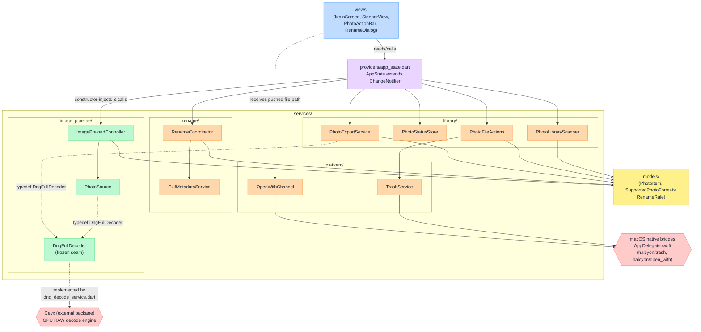
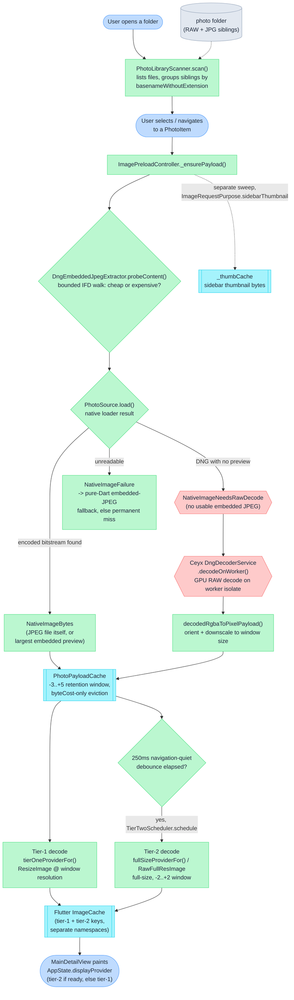
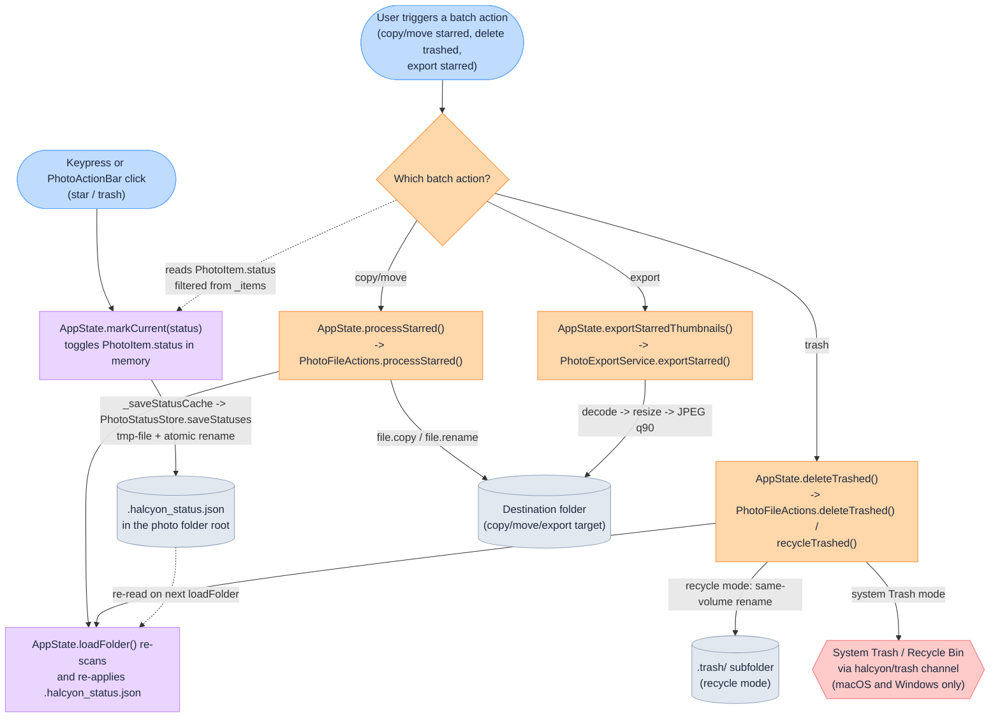

## Architecture diagrams

Three diagrams cover the system: how the modules depend on each other, how a
photo's bytes travel from disk to the screen, and how a keypress turns into a
mark that later drives a batch action on the filesystem. Together they should
let a new reader place any file in `lib/` within thirty seconds.

### Legend

**Shapes** (consistent across all three diagrams):

| Shape | Meaning |
|---|---|
| Stadium `([ ])` | Entry point / user action |
| Rectangle `[ ]` | Module, service, or class |
| Subroutine `[[ ]]` | In-memory cache |
| Cylinder `[( )]` | Persistent storage (file on disk) |
| Rhombus `{ }` | Decision / routing point |
| Hexagon `{{ }}` | Native / FFI boundary crossing |

**Colour** (one hue per architectural layer, Tailwind 200-shade fill / 400-shade
stroke, text forced to `#1e293b`, Tailwind slate-800):

| Layer | Fill (200) | Stroke (400) |
|---|---|---|
| Views / entry points | `#bfdbfe` (blue-200) | `#60a5fa` (blue-400) |
| Providers (`AppState`) | `#e9d5ff` (purple-200) | `#c084fc` (purple-400) |
| Services — image pipeline | `#bbf7d0` (green-200) | `#4ade80` (green-400) |
| Services — library/platform/rename | `#fed7aa` (orange-200) | `#fb923c` (orange-400) |
| Models | `#fef08a` (yellow-200) | `#facc15` (yellow-400) |
| Native / FFI boundary (Ceyx, AppDelegate) | `#fecaca` (red-200) | `#f87171` (red-400) |
| Caches | `#a5f3fc` (cyan-200) | `#22d3ee` (cyan-400) |
| Persistent storage | `#e2e8f0` (slate-200) | `#94a3b8` (slate-400) |

**Edges**: a solid arrow is a direct call or import dependency; a dashed arrow
is a data/file dependency (something read from or written to disk) rather than
a function call.

---

### 1. Module dependency and layering

**Caption:** dependencies flow one way, top to bottom — `views` calls into
`AppState`, which composes every `services/` collaborator by constructor
injection, which in turn depends only on `models/`. Nothing in `services/` or
`models/` imports `views/` or `providers/`. The only two native crossings are
the `DngFullDecoder` seam into the external Ceyx package (RAW decode) and the
two `MethodChannel`s registered in `AppDelegate.swift` (system Trash and
"Open With" file delivery).

**Evidence:**
- `AppState` composes its collaborators via constructor injection —
  `lib/providers/app_state.dart:61-104`.
- `ImagePreloadController` depends on `PhotoSource`, which is the one
  type-aware layer — `lib/services/image_pipeline/photo_source.dart:82-93`.
- `DngFullDecoder`/`DngSizedDecoder` are the frozen integration seam between
  the pipeline and the native decoder —
  `lib/services/image_pipeline/dng_decode_contract.dart:30,39`.
- The Ceyx adapter implementing that seam imports `package:ceyx/ceyx.dart` —
  `lib/services/image_pipeline/dng_decode_service.dart:1,12-14`.
- `PhotoExportService` also takes an optional `DngFullDecoder` for its own
  RAW export path — `lib/services/library/photo_export_service.dart:38-39`.
- `PhotoFileActions` defaults to `TrashService.trashFile` —
  `lib/services/library/photo_file_actions.dart:40`.
- `AppDelegate.swift` registers exactly two channels, `halcyon/trash` and
  `halcyon/open_with` — `macos/Runner/AppDelegate.swift:23,42`.
- `RenameCoordinator` is constructed by `AppState` with `readMetadata:
  readMetadataFor` wired to `ExifMetadataService.readBatch` —
  `lib/providers/app_state.dart:71-102`.

---

### 2. Image pipeline data flow — file on disk to pixels on screen

This is the centrepiece: the complete path a photo's bytes take from a folder
scan to a painted frame, including the two-tier decode strategy and the
routing decision between an embedded preview and a full RAW decode.

**Caption:** the scan groups sibling RAW/JPG files into one `PhotoItem`;
selecting an item runs a bounded content probe before any decode to classify
the file as cheap or expensive; cheap files (JPEGs, DNGs with a large enough
embedded preview) skip the native decoder entirely, while a DNG with no usable
preview crosses into Ceyx's GPU decoder on a worker isolate. Every decoded
result — encoded bytes or downscaled pixels — lands in one byte-budgeted
retention cache; the display path always paints from there, first at
window (tier-1) resolution immediately, then upgraded to full size (tier-2)
once navigation has been quiet for 250ms.

**Evidence:**
- Sibling grouping by `basenameWithoutExtension` —
  `lib/services/library/photo_library_scanner.dart:14-19`, id definition at
  `lib/models/supported_photo_formats.dart:44`.
- The probe-first content classification and its cost/orientation dual output
  — `lib/services/image_pipeline/photo_source.dart:274-317`.
- The three-way `NativeImageResult` routing (bytes / needs-raw-decode /
  failure) — `lib/services/image_pipeline/image_source_types.dart:48-87`, and
  the switch that acts on it — `lib/services/image_pipeline/photo_source.dart:116-201`.
- The Ceyx crossing — `lib/services/image_pipeline/dng_decode_service.dart:12-14`.
- Tier-1/tier-2 provider factories and the identity/key-match requirement —
  `lib/services/image_pipeline/image_preload_controller.dart:28-49`.
- The 250ms navigation debounce constant —
  `lib/services/image_pipeline/image_preload_controller.dart:49`.
- The -3..+5 retention window and byteCost-only eviction —
  `lib/services/image_pipeline/photo_payload_cache.dart:6-10` (window) and
  class doc at `lib/services/image_pipeline/photo_payload_cache.dart:36-49`.
- Sidebar thumbnails use a separate cache/miss set from the detail path —
  `lib/services/image_pipeline/image_preload_controller.dart:91,173`.
- `displayProvider` picks tier-2 when ready, else tier-1 —
  `lib/providers/app_state.dart:214-215`.

---

### 3. Triage action flow — keypress to mark to batch action

**Caption:** a mark is pure in-memory state on `PhotoItem` until
`_saveStatusCache` persists it to `.halcyon_status.json` via an atomic
tmp-file-plus-rename write. Every batch action reads status directly off the
live `_items` list, not the file, and re-triggers a folder reload afterward,
which is what re-reads the JSON back in. Copy/move and export write into a
user-chosen destination; trash either moves files into a `.trash/` sibling
folder (recycle mode, same-volume rename) or hands them to the operating
system's own Trash through the native `halcyon/trash` channel, which is
registered on macOS and Windows only.

**Evidence:**
- `markCurrent` toggles status and calls `_saveStatusCache` —
  `lib/providers/app_state.dart:367-392`.
- Atomic tmp-file + rename write — `lib/services/library/photo_status_store.dart:68-76,132-148`.
- `processStarred` filters `item.status != PhotoStatus.starred` and copies or
  renames each file — `lib/services/library/photo_file_actions.dart:50-87`.
- `deleteTrashed` branches on `recycleMode` between `TrashService.trashFile`
  and `recycleTrashed`'s same-volume rename into `.trash/` —
  `lib/providers/app_state.dart:498-538`,
  `lib/services/library/photo_file_actions.dart:89-155`.
- `TrashService.trashFile` is the default for `PhotoFileActions` and is the
  system-Trash bridge, registered on macOS and Windows —
  `lib/services/library/photo_file_actions.dart:40`,
  channel registration at `macos/Runner/AppDelegate.swift:23`.
- `exportStarred`'s decode/resize/encode path —
  `lib/services/library/photo_export_service.dart:53-142`.
- Batch actions reload the folder afterward, which re-applies saved statuses
  — `lib/providers/app_state.dart:467-474,524-530`, re-application at
  `lib/services/library/photo_status_store.dart:93-130`.
