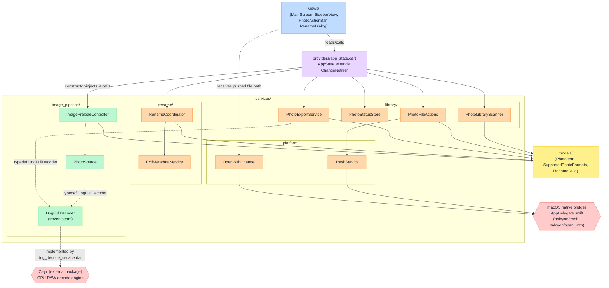
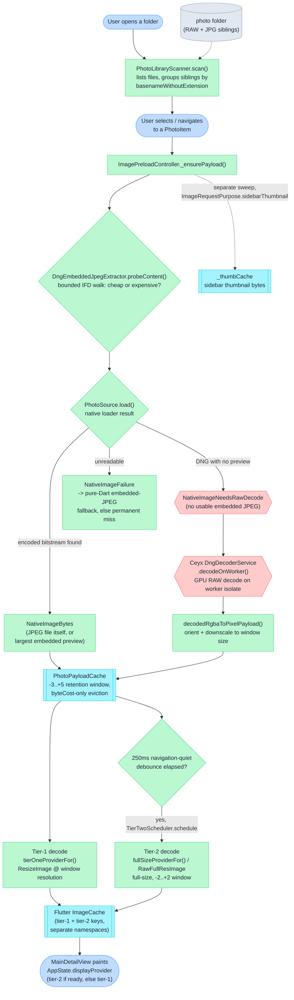
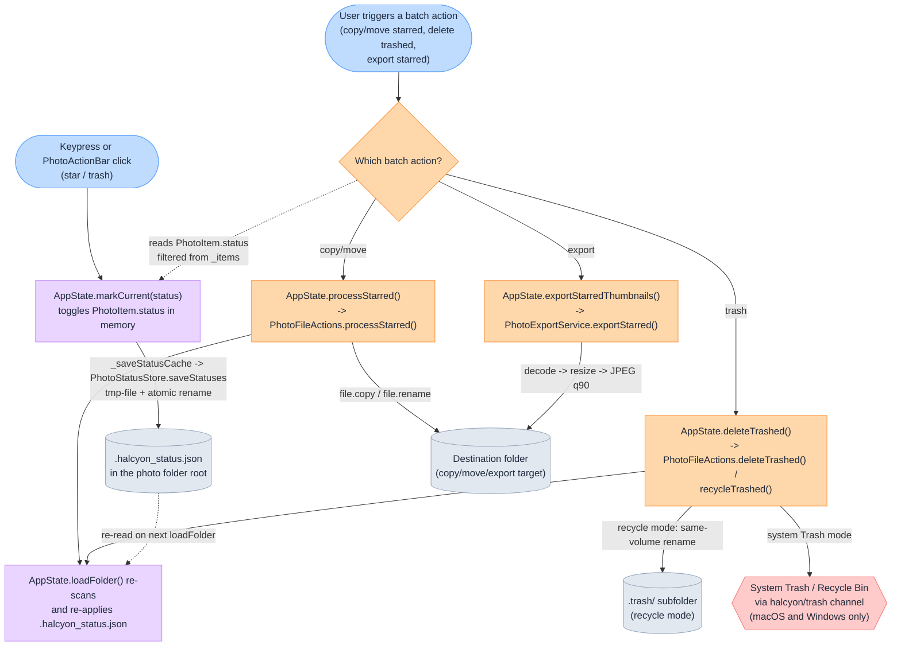

## 架構圖

三張圖涵蓋整個系統：模組之間如何相依、一張照片的位元組如何從磁碟走到螢幕、以及一次按鍵如何變成標記並進而驅動檔案系統上的批次操作。三張圖合起來，應該能讓一位新讀者在三十秒內定位 `lib/` 底下的任何檔案。

### 圖例

**形狀**（三張圖一致）：

| 形狀 | 意義 |
|---|---|
| 圓角矩形 `([ ])` | 進入點／使用者動作 |
| 矩形 `[ ]` | 模組、服務或類別 |
| 子程序框 `[[ ]]` | 記憶體內快取 |
| 圓柱 `[( )]` | 持久化儲存（磁碟上的檔案） |
| 菱形 `{ }` | 決策／路由節點 |
| 六邊形 `{{ }}` | 原生／FFI 邊界跨越 |

**顏色**（每個架構層對應一個色相，Tailwind 200 色階填色／400 色階邊框，文字強制設為 `#1e293b`，即 Tailwind slate-800）：

| 層級 | 填色 (200) | 邊框 (400) |
|---|---|---|
| Views／進入點 | `#bfdbfe`（blue-200） | `#60a5fa`（blue-400） |
| Providers（`AppState`） | `#e9d5ff`（purple-200） | `#c084fc`（purple-400） |
| Services — image pipeline | `#bbf7d0`（green-200） | `#4ade80`（green-400） |
| Services — library/platform/rename | `#fed7aa`（orange-200） | `#fb923c`（orange-400） |
| Models | `#fef08a`（yellow-200） | `#facc15`（yellow-400） |
| 原生／FFI 邊界（Ceyx、AppDelegate） | `#fecaca`（red-200） | `#f87171`（red-400） |
| 快取 | `#a5f3fc`（cyan-200） | `#22d3ee`（cyan-400） |
| 持久化儲存 | `#e2e8f0`（slate-200） | `#94a3b8`（slate-400） |

**邊線**：實線箭頭代表直接呼叫或匯入相依；虛線箭頭代表資料／檔案相依（從磁碟讀取或寫入某物），而非函式呼叫。

---

### 1. 模組相依與分層

**圖說：** 相依關係單向流動，由上而下——`views` 呼叫 `AppState`，`AppState` 透過建構子注入組合每個 `services/` 協作物件，這些協作物件則只相依於 `models/`。`services/` 或 `models/` 底下沒有任何東西會匯入 `views/` 或 `providers/`。唯二的原生邊界跨越，是通往外部 Ceyx 套件（RAW 解碼）的 `DngFullDecoder` 接縫，以及註冊在 `AppDelegate.swift` 裡的兩個 `MethodChannel`（系統垃圾桶與「以此開啟」檔案傳遞）。

**證據：**
- `AppState` 透過建構子注入組合它的協作物件 —
  `lib/providers/app_state.dart:61-104`。
- `ImagePreloadController` 相依於 `PhotoSource`，這是唯一具備型別知識的層 —
  `lib/services/image_pipeline/photo_source.dart:82-93`。
- `DngFullDecoder`／`DngSizedDecoder` 是管線與原生解碼器之間凍結的整合接縫 —
  `lib/services/image_pipeline/dng_decode_contract.dart:30,39`。
- 實作這個接縫的 Ceyx 轉接器匯入 `package:ceyx/ceyx.dart` —
  `lib/services/image_pipeline/dng_decode_service.dart:1,12-14`。
- `PhotoExportService` 也接受一個可選的 `DngFullDecoder`，用於自己的 RAW 匯出路徑 —
  `lib/services/library/photo_export_service.dart:38-39`。
- `PhotoFileActions` 預設使用 `TrashService.trashFile` —
  `lib/services/library/photo_file_actions.dart:40`。
- `AppDelegate.swift` 恰好註冊兩個 channel，`halcyon/trash` 與
  `halcyon/open_with` — `macos/Runner/AppDelegate.swift:23,42`。
- `RenameCoordinator` 由 `AppState` 建構，`readMetadata:
  readMetadataFor` 接到 `ExifMetadataService.readBatch` —
  `lib/providers/app_state.dart:71-102`。

---

### 2. 影像管線資料流——從磁碟上的檔案到螢幕上的像素

這是核心圖：一張照片的位元組從資料夾掃描到畫面繪製的完整路徑，涵蓋兩階解碼策略，以及在內嵌預覽圖與完整 RAW 解碼之間的路由決策。

**圖說：** 掃描階段把 RAW／JPG 的同名檔案分組成一個 `PhotoItem`；選取某個項目時，會先跑一次有邊界的內容探測，才決定要不要解碼，把檔案分類為「便宜」或「昂貴」。便宜的檔案（JPEG、內嵌預覽圖已經夠大的 DNG）完全跳過原生解碼器；沒有可用預覽圖的 DNG，則會跨越邊界進入 Ceyx 在 worker isolate 上執行的 GPU 解碼器。每個解碼結果——不論是編碼位元組還是縮小過的像素——都會落入同一個有位元組預算上限的保留快取；顯示路徑一律從那裡繪製，先立即顯示視窗解析度（第一階），等導覽靜止 250 毫秒後，再升級到完整解析度（第二階）。

**證據：**
- 依 `basenameWithoutExtension` 分組同名檔案 —
  `lib/services/library/photo_library_scanner.dart:14-19`，id 定義於
  `lib/models/supported_photo_formats.dart:44`。
- 先探測再分類的內容判斷邏輯，以及它同時輸出成本與方向的設計
  — `lib/services/image_pipeline/photo_source.dart:274-317`。
- 三分支的 `NativeImageResult` 路由（位元組／需要 RAW 解碼／
  失敗）— `lib/services/image_pipeline/image_source_types.dart:48-87`，以及
  據此執行動作的 switch — `lib/services/image_pipeline/photo_source.dart:116-201`。
- 跨越到 Ceyx 的邊界 — `lib/services/image_pipeline/dng_decode_service.dart:12-14`。
- 第一階／第二階的 provider 工廠函式，以及物件身分／快取鍵必須一致的要求 —
  `lib/services/image_pipeline/image_preload_controller.dart:28-49`。
- 250 毫秒導覽防抖動常數 —
  `lib/services/image_pipeline/image_preload_controller.dart:49`。
- -3..+5 保留視窗與僅以 byteCost 決定的淘汰策略 —
  `lib/services/image_pipeline/photo_payload_cache.dart:6-10`（視窗大小）與
  `lib/services/image_pipeline/photo_payload_cache.dart:36-49` 的類別說明文件。
- 側欄縮圖使用與詳細檢視路徑各自獨立的快取／未命中集合 —
  `lib/services/image_pipeline/image_preload_controller.dart:91,173`。
- `displayProvider` 在第二階就緒時選用第二階，否則使用第一階 —
  `lib/providers/app_state.dart:214-215`。

---

### 3. 分類動作流程——按鍵到標記到批次動作

**圖說：** 一次標記在 `PhotoItem` 上只是純粹的記憶體內狀態，直到 `_saveStatusCache` 透過暫存檔＋原子重新命名的寫入方式，把它持久化到 `.halcyon_status.json`。每個批次動作都是直接讀取 `_items` 這個活動清單上的狀態，而非讀檔案，並且事後會重新觸發一次資料夾重新載入，而這正是把 JSON 重新讀回來的動作。複製／搬移與匯出會寫入使用者選定的目的地；垃圾桶動作則要嘛把檔案搬進同一層的 `.trash/` 子資料夾（回收模式，同磁碟區重新命名），要嘛透過原生的 `halcyon/trash` channel 交給作業系統自己的垃圾桶，而這個 channel 只在 macOS 與 Windows 上有註冊。

**證據：**
- `markCurrent` 切換狀態並呼叫 `_saveStatusCache` —
  `lib/providers/app_state.dart:367-392`。
- 原子式暫存檔＋重新命名寫入 — `lib/services/library/photo_status_store.dart:68-76,132-148`。
- `processStarred` 篩選 `item.status != PhotoStatus.starred`，並複製或
  重新命名每個檔案 — `lib/services/library/photo_file_actions.dart:50-87`。
- `deleteTrashed` 依 `recycleMode` 在 `TrashService.trashFile`
  與 `recycleTrashed` 的同磁碟區重新命名（搬進 `.trash/`）之間擇一 —
  `lib/providers/app_state.dart:498-538`，
  `lib/services/library/photo_file_actions.dart:89-155`。
- `TrashService.trashFile` 是 `PhotoFileActions` 的預設實作，也是
  系統垃圾桶橋接，於 macOS 與 Windows 註冊 —
  `lib/services/library/photo_file_actions.dart:40`，
  channel 註冊於 `macos/Runner/AppDelegate.swift:23`。
- `exportStarred` 的解碼／縮放／編碼路徑 —
  `lib/services/library/photo_export_service.dart:53-142`。
- 批次動作事後會重新載入資料夾，進而重新套用已儲存的狀態
  — `lib/providers/app_state.dart:467-474,524-530`，重新套用邏輯位於
  `lib/services/library/photo_status_store.dart:93-130`。
