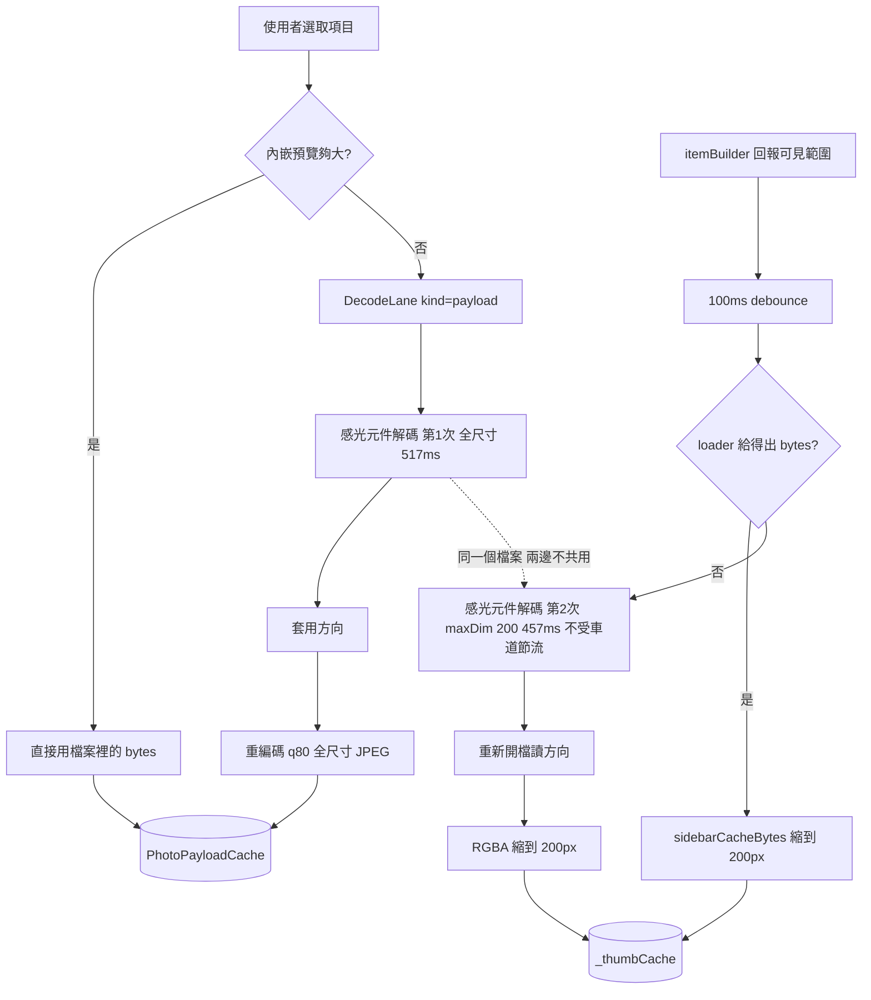
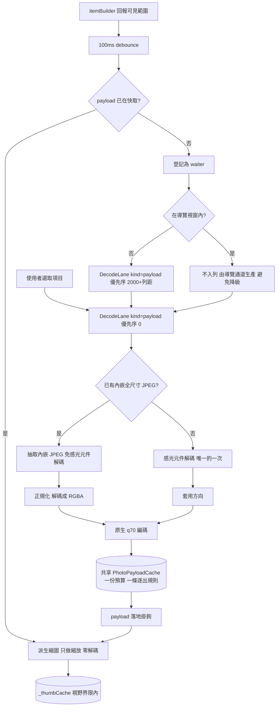

# Shared q70 Payload Cache Implementation Plan

> **For agentic workers:** REQUIRED SUB-SKILL: Use podium:team-spawn (recommended) or podium:team-fable to implement this plan task-by-task. Steps use checkbox (`- [ ]`) syntax for tracking.

**Goal:** Every photo — RAW or JPG — retains exactly ONE payload (a q70 full-resolution JPEG produced from a full-size decode), and the sidebar thumbnail is derived from that same payload instead of running a second decode of its own.

**Architecture:** `PhotoSource` becomes a *normaliser*: whatever the file yields (sensor decode, embedded JPEG, or the JPG's own bytes) is reduced to full-resolution RGBA once and re-encoded to a q70 JPEG, which is the only thing `PhotoPayloadCache` ever holds. The sidebar stops being a second producer of pixels: it derives its 200 px tile from the shared payload by a cheap resample, and when no payload exists yet it *asks the payload pipeline to produce one* (registering a waiter and, for rows outside the navigation window, enqueueing payload production on the existing `DecodeLane` at a low priority). Retention becomes the union of the navigation window and the sidebar's viewport set under one byte budget and one distance-ordered eviction rule.

**Tech Stack:** Dart 3.9 / Flutter 3.35.1; `dart:ui` codecs (`instantiateImageCodec`, `instantiateImageCodecWithSize`); the `ceyx` native package for RAW decode (`DngFullDecoder`) and libjpeg-turbo encode (`CeyxEncodeService.encodeJpegNative`); existing units `PhotoSource`, `PhotoPayloadCache`, `DecodeLane`, `TierTwoRegistry`, `TierTwoScheduler`, `ImagePreloadController`.

## Global Constraints

- `NativeImageResult` stays at EXACTLY 3 variants (`NativeImageBytes` / `NativeImageNeedsRawDecode` / `NativeImageFailure`). No 4th variant, no new field. (memory.md AD-010/AD-011.)
- `DngFullDecoder`, `DngSizedDecoder`, `DecodedRgba`, `PixelPayload`, `EncodedPayload` signatures are unchanged. No new payload subclass.
- `photo_payload_cache.dart` stays type-blind: `grep -c "EncodedPayload\|PixelPayload" lib/services/image_pipeline/photo_payload_cache.dart` must remain `0` (user decision D4). Any file MAY name the subclasses; that one file may not.
- One retention rule, one byte budget, one eviction rule for every file type (user decision D4). No per-kind budget, no second eviction policy.
- Budget constants are NOT changed by this plan: `kPayloadByteBudget` (224 MiB) and the 304 / 384 MiB rungs in `retention_policy.dart` stay exactly as they are. `imageCacheBudgetBytes` and its 768/800/896 MiB ceilings stay exactly as they are.
- Parallelism policy constants are NOT changed: `kCoresPerDecode`, `kMaxDecodeLaneWidth`, `kDefaultDecodeLaneWidth`, `laneCeilingFor`, the rung thresholds. (Contract out-of-scope fence, `docs/logs/2026-08-30/pipeline-followup-contract.md`.)
- The sidebar trigger stays `itemBuilder`-driven with the existing 100 ms debounce (AD-014 / G-001). This plan does not touch `SidebarView`'s reporting.
- `AppDelegate.swift` and every other native file are untouched. This is a pure-Dart change above the decoder seam, so macOS / Windows / Linux behave identically.
- No `Platform.isX` branch may be introduced anywhere (constraint C-3).
- Every task ends with `flutter analyze` at 0 issues and `flutter test` green, with the exit code self-captured in the artifact as `RC=$?` on the line immediately after the command (never `${PIPESTATUS[0]}`, never the harness's reported code — lessons-learned 2026-08-23).
- Commits use Conventional Commits and an EXPLICIT pathspec (`git commit -- <paths>`); the tree is shared with other sessions (lessons-learned 2026-08-24).

---

## 0. Measured facts this plan is built on

| # | Fact | Evidence |
|---|---|---|
| F1 | A no-preview Sony ARW costs a full libraw sensor decode (median 517 ms) plus a native q80 encode (median 78 ms). The retained payload is that q80 full-resolution JPEG — median 2.38 MiB, max 6.49 MiB over 125 files. | `docs/logs/2026-08-30/payload-bench-report.md` §2 |
| F2 | A 200 px sized decode is NOT cheaper than a full decode: median 457 ms vs 505.5 ms, median per-file ratio **0.916** against a pre-registered "faster" threshold of 0.70. The demosaic dominates; `maxDim` only caps the output resize. | payload-bench-report.md §4 (`R2: NOT FASTER`) |
| F3 | Whole-folder resident cost at q80: top-60 = **240.3 MiB**, all 125 items = **348.8 MiB** — both inside the 384 MiB high rung; top-60 also fits the 304 MiB mid rung; neither fits the 224 MiB floor. | payload-bench-report.md §1 |
| F4 | If the camera's embedded full-res JPEG were retained AS-IS, top-60 = **402.1 MiB**, which EXCEEDS the 384 MiB high rung by 4.7%. | payload-bench-report.md §1 row 2 |
| F5 | Today the sidebar runs a second, independent sensor decode for expensive items, and it does NOT go through `DecodeLane` — so peak concurrent sensor decodes is `laneWidth + 1`, and the extra one is not priority-ordered. | `image_preload_controller.dart:1256-1306`; `decode_lane.dart:60-79` |
| F6 | The two producers share no cache: payloads live in `PhotoPayloadCache`, thumbnails in a separate plain `Map _thumbCache`. Nothing reads across. | `image_preload_controller.dart:114,151` |
| F7 | The sidebar's second orientation lookup re-opens the file (`bitmapContainerOrientation`), duplicating work the payload's decode already did. | `image_preload_controller.dart:1280-1281` vs `photo_source.dart:192-196` |

**Consequence:** the 200 px decode path buys nothing (F2) while costing a whole extra decode (F5) and an extra file open (F7). Deleting it and deriving the tile from the shared payload is strictly less work per file, and F3 says the resulting payload cache fits the budget even when the sidebar fills it for a whole folder.

---

## 1. Decisions taken (user, 2026-08-30, contract D5)

Quoting the frozen decisions from `docs/logs/2026-08-30/pipeline-followup-contract.md` §第二輪追加 D5 and the task brief:

1. **"所有項目全尺寸解碼→q70 重編碼→共享 payload 快取"** — ALL items, RAW and JPG alike, are reduced to a full-size decode and a q70 re-encode, and the result is the one shared payload. There is no longer a payload kind that skips the re-encode.
2. **"側欄縮圖一律由共享 payload 派生"** — sidebar thumbnails are ALWAYS derived from the shared payload by downscale.
3. **"刪除 200px 專用解碼路（R2 實證無收益）"** — the independent 200 px sidebar decode path is DELETED. Evidence: measured ratio 0.916, i.e. NOT-FASTER (F2).
4. **"捲動亦填充 payload（實測 240-349 MiB @q80 在 384 MiB 內）"** — sidebar scrolling also fills the payload cache; the measured whole-folder cost fits the 384 MiB high rung (F3).
5. **q70 replaces q80** as `kReencodeJpegQuality`.
6. **Staged shipping preferred** — the tasks below are ordered so Tasks 1–5 are pure additions with no behaviour flip, and each of Tasks 6–8 is independently revertable.

Everything else in this document is derived from those six rulings plus the measured facts; where a derivation had a real choice, the choice and its reason are stated in the task's **Behavior** block.

### 1.1 The ONE open recommendation: embedded-JPEG budget tension

**The tension.** Task #6 fixed `DngEmbeddedJpegExtractor` so Sony ARW's IFD2 `JpgFromRaw` (3.86 MB full-res) is now extractable — it followed the `nextIFD` chain, accepted `JPEGInterchangeFormat`/`Length` (0x0201/0x0202) alongside strip offsets, and loosened the `Compression == 7` filter (`docs/sop/unit_test.md:1446`, TC-404…TC-411). That fix is LANDED and this plan is written against the post-fix world. Once it lands, those ARW files stop being `SourceCost.expensive` — `probeSource` sees an embedded candidate whose long edge ≥ the viewport long edge and classifies them `cheap`, so the ~517 ms sensor decode disappears. That is a large win. But if the extracted embedded JPEG is retained AS-IS, the measured resident cost is **402.1 MiB for the top-60 items, against a 384 MiB high-rung budget** (F4) — a 4.7% overshoot on the largest machine rung, and far worse on the 304 / 224 MiB rungs.

**Options.**

| Option | Resident top-60 | Per-item CPU on the cheap path | Consequence |
|---|---|---|---|
| **A. Normalise the embedded JPEG to q70 like everything else** (recommended) | ≈240 MiB or below (F3's q80 figure is an upper bound; q70 is smaller) | one engine JPEG decode + one native q70 encode (no sensor decode) — order 100–200 ms, versus the 595 ms it replaces | Uniform: one payload kind, one budget arithmetic, one place quality is decided. Generational loss q(camera)→q70, invisible for display-only bytes (export re-reads the original file, `photo_export_service.dart`). |
| B. Retain the embedded JPEG as-is | 402.1 MiB (over budget) | zero | Fastest per item, but the budget is exceeded on every rung, so the byte-LRU evicts inside the retention window — the exact failure `kPayloadByteBudget` exists to prevent. Would require raising the budget. |
| C. Retain as-is and raise the high rung to ~448 MiB | 402.1 MiB (under a new budget) | zero | Requires re-deriving `kPayloadByteBudget`'s rungs, which this plan's Global Constraints forbid and which the user reserved to themselves. Also leaves mid/floor rungs broken. |
| D. Retain as-is and accept eviction | 402.1 MiB | zero | "Eviction-led acceptance" — the cache simply thrashes at the far end of the window. Contradicts decision 4 (scrolling fills the cache), because a whole-folder fill would evict continuously. |

**Recommendation: Option A.** It is also what frozen decision 1 already says literally ("ALL items → full-size decode → q70 re-encode"): an embedded JPEG that skipped the re-encode would be the one payload kind exempt from the rule, and it is precisely the kind that breaks the budget. Option A is implemented by Task 3 (`payload_normalizer.dart` wired into `PhotoSource`'s cheap arms) and needs no separate decision at implementation time — **but the user may override it to Option B at any point before Task 3 lands by setting `kNormalizePassthroughMaxBytes` to a value above the largest embedded JPEG, which turns normalisation into a no-op for those files without deleting any code.**

**Honest limit:** the ≈240 MiB figure for Option A is the MEASURED q80 number for payloads produced from the *sensor* decode. A q70 payload produced from the *embedded* JPEG has not been measured; it is expected to be smaller (lower quality, and the embedded JPEG is 7008×4672 rather than 7028×4688), but that is an inference, not a measurement. Task 9 requires a re-measurement artifact before the budget claim is repeated anywhere.

---

## 2. File structure

| File | Status | Responsibility |
|---|---|---|
| `lib/services/image_pipeline/payload_reencoder.dart` | modify | Holds `kReencodeJpegQuality`; the RGBA→JPEG re-encode with fallback. Quality becomes 70. |
| `lib/services/image_pipeline/payload_normalizer.dart` | **create** | Turns an ENCODED bitstream (JPG file bytes, embedded preview) into the same q70 full-resolution JPEG payload the RAW path produces. Owns the concurrency gate that bounds transient full-res RGBA. |
| `lib/services/image_pipeline/thumbnail_derivation.dart` | **create** | Turns an already-produced payload into a 200 px sidebar payload. Runs no sensor decode. |
| `lib/services/image_pipeline/photo_source.dart` | modify | Routes its two encoded-bitstream arms through the normaliser, so every payload it emits is uniform. |
| `lib/services/image_pipeline/image_preload_controller.dart` | modify | Union retention (navigation window ∪ sidebar viewport set), payload-landed hook, sidebar sweep rewritten as a payload consumer + lane producer, sized-decode path deleted. |
| `lib/providers/app_state.dart` | modify | Stops passing `sidebarRawDecoder` (the parameter is deleted). |
| `docs/sop/memory.md` | modify | AD-042 + G-027. |
| `docs/sop/unit_test.md` | modify | TC-412…TC-437 registration. |

**TC numbering — reconciled against the live registry, 2026-08-30.** `docs/sop/unit_test.md` currently registers up to **TC-411**: TC-385 (tier-2 display path), TC-386…TC-392 (DeviceMemory cross-platform read), and **TC-404…TC-411** (the parallel task #6 extractor fix, `docs/sop/unit_test.md:1446`, which landed while this plan was being written and consumed a larger range than first assumed). This plan therefore claims **TC-412…TC-437** (26 ids), one above the true maximum.

This is still a claim, not a lock: registry-type resources are taken at merge time, not at planning time. Before Task 9 commits, the implementer MUST re-read `docs/sop/unit_test.md`; if another session has taken any of TC-412…TC-437 in the meantime, shift this plan's whole block so it starts one above the new maximum, apply the shift to every TC id in the plan and in the test names, and report the shift amount to the team lead at sign-off. (Two parallel sessions have already collided on this registry — lessons-learned 2026-08-28.)

---

## Stage 1 — Task skeletons

### Task 1: q70 quality constant

**Files:**
- Modify: `lib/services/image_pipeline/payload_reencoder.dart:18-26`
- Test: `test/services/image_pipeline/payload_reencoder_test.dart`

**Interfaces:**
- Consumes: nothing.
- Produces: `const int kReencodeJpegQuality = 70;` — read by `reencodePayload`'s default `quality` parameter and (Task 2) by `normalizeEncodedPayload`'s default `quality` parameter.

**Behavior:**
The single number that decides what every retained payload's quality is. It moves from 80 to 70 by user ruling. Nothing else changes: `reencodePayload`'s signature, fallback behaviour and counters are untouched, and `sidebar_thumbnail_codec.dart`'s own `jpegQuality: 80` default is a DIFFERENT number for a different artifact (a 200 px tile) and is deliberately NOT changed here — the two were only ever coincidentally equal.

**Constraints:**
- Exactly one integer literal changes in `lib/`.
- The doc comment above the constant must record the ruling date and that it supersedes q80, in the same style as the existing q90→q80 note.

**Acceptance criteria:**
- [ ] `grep -n "kReencodeJpegQuality = 70" lib/services/image_pipeline/payload_reencoder.dart` prints exactly one line.
- [ ] `grep -c "jpegQuality = 80" lib/services/image_pipeline/sidebar_thumbnail_codec.dart` prints `0` and `grep -c "int jpegQuality = 80" lib/services/image_pipeline/sidebar_thumbnail_codec.dart` prints `1` (the sidebar codec default is untouched).
- [ ] Test `TC-412 reencodePayload defaults to quality 70` exists in `test/services/image_pipeline/payload_reencoder_test.dart` and passes.
- [ ] `flutter test test/services/image_pipeline/payload_reencoder_test.dart` exits 0.

---

### Task 2: Payload normaliser

**Files:**
- Create: `lib/services/image_pipeline/payload_normalizer.dart`
- Test: `test/services/image_pipeline/payload_normalizer_test.dart`

**Interfaces:**
- Consumes: `PayloadEncoder` and `kReencodeJpegQuality` from `payload_reencoder.dart`; `SourcePayload`/`EncodedPayload` from `photo_payload.dart`; `kDecodedPixelBudgetBytes` from `dng_decode_contract.dart`.
- Produces:
  - `typedef EncodedRgbaDecoder = Future<({Uint8List rgba, int width, int height})?> Function(Uint8List encoded);`
  - `Future<({Uint8List rgba, int width, int height})?> decodeEncodedToRgba(Uint8List encoded)` — the production `EncodedRgbaDecoder`, engine-backed, returns null on any failure.
  - `Future<SourcePayload> normalizeEncodedPayload({required Uint8List encoded, required PayloadEncoder encoder, int quality = kReencodeJpegQuality, EncodedRgbaDecoder? decodeToRgba})` — a NULLABLE parameter, not a defaulted one, resolved at call time as `decodeToRgba ?? debugEncodedRgbaDecoderOverride ?? decodeEncodedToRgba`. Task 3 needs a test seam that `PhotoSource` does not thread through its own constructor, and a default argument cannot be overridden from outside.
  - `@visibleForTesting EncodedRgbaDecoder? debugEncodedRgbaDecoderOverride;`
  - `const int kNormalizePassthroughMaxBytes = 512 * 1024;`
  - `class NormalizeGate { NormalizeGate({int width = 2}); int get width; set width(int value); Future<T> run<T>(Future<T> Function() body); int get runningCount; }`
  - `final NormalizeGate normalizeGate = NormalizeGate();` — the process-wide gate `normalizeEncodedPayload` acquires.
  - `int normalizeFallbacks;` and `void resetNormalizeCounters();`, both `@visibleForTesting`.

**Behavior:**
This is the unit that makes decision 1 ("ALL items") true. An encoded bitstream that arrives from the loader — a JPG file's own bytes, or an embedded JPEG the extractor pulled out of a RAW — is decoded at FULL size to RGBA and re-encoded to a q70 JPEG, so it becomes byte-for-byte the same kind of payload the RAW sensor path produces.

Five refusals, each returning `EncodedPayload(encoded)` unchanged (never null, never a permanent miss — a normalisation that fails must leave the item exactly as displayable as it was):
1. `encoded.length <= kNormalizePassthroughMaxBytes` — a bitstream this small is already far under any per-item budget share; a full decode + encode to save a fraction of 512 KB is pure cost. This is also the override lever named in §1.1 Option B. Does NOT increment the counter (it is a designed skip, not a degradation).
2. `decodeToRgba` returned null (undecodable, or the engine threw).
3. `rgba.lengthInBytes != width * height * 4` — the same guard `reencodePayload` applies, for the same reason: the native encoder trusts `width*height` to bound its scanline reads and cannot validate the buffer itself.
4. `rgba.lengthInBytes > kDecodedPixelBudgetBytes` — refuse to hold an absurd frame; the file keeps its original bytes.
5. The encoder threw, returned empty, or returned MORE bytes than the input. Normalisation must never make a payload bigger; a camera JPEG already smaller than our q70 output is one we should keep.

Refusals 2–5 each increment `normalizeFallbacks`. Observability, not policy: a normaliser that silently failed on every item would look exactly like the pre-change behaviour.

**The gate.** The decode step transiently holds a full-resolution RGBA buffer (7008×4672×4 = 131 MB for the measured ARW). Cheap items load in PARALLEL across the whole retention window, so without a limiter a 9-slot window would hold nine such buffers at once. `normalizeGate` bounds how many normalisations may be inside their decode+encode at one time; the controller sets its width to the decode-lane width so one number governs both kinds of heavy work.

*Rejected alternative (recorded so it is not re-litigated):* routing every item through `DecodeLane` instead of a gate. That would bound memory equally well, but `preloadImages` awaits the selected item's `_ensurePayload` and returns once the window's loads are *issued* — moving cheap items onto the lane makes that await stop meaning "the payload is there", which is the semantics a large number of existing tests assert. A local gate preserves the await chain; the lane does not.

**Constraints:**
- No `Platform` check, no `dart:io`, no FFI. `dart:ui` codecs only.
- `decodeEncodedToRgba` must dispose the `ui.Image` it decodes on EVERY path, including the failure path.
- The gate must never let a body's exception leak a permit (release in `finally`).
- Widening the gate takes effect for the next acquirer; narrowing never pre-empts a body already running (same rule `DecodeLane.width` follows — nothing here is cancellable).

**Acceptance criteria:**
- [ ] `TC-413` (small input passes through untouched, counter stays 0), `TC-414` (large input is re-encoded: returned bytes are the encoder's output and the encoder was called with the decoded width/height and quality 70), `TC-415` (undecodable input returns the original bytes and increments `normalizeFallbacks`), `TC-416` (encoder throws ⇒ original bytes, counter incremented), `TC-417` (encoder output larger than input ⇒ original bytes kept), `TC-418` (`rgba` length disagreeing with `width*height*4` ⇒ original bytes, encoder never called), `TC-419` (gate width 2, 5 concurrent normalisations ⇒ max observed concurrency == 2) all exist in `test/services/image_pipeline/payload_normalizer_test.dart` and pass.
- [ ] `flutter test test/services/image_pipeline/payload_normalizer_test.dart` exits 0.
- [ ] `grep -c "Platform\." lib/services/image_pipeline/payload_normalizer.dart` prints `0`.

---

### Task 3: Wire the normaliser into `PhotoSource`

**Files:**
- Modify: `lib/services/image_pipeline/photo_source.dart:142-157` (the `NativeImageBytes` arm) and `:262-274` (the `NativeImageFailure` recovery arm)
- Test: `test/services/image_pipeline/photo_source_reencode_test.dart`

**Interfaces:**
- Consumes: `normalizeEncodedPayload` from Task 2.
- Produces: no signature change. `PhotoSource.load` still returns `SourceOutcome`; what changes is that its `payload` on the two encoded arms is now the normalised payload.

**Behavior:**
`PhotoSource` is already "the ONE place in the Dart pipeline that knows about file types", so it is where uniformity is enforced. Both arms that previously wrapped raw file bytes in `EncodedPayload` now hand those bytes to the normaliser first.

`payloadEncoder == null` keeps the pre-change behaviour byte-for-byte (`EncodedPayload(bytes)` with no decode) — that is the seam every decode-only test binds, and it must stay a true no-op path.

`fullRes` stays `null` on these arms. It is documented as "full-resolution pixels from the SAME FFI decode that produced the payload", and the normaliser's engine decode is not an FFI decode; feeding it into the tier-2 piggyback would upload a full-resolution frame for every cheap item in the window and blow `imageCacheBudgetBytes`, which this plan may not re-derive. Cheap items keep reaching tier-2 through `TierTwoScheduler`'s ordinary `-1..+3` upgrade path.

`observedCost` stays `SourceCost.cheap` on these arms: the scheduler's rung means "does producing this need a sensor decode", and it still does not. Normalisation is bounded by its own gate, not by the lane.

**Constraints:**
- `load`'s three-arm `switch` on `NativeImageResult` keeps exactly three arms.
- No new field on `SourceOutcome`.
- The `allowExpensive: false` probe path must NOT normalise: it returns `payload: null` and never reaches these arms — verify by test, because a normalisation there would put an engine decode on the discovery pass.

**Acceptance criteria:**
- [ ] `TC-420` (a JPG's payload is the encoder's q70 output, not the file bytes; encoder called once with the file's full dimensions) passes.
- [ ] `TC-421` (`payloadEncoder: null` ⇒ payload bytes are `identical` to the loader's bytes and no decode ran) passes.
- [ ] `TC-422` (`NativeImageFailure` + successful pure-Dart embedded recovery ⇒ recovered bytes are normalised too) passes.
- [ ] `TC-423` (`allowExpensive: false` on a `NeedsRawDecode` file ⇒ normaliser never invoked) passes.
- [ ] `flutter test test/services/image_pipeline/` exits 0.

---

### Task 4: Thumbnail derivation

**Files:**
- Create: `lib/services/image_pipeline/thumbnail_derivation.dart`
- Test: `test/services/image_pipeline/thumbnail_derivation_test.dart`

**Interfaces:**
- Consumes: `sidebarCacheBytes` from `sidebar_thumbnail_codec.dart`; `decodedRgbaToPixelPayload` from `decoded_rgba_image_provider.dart`; `DecodedRgba` from `dng_decode_contract.dart`; `SourcePayload`/`EncodedPayload`/`PixelPayload` from `photo_payload.dart`.
- Produces:
  - `const int kSidebarThumbnailLongEdge = 200;`
  - `Future<SourcePayload?> deriveThumbnailPayload(SourcePayload payload, {int longEdge = kSidebarThumbnailLongEdge})`

**Behavior:**
Turns an ALREADY-PRODUCED payload into the sidebar's tile. Runs no sensor decode and opens no file — which is the whole point, and the reason F7's second orientation lookup disappears: the payload's orientation was baked at production time.

- `EncodedPayload` → `sidebarCacheBytes(bytes, longEdge: longEdge)`, wrapped back in an `EncodedPayload`. After Task 3 EVERY payload is an `EncodedPayload` holding a q70 JPEG, so this is the ordinary path, and it is exactly the operation already applied to embedded previews today.
- `PixelPayload` → `decodedRgbaToPixelPayload(DecodedRgba(...), exifOrientation: 1, longEdge: longEdge)`. Orientation 1 because the buffer is ALREADY oriented; re-applying would rotate it twice. This path is reachable only when re-encoding degraded to the pixel fallback.
- Any throw → `null`. The caller must treat null as "not this sweep", NEVER as a permanent miss: the payload may be replaced by a later, better one.

**Constraints:**
- Zero calls to `DngFullDecoder`, `DngSizedDecoder`, or any loader. Mechanically checked by the acceptance grep.
- The result's long edge must be ≤ `longEdge` for any input larger than that; inputs already smaller are never upscaled.
- Naming: this file MAY name `EncodedPayload`/`PixelPayload`. The D4 grep constraint applies to `photo_payload_cache.dart` only.

**Acceptance criteria:**
- [ ] `TC-424` (an `EncodedPayload` holding a 1200 px JPEG derives to a payload whose decoded long edge is ≤ 200) passes.
- [ ] `TC-425` (a `PixelPayload` 1200×800 derives to ≤200 px and the fake decoder's call count is 0) passes.
- [ ] `TC-426` (undecodable `EncodedPayload` bytes ⇒ returns non-null passthrough OR null, and in neither case throws) passes.
- [ ] `grep -Ec "DngFullDecoder|DngSizedDecoder|NativeImageLoad" lib/services/image_pipeline/thumbnail_derivation.dart` prints `0`.
- [ ] `flutter test test/services/image_pipeline/thumbnail_derivation_test.dart` exits 0.

---

### Task 5: Union retention and one eviction order

**Files:**
- Modify: `lib/services/image_pipeline/image_preload_controller.dart` — fields near `:171`, `preloadImages` at `:476-544`, `reset` at `:396-417`, sweep prune at `:1185-1186`
- Test: `test/services/image_pipeline/shared_payload_retention_test.dart` (create)

**Interfaces:**
- Consumes: `PhotoPayloadCache.setEvictionPriority` / `retainOnly` (unchanged signatures).
- Produces (all private except the debug getters):
  - `Set<String> _navRetentionIds` — the `-before..+after` navigation window.
  - `Set<String> _thumbWantedIds` — the sidebar's viewport ± `thumbnailPrefetchMargin` set.
  - `Set<String> get _retentionIds` — the UNION; replaces today's field of the same name, so every existing reader keeps compiling.
  - `List<String> _navPriorityIds`, `List<String> _thumbPriorityIds`, `void _republishEvictionPriority()`.
  - `@visibleForTesting Set<String> get debugRetentionIds => _retentionIds;`
  - `@visibleForTesting List<String> get debugEvictionPriority;`

**Behavior:**
Decision 4 says sidebar scrolling fills the payload cache. A payload may therefore be produced for an id that is nowhere near the selection — and today `_ensurePayload` REFUSES to write such a payload (`if (!_retentionIds.contains(id)) return;`) and the next navigation's `retainOnly` would drop it. So retention must become the union of the two demands. One cache, one budget, one eviction rule (D4) — only the membership question gets a second contributor.

Eviction order is republished whenever either contributor changes: navigation ids near-to-far FIRST (index 0 = the selected item), then sidebar-only ids ordered by distance from the viewport centre. `PhotoPayloadCache._pickVictim` evicts from the far end, so a whole-folder scroll evicts its own oldest, farthest tiles long before it touches anything near the selection. Ids in both sets appear once, in their navigation position.

This task is deliberately INERT: nothing yet adds ids to `_thumbWantedIds` except the existing sweep's own `neededThumbIds` computation, which is promoted from a local to this field at the same point it is computed today. With `_thumbWantedIds` populated from a sweep that still writes only `_thumbCache`, behaviour is unchanged and the existing suite must stay green — that is what makes this a safe standalone ship.

`reset()` clears both sets and both priority lists.

**Constraints:**
- `_retentionIds` must remain a `Set<String>` supporting `.contains`, so `_ensurePayload:843`, the lane body at `:980` and `_precacheTierOneFor:1004` need no edit.
- `_precacheTierOneWindow` and `TierTwoScheduler.updateWindow` keep walking the NAVIGATION window only. Sidebar-only ids must never get a tier-1 or tier-2 `ImageCache` entry — that budget is sized for 5 full-size entries, not for a folder.
- `retainOnly` is called with the union, never with the navigation window alone.
- No new byte budget, no second eviction policy.

**Acceptance criteria:**
- [ ] `TC-427` (after a navigation pass and a sidebar sweep over a disjoint range, `debugRetentionIds` equals the union of both ranges) passes.
- [ ] `TC-428` (`debugEvictionPriority` starts with the selected id and every navigation-window id precedes every sidebar-only id) passes.
- [ ] `TC-429` (sidebar-only ids get NO tier-1 ImageCache key: `debugTierTwoKeyIds` and the tier-1 key map contain none of them) passes.
- [ ] `flutter test` full suite exits 0 with no behaviour change (this task flips nothing).

---

### Task 6: Sidebar derives from the shared payload

**Files:**
- Modify: `lib/services/image_pipeline/image_preload_controller.dart` — `preloadThumbnails` sweep body `:1188-1332`, `_cache.put` site `:850`, fields near `:151`
- Test: `test/services/image_pipeline/sidebar_shared_payload_test.dart` (create)

**Interfaces:**
- Consumes: `deriveThumbnailPayload` (Task 4), `_retentionIds`/`_thumbWantedIds` (Task 5).
- Produces:
  - `final Set<String> _thumbWaiters = {};`
  - `void _onPayloadLanded(String id, SourcePayload payload)` — called immediately after every `_cache.put`.
  - `void _onPayloadMiss(String id)` — called wherever `_permanentMisses.add(id)` happens, so a file that can never produce a payload also becomes a sidebar permanent miss instead of a tile that waits forever.

**Behavior:**
The sweep's decision table for one row, in order:

| # | Condition | Action | Sensor decodes |
|---|---|---|---|
| 1 | `_thumbCache` hit, or `_thumbLoadingKeys` holds it, or `_thumbPermanentMisses` holds it | skip (unchanged) | 0 |
| 2 | `_cache.peek(id) != null` | `deriveThumbnailPayload` → write `_thumbCache` → `notifyLoaded()` | 0 |
| 3 | otherwise | add `id` to `_thumbWaiters` and do nothing else this sweep; Task 7 is what makes a payload eventually arrive for rows outside the navigation window | 0 |
| 4 | `_permanentMisses` holds it | `_thumbPermanentMisses.add(id)` | 0 |

`_onPayloadLanded` fires for EVERY payload write, navigation-driven or sidebar-driven, and derives the tile if and only if the id is still a waiter, still wanted, and the batch generation has not moved. That is the single point where "one decode serves both" becomes true.

**Deleted in this task:** the entire `else if (_sidebarRawDecoder != null && hasFullDecodeRoute(...))` block (`:1256-1306`) with its sized decode, its `bitmapContainerOrientation` re-open and its `decodedRgbaToPixelPayload`; the `_sidebarRawDecoder` field and constructor parameter; and the `_source.loader(..., purpose: sidebarThumbnail)` call with its `sidebarCacheBytes` leg. Decision 2 says thumbnails are ALWAYS derived from the shared payload, so a second byte source for tiles is exactly what must not survive — leaving it would reintroduce two producers by the back door.

`ImageRequestPurpose.sidebarThumbnail` itself is NOT deleted: it remains the loader's documented purpose and its own tests keep pinning the loader's semantics. What disappears is the controller's use of it.

**Constraints:**
- Every write to `_thumbCache` re-checks `generation == _thumbBatchGeneration` AND `_thumbWantedIds.contains(id)` after its last `await` — both guards, not one; this file has been patched twice for stale-viewport writes (`:1238-1245`, `:1292-1294`).
- A null return from `deriveThumbnailPayload` must NOT add a permanent miss.
- `_onPayloadLanded` must capture the generation BEFORE its first await.
- `_thumbWaiters` is pruned in the same statement that prunes `_thumbCache`, so a waiter cannot outlive its viewport.
- `grep -c "sidebarRawDecoder" lib/` must end at `0`.

**Acceptance criteria:**
- [ ] `TC-430` (payload already cached ⇒ tile appears with the fake decoder's call count still at its pre-sweep value) passes.
- [ ] `TC-431` (navigation produces a payload while the row is visible ⇒ exactly ONE decoder call serves both the preview and the tile; both caches non-null) passes.
- [ ] `TC-432` (viewport moves before derivation completes ⇒ `debugThumbnailCacheLength` never exceeds the new viewport's bound and the stale id is absent) passes.
- [ ] `TC-433` (a permanent-miss item marks `_thumbPermanentMisses` and the sweep stops re-asking: second sweep issues zero derivations) passes.
- [ ] `grep -rc "sidebarRawDecoder" lib/ | grep -v ":0" ` prints nothing.
- [ ] `flutter analyze` 0 issues; `flutter test` full suite exits 0.

---

### Task 7: Sidebar-driven payload production on the shared lane

**Files:**
- Modify: `lib/services/image_pipeline/decode_lane.dart` (one new constant), `lib/services/image_pipeline/image_preload_controller.dart` (sweep rule 3, new `_enqueueSidebarPayload`), `lib/providers/app_state.dart:102-104`
- Test: `test/services/image_pipeline/sidebar_lane_production_test.dart` (create)

**Interfaces:**
- Consumes: `DecodeLane.enqueue`, `LaneKey`, `laneRankFor`, `_ensurePayload`.
- Produces:
  - `const int kSidebarPayloadPriorityBase = 2000;` in `decode_lane.dart`.
  - `void _enqueueSidebarPayload(PhotoItem item, {required int rowDistance})` in the controller.

**Behavior:**
Decision 4: scrolling fills the payload cache. A visible row with no payload and no navigation-window membership gets `(LaneTaskKind.payload, id)` enqueued at `kSidebarPayloadPriorityBase + rowDistance`, where `rowDistance` is the row's distance from the viewport's first visible index.

The lane KEY is the ordinary payload key, not a new kind — that is what makes the single-flight free: if navigation later wants the same item, its enqueue REPLACES the pending entry's priority with the near-to-far rank and the item is promoted rather than decoded twice.

The converse hazard is why rule 3 is split: if the id is ALREADY in the navigation window, the sweep must NOT enqueue, because a sidebar enqueue at priority 2000+ would DEMOTE the navigation pass's pending entry for the item the user is looking at. In that case the waiter registration alone is the whole action.

`kSidebarPayloadPriorityBase = 2000` puts sidebar production below `fullRes` upgrades (1000), which are below navigation payloads (0-based). Justification: a blank sidebar tile is a smaller incompleteness than the main image still being at window resolution, and rule 3's waiter already covers every tile the user is about to select.

The lane body re-checks `_retentionIds` (now the union) before doing anything, so a row scrolled away from before its turn came does no work at all — the existing `_enqueueSerialLoad` body already has exactly this guard and `_enqueueSidebarPayload` uses the same shape.

`app_state.dart` drops the `sidebarRawDecoder:` argument, which Task 6 deleted from the constructor.

**Constraints:**
- No change to `DecodeLane`'s width, ceiling, or rung constants — one new priority constant only.
- No new `LaneTaskKind` value: the enum stays at `payload` and `fullRes`.
- Cancellation: nothing is cancellable mid-body (no FFI decode is). Cancellation is expressed as pending-entry replacement plus the body's own window re-check, exactly as the navigation path already does.
- A sidebar-driven `_ensurePayload` runs with `onSerialLane: true` (it IS a lane body) so it is permitted to run the expensive decode.

**Acceptance criteria:**
- [ ] `TC-434` (a visible row outside the navigation window eventually gets a tile; the lane observed key `(LaneTaskKind.payload, id)` at a priority ≥ 2000) passes.
- [ ] `TC-435` (lane width 2, 6 far rows visible ⇒ max observed concurrent decoder bodies == 2 — i.e. the F5 overshoot is gone) passes.
- [ ] `TC-436` (a row inside the navigation window is NOT enqueued by the sweep: the lane's pending priority for that id stays the near-to-far rank, not 2000+) passes.
- [ ] `TC-437` (scroll away before the turn comes ⇒ the body runs and returns without calling the decoder) passes.
- [ ] `flutter analyze` 0 issues; `flutter test` full suite exits 0.

---

### Task 8: Whole-folder fill measurement

**Files:**
- Create: `scripts/tmp/shared_payload_fill_bench.dart` (scratch lane — not shipped, not linted)
- Create: `docs/logs/2026-08-30/shared-payload-fill-report.md`

**Interfaces:**
- Consumes: nothing in `lib/`. Reads the user's photo volume READ-ONLY.
- Produces: a report file with the pre-registered rules, the raw numbers, and the verdict.

**Behavior:**
§1.1's recommendation rests on an INFERENCE (q70-from-embedded-JPEG is smaller than the measured q80-from-sensor). This task turns it into a measurement before anyone repeats the budget claim.

Pre-registration, written into the report BEFORE any number exists (lessons-learned 2026-08-23): the verdict rule is "sum of the 60 LARGEST normalised payloads over the 125-file A7M5 folder, compared against 384 / 304 / 224 MiB", identical to the R1 rule the earlier bench used, so the two are comparable. No re-runs with changed parameters.

Two columns are required, because the extractor fix changes which producer runs: normalised-from-embedded-JPEG (the post-fix cheap path) and normalised-from-sensor-decode (the pre-fix path, as a comparison against the existing 240.3 MiB q80 figure).

**Constraints:**
- The photo volume is READ-ONLY. No file may be written under `/Volumes/`.
- Nothing under `lib/` or `test/` may be modified by this task.
- The report must state the machine, the loaded native library path, and that no UI/frame claim is made (the standing "user measures UI perf" rule).

**Acceptance criteria:**
- [ ] `docs/logs/2026-08-30/shared-payload-fill-report.md` exists and contains a section headed `Pre-registration` positioned ABOVE the section headed `Results`.
- [ ] The report contains a line matching `top-60 .* MiB` for both columns and an explicit `FIT` or `EXCEED` verdict against each of 384 / 304 / 224 MiB.
- [ ] `git status --porcelain lib/ test/` prints nothing after this task.

---

### Task 9: SOP registration

**Files:**
- Modify: `docs/sop/memory.md`, `docs/sop/unit_test.md`, `docs/sop/task.md`, `docs/sop/handover.md`
- Test: none (documentation).

**Interfaces:**
- Consumes: the TC ids used by Tasks 1–7.
- Produces: `AD-042` and `G-027` identifiers other documents may cite.

**Behavior:**
`AD-042｜一份 q70 payload 服務兩層與側欄；側欄從生產者變成消費者` records: the sidebar is a CONSUMER, not a producer; the 200 px sized decode is deleted with its NOT-FASTER evidence (ratio 0.916); retention becomes a union under one budget; embedded JPEGs are normalised rather than retained as-is, with the 402.1 → ~240 MiB reason. It must state which earlier decisions it does and does not supersede: AD-033's "expensive items queue on the lane" stands; AD-041's configurable width stands; AD-010/011's three variants and AD-040's one-buffer rule stand unchanged; the only superseded text is the sidebar's own sized-decode fallback (M6 P2.5b) and TC-370…TC-373's premise.

`G-027` records the trap Task 7 avoids: re-enqueueing a lane key that is already pending REPLACES its priority, so a low-priority enqueue of an id the navigation pass is waiting on silently demotes the user's own item.

`unit_test.md` gets the TC-412…TC-437 block with, for each, the assertion and the file, plus the red→green artifact path where one exists. TC-370…TC-373 (the deleted sized-decode path) are marked RETIRED with a pointer to their replacements, not deleted.

**Constraints:**
- Do NOT rewrite existing AD entries' bodies; historical entries keep their original wording (repo convention).
- Re-read the live maximum TC before writing; if task #6 took a different range than the assumed TC-393…TC-397, shift this plan's whole block and report the shift.

**Acceptance criteria:**
- [ ] `grep -c "AD-042" docs/sop/memory.md` ≥ 1 and `grep -c "G-027" docs/sop/memory.md` ≥ 1.
- [ ] Every TC id used in Tasks 1–7 appears in `docs/sop/unit_test.md`: `for t in $(seq 412 437); do grep -q "TC-$t" docs/sop/unit_test.md || echo "MISSING $t"; done` prints nothing.
- [ ] `grep -c "RETIRED" docs/sop/unit_test.md` ≥ 1 and the retirement note names TC-370.

---

## Stage 2 — Implementation steps

### Task 1 steps

- [ ] **Step 1.1: Write the failing test**

Append to `test/services/image_pipeline/payload_reencoder_test.dart`:

```dart
  // TC-412
  test('reencodePayload defaults to quality 70', () async {
    resetReencodeCounters();
    final seen = <int>[];
    Future<Uint8List> spy(
      Uint8List rgba, {
      required int width,
      required int height,
      required int quality,
    }) async {
      seen.add(quality);
      return Uint8List.fromList(<int>[1, 2, 3]);
    }

    final fallback = PixelPayload(
      rgba: Uint8List(2 * 2 * 4),
      width: 2,
      height: 2,
    );
    final out = await reencodePayload(
      encoder: spy,
      fallback: fallback,
      fullRes: (rgba: Uint8List(2 * 2 * 4), width: 2, height: 2),
    );

    expect(kReencodeJpegQuality, 70);
    expect(seen, <int>[70]);
    expect(out, isA<EncodedPayload>());
    expect(reencodeFallbacks, 0);
  });
```

- [ ] **Step 1.2: Run it and watch it fail**

```bash
flutter test test/services/image_pipeline/payload_reencoder_test.dart --plain-name 'defaults to quality 70' -j 1 2>&1 | tee /tmp/tc398-red.txt
RC=$?
echo "RC=$RC" >> /tmp/tc398-red.txt
```

Expected: `RC=1`, with `Expected: <70> Actual: <80>`.

- [ ] **Step 1.3: Change the constant**

In `lib/services/image_pipeline/payload_reencoder.dart`, replace lines 18–26 with:

```dart
/// q70 -- what EVERY retained payload is encoded at, RAW and JPG alike.
///
/// USER RULING 2026-08-30 (contract D5), superseding the q80 default recorded
/// below: under the shared-payload design one q70 bitstream serves the main
/// preview, the tier-1 downscale AND the sidebar tile, and the sidebar tile is
/// a 200px resample where q70 vs q80 is invisible. The bytes are display-only
/// (export re-reads the original file, `photo_export_service.dart`), so the
/// extra q80 bytes buy detail nothing writes back to disk -- and they are
/// bytes the payload budget has to hold for every item a scroll touches.
///
/// Superseded history, kept because the reasoning still applies one step down:
/// q90 -> q80 (2026-08-30, same ruling family) for the same display-only
/// argument.
///
/// NOT the same number as `sidebar_thumbnail_codec.dart`'s `jpegQuality: 80`:
/// that one encodes a 200px tile and was only ever coincidentally equal.
const int kReencodeJpegQuality = 70;
```

- [ ] **Step 1.4: Run it and watch it pass**

```bash
flutter test test/services/image_pipeline/payload_reencoder_test.dart -j 1 2>&1 | tee /tmp/tc398-green.txt
RC=$?
echo "RC=$RC" >> /tmp/tc398-green.txt
```

Expected: `RC=0` and `All tests passed!`.

- [ ] **Step 1.5: Verify the sidebar codec was not touched**

```bash
grep -c "int jpegQuality = 80" lib/services/image_pipeline/sidebar_thumbnail_codec.dart
```

Expected output: `1`.

- [ ] **Step 1.6: Full gate**

```bash
flutter analyze 2>&1 | tail -3
flutter test -j 1 2>&1 | tail -5
RC=$?
echo "RC=$RC"
```

Expected: `No issues found!`, `All tests passed!`, `RC=0`.

- [ ] **Step 1.7: Commit**

```bash
git add lib/services/image_pipeline/payload_reencoder.dart test/services/image_pipeline/payload_reencoder_test.dart
git commit -- lib/services/image_pipeline/payload_reencoder.dart test/services/image_pipeline/payload_reencoder_test.dart -m "feat(image-pipeline): retained payload quality drops to q70 (TC-412)"
```

---

### Task 2 steps

- [ ] **Step 2.1: Write the failing tests**

Create `test/services/image_pipeline/payload_normalizer_test.dart`:

```dart
import 'dart:typed_data';

import 'package:flutter_test/flutter_test.dart';
import 'package:halcyon/services/image_pipeline/payload_normalizer.dart';
import 'package:halcyon/services/image_pipeline/photo_payload.dart';

Uint8List _bytes(int length, {int fill = 7}) =>
    Uint8List.fromList(List<int>.filled(length, fill));

({Uint8List rgba, int width, int height}) _rgba(int w, int h) =>
    (rgba: Uint8List(w * h * 4), width: w, height: h);

void main() {
  setUp(resetNormalizeCounters);

  // TC-413
  test('input at or under the passthrough size is returned untouched',
      () async {
    final input = _bytes(kNormalizePassthroughMaxBytes);
    var decodes = 0;
    final out = await normalizeEncodedPayload(
      encoded: input,
      encoder: (rgba, {required width, required height, required quality}) async =>
          _bytes(10),
      decodeToRgba: (bytes) async {
        decodes++;
        return _rgba(4, 4);
      },
    );
    expect(out, isA<EncodedPayload>());
    expect(identical((out as EncodedPayload).bytes, input), isTrue);
    expect(decodes, 0);
    expect(normalizeFallbacks, 0);
  });

  // TC-414
  test('large input is decoded and re-encoded at quality 70', () async {
    final input = _bytes(kNormalizePassthroughMaxBytes + 1);
    final calls = <({int width, int height, int quality})>[];
    final out = await normalizeEncodedPayload(
      encoded: input,
      encoder: (rgba, {required width, required height, required quality}) async {
        calls.add((width: width, height: height, quality: quality));
        return _bytes(64, fill: 3);
      },
      decodeToRgba: (bytes) async => _rgba(80, 60),
    );
    expect(calls, <({int width, int height, int quality})>[
      (width: 80, height: 60, quality: 70),
    ]);
    expect((out as EncodedPayload).bytes.length, 64);
    expect(normalizeFallbacks, 0);
  });

  // TC-415
  test('undecodable input keeps the original bytes and counts a fallback',
      () async {
    final input = _bytes(kNormalizePassthroughMaxBytes + 1);
    var encoderCalls = 0;
    final out = await normalizeEncodedPayload(
      encoded: input,
      encoder: (rgba, {required width, required height, required quality}) async {
        encoderCalls++;
        return _bytes(4);
      },
      decodeToRgba: (bytes) async => null,
    );
    expect(identical((out as EncodedPayload).bytes, input), isTrue);
    expect(encoderCalls, 0);
    expect(normalizeFallbacks, 1);
  });

  // TC-416
  test('a throwing encoder keeps the original bytes', () async {
    final input = _bytes(kNormalizePassthroughMaxBytes + 1);
    final out = await normalizeEncodedPayload(
      encoded: input,
      encoder: (rgba, {required width, required height, required quality}) async {
        throw StateError('boom');
      },
      decodeToRgba: (bytes) async => _rgba(80, 60),
    );
    expect(identical((out as EncodedPayload).bytes, input), isTrue);
    expect(normalizeFallbacks, 1);
  });

  // TC-417
  test('an encoder output larger than the input is discarded', () async {
    final input = _bytes(kNormalizePassthroughMaxBytes + 1);
    final out = await normalizeEncodedPayload(
      encoded: input,
      encoder: (rgba, {required width, required height, required quality}) async =>
          _bytes(input.length + 1),
      decodeToRgba: (bytes) async => _rgba(80, 60),
    );
    expect(identical((out as EncodedPayload).bytes, input), isTrue);
    expect(normalizeFallbacks, 1);
  });

  // TC-418
  test('an rgba buffer disagreeing with its dimensions never reaches the '
      'encoder', () async {
    final input = _bytes(kNormalizePassthroughMaxBytes + 1);
    var encoderCalls = 0;
    final out = await normalizeEncodedPayload(
      encoded: input,
      encoder: (rgba, {required width, required height, required quality}) async {
        encoderCalls++;
        return _bytes(4);
      },
      decodeToRgba: (bytes) async => (rgba: Uint8List(8), width: 80, height: 60),
    );
    expect(identical((out as EncodedPayload).bytes, input), isTrue);
    expect(encoderCalls, 0);
    expect(normalizeFallbacks, 1);
  });

  // TC-419
  test('the gate bounds how many normalisations decode at once', () async {
    normalizeGate.width = 2;
    var live = 0;
    var maxLive = 0;
    final completers = <Completer<void>>[];
    final futures = <Future<SourcePayload>>[];
    for (var i = 0; i < 5; i++) {
      final gate = Completer<void>();
      completers.add(gate);
      futures.add(
        normalizeEncodedPayload(
          encoded: _bytes(kNormalizePassthroughMaxBytes + 1),
          encoder:
              (rgba, {required width, required height, required quality}) async =>
                  _bytes(4),
          decodeToRgba: (bytes) async {
            live++;
            maxLive = live > maxLive ? live : maxLive;
            await gate.future;
            live--;
            return _rgba(4, 4);
          },
        ),
      );
    }
    await Future<void>.delayed(Duration.zero);
    expect(maxLive, 2);
    for (final c in completers) {
      c.complete();
      await Future<void>.delayed(Duration.zero);
    }
    await Future.wait(futures);
    expect(maxLive, 2);
    normalizeGate.width = 2;
  });
}
```

Add `import 'dart:async';` at the top of that file (the gate test uses `Completer`).

- [ ] **Step 2.2: Run them and watch them fail**

```bash
flutter test test/services/image_pipeline/payload_normalizer_test.dart -j 1 2>&1 | tee /tmp/tc399-405-red.txt
RC=$?
echo "RC=$RC" >> /tmp/tc399-405-red.txt
```

Expected: `RC=1`, failing at compile with `Error: Couldn't resolve the package 'halcyon/services/image_pipeline/payload_normalizer.dart'` (the file does not exist yet).

- [ ] **Step 2.3: Create the normaliser**

Create `lib/services/image_pipeline/payload_normalizer.dart`:

```dart
import 'dart:async';
import 'dart:collection';
import 'dart:typed_data';
import 'dart:ui' as ui;

import 'package:flutter/foundation.dart';

import 'dng_decode_contract.dart' show kDecodedPixelBudgetBytes;
import 'payload_reencoder.dart';
import 'photo_payload.dart';

/// A bitstream at or under this size passes through untouched.
///
/// Below this, a full decode + re-encode spends ~100ms of CPU and a
/// full-resolution RGBA buffer to save a fraction of half a megabyte. It is
/// also the single lever that turns normalisation OFF for embedded JPEGs
/// (plan §1.1 option B): raise it above the largest embedded JPEG and those
/// files are retained as-is, with no code deleted.
const int kNormalizePassthroughMaxBytes = 512 * 1024;

/// Decodes an encoded bitstream to FULL-SIZE RGBA8, or null on any failure.
typedef EncodedRgbaDecoder =
    Future<({Uint8List rgba, int width, int height})?> Function(
      Uint8List encoded,
    );

/// How many times normalisation degraded to the original bytes.
///
/// Observability, not policy: a normaliser that silently failed on every item
/// would look exactly like the pre-change behaviour, and the whole change
/// would be a no-op nobody noticed. The designed passthrough (small input)
/// deliberately does NOT count -- it is not a degradation.
@visibleForTesting
int normalizeFallbacks = 0;

@visibleForTesting
void resetNormalizeCounters() {
  normalizeFallbacks = 0;
}

/// Test-only replacement for [decodeEncodedToRgba].
///
/// A library field, not a constructor parameter on `PhotoSource`: the engine
/// codec is unavailable in a plain unit test, and threading a decoder through
/// `PhotoSource` would widen a production seam for a test-only reason. Task 3
/// is the consumer; it is declared here so the seam lives with the thing it
/// replaces.
@visibleForTesting
EncodedRgbaDecoder? debugEncodedRgbaDecoderOverride;

/// Bounds how many normalisations hold a full-resolution RGBA buffer at once.
///
/// Cheap items load in PARALLEL across the whole retention window, and one
/// 7008x4672 frame is 131 MB of RGBA. Without this, a 9-slot window of JPGs
/// would hold nine of them. The controller sets [width] to the decode lane's
/// width so one number governs both kinds of heavy work.
///
/// Widening takes effect for the next acquirer; NARROWING never pre-empts a
/// body already running -- the same rule `DecodeLane.width` follows, for the
/// same reason (nothing in flight is cancellable).
class NormalizeGate {
  NormalizeGate({int width = 2}) : _width = width < 1 ? 1 : width;

  int _width;
  int _running = 0;
  final Queue<Completer<void>> _waiting = Queue<Completer<void>>();

  int get width => _width;

  set width(int value) {
    _width = value < 1 ? 1 : value;
    _admit();
  }

  /// How many bodies are executing right now.
  int get runningCount => _running;

  /// PERMIT TRANSFER, not "wake up and take a slot": a body that waits has its
  /// slot accounted for by [_admit] at the moment it is released. If the
  /// resumed body incremented `_running` itself there would be a gap between
  /// release and resume in which `_running` under-reports, and a second
  /// `_admit` in that gap would over-issue permits.
  Future<T> run<T>(Future<T> Function() body) async {
    if (_running < _width) {
      _running++;
    } else {
      final waiter = Completer<void>();
      _waiting.add(waiter);
      await waiter.future; // the permit is already counted in `_running`
    }
    try {
      return await body();
    } finally {
      _running--;
      _admit();
    }
  }

  void _admit() {
    while (_running < _width && _waiting.isNotEmpty) {
      _running++;
      _waiting.removeFirst().complete();
    }
  }
}

/// The process-wide gate. One per process because the thing it bounds --
/// resident full-resolution RGBA -- is a process-wide resource.
final NormalizeGate normalizeGate = NormalizeGate();

/// Production [EncodedRgbaDecoder]: the engine's own codec, full size.
Future<({Uint8List rgba, int width, int height})?> decodeEncodedToRgba(
  Uint8List encoded,
) async {
  ui.Image? image;
  try {
    final buffer = await ui.ImmutableBuffer.fromUint8List(encoded);
    final codec = await ui.instantiateImageCodec(buffer);
    final frame = await codec.getNextFrame();
    image = frame.image;
    final data = await image.toByteData(format: ui.ImageByteFormat.rawRgba);
    if (data == null) return null;
    return (
      rgba: data.buffer.asUint8List(),
      width: image.width,
      height: image.height,
    );
  } catch (_) {
    return null;
  } finally {
    image?.dispose();
  }
}

/// Turns an ENCODED bitstream into the same q70 full-resolution JPEG payload
/// the RAW sensor path produces, so a JPG, an embedded preview and a decoded
/// RAW are literally the same cache citizen at the same quality.
///
/// USER RULING 2026-08-30 (contract D5): "ALL items (RAW & JPG) full-size
/// decode -> q70 re-encode -> ONE shared payload cache". This is the half of
/// that ruling that covers items which never reach the sensor decoder.
///
/// Every failure returns the ORIGINAL bytes unchanged. Normalisation is an
/// optimisation of what we retain, never a gate on whether the item is
/// displayable: a failure here must leave the item exactly as renderable as it
/// was, and must never produce a permanent miss.
Future<SourcePayload> normalizeEncodedPayload({
  required Uint8List encoded,
  required PayloadEncoder encoder,
  int quality = kReencodeJpegQuality,
  EncodedRgbaDecoder? decodeToRgba,
}) async {
  // Resolved at call time, not as a default argument: Task 3 needs an
  // override seam that `PhotoSource` does not thread through its own
  // constructor, and a default argument cannot be replaced from outside.
  final decode =
      decodeToRgba ?? debugEncodedRgbaDecoderOverride ?? decodeEncodedToRgba;
  if (encoded.lengthInBytes <= kNormalizePassthroughMaxBytes) {
    return EncodedPayload(encoded);
  }
  return normalizeGate.run(() async {
    final decoded = await decode(encoded);
    if (decoded == null) {
      normalizeFallbacks++;
      return EncodedPayload(encoded);
    }
    // The native encoder trusts width*height to bound its scanline reads and
    // cannot validate the buffer itself (encode_ffi_api.cpp); a short buffer
    // is a heap OOB read in release. Same guard, same reason, as
    // `reencodePayload`.
    if (decoded.rgba.lengthInBytes != decoded.width * decoded.height * 4) {
      normalizeFallbacks++;
      return EncodedPayload(encoded);
    }
    if (decoded.rgba.lengthInBytes > kDecodedPixelBudgetBytes) {
      normalizeFallbacks++;
      return EncodedPayload(encoded);
    }
    Uint8List jpeg;
    try {
      jpeg = await encoder(
        decoded.rgba,
        width: decoded.width,
        height: decoded.height,
        quality: quality,
      );
    } catch (_) {
      normalizeFallbacks++;
      return EncodedPayload(encoded);
    }
    if (jpeg.isEmpty || jpeg.lengthInBytes >= encoded.lengthInBytes) {
      // Never make a payload bigger. A camera JPEG already smaller than our
      // q70 output is one worth keeping exactly as it is.
      normalizeFallbacks++;
      return EncodedPayload(encoded);
    }
    return EncodedPayload(jpeg);
  });
}
```

- [ ] **Step 2.4: Prove the gate test has discriminating power**

A concurrency ceiling test passes trivially if the bodies never actually overlap. Temporarily set the gate's default to 99 (`NormalizeGate({int width = 99})`), re-run ONLY TC-419, confirm it goes RED with `Expected: <2> Actual: <5>`, then restore `width = 2`.

```bash
flutter test test/services/image_pipeline/payload_normalizer_test.dart --plain-name 'gate bounds' -j 1 2>&1 | tee /tmp/tc405-mutation.txt
RC=$?
echo "RC=$RC" >> /tmp/tc405-mutation.txt
```

Expected while mutated: `RC=1` and `Expected: <2> Actual: <5>`. Restore the default and confirm `RC=0` before continuing.

- [ ] **Step 2.5: Run the tests and watch them pass**

```bash
flutter test test/services/image_pipeline/payload_normalizer_test.dart -j 1 2>&1 | tee /tmp/tc399-405-green.txt
RC=$?
echo "RC=$RC" >> /tmp/tc399-405-green.txt
```

Expected: `RC=0`, `+7: All tests passed!` (7 declared tests, 7 run — check both numbers, a progress line alone is not evidence).

- [ ] **Step 2.6: Mechanical constraint check**

```bash
grep -c "Platform\." lib/services/image_pipeline/payload_normalizer.dart
```

Expected output: `0`.

- [ ] **Step 2.7: Full gate**

```bash
flutter analyze 2>&1 | tail -3
flutter test -j 1 2>&1 | tail -5
RC=$?
echo "RC=$RC"
```

Expected: `No issues found!`, `All tests passed!`, `RC=0`.

- [ ] **Step 2.8: Commit**

```bash
git add lib/services/image_pipeline/payload_normalizer.dart test/services/image_pipeline/payload_normalizer_test.dart
git commit -- lib/services/image_pipeline/payload_normalizer.dart test/services/image_pipeline/payload_normalizer_test.dart -m "feat(image-pipeline): normalise encoded bitstreams to q70 payloads (TC-413..419)"
```

---

### Task 3 steps

- [ ] **Step 3.1: Write the failing tests**

Append to `test/services/image_pipeline/photo_source_reencode_test.dart`. The file already builds fake loaders and encoders; these follow its existing helper style.

```dart
  // TC-420
  test('a JPG payload is the encoder q70 output, not the file bytes', () async {
    resetNormalizeCounters();
    final fileBytes = Uint8List.fromList(
      List<int>.filled(kNormalizePassthroughMaxBytes + 1, 9),
    );
    final calls = <({int width, int height, int quality})>[];
    final source = PhotoSource(
      loader: (path, {required purpose}) async => NativeImageBytes(fileBytes),
      payloadEncoder:
          (rgba, {required width, required height, required quality}) async {
        calls.add((width: width, height: height, quality: quality));
        return Uint8List.fromList(<int>[0xFF, 0xD8, 0xFF]);
      },
    );

    final outcome = await withStubDecoder(
      (bytes) async => (rgba: Uint8List(40 * 30 * 4), width: 40, height: 30),
      () => source.load('/x/a.jpg', longEdge: 2800),
    );

    expect(calls, <({int width, int height, int quality})>[
      (width: 40, height: 30, quality: 70),
    ]);
    expect((outcome.payload! as EncodedPayload).bytes.length, 3);
    expect(outcome.observedCost, SourceCost.cheap);
    expect(outcome.fullRes, isNull);
  });

  // TC-421
  test('payloadEncoder null keeps the loader bytes identical', () async {
    final fileBytes = Uint8List.fromList(
      List<int>.filled(kNormalizePassthroughMaxBytes + 1, 9),
    );
    var decodes = 0;
    final source = PhotoSource(
      loader: (path, {required purpose}) async => NativeImageBytes(fileBytes),
    );
    final outcome = await withStubDecoder(
      (bytes) async {
        decodes++;
        return (rgba: Uint8List(4), width: 1, height: 1);
      },
      () => source.load('/x/a.jpg', longEdge: 2800),
    );
    expect(
      identical((outcome.payload! as EncodedPayload).bytes, fileBytes),
      isTrue,
    );
    expect(decodes, 0);
  });

  // TC-422
  test('bytes recovered after a native failure go through the normaliser',
      () async {
    // The recovery arm reads a real file through the pure-Dart walker, so this
    // asserts the WIRING: an unreadable path yields a null payload and, since
    // the normaliser was never reached, no fallback is counted. If the arm
    // were wired to normalise BEFORE the null check, the counter would move.
    resetNormalizeCounters();
    final source = PhotoSource(
      loader: (path, {required purpose}) async =>
          const NativeImageFailure('X', 'no bridge'),
      payloadEncoder:
          (rgba, {required width, required height, required quality}) async =>
              Uint8List.fromList(<int>[1]),
    );
    final outcome = await source.load('/x/missing.arw', longEdge: 2800);
    expect(outcome.payload, isNull);
    expect(normalizeFallbacks, 0);
  });

  // TC-423
  test('the discovery pass never normalises', () async {
    resetNormalizeCounters();
    var decodes = 0;
    final source = PhotoSource(
      loader: (path, {required purpose}) async =>
          const NativeImageNeedsRawDecode(exifOrientation: 1),
      dngDecoder: (path) async =>
          DecodedRgba(rgba: Uint8List(4), width: 1, height: 1),
      payloadEncoder:
          (rgba, {required width, required height, required quality}) async =>
              Uint8List.fromList(<int>[1]),
    );
    final outcome = await withStubDecoder(
      (bytes) async {
        decodes++;
        return (rgba: Uint8List(4), width: 1, height: 1);
      },
      () => source.load('/x/a.arw', longEdge: 2800, allowExpensive: false),
    );
    expect(outcome.deferred, isTrue);
    expect(outcome.payload, isNull);
    expect(decodes, 0);
  });
```

`withStubDecoder` is a helper this task adds to the same test file; it swaps the injected `EncodedRgbaDecoder` for the duration of one call:

```dart
Future<T> withStubDecoder<T>(
  EncodedRgbaDecoder stub,
  Future<T> Function() body,
) async {
  final previous = debugEncodedRgbaDecoderOverride;
  debugEncodedRgbaDecoderOverride = stub;
  try {
    return await body();
  } finally {
    debugEncodedRgbaDecoderOverride = previous;
  }
}
```

- [ ] **Step 3.2: Run them and watch them fail**

```bash
flutter test test/services/image_pipeline/photo_source_reencode_test.dart -j 1 2>&1 | tee /tmp/tc420-423-red.txt
RC=$?
echo "RC=$RC" >> /tmp/tc420-423-red.txt
```

Expected: `RC=1`, compile error `Undefined name 'debugEncodedRgbaDecoderOverride'`.

- [ ] **Step 3.3: Confirm the test seam Task 2 declared is importable**

The override field `debugEncodedRgbaDecoderOverride` and the runtime resolution `decodeToRgba ?? debugEncodedRgbaDecoderOverride ?? decodeEncodedToRgba` were both written in Task 2, Step 2.3. Nothing new is added to `lib/` here — only confirm the import resolves:

```bash
grep -n "debugEncodedRgbaDecoderOverride" lib/services/image_pipeline/payload_normalizer.dart
```

Expected: two lines — the declaration and the resolution inside `normalizeEncodedPayload`. If either is missing, Task 2 was landed incompletely; fix it there, not here.

- [ ] **Step 3.4: Wire the two encoded arms of `PhotoSource`**

Add to `lib/services/image_pipeline/photo_source.dart`:

```dart
import 'payload_normalizer.dart';
```

```dart
  /// Every ENCODED bitstream this class emits goes through here, so a JPG's
  /// bytes, an embedded preview and a decoded RAW all become the same q70
  /// payload (USER RULING 2026-08-30, contract D5: "ALL items").
  ///
  /// A null [payloadEncoder] is the pre-change behaviour, byte-for-byte: the
  /// bytes are wrapped and nothing is decoded. That is the binding every
  /// decode-only test uses and it must stay a true no-op.
  Future<SourcePayload> _normalizedEncoded(Uint8List bytes) async {
    final encoder = payloadEncoder;
    if (encoder == null) return EncodedPayload(bytes);
    return normalizeEncodedPayload(encoded: bytes, encoder: encoder);
  }
```

Replace the `NativeImageBytes` arm (`photo_source.dart:149-157`) with:

```dart
      case NativeImageBytes(:final bytes):
        return (
          payload: await _normalizedEncoded(bytes),
          observedCost: SourceCost.cheap,
          deferred: false,
          exifOrientation: null,
          // Deliberately NULL. `fullRes` means "pixels from the SAME FFI
          // decode that produced this payload" and feeds the tier-2
          // piggyback; the normaliser's ENGINE decode is not that, and
          // piggybacking it would upload a full-resolution frame for every
          // cheap item in the window -- `imageCacheBudgetBytes` is sized for
          // five, and this plan may not re-derive it. Cheap items keep
          // reaching tier-2 through TierTwoScheduler's ordinary upgrade.
          fullRes: null,
          failureCode: null,
        );
```

Replace the `NativeImageFailure` arm's return (`photo_source.dart:266-274`) with:

```dart
        final recovered = await fallbackAfterNativeFailure(path);
        return (
          payload: recovered == null
              ? null
              : await _normalizedEncoded(recovered),
          observedCost: recovered == null ? null : SourceCost.cheap,
          deferred: false,
          exifOrientation: null,
          fullRes: null,
          failureCode: null,
        );
```

- [ ] **Step 3.5: Run the tests and watch them pass**

```bash
flutter test test/services/image_pipeline/photo_source_reencode_test.dart -j 1 2>&1 | tee /tmp/tc420-423-green.txt
RC=$?
echo "RC=$RC" >> /tmp/tc420-423-green.txt
```

Expected: `RC=0`, `All tests passed!`, declared test count equal to run count.

- [ ] **Step 3.6: Confirm the three-arm switch is intact**

```bash
grep -c "case NativeImage" lib/services/image_pipeline/photo_source.dart
```

Expected output: `3`.

- [ ] **Step 3.7: Full gate**

```bash
flutter analyze 2>&1 | tail -3
flutter test -j 1 2>&1 | tail -5
RC=$?
echo "RC=$RC"
```

Expected: `No issues found!`, `All tests passed!`, `RC=0`. If a pre-existing test that asserts "a JPG's payload bytes ARE the file's bytes" now fails, that is a TRUE POSITIVE of this change: update the assertion to the normalised expectation and name it in the commit body. Do not weaken the normaliser to keep the old assertion.

- [ ] **Step 3.8: Commit**

```bash
git add lib/services/image_pipeline/photo_source.dart lib/services/image_pipeline/payload_normalizer.dart test/services/image_pipeline/photo_source_reencode_test.dart
git commit -- lib/services/image_pipeline/photo_source.dart lib/services/image_pipeline/payload_normalizer.dart test/services/image_pipeline/photo_source_reencode_test.dart -m "feat(image-pipeline): every encoded payload is normalised to q70 (TC-420..423)"
```

---

### Task 4 steps

- [ ] **Step 4.1: Write the failing tests**

Create `test/services/image_pipeline/thumbnail_derivation_test.dart`:

```dart
import 'dart:typed_data';
import 'dart:ui' as ui;

import 'package:flutter_test/flutter_test.dart';
import 'package:halcyon/services/image_pipeline/photo_payload.dart';
import 'package:halcyon/services/image_pipeline/thumbnail_derivation.dart';

Future<Uint8List> _encodedOf(int width, int height) async {
  final recorder = ui.PictureRecorder();
  ui.Canvas(recorder).drawRect(
    ui.Rect.fromLTWH(0, 0, width.toDouble(), height.toDouble()),
    ui.Paint()..color = const ui.Color(0xFF3366AA),
  );
  final image = await recorder.endRecording().toImage(width, height);
  final data = await image.toByteData(format: ui.ImageByteFormat.png);
  image.dispose();
  return data!.buffer.asUint8List();
}

Future<({int width, int height})> _dimsOf(Uint8List encoded) async {
  final buffer = await ui.ImmutableBuffer.fromUint8List(encoded);
  final codec = await ui.instantiateImageCodec(buffer);
  final frame = await codec.getNextFrame();
  final dims = (width: frame.image.width, height: frame.image.height);
  frame.image.dispose();
  return dims;
}

void main() {
  TestWidgetsFlutterBinding.ensureInitialized();

  // TC-424
  test('an encoded payload derives to at most 200px on the long edge',
      () async {
    final payload = EncodedPayload(await _encodedOf(1200, 800));
    final derived = await deriveThumbnailPayload(payload);
    final dims = await _dimsOf((derived! as EncodedPayload).bytes);
    expect(dims.width, 200);
    expect(dims.height, lessThanOrEqualTo(200));
  });

  // TC-425
  test('a pixel payload resamples without any decoder call', () async {
    final payload = PixelPayload(
      rgba: Uint8List(1200 * 800 * 4),
      width: 1200,
      height: 800,
    );
    final derived = await deriveThumbnailPayload(payload) as PixelPayload;
    expect(derived.width, 200);
    expect(derived.height, lessThanOrEqualTo(200));
    expect(derived.rgba.lengthInBytes, derived.width * derived.height * 4);
  });

  // TC-426
  test('undecodable bytes return without throwing', () async {
    final payload = EncodedPayload(Uint8List.fromList(<int>[0, 1, 2, 3]));
    final derived = await deriveThumbnailPayload(payload);
    // Either null, or the passthrough `sidebarCacheBytes` performs on
    // undecodable input. Both are acceptable; throwing is not.
    expect(derived == null || derived is EncodedPayload, isTrue);
  });
}
```

- [ ] **Step 4.2: Run them and watch them fail**

```bash
flutter test test/services/image_pipeline/thumbnail_derivation_test.dart -j 1 2>&1 | tee /tmp/tc424-426-red.txt
RC=$?
echo "RC=$RC" >> /tmp/tc424-426-red.txt
```

Expected: `RC=1`, `Couldn't resolve the package 'halcyon/services/image_pipeline/thumbnail_derivation.dart'`.

- [ ] **Step 4.3: Create the derivation unit**

Create `lib/services/image_pipeline/thumbnail_derivation.dart`:

```dart
import 'decoded_rgba_image_provider.dart';
import 'dng_decode_contract.dart';
import 'photo_payload.dart';
import 'sidebar_thumbnail_codec.dart';

/// The sidebar tile's long edge. Equal to
/// `ImageRequestPurpose.sidebarThumbnail.targetSize`, restated here because
/// this unit no longer participates in the loader's purpose vocabulary at all
/// -- nothing here requests anything from a loader.
const int kSidebarThumbnailLongEdge = 200;

/// Derives a sidebar tile from an ALREADY-PRODUCED payload.
///
/// USER RULING 2026-08-30 (contract D5): "側欄縮圖一律由共享 payload 派生".
/// This is the whole of that rule's implementation, and it is why the sidebar
/// stops being a producer: NO sensor decode runs here, NO file is opened, and
/// no orientation is looked up -- the payload's orientation was baked when it
/// was produced (`photo_source.dart` step 3), so the second orientation read
/// the old sidebar path performed has nothing left to do.
///
/// Returns null on failure. The caller MUST treat null as "not this sweep",
/// never as a permanent miss: the payload may be replaced later by a better
/// one, and a permanent miss is unrecoverable until the folder reloads.
Future<SourcePayload?> deriveThumbnailPayload(
  SourcePayload payload, {
  int longEdge = kSidebarThumbnailLongEdge,
}) async {
  try {
    switch (payload) {
      case EncodedPayload(:final bytes):
        // After the normalisation phase this is EVERY payload: a q70
        // full-resolution JPEG. `sidebarCacheBytes` is the same operation
        // already applied to embedded previews -- one sized engine decode and
        // a small JPEG out -- so there is no new codec and no new dependency.
        final small = await sidebarCacheBytes(bytes, longEdge: longEdge);
        return EncodedPayload(small);
      case PixelPayload(:final rgba, :final width, :final height):
        // Reachable only when re-encoding degraded to the pixel fallback.
        // Orientation 1, NOT the file's: these pixels are already oriented,
        // and re-applying the EXIF transform would rotate them twice.
        return await decodedRgbaToPixelPayload(
          DecodedRgba(rgba: rgba, width: width, height: height),
          exifOrientation: 1,
          longEdge: longEdge,
        );
    }
  } catch (_) {
    return null;
  }
}
```

- [ ] **Step 4.4: Run the tests and watch them pass**

```bash
flutter test test/services/image_pipeline/thumbnail_derivation_test.dart -j 1 2>&1 | tee /tmp/tc424-426-green.txt
RC=$?
echo "RC=$RC" >> /tmp/tc424-426-green.txt
```

Expected: `RC=0`, `+3: All tests passed!`.

- [ ] **Step 4.5: Mechanical constraint check**

```bash
grep -Ec "DngFullDecoder|DngSizedDecoder|NativeImageLoad" lib/services/image_pipeline/thumbnail_derivation.dart
```

Expected output: `0`. (`DecodedRgba` is a data class from the same contract file, not a decoder; the pattern deliberately does not match it.)

- [ ] **Step 4.6: Full gate and commit**

```bash
flutter analyze 2>&1 | tail -3
flutter test -j 1 2>&1 | tail -5
RC=$?
echo "RC=$RC"
git add lib/services/image_pipeline/thumbnail_derivation.dart test/services/image_pipeline/thumbnail_derivation_test.dart
git commit -- lib/services/image_pipeline/thumbnail_derivation.dart test/services/image_pipeline/thumbnail_derivation_test.dart -m "feat(image-pipeline): derive sidebar tiles from the shared payload (TC-424..426)"
```

Expected: `No issues found!`, `All tests passed!`, `RC=0`.

---

### Task 5 steps

- [ ] **Step 5.1: Write the failing tests**

Create `test/services/image_pipeline/shared_payload_retention_test.dart`. It uses the same fake-loader style as `test/services/image_pipeline/image_preload_controller_test.dart`; copy that file's `_items(n)` and fake-loader helpers rather than importing them.

```dart
import 'dart:typed_data';

import 'package:flutter_test/flutter_test.dart';
import 'package:halcyon/models/photo_item.dart';
import 'package:halcyon/services/image_pipeline/image_preload_controller.dart';
import 'package:halcyon/services/image_pipeline/image_source_types.dart';

List<PhotoItem> _items(int n) => <PhotoItem>[
      for (var i = 0; i < n; i++)
        PhotoItem(id: 'p$i', files: <String>['/x/p$i.jpg']),
    ];

Future<NativeImageResult> _bytesLoader(
  String path, {
  required ImageRequestPurpose purpose,
}) async =>
    NativeImageBytes(Uint8List.fromList(<int>[1, 2, 3, 4]));

void main() {
  TestWidgetsFlutterBinding.ensureInitialized();

  // TC-427
  test('retention is the union of the navigation window and the sidebar set',
      () async {
    final controller = ImagePreloadController(
      imageLoader: _bytesLoader,
      payloadEncoder: null,
    );
    final items = _items(60);

    await controller.preloadImages(
      items: items,
      selectedItemId: 'p0',
      notifyLoaded: () {},
    );
    await controller.preloadThumbnails(
      items: items,
      startIdx: 40,
      endIdx: 44,
      notifyLoaded: () {},
    );
    await Future<void>.delayed(const Duration(milliseconds: 250));

    final ids = controller.debugRetentionIds;
    expect(ids.contains('p0'), isTrue, reason: 'navigation window');
    expect(ids.contains('p42'), isTrue, reason: 'sidebar viewport');
    controller.dispose();
  });

  // TC-428
  test('eviction priority puts every navigation id before every sidebar id',
      () async {
    final controller = ImagePreloadController(
      imageLoader: _bytesLoader,
      payloadEncoder: null,
    );
    final items = _items(60);
    await controller.preloadThumbnails(
      items: items,
      startIdx: 40,
      endIdx: 44,
      notifyLoaded: () {},
    );
    await Future<void>.delayed(const Duration(milliseconds: 250));
    await controller.preloadImages(
      items: items,
      selectedItemId: 'p0',
      notifyLoaded: () {},
    );

    final order = controller.debugEvictionPriority;
    expect(order.first, 'p0');
    final lastNav = order.indexOf('p5'); // inside -3..+5 of p0
    final firstSidebarOnly = order.indexOf('p42');
    expect(lastNav, greaterThanOrEqualTo(0));
    expect(firstSidebarOnly, greaterThan(lastNav));
    controller.dispose();
  });

  // TC-429
  test('sidebar-only ids never get a tier-2 ImageCache entry', () async {
    final controller = ImagePreloadController(
      imageLoader: _bytesLoader,
      payloadEncoder: null,
    );
    final items = _items(60);
    await controller.preloadImages(
      items: items,
      selectedItemId: 'p0',
      notifyLoaded: () {},
    );
    await controller.preloadThumbnails(
      items: items,
      startIdx: 40,
      endIdx: 44,
      notifyLoaded: () {},
    );
    await Future<void>.delayed(const Duration(milliseconds: 400));
    expect(controller.debugTierTwoKeyIds.contains('p42'), isFalse);
    controller.dispose();
  });
}
```

- [ ] **Step 5.2: Run them and watch them fail**

```bash
flutter test test/services/image_pipeline/shared_payload_retention_test.dart -j 1 2>&1 | tee /tmp/tc427-429-red.txt
RC=$?
echo "RC=$RC" >> /tmp/tc427-429-red.txt
```

Expected: `RC=1`, compile error `The getter 'debugRetentionIds' isn't defined`.

- [ ] **Step 5.3: Split the retention field**

In `lib/services/image_pipeline/image_preload_controller.dart`, replace the `_retentionIds` field (`:171`) with:

```dart
  // The navigation demand: the current -before..+after window. Async source
  // completions re-check membership before writing, so a late arrival cannot
  // resurrect an item the user has already navigated away from.
  Set<String> _navRetentionIds = {};

  // The SIDEBAR's demand: the visible range +/- thumbnailPrefetchMargin.
  //
  // USER RULING 2026-08-30 (contract D5, "捲動亦填充 payload"): scrolling fills
  // the payload cache too, so the sidebar is now a second contributor to WHAT
  // IS RETAINED. It is deliberately NOT a second budget or a second eviction
  // rule -- D4's "one retention rule for every file type" is untouched; only
  // the membership question gained a contributor.
  Set<String> _thumbWantedIds = {};

  // The union. A getter, not a third stored set, so the two contributors can
  // never disagree with what the cache is actually asked to retain.
  Set<String> get _retentionIds => _navRetentionIds.union(_thumbWantedIds);

  @visibleForTesting
  Set<String> get debugRetentionIds => _retentionIds;

  // Near-to-far eviction order, kept split by contributor for the same reason
  // the sets are: republished whenever either changes.
  List<String> _navPriorityIds = [];
  List<String> _thumbPriorityIds = [];

  @visibleForTesting
  List<String> get debugEvictionPriority => _evictionPriorityOrder();

  /// Navigation ids near-to-far FIRST, then sidebar-only ids by distance from
  /// the viewport's first visible row.
  ///
  /// `PhotoPayloadCache._pickVictim` evicts from the FAR end, so a
  /// whole-folder scroll evicts its own oldest, farthest tiles long before it
  /// touches anything near the selection -- which is what makes "scrolling
  /// fills the cache" safe against the -3..+N guarantee.
  List<String> _evictionPriorityOrder() {
    final seen = <String>{};
    final order = <String>[];
    for (final id in _navPriorityIds) {
      if (seen.add(id)) order.add(id);
    }
    for (final id in _thumbPriorityIds) {
      if (seen.add(id)) order.add(id);
    }
    return order;
  }

  void _republishEvictionPriority() {
    _cache.setEvictionPriority(_evictionPriorityOrder());
  }
```

- [ ] **Step 5.4: Update the three writers**

In `preloadImages`, replace `_retentionIds = neededIds;` (`:483`) with:

```dart
    _navRetentionIds = neededIds;
    for (final id in _cache.retainOnly(_retentionIds)) {
      _tierTwo.evict(id);
    }
```

and DELETE the old `for (final id in _cache.retainOnly(neededIds))` loop at `:484-486` — the union replaces it. (Retaining only the navigation window here would drop every payload the sidebar just filled, which is the whole failure this task exists to prevent.)

Replace the `_cache.setEvictionPriority([...])` call at `:542-544` with:

```dart
    _navPriorityIds = [for (final i in nearToFarOrder) items[i].id];
    _republishEvictionPriority();
```

In `preloadThumbnails`'s debounce body, replace the local `neededThumbIds` (`:1185-1186`) with:

```dart
        _thumbWantedIds = {for (final i in order) items[i].id};
        _thumbPriorityIds = [for (final i in order) items[i].id];
        _republishEvictionPriority();
        _thumbCache.removeWhere((key, _) => !_thumbWantedIds.contains(key));
```

`order` is already built visible-first then outward from the viewport edges, so it IS the near-to-far order the priority list needs; no second sort.

In `reset()` (`:402`) and `dispose()` (`:438`), replace `_retentionIds = {};` with:

```dart
    _navRetentionIds = {};
    _thumbWantedIds = {};
    _navPriorityIds = [];
    _thumbPriorityIds = [];
```

- [ ] **Step 5.5: Confirm no other reader needs editing**

```bash
grep -n "_retentionIds" lib/services/image_pipeline/image_preload_controller.dart
```

Expected: the getter's definition, the two `.contains(...)` readers (`_ensurePayload`'s window refusal and the lane body's guard), `_precacheTierOneFor`'s guard, the `retainOnly` call and `debugRetentionIds`. Every reader uses `.contains` or iteration, so the field-to-getter change needs no further edits.

- [ ] **Step 5.6: Confirm tier-1/tier-2 still walk the navigation window only**

```bash
grep -n "retentionWindowIds" lib/services/image_pipeline/image_preload_controller.dart lib/services/image_pipeline/tier_two_scheduler.dart
```

Expected: three call sites, all computing from `currentIndex` and `retention.before/after`, none referencing `_thumbWantedIds`. Sidebar-only ids must never receive a tier-1 or tier-2 `ImageCache` entry: that budget is sized for five full-size entries, not for a folder.

- [ ] **Step 5.7: Run the tests and watch them pass**

```bash
flutter test test/services/image_pipeline/shared_payload_retention_test.dart -j 1 2>&1 | tee /tmp/tc427-429-green.txt
RC=$?
echo "RC=$RC" >> /tmp/tc427-429-green.txt
```

Expected: `RC=0`, `+3: All tests passed!`.

- [ ] **Step 5.8: Full gate — this task must flip NOTHING**

```bash
flutter analyze 2>&1 | tail -3
flutter test -j 1 2>&1 | tail -5
RC=$?
echo "RC=$RC"
```

Expected: `No issues found!`, `All tests passed!`, `RC=0`. The sweep still writes only `_thumbCache`, so any behavioural test that changes here indicates a mistake in the union, not a legitimate update — investigate rather than adjust the test.

- [ ] **Step 5.9: Commit**

```bash
git add lib/services/image_pipeline/image_preload_controller.dart test/services/image_pipeline/shared_payload_retention_test.dart
git commit -- lib/services/image_pipeline/image_preload_controller.dart test/services/image_pipeline/shared_payload_retention_test.dart -m "refactor(image-pipeline): retention is the union of navigation and sidebar demand (TC-427..429)"
```

---

### Task 6 steps

- [ ] **Step 6.1: Write the failing tests**

Create `test/services/image_pipeline/sidebar_shared_payload_test.dart`:

```dart
import 'dart:typed_data';

import 'package:flutter_test/flutter_test.dart';
import 'package:halcyon/models/photo_item.dart';
import 'package:halcyon/services/image_pipeline/dng_decode_contract.dart';
import 'package:halcyon/services/image_pipeline/image_preload_controller.dart';
import 'package:halcyon/services/image_pipeline/image_source_types.dart';

List<PhotoItem> _items(int n) => <PhotoItem>[
      for (var i = 0; i < n; i++)
        PhotoItem(id: 'p$i', files: <String>['/x/p$i.arw']),
    ];

class CountingDecoder {
  int calls = 0;
  Future<DecodedRgba> call(String path) async {
    calls++;
    return DecodedRgba(rgba: Uint8List(8 * 8 * 4), width: 8, height: 8);
  }
}

Future<NativeImageResult> _rawLoader(
  String path, {
  required ImageRequestPurpose purpose,
}) async =>
    const NativeImageNeedsRawDecode(exifOrientation: 1);

void main() {
  TestWidgetsFlutterBinding.ensureInitialized();

  // TC-430
  test('a cached payload yields a tile with no further decoder call', () async {
    final decoder = CountingDecoder();
    final controller = ImagePreloadController(
      imageLoader: _rawLoader,
      dngDecoder: decoder.call,
      payloadEncoder: null,
    );
    final items = _items(10);
    controller.updateTargetSize(800, 600);
    await controller.preloadImages(
      items: items,
      selectedItemId: 'p0',
      notifyLoaded: () {},
    );
    await Future<void>.delayed(const Duration(milliseconds: 300));
    final afterPreload = decoder.calls;
    expect(afterPreload, greaterThan(0));

    await controller.preloadThumbnails(
      items: items,
      startIdx: 0,
      endIdx: 3,
      notifyLoaded: () {},
    );
    await Future<void>.delayed(const Duration(milliseconds: 300));

    expect(controller.thumbnailPayloadFor('p0'), isNotNull);
    expect(decoder.calls, afterPreload,
        reason: 'deriving a tile must run no decoder');
    controller.dispose();
  });

  // TC-431
  test('one decode serves both the preview and the sidebar tile', () async {
    final decoder = CountingDecoder();
    final controller = ImagePreloadController(
      imageLoader: _rawLoader,
      dngDecoder: decoder.call,
      payloadEncoder: null,
    );
    final items = _items(10);
    controller.updateTargetSize(800, 600);

    // Sidebar asks FIRST, so the row is a waiter when the payload lands.
    await controller.preloadThumbnails(
      items: items,
      startIdx: 0,
      endIdx: 0,
      notifyLoaded: () {},
    );
    await Future<void>.delayed(const Duration(milliseconds: 150));
    await controller.preloadImages(
      items: items,
      selectedItemId: 'p0',
      notifyLoaded: () {},
    );
    await Future<void>.delayed(const Duration(milliseconds: 400));

    expect(controller.payloadFor('p0'), isNotNull);
    expect(controller.thumbnailPayloadFor('p0'), isNotNull);
    expect(decoder.calls, 1);
    controller.dispose();
  });

  // TC-432
  test('a viewport move before derivation lands writes nothing stale',
      () async {
    final decoder = CountingDecoder();
    final controller = ImagePreloadController(
      imageLoader: _rawLoader,
      dngDecoder: decoder.call,
      payloadEncoder: null,
    );
    final items = _items(200);
    controller.updateTargetSize(800, 600);
    await controller.preloadThumbnails(
      items: items,
      startIdx: 0,
      endIdx: 4,
      notifyLoaded: () {},
    );
    await controller.preloadThumbnails(
      items: items,
      startIdx: 150,
      endIdx: 154,
      notifyLoaded: () {},
    );
    await Future<void>.delayed(const Duration(milliseconds: 400));

    expect(controller.thumbnailPayloadFor('p0'), isNull);
    expect(
      controller.debugThumbnailCacheLength,
      lessThanOrEqualTo(5 + 2 * thumbnailPrefetchMargin),
    );
    controller.dispose();
  });

  // TC-433
  test('a permanent-miss item becomes a sidebar permanent miss', () async {
    final controller = ImagePreloadController(
      imageLoader: _rawLoader,
      dngDecoder: null, // no decoder => permanent miss
      payloadEncoder: null,
    );
    final items = _items(5);
    controller.updateTargetSize(800, 600);
    await controller.preloadImages(
      items: items,
      selectedItemId: 'p0',
      notifyLoaded: () {},
    );
    await controller.preloadThumbnails(
      items: items,
      startIdx: 0,
      endIdx: 4,
      notifyLoaded: () {},
    );
    await Future<void>.delayed(const Duration(milliseconds: 300));

    expect(controller.hasFailed('p0'), isTrue);
    expect(controller.thumbnailPayloadFor('p0'), isNull);
    expect(controller.debugThumbPermanentMisses.contains('p0'), isTrue);
    controller.dispose();
  });
}
```

- [ ] **Step 6.2: Run them and watch them fail**

```bash
flutter test test/services/image_pipeline/sidebar_shared_payload_test.dart -j 1 2>&1 | tee /tmp/tc430-433-red.txt
RC=$?
echo "RC=$RC" >> /tmp/tc430-433-red.txt
```

Expected: `RC=1`. TC-430/431 fail on `thumbnailPayloadFor('p0')` being null (the old sweep has no derive path and `_sidebarRawDecoder` is null here); TC-433 fails to compile on `debugThumbPermanentMisses`.

- [ ] **Step 6.3: Add the waiter set, the debug getter and the two hooks**

Add near `_thumbCache` (`:151`) in `image_preload_controller.dart`:

```dart
  // Rows the sidebar wants a tile for and whose payload has not landed yet.
  //
  // The sidebar is a CONSUMER now (USER RULING 2026-08-30, contract D5): it
  // registers interest instead of producing pixels of its own, and
  // [_onPayloadLanded] converts a landed payload into a tile. Pruned in the
  // same statement that prunes `_thumbCache`, so a waiter cannot outlive its
  // viewport.
  final Set<String> _thumbWaiters = {};

  @visibleForTesting
  Set<String> get debugThumbPermanentMisses =>
      Set<String>.unmodifiable(_thumbPermanentMisses);
```

Add the two hooks next to `_flushPendingNotifies`:

```dart
  /// THE point where "one decode serves both" becomes true.
  ///
  /// Called immediately after every `_cache.put`, whoever produced the
  /// payload. Derivation is cheap (a sized re-decode of bytes already
  /// resident) but it is still async, so both staleness guards apply: the
  /// batch generation is captured BEFORE the first await, and the id must
  /// still be wanted when the result comes back. Dropping either one
  /// reintroduces the stale-viewport write this file has been patched for
  /// twice (`:1238-1245`, `:1292-1294`).
  void _onPayloadLanded(String id, SourcePayload payload) {
    if (!_thumbWaiters.remove(id)) return;
    if (_thumbCache.containsKey(id)) return;
    final generation = _thumbBatchGeneration;
    unawaited(
      deriveThumbnailPayload(payload).then((derived) {
        // A null derivation is NOT a permanent miss: the payload may be
        // replaced by a better one later, and a permanent miss is
        // unrecoverable until the folder reloads.
        if (derived == null) return;
        if (generation != _thumbBatchGeneration) return;
        if (!_thumbWantedIds.contains(id)) return;
        if (!identical(_cache.peek(id), payload)) return;
        _thumbCache[id] = derived;
        _thumbNotify?.call();
      }),
    );
  }

  /// A payload that can NEVER be produced is also a tile that can never be
  /// produced. Without this the sidebar would wait forever on a file the
  /// preview path has already given up on -- the sidebar's own negative cache
  /// exists precisely so a hopeless row is asked about once (invariant I8).
  void _onPayloadMiss(String id) {
    _thumbWaiters.remove(id);
    _thumbPermanentMisses.add(id);
  }

  // The sidebar's repaint callback, parked by the sweep so an asynchronous
  // payload-landed derivation can report a tile that no sweep is awaiting.
  VoidCallback? _thumbNotify;
```

Call them:
- after `_cache.put(id, payload);` (`:850`) add `_onPayloadLanded(id, payload);`
- after `_permanentMisses.add(id);` (`:866`) add `_onPayloadMiss(id);`
- add `import 'thumbnail_derivation.dart';` to the import block.
- clear `_thumbWaiters` and null `_thumbNotify` in `reset()` and `dispose()`.

- [ ] **Step 6.4: Rewrite the sweep body**

Replace the whole per-row body inside `preloadThumbnails`'s `for (final index in order)` loop (`:1188-1332`) with:

```dart
        for (final index in order) {
          if (generation != _thumbBatchGeneration) return;

          final item = items[index];
          final id = item.id;
          if (_thumbCache.containsKey(id) ||
              _thumbLoadingKeys.contains(id) ||
              _thumbPermanentMisses.contains(id)) {
            continue;
          }
          // An answer that cannot change: the preview path already proved this
          // file produces nothing.
          if (_permanentMisses.contains(id)) {
            _thumbPermanentMisses.add(id);
            continue;
          }
          if (item.bestFileToLoad == null) continue;

          final payload = _cache.peek(id);
          if (payload != null) {
            // RULE 1 -- the payload is already here. Derive and go; zero
            // decodes, zero file opens, zero loader round trips.
            _thumbLoadingKeys.add(id);
            try {
              final derived = await deriveThumbnailPayload(payload);
              if (generation != _thumbBatchGeneration) return;
              if (derived == null) continue; // retried next sweep, not a miss
              if (!_thumbWantedIds.contains(id)) continue;
              _thumbCache[id] = derived;
              notifyLoaded();
            } catch (e) {
              // Derivation is not a loader failure and must not be labelled
              // one; it is also not permanent -- a later payload may derive.
              _logThumbFailure(id, 'derive', e);
            } finally {
              _thumbLoadingKeys.remove(id);
            }
            continue;
          }

          // RULE 2 -- no payload yet. Register interest; production is
          // somebody's job, never this sweep's own decode. Task 7 is what
          // makes a payload arrive for rows outside the navigation window.
          _thumbWaiters.add(id);
        }
```

and park the callback once, immediately before the loop:

```dart
        _thumbNotify = notifyLoaded;
```

- [ ] **Step 6.5: Prune waiters with the cache**

In the same body, extend the prune written in Step 5.4:

```dart
        _thumbCache.removeWhere((key, _) => !_thumbWantedIds.contains(key));
        _thumbWaiters.removeWhere((key) => !_thumbWantedIds.contains(key));
```

- [ ] **Step 6.6: Delete the second producer**

Delete, in `image_preload_controller.dart`:
- the `DngSizedDecoder? sidebarRawDecoder` constructor parameter (`:103`), its initialiser (`:112`) and the `_sidebarRawDecoder` field with its comment (`:123-127`);
- the now-unused imports `bitmap_container_probe.dart` and, if nothing else uses it, `decoded_rgba_image_provider.dart`.

Delete in `lib/providers/app_state.dart:95-104` the `sidebarRawDecoder:` argument and its comment block.

The `_source.loader(..., purpose: ImageRequestPurpose.sidebarThumbnail)` call, the `sidebarCacheBytes` leg and the sized-decode `else if` block are already gone — they were inside the body Step 6.4 replaced.

`ImageRequestPurpose.sidebarThumbnail` itself is NOT deleted: it remains the loader's documented purpose and `test/services/image_pipeline/dart_image_loader_test.dart` still pins its semantics. What disappears is the controller's use of it.

- [ ] **Step 6.7: Mechanical check that the second producer is gone**

```bash
grep -rn "sidebarRawDecoder" lib/ | wc -l
grep -rn "bitmapContainerOrientation" lib/services/image_pipeline/image_preload_controller.dart | wc -l
```

Expected output: `0` and `0`.

- [ ] **Step 6.8: Run the tests and watch them pass**

```bash
flutter test test/services/image_pipeline/sidebar_shared_payload_test.dart -j 1 2>&1 | tee /tmp/tc430-433-green.txt
RC=$?
echo "RC=$RC" >> /tmp/tc430-433-green.txt
```

Expected: `RC=0`, `+4: All tests passed!`.

- [ ] **Step 6.9: Retire the tests of the deleted path**

`TC-370`, `TC-371`, `TC-372`, `TC-372b`, `TC-373` and `TC-374` pin the sized-decode sidebar route. TC-371/372/372b test `full_decoder_dispatch.dart` directly and stay green untouched. TC-370 and TC-373 test the controller storing a sized-decoded `PixelPayload` and MUST be deleted from `test/services/image_pipeline/sidebar_pixel_thumbnail_test.dart` — their premise no longer exists. TC-374 (the INV-MEM cache-size bound) is premise-independent and must be KEPT and kept green.

```bash
flutter test test/services/image_pipeline/sidebar_pixel_thumbnail_test.dart -j 1 2>&1 | tail -5
RC=$?
echo "RC=$RC"
```

Expected: `RC=0`, with TC-374 and TC-378 still present.

- [ ] **Step 6.10: Full gate**

```bash
flutter analyze 2>&1 | tail -3
flutter test -j 1 2>&1 | tail -5
RC=$?
echo "RC=$RC"
```

Expected: `No issues found!`, `All tests passed!`, `RC=0`.

- [ ] **Step 6.11: Commit**

```bash
git add lib/services/image_pipeline/image_preload_controller.dart lib/providers/app_state.dart test/services/image_pipeline/sidebar_shared_payload_test.dart test/services/image_pipeline/sidebar_pixel_thumbnail_test.dart
git commit -- lib/services/image_pipeline/image_preload_controller.dart lib/providers/app_state.dart test/services/image_pipeline/sidebar_shared_payload_test.dart test/services/image_pipeline/sidebar_pixel_thumbnail_test.dart -m "feat(sidebar): derive tiles from the shared payload, delete the 200px decode path (TC-430..433)"
```

---

### Task 7 steps

- [ ] **Step 7.1: Write the failing tests**

Create `test/services/image_pipeline/sidebar_lane_production_test.dart`. It reuses `CountingDecoder`, `_items` and `_rawLoader` from Task 6's test file — copy them in rather than importing across test files.

```dart
  // TC-434
  test('a far visible row gets a tile via lane-produced payload', () async {
    final decoder = CountingDecoder();
    final controller = ImagePreloadController(
      imageLoader: _rawLoader,
      dngDecoder: decoder.call,
      payloadEncoder: null,
      decodeLaneWidth: 2,
    );
    final items = _items(200);
    controller.updateTargetSize(800, 600);
    await controller.preloadImages(
      items: items,
      selectedItemId: 'p0',
      notifyLoaded: () {},
    );
    await controller.preloadThumbnails(
      items: items,
      startIdx: 150,
      endIdx: 152,
      notifyLoaded: () {},
    );
    await Future<void>.delayed(const Duration(milliseconds: 600));

    expect(controller.payloadFor('p150'), isNotNull,
        reason: 'scrolling fills the payload cache');
    expect(controller.thumbnailPayloadFor('p150'), isNotNull);
    controller.dispose();
  });

  // TC-435
  test('far-row production is lane-throttled', () async {
    var live = 0;
    var maxLive = 0;
    final gate = Completer<void>();
    Future<DecodedRgba> slowDecoder(String path) async {
      live++;
      maxLive = live > maxLive ? live : maxLive;
      await gate.future;
      live--;
      return DecodedRgba(rgba: Uint8List(8 * 8 * 4), width: 8, height: 8);
    }

    final controller = ImagePreloadController(
      imageLoader: _rawLoader,
      dngDecoder: slowDecoder,
      payloadEncoder: null,
      decodeLaneWidth: 2,
    );
    final items = _items(200);
    controller.updateTargetSize(800, 600);
    await controller.preloadThumbnails(
      items: items,
      startIdx: 150,
      endIdx: 155,
      notifyLoaded: () {},
    );
    await Future<void>.delayed(const Duration(milliseconds: 300));

    expect(maxLive, lessThanOrEqualTo(2));
    expect(maxLive, greaterThan(0));
    gate.complete();
    await Future<void>.delayed(const Duration(milliseconds: 200));
    controller.dispose();
  });

  // TC-436
  test('a row inside the navigation window is not demoted by the sweep',
      () async {
    final controller = ImagePreloadController(
      imageLoader: _rawLoader,
      dngDecoder: (path) async =>
          DecodedRgba(rgba: Uint8List(8 * 8 * 4), width: 8, height: 8),
      payloadEncoder: null,
      decodeLaneWidth: 1,
    );
    final items = _items(200);
    controller.updateTargetSize(800, 600);
    await controller.preloadImages(
      items: items,
      selectedItemId: 'p0',
      notifyLoaded: () {},
    );
    await controller.preloadThumbnails(
      items: items,
      startIdx: 0,
      endIdx: 5,
      notifyLoaded: () {},
    );
    await Future<void>.delayed(const Duration(milliseconds: 200));

    // Every id in the sweep's range that is also in the navigation window must
    // have been registered as a waiter, never enqueued by the sidebar.
    expect(controller.debugSidebarEnqueuedIds.contains('p0'), isFalse);
    expect(controller.debugSidebarEnqueuedIds.contains('p3'), isFalse);
    controller.dispose();
  });

  // TC-437
  test('scrolling away before the turn comes runs no decode', () async {
    var decodes = 0;
    final gate = Completer<void>();
    Future<DecodedRgba> slowDecoder(String path) async {
      decodes++;
      await gate.future;
      return DecodedRgba(rgba: Uint8List(8 * 8 * 4), width: 8, height: 8);
    }

    final controller = ImagePreloadController(
      imageLoader: _rawLoader,
      dngDecoder: slowDecoder,
      payloadEncoder: null,
      decodeLaneWidth: 1,
    );
    final items = _items(200);
    controller.updateTargetSize(800, 600);
    await controller.preloadThumbnails(
      items: items,
      startIdx: 150,
      endIdx: 158,
      notifyLoaded: () {},
    );
    await Future<void>.delayed(const Duration(milliseconds: 200));
    final duringFirstRange = decodes;

    await controller.preloadThumbnails(
      items: items,
      startIdx: 0,
      endIdx: 2,
      notifyLoaded: () {},
    );
    gate.complete();
    await Future<void>.delayed(const Duration(milliseconds: 300));

    // The first range's queued rows are out of the union by the time their
    // turn comes, so they must not add decodes beyond the one already in
    // flight plus the new range's own rows.
    expect(decodes, lessThanOrEqualTo(duringFirstRange + 3));
    controller.dispose();
  });
```

- [ ] **Step 7.2: Run them and watch them fail**

```bash
flutter test test/services/image_pipeline/sidebar_lane_production_test.dart -j 1 2>&1 | tee /tmp/tc434-437-red.txt
RC=$?
echo "RC=$RC" >> /tmp/tc434-437-red.txt
```

Expected: `RC=1`. TC-434 fails on `payloadFor('p150')` being null (nothing produces it yet); TC-436 fails to compile on `debugSidebarEnqueuedIds`.

- [ ] **Step 7.3: Add the priority base**

Append to `lib/services/image_pipeline/decode_lane.dart`, below `kFullResPriorityBase`:

```dart
/// Priority base for payload production requested by the SIDEBAR.
///
/// USER RULING 2026-08-30 (contract D5): scrolling fills the payload cache, so
/// the sidebar may now ask for payloads. It asks LAST: navigation payloads are
/// 0-based, full-resolution upgrades are [kFullResPriorityBase], and a blank
/// sidebar tile is a smaller incompleteness than the main image still being at
/// window resolution -- and every row the user is about to SELECT is covered
/// by the waiter path instead, which costs nothing.
///
/// Deliberately NOT a new [LaneTaskKind]: the key stays `(payload, id)`, so a
/// navigation enqueue for the same item REPLACES this entry's priority and
/// promotes it, instead of decoding the same file twice under two keys.
const int kSidebarPayloadPriorityBase = 2000;
```

- [ ] **Step 7.4: Add the sidebar enqueue**

Add to `image_preload_controller.dart`, next to `_enqueueSerialLoad`:

```dart
  // Ids the SIDEBAR put on the lane, for assertions. Cleared by [reset].
  final Set<String> _sidebarEnqueuedIds = {};

  @visibleForTesting
  Set<String> get debugSidebarEnqueuedIds =>
      Set<String>.unmodifiable(_sidebarEnqueuedIds);

  /// Asks the lane to produce [item]'s payload on the SIDEBAR's behalf.
  ///
  /// [rowDistance] is the row's distance from the first visible row, so nearer
  /// rows are produced first within the sidebar's own priority class.
  ///
  /// The body re-checks the retention union when its TURN comes, not when it
  /// is queued (invariant I4): a row scrolled past before its turn does no
  /// work at all. Nothing is cancellable mid-body -- no FFI decode is -- so
  /// "cancellation" here is exactly pending-entry replacement plus this
  /// re-check, the same shape `_enqueueSerialLoad` already uses.
  void _enqueueSidebarPayload(PhotoItem item, {required int rowDistance}) {
    final id = item.id;
    _sidebarEnqueuedIds.add(id);
    _decodeLane.enqueue(
      (LaneTaskKind.payload, id),
      priority: kSidebarPayloadPriorityBase + rowDistance,
      body: () async {
        if (!_retentionIds.contains(id)) return;
        if (_cache.contains(id)) return;
        await _ensurePayload(
          item,
          distance: 0,
          notifyLoaded: null,
          onSerialLane: true,
        );
      },
    );
  }
```

Clear `_sidebarEnqueuedIds` in `reset()`.

- [ ] **Step 7.5: Wire rule 2 of the sweep**

Replace the sweep's `_thumbWaiters.add(id);` line (Task 6, Step 6.4) with:

```dart
          // RULE 2 -- no payload yet. Register interest either way; the
          // payload-landed hook turns whichever producer wins into a tile.
          _thumbWaiters.add(id);
          if (!_navRetentionIds.contains(id)) {
            // RULE 3 -- outside the navigation window, so nobody else will
            // produce it. Ask the lane, at the sidebar's own low priority.
            //
            // The `_navRetentionIds` test is load-bearing, NOT an
            // optimisation: re-enqueueing a key that is already pending
            // REPLACES its priority, so enqueueing an id the navigation pass
            // is waiting on would DEMOTE the decode of the item the user is
            // looking at from rank 0 to rank 2000+.
            _enqueueSidebarPayload(item, rowDistance: (index - safeStart).abs());
          }
```

- [ ] **Step 7.6: Run the tests and watch them pass**

```bash
flutter test test/services/image_pipeline/sidebar_lane_production_test.dart -j 1 2>&1 | tee /tmp/tc434-437-green.txt
RC=$?
echo "RC=$RC" >> /tmp/tc434-437-green.txt
```

Expected: `RC=0`, `+4: All tests passed!`.

- [ ] **Step 7.7: Prove TC-435 has discriminating power**

Temporarily construct the controller in TC-435 with `decodeLaneWidth: 6`, re-run only that test, confirm it goes RED with `Expected: a value less than or equal to <2> Actual: <6>`, then restore `decodeLaneWidth: 2`. A concurrency ceiling that was never approached is not evidence.

```bash
flutter test test/services/image_pipeline/sidebar_lane_production_test.dart --plain-name 'lane-throttled' -j 1 2>&1 | tee /tmp/tc435-mutation.txt
RC=$?
echo "RC=$RC" >> /tmp/tc435-mutation.txt
```

Expected while mutated: `RC=1`. Restore and confirm `RC=0`.

- [ ] **Step 7.8: Full gate**

```bash
flutter analyze 2>&1 | tail -3
flutter test -j 1 2>&1 | tail -5
RC=$?
echo "RC=$RC"
```

Expected: `No issues found!`, `All tests passed!`, `RC=0`.

- [ ] **Step 7.9: Commit**

```bash
git add lib/services/image_pipeline/decode_lane.dart lib/services/image_pipeline/image_preload_controller.dart test/services/image_pipeline/sidebar_lane_production_test.dart
git commit -- lib/services/image_pipeline/decode_lane.dart lib/services/image_pipeline/image_preload_controller.dart test/services/image_pipeline/sidebar_lane_production_test.dart -m "feat(sidebar): scrolling fills the payload cache through the shared lane (TC-434..437)"
```

---

### Task 8 steps

- [ ] **Step 8.1: Write the pre-registration FIRST**

Create `docs/logs/2026-08-30/shared-payload-fill-report.md` containing ONLY this, before any measurement exists. The order matters: a rule written after the numbers is not a rule.

```markdown
# Shared-payload whole-folder fill — measurement report

## Pre-registration (written before any number existed)

Corpus: the same 125 Sony A7M5 `.ARW` used by `payload-bench-report.md`
(`/Volumes/EVO_4TII/2026.08 新潟/DNG/2026/2026-08-09`), READ-ONLY.

Rule R1 (identical to the earlier bench, so the two are comparable): sum the
60 LARGEST normalised payloads and compare against 384 / 304 / 224 MiB.
Verdict per budget is FIT if the sum is below it, EXCEED otherwise.

Two columns are measured because the extractor fix changed which producer
runs:
  A. normalised-from-embedded-JPEG (the post-fix cheap path)
  B. normalised-from-sensor-decode (the pre-fix path; comparable with the
     already-published 240.3 MiB q80 figure)

Quality is `kReencodeJpegQuality` = 70 for both columns.

Expected before measuring: column A lands at or below column B, and both FIT
384 MiB. If column A EXCEEDS 384 MiB, plan §1.1's recommendation is WRONG and
must be reported as such rather than re-run with different parameters.

No re-runs with changed parameters (rule R4). If a run is aborted, say so.

## Results

(empty until measured)
```

- [ ] **Step 8.2: Write the bench script**

Create `scripts/tmp/shared_payload_fill_bench.dart`: for each `.ARW` in the folder, (a) extract the embedded JPEG via `DngEmbeddedJpegExtractor.probeEmbeddedJpeg`, normalise it at q70, record the byte length; (b) run `decodeDngFull` + `reencodePayload` at q70, record the byte length. Print one CSV row per file: `path,embedded_q70_bytes,sensor_q70_bytes`.

Model it on the existing `scripts/tmp/arw_payload_bench.dart` — same `DNG_NATIVE_BUILD_DIR` handling, same CSV shape, same error reporting.

- [ ] **Step 8.3: Prove the binary contains the code under test**

Before any number is believed, confirm the loaded native library is the one this branch builds against:

```bash
ls -l /Users/jhangyu/project/ceyx/plugin/macos/Libraries/libdng_decoder_native.dylib
nm -gU /Users/jhangyu/project/ceyx/plugin/macos/Libraries/libdng_decoder_native.dylib > /tmp/nm.txt
RC=$?
grep -c "encode" /tmp/nm.txt
```

Expected: `RC=0` and a non-zero encode-symbol count. Note: `nm | grep -q` under `set -o pipefail` is a REVERSE gate (grep exits early, nm takes SIGPIPE, the pipeline reports 141) — write nm's output to a file first, as above (lessons-learned 2026-08-28).

- [ ] **Step 8.4: Run it**

```bash
DNG_NATIVE_BUILD_DIR=/Users/jhangyu/project/ceyx/plugin/macos/Libraries \
  dart run scripts/tmp/shared_payload_fill_bench.dart > /tmp/fill-bench.csv 2> /tmp/fill-bench.err
RC=$?
echo "RC=$RC" >> /tmp/fill-bench.err
wc -l /tmp/fill-bench.csv
```

Expected: `RC=0` and 125 data rows (plus a header). A row count below 125 means files failed — report the count, do not silently sum a partial corpus.

- [ ] **Step 8.5: Compute and fill in the Results section**

Sum the 60 largest values per column, convert to MiB, and write the table plus the FIT/EXCEED verdict for each of 384 / 304 / 224 MiB into the report's `## Results` section. Record the machine, the library path, the row count, and one line stating that no UI or frame claim is made.

- [ ] **Step 8.6: Confirm nothing shipped changed**

```bash
git status --porcelain lib/ test/
```

Expected: no output.

- [ ] **Step 8.7: Commit the report only**

```bash
git add docs/logs/2026-08-30/shared-payload-fill-report.md
git commit -- docs/logs/2026-08-30/shared-payload-fill-report.md -m "docs(bench): measure the q70 whole-folder payload fill"
```

`scripts/tmp/` is scratch and is not committed.

---

### Task 9 steps

- [ ] **Step 9.1: Reconcile the TC block against the live registry**

```bash
grep -o "TC-[0-9]\{3\}" docs/sop/unit_test.md | sed 's/TC-//' | sort -n | uniq | tail -3
```

Expected: `411` as the maximum (task #6's block). If it is higher, another session took ids: shift this plan's TC-412…TC-437 block so it starts one above the new maximum, apply the shift to every `// TC-NNN` comment in the new test files, and report the shift to the team lead.

- [ ] **Step 9.2: Register the TCs**

Append to `docs/sop/unit_test.md`, in the file's existing table style:

```markdown
### TC-412…TC-437｜共享 q70 payload 快取：側欄由生產者變消費者（2026-08-30，AD-042）

| TC | 斷言 | 檔案 |
|---|---|---|
| TC-412 | `kReencodeJpegQuality == 70`，且 `reencodePayload` 預設把 70 傳給 encoder | `test/services/image_pipeline/payload_reencoder_test.dart` |
| TC-413 | 小於等於 `kNormalizePassthroughMaxBytes` 的輸入原樣通過，不解碼、不計 fallback | `test/services/image_pipeline/payload_normalizer_test.dart` |
| TC-414 | 大輸入被解碼並以 q70 重編碼，encoder 收到解碼後的寬高 | 同上 |
| TC-415 | 無法解碼的輸入退回原 bytes 並 `normalizeFallbacks++` | 同上 |
| TC-416 | encoder 拋例外退回原 bytes | 同上 |
| TC-417 | encoder 輸出比輸入大時丟棄，永不讓 payload 變大 | 同上 |
| TC-418 | `rgba` 長度與寬高不符時 encoder 完全不被呼叫（native OOB read 防線） | 同上 |
| TC-419 | gate 寬 2 時 5 個併發正規化的最大同時數為 2（mutation-checked：預設改 99 轉紅） | 同上 |
| TC-420 | JPG 的 payload 是 encoder 的 q70 輸出而非檔案 bytes；`fullRes` 為 null | `test/services/image_pipeline/photo_source_reencode_test.dart` |
| TC-421 | `payloadEncoder: null` 時 payload bytes 與 loader bytes `identical`，零解碼 | 同上 |
| TC-422 | native 失敗後的純 Dart 復原路徑同樣經過正規化接線 | 同上 |
| TC-423 | `allowExpensive: false` 的探索通道完全不進正規化 | 同上 |
| TC-424 | `EncodedPayload` 派生後長邊 ≤200px | `test/services/image_pipeline/thumbnail_derivation_test.dart` |
| TC-425 | `PixelPayload` 派生為 ≤200px 且不呼叫任何解碼器 | 同上 |
| TC-426 | 無法解碼的 bytes 不拋例外 | 同上 |
| TC-427 | 保留集合為「導覽視窗 ∪ 側欄視野集合」 | `test/services/image_pipeline/shared_payload_retention_test.dart` |
| TC-428 | 逐出優先序中所有導覽 id 皆排在所有純側欄 id 之前，首位為被選取項 | 同上 |
| TC-429 | 純側欄 id 永不取得 tier-2 ImageCache 條目 | 同上 |
| TC-430 | payload 已在快取時，側欄取得縮圖且解碼器呼叫次數不變（零解碼） | `test/services/image_pipeline/sidebar_shared_payload_test.dart` |
| TC-431 | 同一檔案一次解碼同時服務主預覽與側欄縮圖（headline claim，decoder 呼叫 == 1） | 同上 |
| TC-432 | 派生完成前視野已移動 ⇒ 不寫入過期縮圖，快取長度仍受視野界限 | 同上 |
| TC-433 | 永久失敗項同時成為側欄永久 miss，第二次掃描不再重問 | 同上 |
| TC-434 | 導覽視窗外的可見列經車道產生 payload 後取得縮圖（捲動填充 payload） | `test/services/image_pipeline/sidebar_lane_production_test.dart` |
| TC-435 | 側欄觸發的產出受車道節流：寬 2 時最大同時解碼 ≤2（mutation-checked：寬 6 轉紅） | 同上 |
| TC-436 | 位於導覽視窗內的列不被側欄入列，避免把使用者正在看的項目降級 | 同上 |
| TC-437 | 輪到之前已捲離的列不執行解碼 | 同上 |

**TC-370 / TC-373 已 RETIRED（2026-08-30，AD-042）**：兩者的前提是側欄自帶 200px sized 解碼路徑，該路徑已刪除（實測 sized/full 比 0.916，無收益）。取代者為 TC-430/TC-431。TC-371/TC-372/TC-372b 測的是 `full_decoder_dispatch.dart` 本身，不受影響仍然有效；TC-374（INV-MEM 快取上界）與前提無關，保留且必須維持綠燈。
```

- [ ] **Step 9.3: Write AD-042 and G-027**

Append to `docs/sop/memory.md`:

```markdown
### AD-042｜一份 q70 payload 服務兩層與側欄；側欄從生產者變成消費者（2026-08-30，契約 D5）

- **決策**：所有項目（RAW 與 JPG 一視同仁）全尺寸解碼後以 q70 重編碼，成為唯一的共享 payload；側欄縮圖一律由該 payload 降取樣派生；側欄專用的 200px 解碼路徑刪除；側欄捲動同樣會填充 payload 快取，保留集合改為「導覽視窗 ∪ 側欄視野集合」，仍是一份預算、一條逐出規則。
- **證據**：sized(200) 與 full 解碼的中位數比為 **0.916**（門檻 0.70 才算更快），即 200px 請求幾乎沒有省到 demosaic —— 側欄那次解碼是整份重工（`docs/logs/2026-08-30/payload-bench-report.md` §4）。整資料夾常駐量 q80 實測 top-60 = 240.3 MiB、全 125 項 = 348.8 MiB，均在 384 MiB 高階內（同檔 §1）。
- **內嵌 JPEG 一律正規化，不原樣保留**：抽取器修復後 Sony ARW 的全尺寸內嵌 JPEG 可取得，但原樣保留實測 top-60 = 402.1 MiB，超出 384 MiB。改為與其他項目一樣重編碼成 q70，代價是一次引擎解碼＋一次原生編碼（無感光元件解碼）。
- **不變的事**：`NativeImageResult` 三變體（AD-010/AD-011）、`DngFullDecoder`/`DecodedRgba` 簽章、AD-040 的一緩衝區規則、AD-041 的可設定車道寬度、D4 的單一保留策略與 `photo_payload_cache.dart` 不具名子類別、tier-2 視窗 `-1..+3`（AD-034）、所有預算與並行度常數。
- **被本條取代的**：M6 P2.5b 的側欄 sized 解碼回退（連同其 `bitmapContainerOrientation` 二次開檔），以及 TC-370/TC-373 的前提。AD-033「便宜／昂貴唯一差異是併發模式」仍然成立：側欄請求的 payload 走的就是同一條車道。
- **關聯**：AD-014/G-001（側欄由 `itemBuilder` 驅動、100ms debounce，未變）、AD-027/AD-028（registry 與 scheduler 三單元切分未變）。

### G-027｜同一 lane key 的重複入列會「取代」優先序，低優先入列會把使用者正在看的項目降級（2026-08-30）

- **現象**：`DecodeLane.enqueue` 對仍在 pending 的相同 key 是取代而非新增（`decode_lane.dart:100-119`），這正是導覽重排所需的行為。但側欄若對「已在導覽視窗內、正等著被解碼」的 id 以 `kSidebarPayloadPriorityBase`（2000）入列，就會把該項目從 rank 0 降到 2000+，使用者正在看的那張反而最後才解。
- **防法**：側欄只對 `!_navRetentionIds.contains(id)` 的列入列；視窗內的列只登記 waiter，由導覽通道生產。TC-436 機械守住這條。
- **一般化**：任何共用 key 空間的佇列，低優先生產者都必須先問「這個 key 是不是已經有更高優先的擁有者在等」，否則「加一個背景工作」會變成「把前景工作推後」。
```

- [ ] **Step 9.4: Update the short-horizon SOP files**

Add the completed phase to `docs/sop/task.md`'s ACTIVE block (or move it to done, per that file's convention) and a handoff paragraph to `docs/sop/handover.md` naming: what shipped, the retired TCs, the measurement report path, and the one thing left open (whether the user wants the passthrough lever raised, plan §1.1 Option B).

- [ ] **Step 9.5: Verify every claimed TC is registered**

```bash
for t in $(seq 412 437); do grep -q "TC-$t" docs/sop/unit_test.md || echo "MISSING $t"; done
grep -c "AD-042" docs/sop/memory.md
grep -c "G-027" docs/sop/memory.md
```

Expected: no `MISSING` lines; both greps ≥ 1.

- [ ] **Step 9.6: Commit**

```bash
git add docs/sop/memory.md docs/sop/unit_test.md docs/sop/task.md docs/sop/handover.md
git commit -- docs/sop/memory.md docs/sop/unit_test.md docs/sop/task.md docs/sop/handover.md -m "docs(sop): record AD-042/G-027 and register TC-412..437"
```

---

## Appendix A — ELI5（繁體中文白話版）

**現在發生什麼事**

程式要顯示一張照片，有兩個地方會用到它：左邊那排小小的縮圖清單，還有中間那張大圖。

大部分相機檔案裡面本來就藏了一張現成的預覽照，拿來用幾乎不花力氣。問題出在那種「裡面沒有附預覽、或附的太小」的原始檔：這時候程式只能自己從感光元件的原始資料重新算出一張照片，這是整個程式裡最慢、最吃處理器的一件事——實測一張要半秒。

現在的狀況是：中間的大圖自己算了一次，左邊的小縮圖**又算了一次**。同一個檔案，同樣最貴的計算，做了兩遍。

**為什麼會變成這樣**

因為當初有人合理地想：「縮圖只要 200 像素，那我叫解碼器只算 200 像素就好，應該會快很多吧。」這次我們實際去量了：算 200 像素要 0.457 秒，算全尺寸要 0.506 秒——只省了 8%。因為最花時間的是把感光元件的資料還原成彩色像素，這一步不論你最後要 200 像素還是 7000 像素都得做完；「只要小張」省下的只有最後縮小那一下。所以那第二次計算基本上是白做的。

**這次要改成什麼**

改成「每張照片只算一次，全部共用」。程式會替每張照片算出一份成品，壓成一張品質 70 的 JPEG 存起來（原本是品質 80，這次調低一階，因為這份檔案只拿來顯示，匯出時程式會回去讀原始檔，所以畫質降一階不會傷到你真正要交付的檔案，卻能少佔記憶體）。中間的大圖用這份，左邊的縮圖也用這份——把一張現成的照片縮小是很便宜的事，跟重新算完全不是一個量級。

**那離很遠的縮圖怎麼辦**

以前程式只替「你正在看的附近幾張」準備成品，所以捲到很遠的地方就沒東西可縮，只好當場自己算。這次改成：捲到哪裡，那裡的照片也會被排進同一條生產隊伍，算好之後一樣存進共用的那份。我們實際量過整個資料夾 125 張的成品加起來是 349 MB，而程式在大記憶體機器上允許放 384 MB，放得下。放不下的時候，程式會從「離你目前看的位置最遠的那些」開始丟掉，永遠不會丟掉你正在看的那張。

**還有一件跟這次一起處理的事**

隔壁的修復讓程式終於讀得到 Sony 檔案裡藏的那張全尺寸預覽照——這是個大收穫，因為有現成的就完全不用重算了。但那張照片是相機用高品質壓的，一張近 4 MB，60 張就 402 MB，反而超過上限。所以建議把它也一樣重壓成品質 70 再存：多花一次很便宜的解壓縮和壓縮（不用碰感光元件那步），換回記憶體放得下，而且全部照片的處理方式維持一致。這是這份文件唯一還留給你拍板的事。

**你會感覺到什麼**

同一批照片，最貴的計算次數少一半左右；機器同時在跑的重活也不會再莫名其妙多出一份（現在縮圖那次計算是插隊的、不受數量管制的，改完就受管了）。代價是：剛打開一個全是原始檔的資料夾時，左邊的縮圖會變成「等大圖算完才亮起來」，可能比現在稍微晚一點點，因為它現在是靠插隊搶先亮的——而那個插隊正是我們要修掉的東西。

---

## Appendix B — Mermaid：現行 vs 新架構

### B.1 現行：兩次獨立的感光元件解碼



### B.2 新架構：一次解碼，縮圖由共用成品派生



---

## Appendix C — Risks the implementer must not paper over

- **R-1 — the JPG path now costs CPU it did not cost before.** Normalisation adds one engine decode + one native encode to every JPG. It is far cheaper than a sensor decode, but it is not free, and on a folder of large JPGs it is new work on the parallel cheap path. `normalizeGate` bounds the MEMORY, not the CPU. If the user reports JPG folders feeling slower, the lever is `kNormalizePassthroughMaxBytes` (raise it) — and that is a measurement question the user owns, per the standing "user measures UI perf" rule.
- **R-2 — first-open latency for the sidebar is a real regression.** Today a near tile races ahead by stealing an unthrottled decode slot; after this change it waits for the payload. The wait is usually shorter (the payload has higher lane priority than any thumbnail would), but on the very first sweep of a fresh folder the tiles appear later. This is the accepted cost of removing F5's overshoot, and it must be reported as such rather than discovered by the user.
- **R-3 — the union retention is the one place this design can silently do nothing.** If `retainOnly` is ever called with the navigation window alone (Step 5.4), every sidebar-produced payload is dropped on the next navigation and the sidebar re-produces them forever — with no test failing, because each individual tile still eventually appears. TC-427 is the only thing standing between this design and that quiet defeat; do not weaken it.
- **R-4 — `_onPayloadLanded` couples two subsystems that were independent.** Every guard in it (generation, wanted-set, payload identity) exists because of that coupling. Dropping any one reintroduces a stale-viewport write, a defect class this file has already been patched for twice.
- **R-5 — no number in this document was measured after the change.** F1–F7 describe the CURRENT code. Every performance claim made when this lands must come with its own artifact; Task 8 produces the only one this plan authorises.

---

## Appendix D — Self-review results

**1. Spec coverage.** Every frozen decision maps to a task: decision 1 (all items → q70) → Tasks 1–3; decision 2 (tiles derived from the payload) → Tasks 4, 6; decision 3 (delete the 200 px path) → Task 6, Step 6.6; decision 4 (scrolling fills the cache) → Tasks 5, 7; decision 5 (q70) → Task 1; decision 6 (staged shipping) → the task order itself, with Tasks 1–5 flipping no behaviour. The brief's additional required subjects also each have an owner: eviction under whole-folder fill → Task 5 Behavior + `_evictionPriorityOrder`; lane priority ordering → Task 7 + `kSidebarPayloadPriorityBase`; cancellation → Task 7 Constraints (pending replacement + turn-time re-check; nothing is cancellable mid-body); orientation bake → Task 4 Behavior (orientation 1 on the pixel arm; F7's second file open deleted); encode-failure fallback memory hazard → Task 2 refusals 3–5 and Task 4's `PixelPayload` arm, with the RGBA budget check as the guard; Windows parity → Global Constraints (pure Dart above the decoder seam, no `Platform` branch, verified by grep in Task 2); migration staging → Tasks 1–5 inert, 6–8 independently revertable; TC reconciliation → §2 and Task 9 Step 9.1. **No gap found.**

**2. Placeholder scan.** Searched for `TBD`, `TODO`, `implement later`, `handle edge cases`, `add appropriate error handling`, `similar to Task`, `etc.` — no occurrences in any task's steps. Every code step carries the actual code; every command carries its expected output. Two known softnesses, both deliberate and both labelled rather than hidden: Task 8 Step 8.2 describes the bench script by its output contract and its model file instead of listing its source, because it is scratch-lane code that is never committed and the plan's own Scratch rule exempts it; and Task 9 Step 9.4 describes the `task.md` / `handover.md` edits by content rather than verbatim text, because those files' conventions are positional and the implementer must match the file's live state.

**3. Type consistency.** Cross-checked every name that crosses a task boundary: `kReencodeJpegQuality` (Task 1 → Tasks 2, 8); `normalizeEncodedPayload` / `EncodedRgbaDecoder` / `kNormalizePassthroughMaxBytes` / `normalizeGate` / `normalizeFallbacks` / `debugEncodedRgbaDecoderOverride` (Task 2 → Task 3, and the Step 3.3 signature change is reflected in the skeleton's Produces block); `deriveThumbnailPayload` / `kSidebarThumbnailLongEdge` (Task 4 → Task 6); `_navRetentionIds` / `_thumbWantedIds` / `_retentionIds` / `_republishEvictionPriority` / `debugRetentionIds` / `debugEvictionPriority` (Task 5 → Tasks 6, 7); `_thumbWaiters` / `_onPayloadLanded` / `_onPayloadMiss` / `_thumbNotify` / `debugThumbPermanentMisses` (Task 6 → Task 7); `kSidebarPayloadPriorityBase` / `_enqueueSidebarPayload` / `debugSidebarEnqueuedIds` (Task 7). One inconsistency was found and fixed during the review: Task 2's skeleton declared `decodeToRgba` as a defaulted positional parameter, while Task 3's override seam requires a runtime lookup — the skeleton's Produces block and Step 2.3's code were corrected to the nullable parameter form before Task 3's steps were written. No name is used in a Stage 2 code block that is not declared in some task's Produces block.

---

## Appendix E — Pre-implementation review amendments (USER RULINGS, 2026-08-30)

An opus refactor review before implementation found the following. Each item below is a USER-APPROVED amendment to the frozen plan; implementers follow these over the original task text where they conflict.

- **E-C1/C2 (Task 6, MUST).** `sidebarRawDecoder` is constructed in `test/views/sidebar_view_test.dart:355,393,420,454,470`, `test/services/image_pipeline/sidebar_pixel_thumbnail_test.dart:65,93,114,145`, `test/services/image_pipeline/raw_coverage_wiring_test.dart:308`, `test/services/image_pipeline/bitmap_decode_wiring_test.dart:51`, `test/services/image_pipeline/sidebar_failure_logging_test.dart:53`. Task 6 must update/remove ALL of these (tests asserting the deleted behaviour are retired, per user: remove tests that test the now-nonexistent path), include them in the commit pathspec, and the AC grep widens to `grep -rc "sidebarRawDecoder" lib/ test/ | grep -v ":0"` printing nothing. `test/providers/app_state_test.dart:171` and `test/views/sidebar_view_test.dart:248` assert the deleted loader-leg behaviour: retire/rewrite them and register them alongside TC-370…TC-373 in Task 9's RETIRED note.
- **E-C3 (Task 4, MUST).** `deriveThumbnailPayload` passes `reencodeThreshold: 0` to `sidebarCacheBytes` so EVERY payload is downscaled regardless of size (user ruling: "不管多小都縮"). This makes TC-424's fixture valid and protects the thumbnail-cache byte bound (TC-374).
- **E-H1 (Tasks 6/7, MUST).** (a) When `deriveThumbnailPayload` returns null transiently, re-add the id to `_thumbWaiters` so the next landing retries. (b) Sweep rule 3's "already owned" test uses `_decodeLane.isPending((LaneTaskKind.payload, id))` instead of `_navRetentionIds.contains(id)` — the literal G-027 statement, self-healing when the nav window moves away before the lane body ran. TC-436's assertion becomes "pending priority for the nav item stays < 2000".
- **E-H2 (Task 8, ruling).** Unified architecture stands; the deleted cheap embedded-candidate loader leg is NOT re-measured (re-encode ≈50 ms, user rules the per-tile derivation cost negligible). No third measurement column. Document the deletion in Appendix C as R-6 wording only.
- **E-M1 (Task 2, MUST).** Do not duplicate `reencodePayload`'s guards/counter. Widen `reencodePayload`'s `fallback` parameter type from `PixelPayload` to `SourcePayload` and have `normalizeEncodedPayload` delegate to it, keeping only the normaliser-specific `output >= input` refusal (and the passthrough rule). TC-415/416/418 assert on the shared counter accordingly.
- **E-M2 (Task 2, MUST).** DELETE the doc-comment claim "the controller sets the gate width to the decode-lane width". No wiring is implemented; the gate keeps its own default width.
- **E-M3 (Task 2, MUST).** `normalizeEncodedPayload` accepts an optional `NormalizeGate? gate` parameter (default: the module singleton), same pattern as `decodeToRgba`. TC-419 constructs its own gate instead of mutating the singleton.
- **E-M4 (Task 2, doc-only).** The gate-width doc comment cites the measured numbers (single full-res RGBA = 7008×4672×4 ≈ 131 MB, payload-bench-report.md) and states the transient ceiling arithmetically (width 2 ⇒ ≤262 MB transient RGBA, alongside lane decodes and the payload budget) as a DERIVED figure, not a measured one.
- **E-M5 (Task 5, ruling).** Sidebar-shrink does NOT proactively evict (user ruling: evicting then re-decoding wastes more than it saves). Byte budget remains the only bound between navigations. Original Task 5 text stands.

Parking-lot (approved to stay out): sidebar sweep extraction into its own class; payload-cache listener/stream; merging thumbnail_derivation into the codec file; cached union set.
